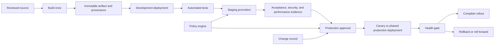
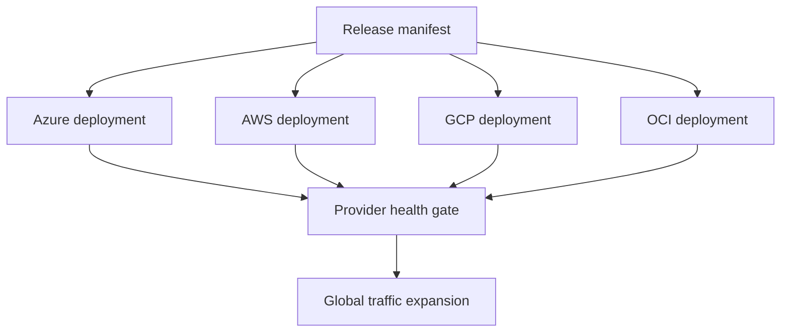

> **文档类型：** CI/CD & 自动化实施指南
> **规范性术语：** **MUST**、**MUST NOT**、**SHOULD**、**SHOULD NOT** 和 **MAY** 是要求级别。
> **适用范围：** 制品升级、环境信任边界、批准、自动门、发布策略、回滚和多云协调。
> **例外流程：** 偏离要求需要记录风险评估、补偿控制、指定风险负责人和到期日期。

|控制领域|价值|
|---|---|
|文件编号 | `CICD-07` |
|负责人|云卓越中心 |
|审核周期|至少每年一次，并且在重大平台、提供商、安全性或运营模式发生变化之后 |
|证据|发布清单、批准和检查、门控结果、部署波次、回滚或前向恢复测试以及审计日志记录 |

# 环境晋级、批准和发布控制

> **决策简述：** 通过具有基于风险的批准、自动门、并发控制和记录在案的恢复路径的显式信任边界，提升一个不可变的制品。

## 概述

环境晋级是已构建的制品从一个信任边界到另一个信任边界的受控移动。它不是重建、单独的分支合并，也不是操作员手动重复部署命令。

释放控制系统必须回答：

- 正在晋级的具体制品是什么？
- 哪个源版本产生了它？
- 通过了哪些测试和策略？
- 谁批准了这次晋级？
- 哪个身份部署了它？
- 目标发生了什么变化？
- 组织将如何检测故障并恢复？

## 目标和非目标

### 目标

- 构建一次并晋级相同的不可变制品。
- 隔离环境和部署身份。
- 按比例应用自动门和人工门。
- 防止并发冲突版本。
- 保留证据和部署历史记录。
- 支持快速回滚或前滚。

### 非目标

- 需要对每个低风险开发部署进行手动批准。
- 将批准点击视为技术验证。
- 让变更作者绕过生产控制。
- 从不同的依赖集重建生产。

## 参考架构

## 环境设计

环境是具有不同配置、身份、策略和可观测性的逻辑部署边界。

最小间隔：

- 非生产。
- 生产。

推荐企业分离：

- 短暂预览。
- 开发。
- 集成或测试。
- 分阶段或预生产。
- 生产。
- 灾难恢复环境（如果适用）。

环境名称不是安全边界。边界必须存在于云账户、订阅、项目、隔间、集群、网络、身份和受保护的 CI/CD 资源中。

## 云隔离映射

|提供商|强环境边界|
|---|---|
|Azure|生产环境专用订阅；用于从属隔离的资源组|
|AWS |单独的生产账户|
| GCP |单独的生产项目|
|OCI |至少有独立隔间；特殊要求的租户分离 |
|Kubernetes |独立集群，隔离性强；用于低风险分段的命名空间|

确切的边界取决于爆炸半径、法规、成本和操作成熟度。命名空间并不等同于账户边界。

## 构建一次，晋级多次

提升的对象必须是不可变的：

- 容器摘要。
- 包版本加上校验和。
- 签名的静态站点包。
- Terraform 保存了一个环境的计划和状态快照。
- 包含所需状态引用的 Git 提交。

对于应用版本，相同的二进制文件或镜像应在环境中移动。配置单独提供并根据环境进行验证。

Terraform 则不同：保存的计划是特定于环境的，无法从开发升级到生产。晋级的是经过审查的配置修订和策略证据；必须根据生产状态生成单独的生产计划。

## 晋级模式

### 自动低环境升级

当测试可靠且爆炸半径较小时使用。


### 生产前批准

使用需要在获取技术证据后进行审查的受保护环境。

### 预定的发布窗口

用于具有操作人员、市场、监管或依赖性限制的系统。调度是一种治理控制，而不是技术准备的替代品。

### 手动发布持续交付

制品始终是可部署的，但发布时刻由人为或业务决策选择。

### 持续部署

每一个通过控制的变更都会自动进入生产。这需要强大的自动化测试、渐进式部署、可观测性和快速恢复。仅仅因为流水线可以做到这一点是不合适的。

## 审批设计

有用的批准是知情的、独立的和有范围的。

审批人需要：

- 制品版本和提交。
- 变更摘要。
- 测试和策略结果。
- 风险分类。
- 预期的基础设施或模式更改。
- 回滚或前滚计划。
- 部署窗口和所有者。

批准反模式：

- 审批者无法查看计划或发布证据。
- 由同一人编写、批准和部署高风险变更。
- 批准仅嵌入可编辑的 YAML 中。
- 制品更改后批准仍然有效。
- 大批量的批准没有组件级的可追溯性。

## Azure DevOps 控件

使用 Azure DevOps 环境和批准/检查。控件可以保护环境和其他资源，例如服务连接、变量组、代理池和安全文件。

建议的生产检查：

- 手动批准。
- 分支控制。
- 所需模板。
- 营业时间。
- 外部 REST/Azure Functions 策略验证。
- 专属锁。
- 服务连接受限。

当每个排队的发布都必须执行时使用 `lockBehavior: sequential`，或者当应取消过时的排队发布时使用 `runLatest`。根据发布语义显式选择。

## GitHub 控件

使用 GitHub 环境：

- 需要审稿人。
- 在支持的情况下防止自我审查。
- 部署分支或标签策略。
- 在适当的情况下等待计时器。
- 自定义部署保护规则。
- 环境范围的机密和变量。
- 并发组。
```yaml
concurrency:
  group: production-payments
  cancel-in-progress: false

jobs:
  deploy:
    environment: production
```
环境名称必须是静态的或严格控制的。允许不受信任的输入来选择环境可以绕过预期的机密和批准边界。

## 自动门

释放门应该返回确定性的通过、失败或超时结果。

示例：

- 制品签名和来源证明验证。
- 漏洞策略。
- 更改机票状态。
- 维护窗口检查。
- Terraform 破坏性改变策略。
- 数据库兼容性检查。
- 服务级别的客观状态。
- 容量和配额检查。
- 依赖关系的可用性。
- 安全事件冻结。

不要创建在日志记录警告后总是通过的门。

## 并发和锁定

改变同一目标的两个部署可能会破坏状态或产生未知版本。

用途：

- CI/CD 并发组。
- Azure DevOps 独占锁。
- Terraform 后端锁。
- Kubernetes 部署控制器语义。
- 数据库迁移锁。
- Cloud Deploy 服务锁定。

锁定范围应与可变目标匹配。全球组织锁定通常过于宽泛；当更改跨越系统时，每个资源的锁定可能会太窄。

## 发布策略

### 滚动部署

逐渐取代实例。验证新旧版本之间的向后兼容性。

### 蓝绿色

部署完整的并行环境并切换流量。如果数据更改保持兼容，则回滚速度很快。

### 金丝雀

将一小部分流量或用户群发送到新版本。需要可靠的指标、自动分析和定义的中止阈值。

### 环型或波型部署

跨区域、集群、租户或客户群体进行晋级。对于多云和大型集群舰队很有用。

### 功能开关

将 CodeDeploy 与面向用户的发布分开。标志需要两个状态的所有权、到期时间和测试。

## 数据库和有状态发布控制

使用扩展和收缩迁移：

1. 添加向后兼容的架构。
2. 部署可以使用旧模式和新模式的代码。
3. 迁移数据。
4. 验证。
5. 在后续版本中删除过时的架构。

不要批准在不可逆转的架构更改后无法工作的回滚计划。当数据转换导致二进制回滚不安全时，首选前滚。

## 多云发布协调

跨越 Azure、AWS、GCP 和 OCI 的版本不应使用一种不受限制的编排身份。

用途：

- 独立的云角色和信任策略。
- 包含制品摘要和环境目标的发布清单。
- 具有明确依赖性的独立部署阶段。
- 区域或提供商级别的健康门。
- 部分故障处理。
- 最终发布状态的清晰日志系统。

当一个提供商使用未知版本时，请勿将发布标记为完成。

## 证据和审计

保留：

- 源代码提交。
- 制品摘要和签名。
- 构建和测试结果。
- 策略决定。
- 审批者身份和时间戳。
- 部署身份。
- 目标环境。
- 配置版本。
- 部署日志。
- 健康验证。
- 回滚或事件日志记录。

证据必须足够不可变，以便工作流在部署后无法重写自己的历史记录。

## 回滚和前滚

定义目标触发因素：

- 错误率阈值。
- 延迟回归。
- 关键事务失败。
- 健康检查失败。
- 数据完整性信号。
- 安全告警。

回滚要求：

- 保留已知的良好制品。
- 配置兼容性。
- 数据库兼容性。
- 经过测试的流量切换机制。
- 授权快速执行。

对于有状态系统来说，前滚通常更安全。发布计划应说明应用哪种策略。

## 验证

晋级前：

- 验证制品摘要和签名。
- 确认源分支并提交。
- 验证环境配置。
- 确认所需的测试是最新的。
- 检查依赖性和漏洞策略。
- 验证配额和容量。
- 确认没有冲突的部署。
- 验证回滚或前滚路径。

部署后：

- 验证运行版本。
- 执行烟雾和综合测试。
- 将关键指标与基线进行比较。
- 在稳定期间进行监测。
- 记录最终发布状态。

## 发布清单控制

使用发布清单作为晋级单位。清单应该绑定：
```text
release identifier
source revision
artifact digests
configuration revision
pipeline-template version
policy and test evidence
target environments and regions
compatibility requirements
rollback artifact
```
晋级更新目标的批准清单参考。它不会重新解释可变标签或重建制品。

## 批准有效性和重新批准

当其证据发生重大变化时，批准必须失效。定义重新批准触发器，例如：

- 制品摘要或源版本更改。
- 重新生成生产计划。
- 所需的测试或漏洞结果已过期。
- 部署目标、区域、身份或配置更改。
- 更改窗口关闭。
- 宣布新的高严重性事件或释放冻结。
- 批准超过了最大年龄。

在未检查决策基础是否仍然有效的情况下，请勿将失败或更改的发布的批准带入新的尝试。

## 更改分类

使用简单的风险分类来选择控制：

|班级 |示例|最小释放控制 |
|---|---|---|
|标准|低风险、可重复的应用变更 |自动门和正常晋级|
|高风险|身份、网络、数据或广泛的基础设施变化 |独立审查和强化证据|
|紧急|主动事件纠正|审计和回顾性审查的快速路径 |
|禁止窗口|冻结或未解决的关键依赖关系 |除非指定机构授予例外，否则阻止 |

分类必须以证据为基础。贡献者不应该能够将破坏性变更标记为标准以减少审查。

## 部分多目标失败

对于跨区域或跨云的发布，定义一个目标成功而另一个目标失败时的结果：

- 停止后续波次。
- 在新版本上保留健康的目标或根据兼容性规则恢复它们。
- 将全局发布标记为部分发布，未成功。
- 保留每个目标的部署证据。
- 防止流量自动扩张。
- 决定是否支持混合版本。
- 定义恢复、回滚和客户沟通的所有权。

隐藏目标分歧的全局发布状态在操作上是错误的。

## 操作清单

- [ ] 环境是真正的安全边界。
- [ ] 制品构建一次且不可变。
- [ ] Terraform 计划是根据目标环境生成的。
- [ ] 生产批准是可编辑流水线逻辑的外部。
- [ ] 批准者收到有用的证据。
- [ ] 自我批准仅限于高风险发布。
- [ ] 并发部署受到控制。
- [ ] 渐进式交付具有可测量的中止阈值。
- [ ] 数据库更改向后兼容。
- [ ] 多云阶段具有独立的身份和健康门。
- [ ] 保留部署和批准证据。
- [ ] 测试回滚或前滚过程。

## 相关主题

- [分支、版本控制和发布策略](branching-versioning-and-release-strategy.md)
- [容器构建和发布最佳实践](container-build-and-release-best-practices.md)
- [GitOps 交付模式](gitops-delivery-patterns.md)
- [流水线故障排除与恢复](pipeline-troubleshooting-and-recovery.md)

## 参考文档

- [Microsoft: 流水线审批和检查](https://learn.microsoft.com/en-us/azure/devops/pipelines/process/approvals)
- [Microsoft: Azure DevOps 环境](https://learn.microsoft.com/en-us/azure/devops/pipelines/process/environments)
- [GitHub：部署和环境](https://docs.github.com/en/actions/reference/workflows-and-actions/deployments-and-environments)
- [GitHub：控制部署](https://docs.github.com/en/actions/how-tos/deploy/configure-and-manage-deployments/control-deployments)
- [GitHub：审查部署](https://docs.github.com/en/actions/how-tos/deploy/configure-and-manage-deployments/review-deployments)
- [Kubernetes：无需停机即可更新部署](https://kubernetes.io/docs/tasks/run-application/update-deployment-rolling/)
