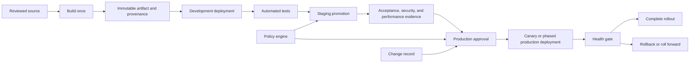
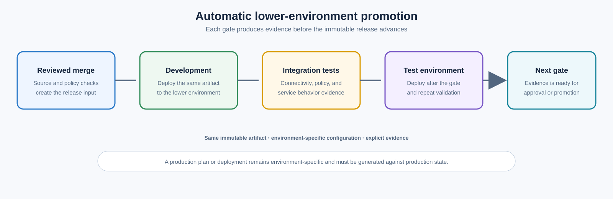
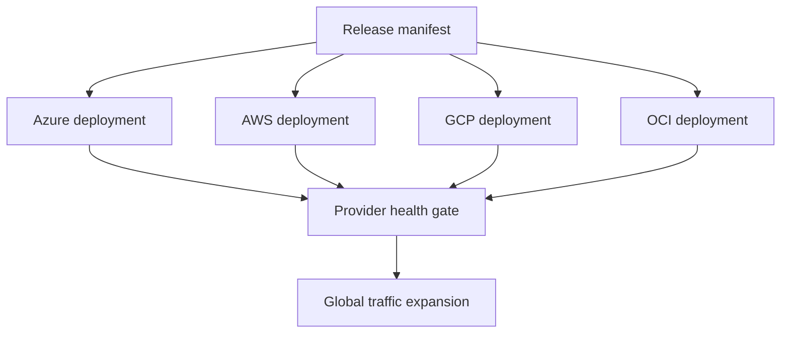

> **Document class:** CI/CD & Automation implementation guide
> **Normative terms:** **MUST**, **MUST NOT**, **SHOULD**, **SHOULD NOT**, and **MAY** are requirements levels.
> **Applicability:** Artifact promotion, environment trust boundaries, approvals, automated gates, release strategies, rollback, and multi-cloud coordination.
> **Exception process:** Deviations require a documented risk assessment, compensating controls, named risk owner, and expiry date.

| Control field | Value |
|---|---|
| Document ID | `CICD-07` |
| Owner | Cloud Center of Excellence |
| Review cycle | At least annually and after material platform, provider, security, or operating-model changes |
| Evidence | Release manifest, approvals and checks, gate results, deployment waves, rollback or forward-recovery tests, and audit records |

# Environment Promotion, Approval, and Release Controls

> **Decision in brief:** Promote one immutable artifact through explicit trust boundaries with risk-based approvals, automated gates, concurrency controls, and recorded recovery paths.

## Overview

Environment promotion is the controlled movement of an already-built artifact from one trust boundary to another. It is not a rebuild, a branch merge alone, or an operator manually repeating deployment commands.

A release-control system must answer:

- What exact artifact is being promoted?
- Which source revision produced it?
- Which tests and policies passed?
- Who approved the promotion?
- Which identity deployed it?
- What changed in the target?
- How will the organization detect failure and recover?

## Goals and non-goals

### Goals

- Build once and promote the same immutable artifact.
- Isolate environments and deployment identities.
- Apply automated and human gates proportionately.
- Prevent concurrent conflicting releases.
- Preserve evidence and deployment history.
- Support rapid rollback or roll forward.

### Non-goals

- Requiring manual approval for every low-risk development deployment.
- Treating an approval click as technical validation.
- Letting the change author bypass production controls.
- Rebuilding production from a different dependency set.

## Reference architecture



## Environment design

An environment is a logical deployment boundary with distinct configuration, identity, policy, and observability.

Minimum separation:

- Non-production.
- Production.

Recommended enterprise separation:

- Ephemeral preview.
- Development.
- Integration or test.
- Staging or pre-production.
- Production.
- Disaster-recovery environment where applicable.

Environment names are not security boundaries. The boundary must exist in cloud accounts, subscriptions, projects, compartments, clusters, networks, identities, and protected CI/CD resources.

## Cloud isolation mapping

| Provider | Strong environment boundary |
|---|---|
| Azure | Separate subscription for production; resource groups for subordinate isolation |
| AWS | Separate account for production |
| GCP | Separate project for production |
| OCI | Separate compartment at minimum; tenancy separation for exceptional requirements |
| Kubernetes | Separate cluster for strong isolation; namespaces for lower-risk segmentation |

The exact boundary depends on blast radius, regulation, cost, and operating maturity. A namespace is not equivalent to an account boundary.

## Build once, promote many

The promoted object must be immutable:

- Container digest.
- Package version plus checksum.
- Signed static-site bundle.
- Terraform saved plan for one environment and state snapshot.
- Git commit containing desired-state references.

For application releases, the same binary or image should move through environments. Configuration is supplied separately and validated per environment.

Terraform is different: a saved plan is environment-specific and cannot be promoted from development to production. What is promoted is the reviewed configuration revision and policy evidence; a separate production plan must be generated against production state.

## Promotion models

### Automatic lower-environment promotion

Use when tests are reliable and blast radius is low.



### Approval before production

Use a protected environment requiring review after technical evidence is available.

### Scheduled release window

Use for systems with operational staffing, market, regulatory, or dependency constraints. Scheduling is a governance control, not a substitute for technical readiness.

### Continuous delivery with manual release

Artifacts are always deployable, but a human or business decision selects the release moment.

### Continuous deployment

Every change that passes controls reaches production automatically. This requires strong automated testing, progressive rollout, observability, and rapid recovery. It is not appropriate merely because the pipeline can do it.

## Approval design

A useful approval is informed, independent, and scoped.

Approvers need:

- Artifact version and commit.
- Change summary.
- Test and policy results.
- Risk classification.
- Expected infrastructure or schema changes.
- Rollback or roll-forward plan.
- Deployment window and owner.

Approval anti-patterns:

- Approver cannot see the plan or release evidence.
- Same person authors, approves, and deploys a high-risk change.
- Approval is embedded only in editable YAML.
- Approval remains valid after the artifact changes.
- Large batches are approved without component-level traceability.

## Azure DevOps controls

Use Azure DevOps environments and approvals/checks. Controls can protect environments and other resources such as service connections, variable groups, agent pools, and secure files.

Recommended production checks:

- Manual approval.
- Branch control.
- Required template.
- Business hours.
- External REST/Azure Function policy validation.
- Exclusive lock.
- Restricted service connection.

Use `lockBehavior: sequential` when every queued release must execute, or `runLatest` when stale queued releases should be canceled. Choose explicitly based on the release semantics.

## GitHub controls

Use GitHub environments:

- Required reviewers.
- Prevent self-review where supported.
- Deployment branch or tag policies.
- Wait timers where appropriate.
- Custom deployment protection rules.
- Environment-scoped secrets and variables.
- Concurrency groups.

```yaml
concurrency:
  group: production-payments
  cancel-in-progress: false

jobs:
  deploy:
    environment: production
```

The environment name must be static or tightly controlled. Allowing untrusted input to select an environment can bypass intended secret and approval boundaries.

## Automated gates

A release gate should return a deterministic pass, fail, or timed-out result.

Examples:

- Artifact signature and provenance verification.
- Vulnerability policy.
- Change-ticket status.
- Maintenance-window check.
- Terraform destructive-change policy.
- Database compatibility check.
- Service-level objective status.
- Capacity and quota check.
- Dependency availability.
- Security incident freeze.

Do not create gates that always pass after logging a warning.

## Concurrency and locking

Two deployments mutating the same target can corrupt state or produce an unknown version.

Use:

- CI/CD concurrency groups.
- Azure DevOps exclusive locks.
- Terraform backend locks.
- Kubernetes deployment-controller semantics.
- Database migration locks.
- Cloud deployment service locking.

Lock scope should match the mutable target. A global organization lock is usually too broad; a per-resource lock can be too narrow when changes span a system.

## Release strategies

### Rolling deployment

Gradually replaces instances. Verify backward compatibility between old and new versions.

### Blue-green

Deploys a complete parallel environment and switches traffic. Rollback is fast if data changes remain compatible.

### Canary

Sends a small traffic percentage or user cohort to the new version. Requires reliable metrics, automated analysis, and a defined abort threshold.

### Ring or wave deployment

Promotes across regions, clusters, tenants, or customer cohorts. Useful for multi-cloud and large fleets.

### Feature flags

Separates code deployment from user-facing release. Flags require ownership, expiry, and testing of both states.

## Database and stateful release controls

Use expand-and-contract migration:

1. Add backward-compatible schema.
2. Deploy code that can use old and new schema.
3. Migrate data.
4. Verify.
5. Remove obsolete schema in a later release.

Do not approve a rollback plan that cannot work after an irreversible schema change. Prefer roll forward when data transformation makes binary rollback unsafe.

## Multi-cloud release coordination

A release spanning Azure, AWS, GCP, and OCI should not use one unrestricted orchestration identity.

Use:

- Separate cloud roles and trust policies.
- A release manifest containing artifact digests and environment targets.
- Independent deployment stages with explicit dependencies.
- Region- or provider-level health gates.
- Partial-failure handling.
- A clear system-of-record for final release status.



Do not mark the release complete while one provider is on an unknown version.

## Evidence and audit

Retain:

- Source commit.
- Artifact digest and signature.
- Build and test results.
- Policy decisions.
- Approver identity and timestamp.
- Deployment identity.
- Target environment.
- Configuration version.
- Deployment logs.
- Health verification.
- Rollback or incident record.

Evidence must be immutable enough that a workflow cannot rewrite its own history after deployment.

## Rollback and roll forward

Define objective triggers:

- Error-rate threshold.
- Latency regression.
- Failed critical transaction.
- Health-check failure.
- Data-integrity signal.
- Security alert.

Rollback requirements:

- Known-good artifact retained.
- Configuration compatibility.
- Database compatibility.
- Tested traffic-switch mechanism.
- Authorization to execute rapidly.

Roll forward is often safer for stateful systems. The release plan should state which strategy applies.

## Validation

Before promotion:

- Verify artifact digest and signature.
- Confirm source branch and commit.
- Validate environment configuration.
- Confirm required tests are current.
- Check dependency and vulnerability policy.
- Verify quota and capacity.
- Confirm no conflicting deployment.
- Validate rollback or roll-forward path.

After deployment:

- Verify running version.
- Execute smoke and synthetic tests.
- Compare key metrics to baseline.
- Monitor during a stabilization period.
- Record final release state.

## Release-manifest control

Use a release manifest as the promotion unit. The manifest should bind:

```text
release identifier
source revision
artifact digests
configuration revision
pipeline-template version
policy and test evidence
target environments and regions
compatibility requirements
rollback artifact
```

Promotion updates the target's approved manifest reference. It does not reinterpret a mutable tag or rebuild the artifact.

## Approval validity and reapproval

An approval must become invalid when its evidence changes materially. Define reapproval triggers such as:

- Artifact digest or source revision changes.
- Production plan is regenerated.
- Required test or vulnerability result expires.
- Deployment target, region, identity, or configuration changes.
- Change window closes.
- A new high-severity incident or release freeze is declared.
- The approval exceeds a maximum age.

Do not carry an approval from a failed or altered release into a new attempt without checking whether the decision basis remains valid.

## Change classification

Use a simple risk classification to select controls:

| Class | Example | Minimum release control |
|---|---|---|
| Standard | Low-risk, repeatable application change | Automated gates and normal promotion |
| Elevated | Identity, network, data, or broad infrastructure change | Independent review and enhanced evidence |
| Emergency | Active incident correction | Expedited path with audit and retrospective review |
| Prohibited window | Freeze or unresolved critical dependency | Block unless designated authority grants exception |

The classification must be evidence-based. A contributor should not be able to label a destructive change as standard to reduce scrutiny.

## Partial multi-target failure

For releases spanning regions or clouds, define the outcome when one target succeeds and another fails:

- Stop further waves.
- Keep healthy targets on the new version or revert them according to compatibility rules.
- Mark the global release as partial, not successful.
- Preserve per-target deployment evidence.
- Prevent automatic traffic expansion.
- Decide whether mixed versions are supported.
- Define ownership for resumption, rollback, and customer communication.

A global release status that hides target divergence is operationally false.

## Operational checklist

- [ ] Environments are real security boundaries.
- [ ] Artifacts are built once and immutable.
- [ ] Terraform plans are generated per target environment.
- [ ] Production approval is external to editable pipeline logic.
- [ ] Approvers receive useful evidence.
- [ ] Self-approval is restricted for high-risk releases.
- [ ] Concurrent deployments are controlled.
- [ ] Progressive delivery has measurable abort thresholds.
- [ ] Database changes are backward-compatible.
- [ ] Multi-cloud stages have separate identities and health gates.
- [ ] Deployment and approval evidence is retained.
- [ ] Rollback or roll-forward procedures are tested.

## Related topics

- [Branching, Versioning, and Release Strategy](branching-versioning-and-release-strategy.md)
- [Container Build and Release Best Practices](container-build-and-release-best-practices.md)
- [GitOps Delivery Patterns](gitops-delivery-patterns.md)
- [Pipeline Troubleshooting and Recovery](pipeline-troubleshooting-and-recovery.md)

## References

- [Microsoft: Pipeline approvals and checks](https://learn.microsoft.com/en-us/azure/devops/pipelines/process/approvals)
- [Microsoft: Azure DevOps environments](https://learn.microsoft.com/en-us/azure/devops/pipelines/process/environments)
- [GitHub: Deployments and environments](https://docs.github.com/en/actions/reference/workflows-and-actions/deployments-and-environments)
- [GitHub: Control deployments](https://docs.github.com/en/actions/how-tos/deploy/configure-and-manage-deployments/control-deployments)
- [GitHub: Reviewing deployments](https://docs.github.com/en/actions/how-tos/deploy/configure-and-manage-deployments/review-deployments)
- [Kubernetes: Update a deployment without downtime](https://kubernetes.io/docs/tasks/run-application/update-deployment-rolling/)
