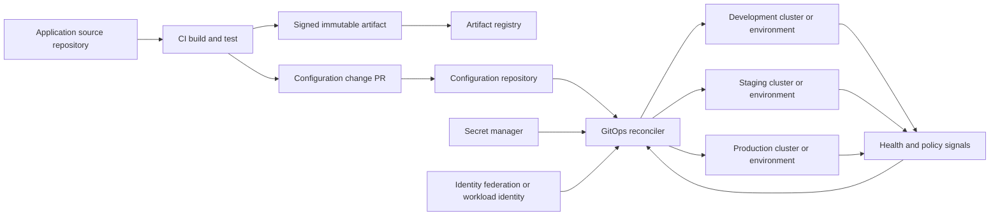

> **文档类型：** CI/CD & 自动化架构参考模型
> **规范性术语：** **MUST**、**MUST NOT**、**SHOULD**、**SHOULD NOT** 和 **MAY** 是要求级别。
> **适用范围：** GitOps 跨 Kubernetes 和云环境所需的状态、协调、漂移管理、渐进式交付和恢复。
> **例外流程：** 偏离要求需要记录风险评估、补偿控制、指定风险负责人和到期日期。

|控制领域|价值|
|---|---|
|文件编号 | `CICD-04` |
|负责人|云卓越中心 |
|审核周期|至少每年一次，并且在重大平台、提供商、安全性或运营模式发生变化之后 |
|证据|签名的提交和制品、仓库策略、协调运行状况、漂移和修剪事件以及恢复测试 |

# GitOps 交付模式

> **简单的决定：** 让 CI 负责经过验证的不可变制品，并让环境内协调器负责收敛、漂移可见性和恢复。

## 概述

GitOps 是一种操作模型，其中所需的状态是声明性的、版本化的、自动协调的并且持续可监控的。它不仅仅是“从 Git 部署”，也不是特定产品的代名词。

最强大的 GitOps 设计将职责分开：

- CI 构建、测试、签名和发布不可变的制品。
- 配置仓库记录所需的制品和环境配置。
- 目标环境内部或附近的协调器将实际状态收敛到期望状态。
- 策略、批准和可观测性决定是否晋级变革以及协调是否健康。

## 目标和非目标

### 目标

- 使所需状态可审查和版本化。
- 最大限度地减少从 CI 到运行时环境的直接部署访问。
- 检测并纠正漂移。
- 支持通过 Git 历史记录进行重复升级和回滚。
- 提供从源代码到运行版本的清晰审计跟踪。

### 非目标

- 在 Git 中存储明文机密。
- 假设每个可变或有状态系统都已安全协调。
- 允许控制器在没有保障措施的情况下删除生产资源。
- 在没有所有权规则的情况下混合应用源、环境配置和生成的制品。

## 核心原则

提供商中立的 GitOps 实现遵循四个控制概念：

1. **声明式：**目标状态以数据的形式表达。
2. **版本化且不可变：**变更记录在具有持久历史记录在案的版本控制系统中。
3. **自动拉取：** 软件代理检索所需状态，而不需要中央流水线来推送每个更改。
4. **持续协调：** 控制器比较期望状态和实际状态，并根据差异采取行动。

需要操作员在每次合并后运行 `kubectl apply` 的系统使用 Git 作为存储，但它并没有完全协调 GitOps。

## 参考架构

协调器应该通过不可变版本或摘要读取制品。可变标签会削弱 Git 审核跟踪，因为相同的 Git 提交稍后可以解析为不同的内容。

## 仓库模式

### 单独的应用和环境仓库
```text
app-repo/
  src/
  Dockerfile
  .github/workflows/build.yml

environment-repo/
  apps/
    payments/
      base/
      overlays/
        dev/
        staging/
        prod/
  clusters/
```
优势：

- 清晰的所有权和访问边界。
- CI 不需要直接生产集群访问。
- 环境变化接受独立审查。

风险：

- 跨仓库变更协调。
- 自动更新拉取请求可能会产生噪音。
- 设计不当的升级脚本可能会覆盖手动配置。

### 单一仓库
```text
platform-repo/
  applications/
  infrastructure/
  clusters/
  policies/
```
优势：

- 相关组件之间的原子更改。
- 更简单的仓库范围的策略。

风险：

- 广泛的仓库权限。
- 对账范围大。
- 仓库或自动化遭入侵造成的爆炸半径更大。

### 每个环境的仓库

这提供了强大的隔离，但会造成重复和困难的跨环境可见性。仅当监管或组织边界证明开销合理时才使用它。

## 交付模式

### 模式 1：镜像更新拉取请求

1. CI 构建并签署镜像。
2. CI 打开一个拉取请求，更新环境仓库中的镜像摘要。
3. 验证呈现清单并评估策略。
4. 审稿人批准。
5. 协调器部署合并后的所需状态。

这是最透明的模型。它保存了人类可读的晋级日志记录。

### 模式 2：自动较低环境更新

测试通过后，CI 将新摘要直接提交开发。登台和生产仍然需要拉取请求或显式升级。

当开发速度很重要并且开发是孤立的时，请使用此选项。不允许相同的自动化身份直接写入生产配置。

### 模式 3：通过 Pull Request 逐步晋级

晋级仅改变环境参考。该制品不会被重建。

### 模式4：环境分支晋级

分支代表环境。这很容易理解，但会在长期分支之间产生合并复杂性和隐藏漂移。当配置差异很大时，首选基于目录或仓库的环境。

### 模式 5：基于拉动的基础设施协调

Terraform 或云资源控制器可协调 Git 的基础设施。这应用于选定的资源，但基础设施与无状态 Kubernetes 应用具有不同的故障模式：

- 破坏可能是不可逆转的。
- 状态和锁定至关重要。
- 提供商 API 可能并非在所有故障下都是幂等的。
- 破坏性变更之前通常需要获取批准。

使用公开计划、策略、批准和状态控制的控制器。不要仅仅因为源是 Git 就不断自动应用不受限制的基础架构更改。

## Argo CD 和 Flux 操作模型

### 阿尔戈 CD

Argo CD 将 Git 中所需的清单与实时 Kubernetes 状态进行比较，并可以自动或手动同步。自动同步可以消除 CI 直接调用 Argo CD API 的需要。修剪和自我修复是单独的决定，应谨慎启用。

### 通量

Flux 使用专门的控制器来协调源、Kustomizations、Helm 版本和相关资源。协调可以通过 Webhook 进行事件驱动，也可以按配置的时间间隔进行。

这两个工具都可以实现健全的 GitOps。选择应基于运营模式、租户、策略集成、规模、用户体验和平台支持，而不是口号。

## 多云模式

GitOps 控制器在 Azure Kubernetes Service、Amazon EKS、Google Kubernetes Engine、OCI Container Engine for Kubernetes、OpenShift 和一致的本地 Kubernetes 上运行类似。

特定于云的集成主要涉及身份和服务：

|需要|Azure|AWS | GCP |OCI |
|---|---|---|---|---|
|集群工作负载身份 |内部工作负载身份 |服务账户/Pod 身份的 IAM 角色 | GKE 的工作负载身份联合 |支持的 OCI 工作负载身份/资源主体 |
|机密 | Key Vault CSI 或操作员 | Secrets Manager 集成 |Secret Manager 集成 | Vault 集成 |
|注册中心 | ACR |ECR |Artifact Registry | OCI Container Registry |
|审计|活动和集群日志 | CloudTrail 和集群日志 | Cloud Audit Logs 和集群日志 |审计和集群日志 |

控制器应该仅接收其命名空间、集群、账户、订阅、项目或区间范围所需的权限。

## 机密模式

切勿提交已解密的机密。

可接受的模式包括：

- 从云 Secret Manager 读取的外部机密式 Operator。
- Secrets Store CSI 驱动程序。
- 加密的机密文件，其中解密密钥保存在 Git 外部，并且访问范围受到严格限制。
- 私钥受保护且可恢复的密封机制。

评估机密系统的轮换行为、故障模式、备份、多集群使用以及密钥泄露的爆炸半径。
## 晋级与审批

批准点应与风险相匹配：

- 请求批准所需状态更改。
- 受保护的生产路径分支和代码所有者。
- 根据需要签署提交或验证自动化身份。
- 合并或协调之前的外部变更检查。
- 协调后逐步推出健康检查。

避免双重批准路径，其中更改可以通过命令式流水线或直接集群访问绕过配置仓库。

## 漂移管理

对漂移进行分类，而不是自动覆盖所有内容。

|漂移类型|响应 |
|---|---|
|未经授权手动更改|告警、恢复和调查 |
|紧急生产变更 |立即日志、反向移植到 Git，然后协调 |
|控制器添加的默认值 |配置 diff 标准化或仅忽略精确字段 |
|运行时生成的数据 |排除在理想的状态所有权之外 |
|外部控制器冲突 |为每个字段/资源分配一个权威控制器 |

广泛的忽略规则掩盖了真正的偏差。每个被忽略的字段都应该有一个记录在案的所有者和理由。

## 修剪和删除控制

删除是风险最高的协调操作。

控制：

- 需要明确的修剪启用。
- 除非有意允许，否则阻止空的所需状态集删除整个应用。
- 使用策略保护命名空间、自定义资源和有状态服务。
- 在适当的情况下使用终结器和备份检查。
- 需要批准破坏性基础设施变更。
- 在较低环境下测试删除和恢复。

## 部署方式和渐进式交付

GitOps 控制所需的状态；推出控制器控制流量和运行状况。

支持的策略包括：

- 标准 Kubernetes 滚动更新。
- 蓝绿发布。
- 金丝雀发布。
- 逐区域或集群式晋级。
- 部署后释放功能开关。

编排器不得仅仅因为清单被接受而将发布标记为成功。集成运行状况、准备情况、指标和服务级别检查。

## 验证

在合并所需状态更改之前：

1. 验证 YAML 和架构。
2. 渲染 Helm、Kustomize 或其他模板。
3. 验证 Kubernetes API 兼容性。
4. 尽可能离线评估准入和组织策略。
5. 验证镜像摘要和签名。
6. 检查命名空间、资源和身份边界。
7. 检测破坏性变化。
8. 生成可审查的差异。

渲染流程示例：
```bash
set -euo pipefail
kustomize build clusters/prod/apps > rendered.yaml
kubeconform -strict -summary rendered.yaml
conftest test rendered.yaml --policy policy/
```
固定并验证用于验证的每个工具。

## 失败与恢复

### 协调失败

- 检查控制器事件和条件。
- 确认仓库修订和身份验证。
- 在本地或 CI 中渲染准确的所需状态。
- 检查录取策略和缺失的 CRD。
- 确定错误是暂时性的还是确定性的。

### 糟糕的发布

回滚通常是 Git 恢复或新提交，恢复已知良好的不可变制品引用。 For Kubernetes, native rollout history can help diagnose, but the final desired state must be reflected in Git to avoid the controller reapplying the bad revision.

### 协调器遭入侵

- 禁用或隔离协调。
- 撤销仓库和云凭据。
- 保留审核和控制器日志。
- 验证配置仓库和制品。
- 从受信任的镜像和清单重建控制器。
- 根据已验证的提交进行协调。

## 引导和恢复链

GitOps 依赖于协调器可以管理自身之前存在的引导路径。文件及版本：

1. 云账号、网络、集群前提条件。
2. 协调器命名空间和身份。
3. 仓库身份验证和信任锚。
4. 控制器镜像和版本。
5.策略与机密的结合。
6. 初始来源和协调对象。
7. 验证预期修订是否处于活动状态。

引导过程应该可以从受保护的基础设施代码和经过验证的仓库修订中重现。只能通过复制管理员本地命令来重建的集群不是可恢复的 GitOps。

## 仓库身份验证和提交信任

使用部署密钥、应用身份、工作负载身份或仅限读取所需仓库的短期令牌。将读取访问与用于创建升级拉取请求的写入自动化分开。

如果需要提交签名或验证自动化，请定义实际强制执行的内容：

- 接受的签名者身份。
- 受保护的路径和分支。
- 签名丢失或无效时的行为。
- 密钥或身份撤销。
- 生成的提交是否可归因于机器人身份。
- 历史验证如何在密钥轮换中幸存下来。

签名的提交不会验证渲染的清单或制品内容；它们是链条中的一环。

## 对账服务目标

将协调视为生产服务。定义：

- 从批准的 Git 更改到观测到的目标收敛的最长时间。
- 最大容忍的过时的期望状态。
- 针对失败、暂停或停滞的资源发出告警。
- 仓库和 API 服务器可用性依赖性。
- 控制器队列深度和速率限制。
- 网络或身份中断后的恢复预期。

当协调停止时，健康的应用仍可能处于未经授权的修订版本上。监控应用运行状况以及期望与实际修订情况。

## 暂停和紧急运行

暂停是一种受控操作状态，而不是永久的解决方法。当协调暂停时：

- 记录所有者、原因、范围和有效期。
- 如果过期则发出告警。
- 限制手动更改事件范围。
- 在恢复之前采集实际状态。
- 将批准的紧急更改向后移植到 Git。
- 在重新启用自我修复之前检查修剪和漂移。

大量手动更改后盲目恢复可能会引发破坏性收敛。

## 操作清单

- [ ] 期望的状态是声明性的和版本化的。
- [ ] 制品使用不可变的摘要或版本。
- [ ] CI 构建制品，但不需要直接生产集群访问。
- [ ] 生产配置受到审查和分支控制的保护。
- [ ] 编排器具有最低权限身份。
- [ ] 机密保留在纯文本 Git 之外。
- [ ] 漂移所有权和忽略规则是明确的。
- [ ] 修剪和空状态删除受到保护。
- [ ] 推出运行状况是测量的，而不是假设的。
- [ ] 回滚在 Git 中表示。
- [ ] 紧急变更有一个向后移植程序。

## 相关主题

- [多集群多租户 GitOps 架构](multi-cluster-and-multi-tenant-gitops-architecture.md)
- [GitOps 中的配置和机密管理](configuration-and-secret-management-in-gitops.md)
- [环境晋级、审批、发布控制](environment-promotion-approval-and-release-controls.md)
- [流水线故障排除与恢复](pipeline-troubleshooting-and-recovery.md)

## 参考文档

- [OpenGitOps](https://opengitops.dev/)
- [Argo CD：自动同步策略](https://argo-cd.readthedocs.io/en/stable/user-guide/auto_sync/)
- [Argo CD：CI 流水线自动化](https://argo-cd.readthedocs.io/en/latest/user-guide/ci_automation/)
- [通量文档](https://fluxcd.io/flux/)
- [磁通核心概念](https://fluxcd.io/flux/concepts/)
- [Kubernetes：部署](https://kubernetes.io/docs/concepts/workloads/controllers/deployment/)
- [Kubernetes：kubectl 推出](https://kubernetes.io/docs/reference/kubectl/generated/kubectl_rollout/)
