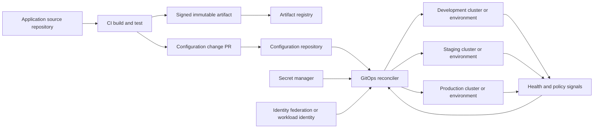
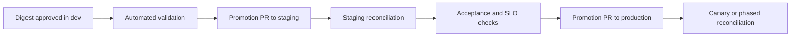

> **Document class:** CI/CD & Automation architecture reference model
> **Normative terms:** **MUST**, **MUST NOT**, **SHOULD**, **SHOULD NOT**, and **MAY** are requirements levels.
> **Applicability:** GitOps desired state, reconciliation, drift management, progressive delivery, and recovery across Kubernetes and cloud environments.
> **Exception process:** Deviations require a documented risk assessment, compensating controls, named risk owner, and expiry date.

| Control field | Value |
|---|---|
| Document ID | `CICD-04` |
| Owner | Cloud Center of Excellence |
| Review cycle | At least annually and after material platform, provider, security, or operating-model changes |
| Evidence | Signed commits and artifacts, repository policy, reconciliation health, drift and prune events, and recovery tests |

# GitOps Delivery Patterns

> **Decision in brief:** Keep CI responsible for validated immutable artifacts and let an in-environment reconciler own convergence, drift visibility, and recovery.

## Overview

GitOps is an operating model in which desired state is declarative, versioned, automatically reconciled, and continuously observable. It is not merely "deploying from Git" and it is not synonymous with a specific product.

The strongest GitOps design separates responsibilities:

- CI builds, tests, signs, and publishes immutable artifacts.
- A configuration repository records the desired artifact and environment configuration.
- A reconciler inside or near the target environment converges actual state toward desired state.
- Policy, approval, and observability determine whether a change is promoted and whether reconciliation is healthy.

## Goals and non-goals

### Goals

- Make desired state reviewable and versioned.
- Minimize direct deployment access from CI to runtime environments.
- Detect and correct drift.
- Support repeatable promotion and rollback through Git history.
- Provide a clear audit trail from source to running version.

### Non-goals

- Storing plaintext secrets in Git.
- Assuming every mutable or stateful system is safely reconciled.
- Allowing the controller to delete production resources without safeguards.
- Mixing application source, environment configuration, and generated artifacts without ownership rules.

## Core principles

A vendor-neutral GitOps implementation follows four control concepts:

1. **Declarative:** the target state is expressed as data.
2. **Versioned and immutable:** changes are recorded in a version-controlled system with durable history.
3. **Pulled automatically:** software agents retrieve desired state rather than requiring a central pipeline to push every change.
4. **Continuously reconciled:** controllers compare desired and actual state and act on divergence.

A system that requires an operator to run `kubectl apply` after every merge uses Git as storage, but it is not fully reconciled GitOps.

## Reference architecture



The reconciler should read artifacts by immutable version or digest. A mutable tag weakens the Git audit trail because the same Git commit can later resolve to different content.

## Repository patterns

### Separate application and environment repositories

```text
app-repo/
  src/
  Dockerfile
  .github/workflows/build.yml

environment-repo/
  apps/
    payments/
      base/
      overlays/
        dev/
        staging/
        prod/
  clusters/
```

Strengths:

- Clear ownership and access boundaries.
- CI does not need direct production cluster access.
- Environment changes receive independent review.

Risks:

- Cross-repository change coordination.
- Automated update pull requests can create noise.
- Poorly designed promotion scripts can overwrite manual configuration.

### Monorepository

```text
platform-repo/
  applications/
  infrastructure/
  clusters/
  policies/
```

Strengths:

- Atomic changes across related components.
- Easier repository-wide policy.

Risks:

- Broad repository permissions.
- Large reconciliation scope.
- Higher blast radius from repository or automation compromise.

### Repository per environment

This provides strong isolation but creates duplication and difficult cross-environment visibility. Use it only when regulatory or organizational boundaries justify the overhead.

## Delivery patterns

### Pattern 1: Image update pull request

1. CI builds and signs an image.
2. CI opens a pull request updating the image digest in the environment repository.
3. Validation renders manifests and evaluates policy.
4. Reviewers approve.
5. The reconciler deploys the merged desired state.

This is the most transparent model. It preserves a human-readable promotion record.

### Pattern 2: Automated lower-environment update

CI commits the new digest directly to development after tests pass. Staging and production still require pull requests or explicit promotion.

Use this when development speed matters and development is isolated. Do not allow the same automation identity to write directly to production configuration.

### Pattern 3: Progressive promotion by pull request



Promotion changes only the environment reference. The artifact is not rebuilt.

### Pattern 4: Environment branch promotion

Branches represent environments. This is easy to understand but can create merge complexity and hidden drift between long-lived branches. Prefer directory- or repository-based environments when configuration divergence is substantial.

### Pattern 5: Pull-based infrastructure reconciliation

Terraform or cloud-resource controllers reconcile infrastructure from Git. This can work for selected resources, but infrastructure has different failure modes from stateless Kubernetes applications:

- Destruction can be irreversible.
- State and locking are critical.
- Provider APIs may not be idempotent under all failures.
- Approval is often required before destructive changes.

Use a controller that exposes plan, policy, approval, and state controls. Do not continuously auto-apply unrestricted infrastructure changes merely because the source is Git.

## Argo CD and Flux operating models

### Argo CD

Argo CD compares desired manifests in Git with live Kubernetes state and can synchronize automatically or manually. Automated synchronization can remove the need for CI to call the Argo CD API directly. Pruning and self-healing are separate decisions and should be enabled deliberately.

### Flux

Flux uses specialized controllers to reconcile sources, Kustomizations, Helm releases, and related resources. Reconciliation can be event-driven with webhooks and also occurs on configured intervals.

Both tools can implement sound GitOps. Selection should be based on operational model, tenancy, policy integration, scale, user experience, and platform support—not slogans.

## Multi-cloud pattern

GitOps controllers run similarly on Azure Kubernetes Service, Amazon EKS, Google Kubernetes Engine, OCI Container Engine for Kubernetes, OpenShift, and conformant on-premises Kubernetes.

Cloud-specific integration is primarily about identity and services:

| Need | Azure | AWS | GCP | OCI |
|---|---|---|---|---|
| Cluster workload identity | Entra workload identity | IAM roles for service accounts / pod identity | Workload Identity Federation for GKE | OCI workload identity / resource principals where supported |
| Secrets | Key Vault CSI or operator | Secrets Manager integrations | Secret Manager integrations | Vault integrations |
| Registry | ACR | ECR | Artifact Registry | OCI Registry |
| Audit | Activity and cluster logs | CloudTrail and cluster logs | Cloud Audit Logs and cluster logs | Audit and cluster logs |

The controller should receive only the permissions required for its namespace, cluster, account, subscription, project, or compartment scope.

## Secret patterns

Never commit decrypted secrets.

Accepted patterns include:

- External Secrets-style operators that read from a cloud secret manager.
- Secrets Store CSI drivers.
- Encrypted secret files where decryption keys are held outside Git and access is tightly scoped.
- A sealed-secret mechanism whose private key is protected and recoverable.

Evaluate secret systems for rotation behavior, failure mode, backup, multi-cluster use, and the blast radius of key compromise.

## Promotion and approval

The approval point should match the risk:

- Pull-request approval for desired-state changes.
- Protected branches and CODEOWNERS for production paths.
- Signed commits or verified automation identities where required.
- External change checks before merge or reconciliation.
- Progressive rollout health checks after reconciliation.

Avoid dual approval paths in which a change can bypass the configuration repository through an imperative pipeline or direct cluster access.

## Drift management

Classify drift rather than automatically overwriting everything.

| Drift type | Response |
|---|---|
| Unauthorized manual change | Alert, revert, and investigate |
| Emergency production change | Record, back-port to Git immediately, then reconcile |
| Controller-added defaults | Configure diff normalization or ignore only the exact field |
| Runtime-generated data | Exclude from desired-state ownership |
| External controller conflict | Assign one authoritative controller per field/resource |

Broad ignore rules conceal real drift. Every ignored field should have a documented owner and rationale.

## Pruning and deletion controls

Deletion is the highest-risk reconciliation action.

Controls:

- Require explicit pruning enablement.
- Block empty desired-state sets from deleting an entire application unless intentionally allowed.
- Protect namespaces, custom resources, and stateful services with policy.
- Use finalizers and backup checks where appropriate.
- Require approval for destructive infrastructure changes.
- Test deletion and recovery in a lower environment.

## Deployment methods and progressive delivery

GitOps controls desired state; rollout controllers control traffic and health.

Supported strategies include:

- Standard Kubernetes rolling updates.
- Blue-green releases.
- Canary releases.
- Region-by-region or cluster-wave promotion.
- Feature-flag release after deployment.

The reconciler must not mark a release successful merely because manifests were accepted. Integrate health, readiness, metrics, and service-level checks.

## Validation

Before merging desired-state changes:

1. Validate YAML and schemas.
2. Render Helm, Kustomize, or other templates.
3. Validate Kubernetes API compatibility.
4. Evaluate admission and organizational policy offline where possible.
5. Verify image digests and signatures.
6. Check namespace, resource, and identity boundaries.
7. Detect destructive changes.
8. Generate a reviewable diff.

Example rendering flow:

```bash
set -euo pipefail
kustomize build clusters/prod/apps > rendered.yaml
kubeconform -strict -summary rendered.yaml
conftest test rendered.yaml --policy policy/
```

Pin and verify every tool used in validation.

## Failure and recovery

### Reconciliation failure

- Inspect controller events and conditions.
- Confirm repository revision and authentication.
- Render the exact desired state locally or in CI.
- Check admission policies and missing CRDs.
- Determine whether the error is transient or deterministic.

### Bad release

Rollback is normally a Git revert or a new commit restoring a known-good immutable artifact reference. For Kubernetes, native rollout history can help diagnose, but the final desired state must be reflected in Git to avoid the controller reapplying the bad revision.

### Reconciler compromise

- Disable or quarantine reconciliation.
- Revoke repository and cloud credentials.
- Preserve audit and controller logs.
- Validate the configuration repository and artifacts.
- Rebuild the controller from trusted images and manifests.
- Reconcile from a verified commit.

## Bootstrap and recovery chain

GitOps depends on a bootstrap path that exists before the reconciler can manage itself. Document and version:

1. Cloud account, network, and cluster prerequisites.
2. Reconciler namespace and identity.
3. Repository authentication and trust anchors.
4. Controller images and versions.
5. Policy and secret integrations.
6. Initial source and reconciliation objects.
7. Verification that the expected revision is active.

The bootstrap process should be reproducible from protected infrastructure code and a verified repository revision. A cluster that can be rebuilt only by copying an administrator's local commands is not recoverable GitOps.

## Repository authentication and commit trust

Use deploy keys, application identities, workload identity, or short-lived tokens scoped to read only the required repositories. Separate read access from write automation used to create promotion pull requests.

Where commit signing or verified automation is required, define what is actually enforced:

- Accepted signer identities.
- Protected paths and branches.
- Behavior when a signature is missing or invalid.
- Key or identity revocation.
- Whether generated commits are attributable to a bot identity.
- How historical verification survives key rotation.

Signed commits do not validate rendered manifests or artifact contents; they are one link in the chain.

## Reconciliation service objectives

Treat reconciliation as a production service. Define:

- Maximum time from approved Git change to observed target convergence.
- Maximum tolerated stale desired state.
- Alerting for failed, suspended, or stalled resources.
- Repository and API-server availability dependencies.
- Controller queue depth and rate limits.
- Recovery expectations after network or identity outage.

A healthy application can still be on an unauthorized revision when reconciliation is stalled. Monitor both application health and desired-versus-actual revision.

## Suspension and emergency operation

Suspension is a controlled operational state, not a permanent workaround. When reconciliation is paused:

- Record owner, reason, scope, and expiry.
- Alert if the expiry passes.
- Restrict manual changes to the incident scope.
- Capture the actual state before resuming.
- Back-port approved emergency changes to Git.
- Review pruning and drift before re-enabling self-heal.

Resuming blindly after extensive manual change can trigger destructive convergence.

## Operational checklist

- [ ] Desired state is declarative and versioned.
- [ ] Artifacts use immutable digests or versions.
- [ ] CI builds artifacts but does not require direct production cluster access.
- [ ] Production configuration is protected by review and branch controls.
- [ ] The reconciler has least-privilege identity.
- [ ] Secrets remain outside plaintext Git.
- [ ] Drift ownership and ignore rules are explicit.
- [ ] Pruning and empty-state deletion are protected.
- [ ] Rollout health is measured, not assumed.
- [ ] Rollback is represented in Git.
- [ ] Emergency changes have a back-port procedure.

## Related topics

- [Multi-Cluster and Multi-Tenant GitOps Architecture](multi-cluster-and-multi-tenant-gitops-architecture.md)
- [Configuration and Secret Management in GitOps](configuration-and-secret-management-in-gitops.md)
- [Environment Promotion, Approval, and Release Controls](environment-promotion-approval-and-release-controls.md)
- [Pipeline Troubleshooting and Recovery](pipeline-troubleshooting-and-recovery.md)

## References

- [OpenGitOps](https://opengitops.dev/)
- [Argo CD: Automated Sync Policy](https://argo-cd.readthedocs.io/en/stable/user-guide/auto_sync/)
- [Argo CD: Automation from CI pipelines](https://argo-cd.readthedocs.io/en/latest/user-guide/ci_automation/)
- [Flux documentation](https://fluxcd.io/flux/)
- [Flux core concepts](https://fluxcd.io/flux/concepts/)
- [Kubernetes: Deployments](https://kubernetes.io/docs/concepts/workloads/controllers/deployment/)
- [Kubernetes: kubectl rollout](https://kubernetes.io/docs/reference/kubectl/generated/kubectl_rollout/)
