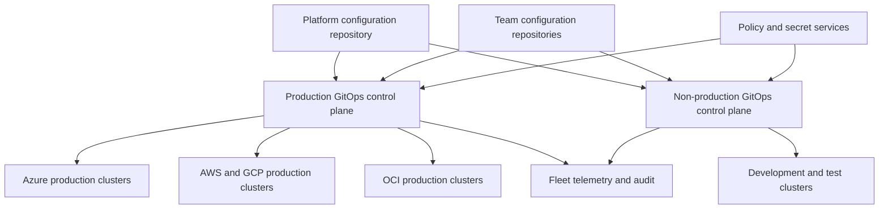

> **文档类型：** CI/CD & 自动化架构参考模型
> **规范性术语：** **MUST**、**MUST NOT**、**SHOULD**、**SHOULD NOT** 和 **MAY** 是要求级别。
> **适用范围：** Kubernetes 的多集群 GitOps、租户隔离、仓库和协调器身份、队列加入、部署、扩展、漂移和恢复。
> **例外流程：** 偏离要求需要记录风险评估、补偿控制、指定风险负责人和到期日期。

|控制领域|价值|
|---|---|
|文件编号 | `CICD-13` |
|负责人|云卓越中心 |
|审核周期|至少每年一次，并且在重大平台、提供商、安全性或运营模式发生变化之后 |
|证据|队列清单、仓库和 RBAC 策略、部署波次、协调器 SLO、漂移和修剪测试、租户隔离和恢复证据 |

# 多集群和多租户 GitOps 架构

> **决策简述：** 通过明确的队列、租户、身份和部署边界来扩展 GitOps，这样一个控制平面故障就不会跨越整个领域。

## 概述

多集群 GitOps 在整个队列中应用声明式交付。多租户决定了哪些团队可以更改哪些资源以及这些资源的隔离程度。健全的设计将仓库访问、协调器身份、集群凭证、命名空间策略和云边界视为一个安全模型。

本文应用于 AKS、EKS、GKE、OKE、OpenShift 和符合要求的 Kubernetes。 Argo CD 和 Flux 是常见的实现，但控制目标是产品中立的。

## 目标和非目标

### 目标

- 规模协调，无需创建单个无限制的控制平面。
- 隔离生产、非生产、平台和租户的责任。
- 使集群加入和删除具有声明性且可重复。
- 限制仓库和集群危害的爆炸半径。
- 保持整个集群舰队的可见性、策略和恢复能力。

### 非目标

- 假设命名空间单独提供敌对租户隔离。
- 通过 Git 为应用团队提供集群管理。
- 从一个控制器管理每个集群，无论风险或延迟如何。
- 在应用仓库中存储长期存在的集群凭据。

## 推荐架构

对生产和非生产使用单独的协调信任域。当延迟、数据驻留、可用性或主权需要时添加区域或监管控制平面。

## 控制平面布局模型

### 每个集群的控制器

每个集群都会自行协调。这可以最大程度地减少远程集群凭据和故障影响范围，并且在管理集群丢失期间继续运行。由于控制器、升级、策略和遥测都是分布式的，因此运营开销会增加。

用于高隔离环境、边缘集群、受监管的工作负载或管理平面连接不可靠的集群。

### 管理多个集群的中央控制器

中央 Argo CD 或类似服务管理远程集群。这提高了可见性和管理效率，但集中了凭证、网络访问和可用性风险。

仅与强大的集群分组、范围凭据、分片、受保护的管理、经过测试的备份和容量限制一起使用。

### 分层或分段机队

中央服务定义队列策略和集群注册，而区域或环境控制器则协调工作负载。这平衡了可见性和爆炸半径，是大型企业的首选模式。

## 租户模式

|模型|隔离|运营成本|正确使用|
|---|---|---|---|
|共享控制器和集群|最低|最低|值得信赖的团队和低风险工作负载 |
|共享控制器，独立集群|中等|中等|环境或业务单元隔离|
|独立控制器，共享集群|中等|中等|与可信集群租户的管理分离|
|独立的控制器和集群|最高|最高|受监管、敌对或高影响力的租户 |

Kubernetes 命名空间需要补充 RBAC、准入策略、配额、网络策略、需要的节点隔离以及对集群范围资源的限制。

## 仓库架构

推荐分离：
```text
platform-fleet/
  clusters/
    prod-us/
    prod-eu/
    nonprod-us/
  infrastructure/
  policies/

team-payments-config/
  apps/
    payments-api/
      base/
      overlays/
```
- 平台仓库管理控制器、命名空间、策略、集群附加组件和租户加入。
- 团队仓库管理批准的命名空间应用资源。
- 生产路径比开发路径需要更严格的审查。
- 协调器应仅读取其范围所需的仓库和路径。
- 生成的清单必须可追踪到已审核的输入。

在没有自动化的情况下，避免每个集群的仓库激增。当独立团队需要不同的访问边界时，还要避免使用不受限制的单一仓库。

## 协调顺序

定义显式依赖关系：

1. 集群 API 和身份先决条件。
2. GitOps 控制器和策略引擎。
3. 命名空间、配额、RBAC 和网络控制。
4.机密交付组件和操作员。
5、共享平台服务。
6. 租户应用。
7. 部署后运行状况和服务检查。

不要依赖文件名顺序或重复重试来隐藏丢失的依赖项。使用受支持的运行状况和依赖机制，并保护基础资源的删除。

## 身份和访问控制

- 通过组织身份提供商对管理员进行身份验证。
- 将组映射到最低权限的 GitOps 角色。
- 在支持的情况下，为每个租户使用单独的服务账户或模拟边界。
- 限制集群范围的类型和目标命名空间。
- 除非明确要求，否则禁用跨命名空间引用。
- 将仓库读取身份与集群突变身份分开。
- 将工作负载身份用于云 API 和外部机密访问。
- 轮换或消除远程集群凭据。

拉取请求批准不会授权协调器运行时权限之外的资源。实施源和目的地控制。

## 集群舰队入驻

集群加入应该是一个自动化的、经过审查的事务：

1. 注册集群身份和所有权。
2. 分配环境、区域、云、数据分类和支持标签。
3. 安装或注册固定控制器版本。
4. 应用基线策略、命名空间、网络控制、遥测和机密集成。
5. 仅授予所需的仓库和目标访问权限。
6. 运行一致性和负面授权测试。
7. 在受控波中启用对账。

卸载必须安全地暂停工作负载，保留所需的证据和数据，删除凭据，删除队列注册，并确认控制器无法重新连接。

## 扩展性和可用性

容量规划必须包括应用计数、渲染资源计数、仓库大小、协调频率、API 服务器限制、Webhook 和状态存储。使用事件通知来提高响应能力，但保留间隔协调以进行恢复。

按环境、地理位置、租户或一致的应用分组进行分片。避免任意分片导致事件所有权不明确。测试 Git、DNS、云身份或管理集群不可用时的行为。

## 漂移、修剪和破坏性变化

- 定义哪个控制器负责每个资源。
- 阻止两个协调器管理相同的字段或对象。
- 审查忽略规则和临时突变。
- 保护命名空间、持久卷、CRD 和共享服务免遭广泛修剪。
- 将空的渲染结果视为潜在的破坏性事件。
- 需要对集群范围内或高影响的删除进行额外审查。

必须记录紧急手动更改并将其反向移植到 Git 或通过协调有意恢复。

## 集群舰队清单契约

每个托管集群都应该具有规范化的清单元数据：
```text
cluster_id
cloud_and_account_boundary
region_and_data_residency
environment
tenant_or_business_owner
criticality
controller_shard
supported_kubernetes_version
policy_baseline
network_and_secret_integration
recovery_tier
lifecycle_state
```
清单用于定位、策略、升级波次、成本分配和事件响应。租户仓库提供的集群标签不得被信任为权威清单。

## 集群舰队发布波次

对控制器、策略、CRD、网关和共享服务的更改应通过明确的波次进行：

1. 集成或短暂集群。
2.具有代表性的非生产集群。
3. 低影响生产金丝雀。
4. 一个区域或租户群体。
5. 剩余生产集群。
6. 延迟或异常集群。

每波都需要成功、暂停和中止标准。整个集群舰队的 Git 合并以及随后的同步协调并不是高影响力平台变更的受控部署。

## 租户模板安全

ApplicationSet 生成器、Helm 模板、Kustomize 组件和仓库发现自动化可能会在整个队列中增加一个错误。验证：

- 仓库和路径允许列表。
- 目标命名空间和集群约束。
- 针对架构的模板值。
- 防止路径遍历和意外的仓库选择。
- 空的生成器输出和批量删除行为。
- 最大生成的应用数量。
- 集群范围内的资源的所有权和批准。

在生产协调之前必须可以审查生成的所需状态。

## 控制平面服务目标

对于每个控制器分片或管理平面，定义可用性、协调延迟、队列饱和度、API 限制、仓库依赖性、凭证轮换和备份目标。

集中控制平面还需要：

- 区域或故障域分布。
- 经过测试的故障转移或重建。
- 远程集群凭据的限制。
- 行政审计。
- 停电后机队恢复的容量空间。
- 防止一个吵闹的租户导致其他协调队列挨饿。

没有恢复设计的集中式仪表板不是弹性集群舰队架构。

## 验证

- [ ] 生产和非生产具有单独的协调信任域。
- [ ] 每个集群和租户都有一个负责任的所有者。
- [ ] 仓库、路径、命名空间和资源权限一致。
- [ ] 跨命名空间和集群范围的访问受到限制。
- [ ] 控制器和租户服务账户使用最小权限。
- [ ] 集群加入和退出是自动化的并经过测试。
- [ ] 依赖性和健康门是明确的。
- [ ] 修剪和空状态删除有保障。
- [ ] 监控队列容量、协调延迟和故障。
- [ ] 执行控制平面备份和恢复。

## 操作注意事项

监控所需修订与实际修订、协调持续时间、队列深度、API 限制、仓库故障、身份验证错误、挂起的资源、偏差和版本差异。通过服务所有权发出告警，而不是将每个集群舰队事件发送给一个团队。

备份声明性配置、控制器配置、签名信任和不可重构的操作状态。恢复应该从经过验证的仓库修订版和已知的控制器镜像引导，然后按依赖顺序进行协调。

## 相关主题
- [GitOps 交付模式](gitops-delivery-patterns.md)
- [GitOps 中的配置和机密管理](configuration-and-secret-management-in-gitops.md)
- [流水线身份和机密处理](pipeline-identity-and-secret-handling.md)
- [流水线故障排除与恢复](pipeline-troubleshooting-and-recovery.md)

## 参考文档

- [OpenGitOps 原则](https://opengitops.dev/)
- [Argo CD：声明式设置](https://argo-cd.readthedocs.io/en/stable/operator-manual/declarative-setup/)
- [Argo CD：应用集](https://argo-cd.readthedocs.io/en/stable/operator-manual/applicationset/)
- [Flux：仓库结构](https://fluxcd.io/flux/guides/repository-structure/)
- [Flux：多租户](https://fluxcd.io/flux/installation/configuration/multitenancy/)
- [Kubernetes：多租户](https://kubernetes.io/docs/concepts/security/multi-tenancy/)
