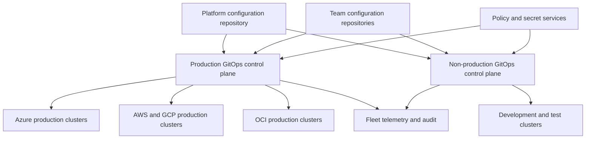

> **Document class:** CI/CD & Automation architecture reference model
> **Normative terms:** **MUST**, **MUST NOT**, **SHOULD**, **SHOULD NOT**, and **MAY** are requirements levels.
> **Applicability:** Multi-cluster GitOps, tenant isolation, repository and reconciler identity, fleet onboarding, rollout, scaling, drift, and recovery for Kubernetes.
> **Exception process:** Deviations require a documented risk assessment, compensating controls, named risk owner, and expiry date.

| Control field | Value |
|---|---|
| Document ID | `CICD-13` |
| Owner | Cloud Center of Excellence |
| Review cycle | At least annually and after material platform, provider, security, or operating-model changes |
| Evidence | Fleet inventory, repository and RBAC policy, rollout waves, reconciler SLOs, drift and prune tests, tenant isolation, and recovery evidence |

# Multi-Cluster and Multi-Tenant GitOps Architecture

> **Decision in brief:** Scale GitOps through explicit fleet, tenant, identity, and rollout boundaries so one control-plane failure cannot cross the whole estate.

## Overview

Multi-cluster GitOps applies declarative delivery across a fleet. Multi-tenancy determines which teams can change which resources and how strongly they are isolated. A sound design treats repository access, reconciler identity, cluster credentials, namespace policy, and cloud boundaries as one security model.

This article applies to AKS, EKS, GKE, OKE, OpenShift, and conformant Kubernetes. Argo CD and Flux are common implementations, but the control objectives are product-neutral.

## Goals and non-goals

### Goals

- Scale reconciliation without creating a single unrestricted control plane.
- Isolate production, non-production, platform, and tenant responsibilities.
- Make cluster onboarding and removal declarative and repeatable.
- Limit repository and cluster compromise blast radius.
- Preserve fleet-wide visibility, policy, and recovery capability.

### Non-goals

- Assuming namespaces alone provide hostile-tenant isolation.
- Giving application teams cluster-admin through Git.
- Managing every cluster from one controller regardless of risk or latency.
- Storing long-lived cluster credentials in application repositories.

## Recommended architecture



Use separate reconciliation trust domains for production and non-production. Add regional or regulatory control planes when latency, data residency, availability, or sovereignty requires them.

## Control-plane placement models

### Controller per cluster

Each cluster reconciles itself. This minimizes remote cluster credentials and failure blast radius, and it continues operating during management-cluster loss. Operational overhead increases because controllers, upgrades, policy, and telemetry are distributed.

Use for high-isolation environments, edge clusters, regulated workloads, or clusters with unreliable management-plane connectivity.

### Central controller managing many clusters

A central Argo CD or similar service manages remote clusters. This improves visibility and administrative efficiency but concentrates credentials, network access, and availability risk.

Use only with strong cluster grouping, scoped credentials, sharding, protected administration, tested backup, and capacity limits.

### Hierarchical or segmented fleet

A central service defines fleet policy and cluster registration while regional or environment controllers reconcile workloads. This balances visibility and blast radius and is the preferred large-enterprise pattern.

## Tenancy models

| Model | Isolation | Operational cost | Appropriate use |
|---|---|---|---|
| Shared controller and cluster | Lowest | Lowest | Trusted teams and low-risk workloads |
| Shared controller, separate clusters | Medium | Medium | Environment or business-unit isolation |
| Separate controller, shared cluster | Medium | Medium | Administrative separation with trusted cluster tenants |
| Separate controller and cluster | Highest | Highest | Regulated, hostile, or high-impact tenants |

Kubernetes namespaces require complementary RBAC, admission policy, quotas, network policy, node isolation where needed, and restrictions on cluster-scoped resources.

## Repository architecture

Recommended separation:

```text
platform-fleet/
  clusters/
    prod-us/
    prod-eu/
    nonprod-us/
  infrastructure/
  policies/

team-payments-config/
  apps/
    payments-api/
      base/
      overlays/
```

- Platform repositories own controllers, namespaces, policy, cluster add-ons, and tenant onboarding.
- Team repositories own approved namespaced application resources.
- Production paths require stronger review than development paths.
- Reconcilers should read only repositories and paths needed for their scope.
- Generated manifests must remain traceable to reviewed input.

Avoid repository-per-cluster proliferation without automation. Also avoid one unrestricted monorepository when independent teams require different access boundaries.

## Reconciliation ordering

Define explicit dependencies:

1. Cluster APIs and identity prerequisites.
2. GitOps controllers and policy engines.
3. Namespaces, quotas, RBAC, and network controls.
4. Secret-delivery components and operators.
5. Shared platform services.
6. Tenant applications.
7. Post-deployment health and service checks.

Do not rely on filename order or repeated retries to hide missing dependencies. Use supported health and dependency mechanisms, and protect deletion of foundational resources.

## Identity and access controls

- Authenticate administrators through the organization identity provider.
- Map groups to least-privilege GitOps roles.
- Use separate service accounts or impersonation boundaries per tenant where supported.
- Restrict cluster-scoped kinds and destination namespaces.
- Disable cross-namespace references unless explicitly required.
- Separate repository read identity from cluster mutation identity.
- Use workload identity for cloud APIs and external secret access.
- Rotate or eliminate remote cluster credentials.

A pull request approval does not authorize resources outside the reconciler's runtime permissions. Enforce both source and destination controls.

## Fleet onboarding

Cluster onboarding should be an automated, reviewed transaction:

1. Register cluster identity and ownership.
2. Assign environment, region, cloud, data classification, and support labels.
3. Install or register a pinned controller version.
4. Apply baseline policy, namespaces, network controls, telemetry, and secret integration.
5. Grant only required repository and destination access.
6. Run conformance and negative authorization tests.
7. Enable reconciliation in controlled waves.

Offboarding must suspend workloads safely, preserve required evidence and data, remove credentials, delete fleet registration, and confirm the controller cannot reconnect.

## Scaling and availability

Capacity planning must include application count, rendered resource count, repository size, reconciliation frequency, API server limits, webhooks, and status storage. Use event notifications for responsiveness but retain interval reconciliation for recovery.

Shard by environment, geography, tenant, or consistent application grouping. Avoid arbitrary sharding that makes incident ownership unclear. Test behavior when Git, DNS, cloud identity, or the management cluster is unavailable.

## Drift, pruning, and destructive changes

- Define which controller owns each resource.
- Block two reconcilers from managing the same field or object.
- Review ignore rules and temporary mutations.
- Protect namespaces, persistent volumes, CRDs, and shared services from broad pruning.
- Treat an empty rendered result as a potentially destructive event.
- Require additional review for cluster-wide or high-impact deletions.

Emergency manual changes must be recorded and back-ported to Git or intentionally reverted by reconciliation.

## Fleet inventory contract

Every managed cluster should have normalized inventory metadata:

```text
cluster_id
cloud_and_account_boundary
region_and_data_residency
environment
tenant_or_business_owner
criticality
controller_shard
supported_kubernetes_version
policy_baseline
network_and_secret_integration
recovery_tier
lifecycle_state
```

The inventory is used for targeting, policy, upgrade waves, cost allocation, and incident response. Cluster labels supplied by tenant repositories must not be trusted as the authoritative inventory.

## Fleet rollout waves

Changes to controllers, policies, CRDs, gateways, and shared services should progress through explicit waves:

1. Integration or ephemeral clusters.
2. Representative non-production clusters.
3. Low-impact production canary.
4. One region or tenant cohort.
5. Remaining production fleet.
6. Deferred or exception clusters.

Each wave needs success, pause, and abort criteria. A fleet-wide Git merge followed by simultaneous reconciliation is not a controlled rollout for high-impact platform changes.

## Tenant-template safety

ApplicationSet generators, Helm templates, Kustomize components, and repository-discovery automation can multiply one error across the fleet. Validate:

- Repository and path allow lists.
- Destination namespace and cluster constraints.
- Template values against a schema.
- Prevention of path traversal and unexpected repository selection.
- Empty generator output and mass deletion behavior.
- Maximum generated application count.
- Ownership and approval for cluster-scoped resources.

Generated desired state must be reviewable before production reconciliation.

## Control-plane service objectives

For each controller shard or management plane, define availability, reconciliation latency, queue saturation, API throttling, repository dependency, credential rotation, and backup objectives.

Centralized control planes also require:

- Zone or failure-domain distribution.
- Tested failover or rebuild.
- Limits on remote cluster credentials.
- Administrative audit.
- Capacity headroom for fleet recovery after outage.
- Protection against one noisy tenant starving other reconciliation queues.

A centralized dashboard without a recovery design is not a resilient fleet architecture.

## Validation

- [ ] Production and non-production have separate reconciliation trust domains.
- [ ] Every cluster and tenant has an accountable owner.
- [ ] Repository, path, namespace, and resource permissions align.
- [ ] Cross-namespace and cluster-scoped access is restricted.
- [ ] Controller and tenant service accounts use least privilege.
- [ ] Cluster onboarding and offboarding are automated and tested.
- [ ] Dependencies and health gates are explicit.
- [ ] Pruning and empty-state deletion have safeguards.
- [ ] Fleet capacity, reconciliation latency, and failures are monitored.
- [ ] Control-plane backup and recovery are exercised.

## Operational considerations

Monitor desired versus actual revision, reconciliation duration, queue depth, API throttling, repository failures, authentication errors, suspended resources, drift, and version skew. Alert by service ownership rather than sending every fleet event to one team.

Back up declarative configuration, controller configuration, signing trust, and non-reconstructible operational state. Recovery should bootstrap from a verified repository revision and known controller images, then reconcile in dependency order.

## Related topics

- [GitOps Delivery Patterns](gitops-delivery-patterns.md)
- [Configuration and Secret Management in GitOps](configuration-and-secret-management-in-gitops.md)
- [Pipeline Identity and Secret Handling](pipeline-identity-and-secret-handling.md)
- [Pipeline Troubleshooting and Recovery](pipeline-troubleshooting-and-recovery.md)

## References

- [OpenGitOps principles](https://opengitops.dev/)
- [Argo CD: Declarative setup](https://argo-cd.readthedocs.io/en/stable/operator-manual/declarative-setup/)
- [Argo CD: ApplicationSet](https://argo-cd.readthedocs.io/en/stable/operator-manual/applicationset/)
- [Flux: Repository structure](https://fluxcd.io/flux/guides/repository-structure/)
- [Flux: Multi-tenancy](https://fluxcd.io/flux/installation/configuration/multitenancy/)
- [Kubernetes: Multi-tenancy](https://kubernetes.io/docs/concepts/security/multi-tenancy/)
