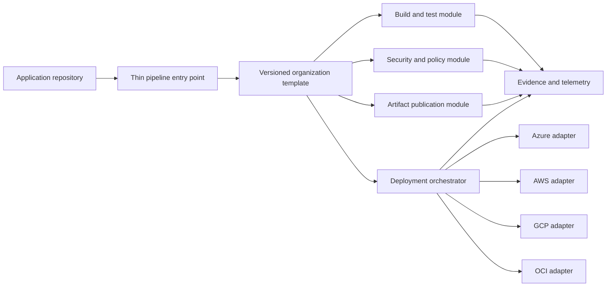
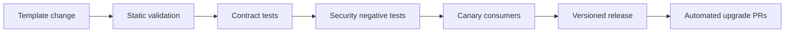

> **文档类型：** CI/CD 与自动化强制性工程标准
> **规范性术语：** **MUST**、**MUST NOT**、**SHOULD**、**SHOULD NOT** 和 **MAY** 是要求级别。
> **适用范围：** 流水线源、可复用模板、工作流信任边界、版本控制、测试、消费者契约、遥测和异常。
> **例外流程：** 偏离要求需要记录风险评估、补偿控制、指定风险负责人和到期日期。

|控制领域|价值|
|---|---|
|文件编号 | `CICD-10` |
|负责人|云卓越中心 |
|审核周期|至少每年一次，并且在重大平台、提供商、安全性或运营模式发生变化之后 |
|证据|模板测试、生成流水线审查、依赖固定、消费者采用、质量遥测和异常日志记录 |

# 流水线即代码标准和可复用模板

> **简要决定：** 将可复用控件集中在版本化、经过测试的模板中，同时保持消费者输入明确、有界和可审查。

## 概述

流水线即代码将交付逻辑置于版本控制之下，以便可以对其进行审查、测试、复制和审计。可复用模板将通用控件变为可维护的平台功能，而不是在仓库之间复制大型工作流程文件。

目标不是将所有工作负载强制放入一条流水线中。目标是标准化安全和生命周期控制，同时为团队的语言、制品和部署需求留下明确的、有界的扩展点。

## 目标和非目标

### 目标

- 保持流水线定义的版本化，并具有明确的所有权和审查。
- 提供可复用的组件以及稳定的、记录在案的接口。
- 一致地应用强制性安全、证据和部署控制。
- 支持 GitHub Actions、Azure Pipelines、GitLab CI/CD 和类似平台。
- 将云中立交付逻辑与 Azure、AWS、GCP 和 OCI 适配器分开。

### 非目标

- 构建一条具有数百个条件分支的通用流水线。
- 允许共享模板默默地获取生产权限。
- 引用生产工作负载的可变模板分支。
- 对消费团队隐藏所有流水线行为。

## 参考架构

应用仓库负责特定于工作负载的配置。平台团队负责共享模板。云适配器实现特定于提供商的身份验证和部署，而无需更改公共控制流。

## 所需的设计标准

### 保持入口点精简

消费仓库通常应声明：

- 模板版本。
- 构建类型和支持的运行时。
- 测试命令和路径。
- 制品名称和包装方法。
- 目标环境标识符。
- 批准的可选功能。

它不应重复身份设置、证据收集、制品签名、生产批准或运行器强化。

### 将模板接口视为 API

每个模板输入都必须具有名称、类型、默认值、允许值、安全分类和描述。输出必须记录在案且稳定。尽早拒绝未知或无效的输入。

优先选择面向功能的输入（例如 `publish_artifact: true`）而不是任意命令字符串。自由格式的 shell 参数允许使用者绕过模板的预期控制。

### 将强制控制与扩展点分开

强制控制通常包括：

- 在支持的情况下禁用凭证持久性的源签出。
- 依赖关系和源扫描。
- 测试和策略评估。
- 不可变的制品发布。
- 工作负载身份联合。
- 环境保护和并发控制。
- 证据保留和部署验证。

扩展点应放置在定义的阶段之前或之后，并且必须说明哪些凭据和网络访问可用。切勿在特权签名或生产部署上下文中执行消费者提供的步骤。

## 模板层次结构

使用小型的、可组合的层次结构：
```text
pipeline-catalog/
  workflows/       # Complete governed workflows
  stages/          # Build, test, publish, deploy
  steps/           # Focused reusable operations
  cloud-adapters/  # Azure, AWS, GCP, OCI integrations
  policy/          # Validation rules and schemas
  examples/        # Minimal consumer pipelines
  changelog/
```
避免深层嵌套。故障应该可以从消费者入口点追溯到确切的组件和版本，而无需导航大型继承树。

## 版本控制和发布策略

- 发布模板目录的不可变版本。
- 将生产消费者固定到提交、摘要或受保护的发布标签。
- 对记录在案的模板接口使用语义版本控制。
- 将破坏性输入、输出、权限或行为更改作为主要版本。
- 在定义的过渡窗口内维护受支持的主要版本。
- 自动提出安全模板升级的拉取请求。
- 发布说明、迁移说明和经过测试的回滚路径。

请勿将 `main`、`latest` 或其他可变引用设为生产标准。重新运行必须解析相同的模板内容，除非使用仓库有意更新它。

## 平台实现模式

|平台|复用机制|推荐对照|
|---|---|---|
| GitHub Actions |可复用的工作流程和复合 Action |固定外部 Action 和可复用的工作流程；限制允许的 Action 和运行器组 |
| Azure Pipelines | `extends`、阶段、作业和步骤模板 |使用受保护的模板仓库和所需的模板检查 |
|GitLab CI/CD |组件和版本化 `include` 文件 |固定组件版本并验证合并的配置 |
|云原生构建服务 |共享构建规范或编排模块|将定义存储在受保护的源中并使用工作负载标识 |

平台语法有所不同，但所有权、不变性、最小权限、验证和兼容性规则保持不变。

## 安全边界

- 模板仓库必须使用受保护的分支和代码所有者。
- 身份、运行器选择、制品签名或生产部署的更改需要安全或平台审查。
- 模板必须仅请求每个作业所需的权限。
- 不受信任的拉取请求代码不得接收受保护的机密或特权运行器。
- 云访问必须在支持的情况下使用短期联邦身份。
- 必须固定和审查模板依赖性和 Marketplace Actions。
- 日志、输出、缓存和制品不得公开凭据。

有关底层控制，请参阅[流水线身份和机密处理](pipeline-identity-and-secret-handling.md) 和[共享运行器安全与清理规范](shared-runner-security-and-hygiene.md)。

## 测试模板发布

将目录作为产品进行测试：

1. 对每个组件进行 Lint 和架构检查。
2. 练习必需的和可选的输入。
3. 对支持的工作负载类型运行积极测试。
4. 对不允许的命令、权限、分支和环境运行负面测试。
5. 在支持的运行器操作系统和架构上进行验证。
6. 使用非生产身份独立测试云适配器。
7. 验证证据、制品、超时、取消和清理行为。
8. 在升级之前运行代表性的消费者仓库。

## 采用和例外管理

度量模板采用情况、活动版本、升级失败、绕过和不受支持的使用者。为团队提供一个迁移窗口，而不是同时更改所有仓库。

异常必须记录所有者、业务原因、缺失功能、补偿控制、到期日期和修复计划。重复的异常表明平台团队应该解决目录差距。

## 消费者契约和生成流水线审查

可复用的模板应该使有效的流水线可见。保留或渲染：

- 解决了模板和组件版本。
- 最终作业图和依赖关系。
- 有效的权限。
- 运行器组。
- 环境和服务连接参考。
- 制品、缓存和输出。
- 消费者扩展点。
- 由输入选择的条件路径。

当大多数行为来自远程模板时，仅查看瘦消费者文件是不够的。

## 输入安全

在验证之前，将模板输入视为不可信。高风险输入类型包括：

- Shell 命令或命令片段。
- 文件路径和工作目录。
- 文件系统操作中使用的制品名称。
- 环境名称。
- 运行器标签。
- 云角色或服务连接名称。
- 禁用检查的布尔标志。
- 插入到 YAML 或命令行中的列表。

使用允许列表、架构、固定映射和安全引用。可复用模板不得允许消费者选择任意生产身份或特权运行器。

## 弃用生命周期

对于每个发布的主要版本：

1. 发布支持和支持结束日期。
2. 识别消费者和所有者。
3.提供兼容性和迁移测试。
4. 在安全的情况下打开自动升级拉取请求。
5. 测量剩余使用情况。
6. 弃用后阻止新的采用。
7. 仅在支持的迁移或批准的例外情况后删除特权后端访问。

不要默默地更改已弃用的模板来强制迁移。这会破坏再现性并可能破坏紧急重播。

## 模板遥测和质量目标

曲目：

- 按版本采用。
- 按阶段和消费者类型划分的故障率。
- 流水线持续时间中位数。
- 运行器池的排队时间。
- 安全门旁路和异常率。
- 升级成功率。
- 不支持的消费者数量。
- 模板更改后的回滚频率。
- 是时候修复目录缺陷了。

模板遥测必须避免收集源内容、机密值或敏感命令输出。目的是产品可靠性和治理，而不是广泛的监视。

## 验证

- [ ] 消费流水线引用不可变的模板版本。
- [ ] 输入和输出被键入并记录。
- [ ] 强制控制不能通过消费者参数删除。
- [ ] 扩展点以明确记录在案的权限运行。
- [ ] 模板更改通过契约和负面安全测试。
- [ ] 云适配器使用短暂的、环境范围内的身份。
- [ ] 支持的版本和弃用日期可见。
- [ ] 可以快速恢复已知良好的模板版本。
- [ ] 通过模板版本可以监控使用情况和失败情况。

## 操作注意事项
指定平台产品所有者和安全审核员。定义模板缺陷的支持目标，因为一个错误的版本可能会影响许多仓库。保留扩展的流水线定义、已解析的组件版本、日志和制品标识符以进行事件调查。

通过恢复最后一个已知良好的不可变模板版本或恢复消费者升级拉取请求来进行回滚。不要覆盖损坏的标签；发布更正的版本，以便历史仍然值得信赖。

## 相关主题

- [实用的 CI/CD 蓝图](practical-ci-cd-blueprint.md)
- [流水线身份和机密处理](pipeline-identity-and-secret-handling.md)
- [环境晋级、审批、发布控制](environment-promotion-approval-and-release-controls.md)
- [流水线故障排除与恢复](pipeline-troubleshooting-and-recovery.md)

## 参考文档

- [GitHub 文档：重用工作流程](https://docs.github.com/en/actions/how-tos/reuse-automations/reuse-workflows)
- [Microsoft Learn：Azure Pipelines 中的安全模板](https://learn.microsoft.com/en-us/azure/devops/pipelines/security/templates)
- [Microsoft Learn：用于可复用和安全流水线的 YAML 模板](https://learn.microsoft.com/en-us/azure/devops/pipelines/process/templates)
- [GitLab 文档：CI/CD YAML 包括](https://docs.gitlab.com/ci/yaml/includes/)
- [语义版本控制 2.0.0](https://semver.org/)
