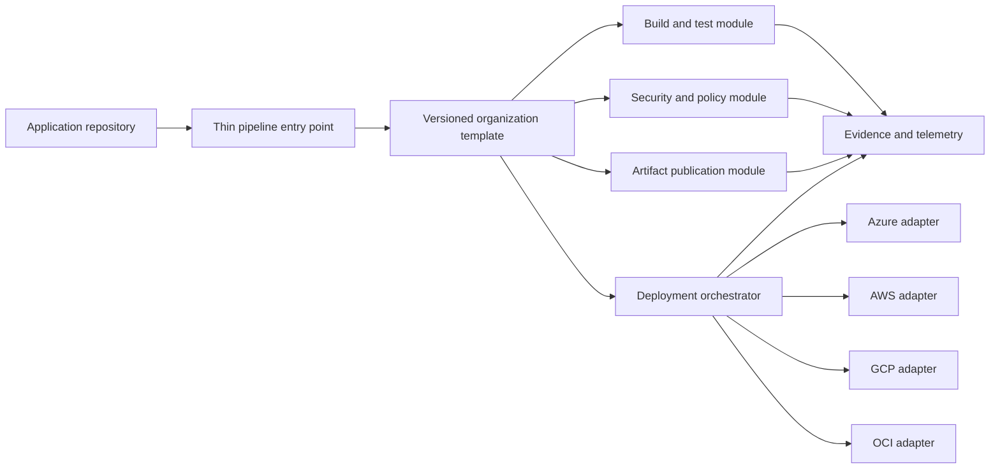

> **Document class:** CI/CD & Automation mandatory engineering standard
> **Normative terms:** **MUST**, **MUST NOT**, **SHOULD**, **SHOULD NOT**, and **MAY** are requirements levels.
> **Applicability:** Pipeline source, reusable templates, workflow trust boundaries, versioning, testing, consumer contracts, telemetry, and exceptions.
> **Exception process:** Deviations require a documented risk assessment, compensating controls, named risk owner, and expiry date.

| Control field | Value |
|---|---|
| Document ID | `CICD-10` |
| Owner | Cloud Center of Excellence |
| Review cycle | At least annually and after material platform, provider, security, or operating-model changes |
| Evidence | Template tests, generated-pipeline review, dependency pinning, consumer adoption, quality telemetry, and exception records |

# Pipeline as Code Standards and Reusable Templates

> **Decision in brief:** Centralize reusable controls in versioned, tested templates while keeping consumer inputs explicit, bounded, and reviewable.

## Overview

Pipeline as code places delivery logic under version control so it can be reviewed, tested, reproduced, and audited. Reusable templates turn common controls into a maintained platform capability instead of copying large workflow files between repositories.

The objective is not to force every workload into one pipeline. The objective is to standardize security and lifecycle controls while leaving teams explicit, bounded extension points for their language, artifact, and deployment needs.

## Goals and non-goals

### Goals

- Keep pipeline definitions versioned with clear ownership and review.
- Provide reusable components with stable, documented interfaces.
- Apply mandatory security, evidence, and deployment controls consistently.
- Support GitHub Actions, Azure Pipelines, GitLab CI/CD, and comparable platforms.
- Separate cloud-neutral delivery logic from Azure, AWS, GCP, and OCI adapters.

### Non-goals

- Building one universal pipeline with hundreds of conditional branches.
- Allowing a shared template to silently gain production permissions.
- Referencing mutable template branches for production workloads.
- Hiding all pipeline behavior from consuming teams.

## Reference architecture



The application repository owns workload-specific configuration. The platform team owns shared templates. Cloud adapters implement provider-specific authentication and deployment without changing the common control flow.

## Required design standards

### Keep the entry point thin

A consuming repository should normally declare:

- Template version.
- Build type and supported runtime.
- Test commands and paths.
- Artifact name and packaging method.
- Target environment identifiers.
- Approved optional capabilities.

It should not duplicate identity setup, evidence collection, artifact signing, production approval, or runner hardening.

### Treat the template interface as an API

Every template input must have a name, type, default, allowed values, security classification, and description. Outputs must be documented and stable. Reject unknown or invalid inputs early.

Prefer capability-oriented inputs such as `publish_artifact: true` over arbitrary command strings. Free-form shell parameters allow consumers to bypass the template's intended controls.

### Separate mandatory controls from extension points

Mandatory controls commonly include:

- Source checkout with credential persistence disabled where supported.
- Dependency and source scanning.
- Tests and policy evaluation.
- Immutable artifact publication.
- Workload identity federation.
- Environment protection and concurrency control.
- Evidence retention and deployment verification.

Extension points should be placed before or after defined phases and must state which credentials and network access are available. Never execute consumer-supplied steps inside a privileged signing or production deployment context.

## Template hierarchy

Use a small, composable hierarchy:

```text
pipeline-catalog/
  workflows/       # Complete governed workflows
  stages/          # Build, test, publish, deploy
  steps/           # Focused reusable operations
  cloud-adapters/  # Azure, AWS, GCP, OCI integrations
  policy/          # Validation rules and schemas
  examples/        # Minimal consumer pipelines
  changelog/
```

Avoid deep nesting. A failure should be traceable from the consumer entry point to the exact component and version without navigating a large inheritance tree.

## Versioning and release policy

- Publish immutable releases of the template catalog.
- Pin production consumers to a commit, digest, or protected release tag.
- Use semantic versioning for the documented template interface.
- Make breaking input, output, permission, or behavior changes a major release.
- Maintain supported major versions for a defined transition window.
- Automate pull requests that propose safe template upgrades.
- Publish release notes, migration instructions, and a tested rollback path.

Do not make `main`, `latest`, or another mutable reference the production standard. A rerun must resolve the same template content unless the consuming repository intentionally updates it.

## Platform implementation patterns

| Platform | Reuse mechanism | Recommended control |
|---|---|---|
| GitHub Actions | Reusable workflows and composite actions | Pin external actions and reusable workflows; restrict allowed actions and runner groups |
| Azure Pipelines | `extends`, stage, job, and step templates | Use protected template repositories and required template checks |
| GitLab CI/CD | Components and versioned `include` files | Pin component versions and validate merged configuration |
| Cloud-native build services | Shared build specifications or orchestrated modules | Store definitions in protected source and use workload identity |

Platform syntax differs, but ownership, immutability, least privilege, validation, and compatibility rules remain the same.

## Security boundaries

- The template repository must use protected branches and CODEOWNERS.
- Changes to identity, runner selection, artifact signing, or production deployment require security or platform review.
- Templates must request only the permissions needed by each job.
- Untrusted pull-request code must not receive protected secrets or privileged runners.
- Cloud access must use short-lived federated identity where supported.
- Template dependencies and marketplace actions must be pinned and reviewed.
- Logs, outputs, caches, and artifacts must not expose credentials.

See [Pipeline Identity and Secret Handling](pipeline-identity-and-secret-handling.md) and [Shared Runner Security and Hygiene](shared-runner-security-and-hygiene.md) for the underlying controls.

## Testing a template release

Test the catalog as a product:

1. Lint and schema-check every component.
2. Exercise required and optional inputs.
3. Run positive tests for supported workload types.
4. Run negative tests for disallowed commands, permissions, branches, and environments.
5. Validate across supported runner operating systems and architectures.
6. Test cloud adapters independently with non-production identities.
7. Verify evidence, artifact, timeout, cancellation, and cleanup behavior.
8. Run representative consumer repositories before promotion.


## Adoption and exception management

Measure template adoption, active versions, failed upgrades, bypasses, and unsupported consumers. Give teams a migration window rather than changing all repositories simultaneously.

An exception must record the owner, business reason, missing capability, compensating controls, expiration date, and remediation plan. Repeated exceptions indicate a catalog gap that the platform team should address.

## Consumer contract and generated-pipeline review

A reusable template should make the effective pipeline visible. Preserve or render:

- Resolved template and component versions.
- Final job graph and dependencies.
- Effective permissions.
- Runner groups.
- Environment and service-connection references.
- Artifacts, caches, and outputs.
- Consumer extension points.
- Conditional paths selected by inputs.

Reviewing only the thin consumer file is insufficient when most behavior comes from remote templates.

## Input safety

Treat template inputs as untrusted until validated. High-risk input types include:

- Shell commands or command fragments.
- File paths and working directories.
- Artifact names used in filesystem operations.
- Environment names.
- Runner labels.
- Cloud role or service-connection names.
- Boolean flags that disable checks.
- Lists interpolated into YAML or command lines.

Use allow lists, schemas, fixed mappings, and safe quoting. A reusable template must not permit a consumer to select an arbitrary production identity or privileged runner.

## Deprecation lifecycle

For each released major version:

1. Publish support and end-of-support dates.
2. Identify consumers and owners.
3. Provide compatibility and migration tests.
4. Open automated upgrade pull requests where safe.
5. Measure remaining usage.
6. Block new adoption after deprecation.
7. Remove privileged backend access only after supported migration or approved exception.

Do not silently change a deprecated template to force migration. That destroys reproducibility and can break emergency reruns.

## Template telemetry and quality objectives

Track:

- Adoption by version.
- Failure rate by phase and consumer type.
- Median pipeline duration.
- Queuing time by runner pool.
- Security-gate bypass and exception rate.
- Upgrade success rate.
- Unsupported consumer count.
- Rollback frequency after template changes.
- Time to remediate a catalog defect.

Template telemetry must avoid collecting source contents, secret values, or sensitive command output. The purpose is product reliability and governance, not broad surveillance.

## Validation

- [ ] The consuming pipeline references an immutable template version.
- [ ] Inputs and outputs are typed and documented.
- [ ] Mandatory controls cannot be removed by consumer parameters.
- [ ] Extension points run with explicitly documented privileges.
- [ ] Template changes pass contract and negative security tests.
- [ ] Cloud adapters use short-lived, environment-scoped identity.
- [ ] Supported versions and deprecation dates are visible.
- [ ] A known-good template version can be restored quickly.
- [ ] Usage and failures are observable by template version.

## Operational considerations

Assign a platform product owner and security reviewer. Define support objectives for template defects because one bad release can affect many repositories. Preserve the expanded pipeline definition, resolved component versions, logs, and artifact identifiers for incident investigation.

Roll back by restoring the last known-good immutable template version or reverting consumer upgrade pull requests. Do not overwrite a broken tag; publish a corrected version so history remains trustworthy.

## Related topics

- [A Practical CI/CD Blueprint](practical-ci-cd-blueprint.md)
- [Pipeline Identity and Secret Handling](pipeline-identity-and-secret-handling.md)
- [Environment Promotion, Approval, and Release Controls](environment-promotion-approval-and-release-controls.md)
- [Pipeline Troubleshooting and Recovery](pipeline-troubleshooting-and-recovery.md)

## References

- [GitHub Docs: Reusing workflows](https://docs.github.com/en/actions/how-tos/reuse-automations/reuse-workflows)
- [Microsoft Learn: Templates for security in Azure Pipelines](https://learn.microsoft.com/en-us/azure/devops/pipelines/security/templates)
- [Microsoft Learn: YAML templates for reusable and secure pipelines](https://learn.microsoft.com/en-us/azure/devops/pipelines/process/templates)
- [GitLab Docs: CI/CD YAML includes](https://docs.gitlab.com/ci/yaml/includes/)
- [Semantic Versioning 2.0.0](https://semver.org/)
