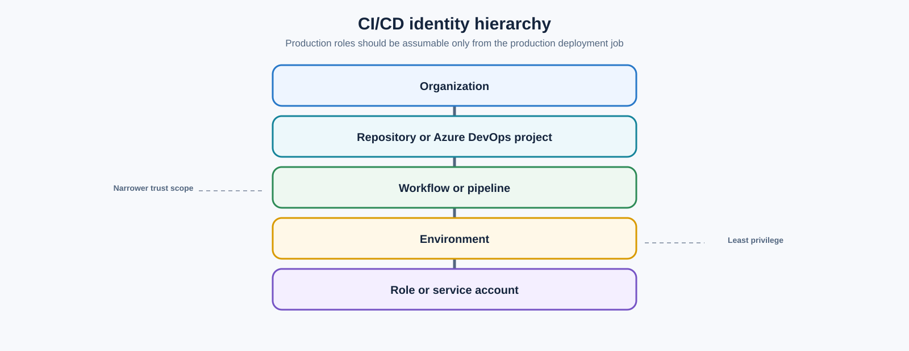

> **Document class:** CI/CD & Automation implementation guide
> **Normative terms:** **MUST**, **MUST NOT**, **SHOULD**, **SHOULD NOT**, and **MAY** are requirements levels.
> **Applicability:** CI/CD identities, federated cloud access, secret storage and injection, signing, provenance, rotation, and incident response.
> **Exception process:** Deviations require a documented risk assessment, compensating controls, named risk owner, and expiry date.

| Control field | Value |
|---|---|
| Document ID | `CICD-05` |
| Owner | Cloud Center of Excellence |
| Review cycle | At least annually and after material platform, provider, security, or operating-model changes |
| Evidence | Trust policies, token claims, access reviews, secret inventory and rotation, signing attestations, and incident tests |

# Pipeline Identity and Secret Handling

> **Decision in brief:** Eliminate standing pipeline secrets where possible, constrain every issued identity, and make token use observable and reversible.

## Overview

Pipeline credentials are high-value attack targets because they connect source code to production systems. The correct objective is not "store secrets safely." It is to eliminate standing secrets where possible, restrict every issued credential, and make misuse observable and reversible.

A mature design distinguishes:

- The CI/CD platform identity.
- The repository or project identity.
- The workflow, job, or pipeline identity.
- The target-environment deployment identity.
- Runtime workload identities.
- Human break-glass identities.

Collapsing these into one shared service account destroys attribution and expands blast radius.

## Goals and non-goals

### Goals

- Prefer short-lived federated credentials.
- Bind trust to repository, branch, environment, workflow, and audience claims.
- Separate read-only plan identities from write-capable apply identities.
- Prevent untrusted code from accessing protected credentials.
- Store unavoidable secrets in managed secret systems.
- Detect, revoke, and recover from credential exposure.

### Non-goals

- Relying on log masking as the primary security control.
- Sharing one credential across environments or teams.
- Giving a pipeline owner unrestricted cloud administration.
- Treating repository privacy as a substitute for least privilege.

## Reference architecture

```mermaid
flowchart LR
    A[Repository event] --> B[CI/CD job]
    B --> C[Platform-issued OIDC token]
    C --> D[Cloud trust policy]
    D --> E[Short-lived deployment credential]
    E --> F[Environment-scoped role]
    F --> G[Target resources]

    H[Managed secret store] --> I[Exceptional secrets]
    I --> B

    J[Audit logs] <-- C
    J <-- E
    J <-- G
```

The cloud trust policy is the decisive control. Merely enabling OIDC does not produce least privilege.

## Identity hierarchy

Use a hierarchy such as:



A production role should be assumable only from the production deployment job, not from every job in the repository.

## Federation by provider

### Azure

Use Microsoft Entra workload identity federation for Azure DevOps or GitHub Actions. Configure federated credentials with exact issuer, audience, and subject matching. Assign the backing service principal or managed identity only the Azure RBAC roles required for the target scope.

Avoid subscription-wide `Owner` or `Contributor` when resource-group- or resource-scoped roles are sufficient. Separate the permission to deploy resources from the permission to grant roles.

### AWS

Configure the CI/CD platform as an IAM OIDC provider and permit `sts:AssumeRoleWithWebIdentity` only under strict conditions. Restrict:

- Audience.
- Repository and organization claims.
- Branch, tag, or environment.
- Workflow identity where supported by claims.
- Session duration.
- IAM permissions and resource scope.

Use separate roles for plan, deploy, and production. Use permission boundaries or service-control policies where the organization requires defense in depth.

### GCP

Use Workload Identity Federation. Map external claims to attributes and enforce attribute conditions. Permit service-account impersonation only for the intended external principal set.

Avoid broad `principalSet` mappings that include every repository or branch. Service-account keys are long-lived bearer credentials and should be removed once federation is operational.

### OCI

Prefer OCI-native identities when execution occurs inside OCI:

- Instance principals.
- Resource principals.
- Workload identity for supported OCI services and Kubernetes patterns.
- OCI Resource Manager for Terraform execution.

For external CI/CD, evaluate OCI's supported external token exchange or identity-propagation trust. Where federation is not available or operationally mature, use a dedicated API-signing principal with narrowly scoped IAM policies, isolated key material, rotation, and monitoring.

## Trust-policy design

A robust trust policy answers five questions:

1. Who issued the token?
2. What audience was the token intended for?
3. Which repository, project, or organization initiated the job?
4. Which branch, tag, environment, or workflow is allowed?
5. What role and session duration can be issued?

Example conceptual rule:

```text
allow token only when:
  issuer == approved CI platform
  audience == cloud token service
  repository == platform/infrastructure
  environment == production
  ref == protected main branch
```

Do not use wildcard subjects to simplify initial rollout and then leave them permanently. Wildcards are authorization decisions, not implementation details.

## Plan and apply identity separation

Terraform and infrastructure pipelines should use distinct identities:

| Identity | Permissions |
|---|---|
| Validation | No cloud access |
| Plan | Read target resources and state; limited data-source access |
| Apply | Create/update approved resources in one environment |
| State administration | Break-glass only; backend recovery actions |
| Role assignment | Separate privileged workflow or human approval |

Some Terraform providers cannot produce a complete plan with strictly read-only permissions. Document the exact write permissions required and isolate them. Do not default to full administrative access.

## Secret classification

Classify pipeline values before deciding where to store them.

| Class | Examples | Handling |
|---|---|---|
| Public configuration | Region, non-sensitive resource name | Repository or environment variable |
| Internal configuration | Tenant IDs, account IDs, internal endpoints | Restricted variables; do not assume secrecy |
| Credential | Password, API token, private key | Managed secret store; short lifetime |
| Cryptographic root | Signing key, CA key, master decryption key | Hardware-backed or specialized key management |
| Recovery secret | Break-glass token, state-recovery credential | Offline or highly restricted vault process |

Tenant, subscription, project, and account identifiers are usually not authenticators, but they may still be operationally sensitive. Do not misuse secret storage to compensate for poor configuration management.

## Secret-storage hierarchy

Preferred order:

1. No secret: workload federation.
2. Environment-local managed identity.
3. Managed secret store with dynamic or short-lived credentials.
4. CI/CD environment secret linked to a managed secret source.
5. Static repository or project secret as a temporary exception.
6. Plaintext files or pipeline variables: prohibited.

Cloud secret systems include Azure Key Vault, AWS Secrets Manager or Systems Manager Parameter Store, Google Secret Manager, and OCI Vault.

## Secret injection

Inject secrets only into the process that needs them and only for the required duration.

Preferred mechanisms:

- Environment variables scoped to one step.
- In-memory files created with restrictive permissions and deleted immediately.
- Process substitution or standard input where the tool supports it.
- Cloud SDK credential providers that obtain tokens on demand.

Avoid:

- Command-line arguments visible in process listings.
- Writing secrets to the repository workspace.
- Persisting credentials in Docker layers.
- Exporting all secrets globally for an entire job.
- Including secrets in Terraform variable files stored as artifacts.

## Masking limitations

Log masking is a last-line reduction control, not confidentiality enforcement.

Masking can fail when:

- A secret is transformed, encoded, split, or partially printed.
- Structured data contains only part of the registered secret.
- A malicious process exfiltrates the value over the network.
- Debug tracing prints environment state.
- The secret is written to an artifact, cache, test report, or crash dump.

Disable shell tracing around credential operations and never use `set -x` in secret-bearing steps.

## Git credentials and `extraheader`

CI systems often authenticate Git through temporary headers or helper configuration. Treat these values as credentials.

Controls:

- Keep checkout credential persistence disabled by default.
- Use URL-specific `http.<url>.extraheader` for a single command where required.
- Remove headers from local and global Git configuration.
- Do not cache `.git/config` or home-directory Git configuration.
- Do not reuse a workspace across trust levels.
- Use a dedicated bot identity for repository writes.
- Scope repository tokens to the single repository and operation.

For Azure Pipelines, `persistCredentials: true` intentionally leaves the OAuth token in Git configuration after checkout. Enable it only when later Git commands require it, and clean it explicitly on self-hosted agents.

## Secret access by event type

| Event | Secret posture |
|---|---|
| Pull request from fork | No protected secrets or privileged self-hosted runner |
| Pull request from same repository | Read-only identity at most; still treat code as untrusted until reviewed |
| Push to protected branch | Controlled lower-environment identity |
| Protected environment deployment | Environment-scoped short-lived identity after checks |
| Scheduled job | Separate identity; restrict repository and workflow claims |
| Manual dispatch | Not sufficient alone; still require environment and branch controls |

A maintainer clicking "Run workflow" does not make unreviewed code safe.

## Rotation and lifecycle

Every credential exception needs:

- Owner.
- Purpose.
- Scope.
- Creation date.
- Expiration date.
- Rotation method.
- Revocation method.
- Last-use telemetry.
- Replacement plan.

Automate rotation and alert on secrets that are not used, never expire, or exist outside the inventory.

## Signing and provenance

Signing keys deserve stronger controls than ordinary deployment credentials. Prefer keyless signing based on workload identity when the ecosystem supports it. Otherwise:

- Use KMS- or HSM-backed keys.
- Separate signing permission from artifact publication.
- Record identity, artifact digest, and build metadata.
- Verify signatures at deployment or admission time.

A signed artifact is not automatically safe; it proves who or what signed the exact bytes. The signing identity and build process must be trustworthy.

## Incident response

If a pipeline credential may be exposed:

1. Stop affected workflows and isolate self-hosted runners.
2. Revoke tokens, keys, sessions, and federated trust where necessary.
3. Rotate downstream secrets the credential could access.
4. Preserve logs, artifacts, runner disks, and audit records.
5. Determine the exact scope and time window.
6. Review cloud control-plane actions and repository changes.
7. Rebuild runners from trusted images.
8. Restore access with narrower permissions and tested federation.
9. Document the root cause and control failure.

Deleting the log line is not incident response. Assume copied credentials are compromised until proven otherwise.

## Validation

- Scan repositories and pipeline definitions for secrets.
- Block commits containing known credential patterns.
- Test trust policies with negative cases.
- Verify that forked pull requests cannot obtain tokens.
- Audit role assumptions and service-account impersonation.
- Alert on unusual regions, resources, hours, or repositories.
- Review unused permissions.
- Validate that secrets do not appear in artifacts or caches.

## Token lifetime, audience, and session binding

Short-lived credentials are only safer when issuance is narrow. Define:

- Maximum token and cloud-session lifetime.
- Exact audience.
- Allowed repository, project, branch, tag, workflow, and environment claims.
- Whether session tags or attributes record the source run.
- Maximum concurrent sessions.
- Revocation or trust-disable procedure.
- Clock-skew tolerance and time-synchronization monitoring.

Do not request a long cloud session merely because a pipeline might queue or wait for approval. Issue the credential after protected checks complete and as close as possible to the privileged operation.

## Credential broker separation

Where a central broker exchanges CI identity for cloud credentials, treat it as a critical security service.

The broker should:

- Validate issuer, audience, signature, freshness, and claims.
- Map claims to a fixed allow-listed role.
- Refuse caller-supplied arbitrary role names.
- Record the source run and issued session without storing raw tokens.
- Apply rate, lifetime, and environment limits.
- Separate production and non-production trust.
- Support rapid disablement and audit export.

A broker that accepts a repository claim and a user-provided target role recreates broad static credentials through a different mechanism.

## Permission review and reduction

Run periodic permission analysis using actual deployment activity:

1. Inventory every pipeline identity and trust relationship.
2. Compare granted permissions with observed actions.
3. Identify wildcard actions and broad resource scopes.
4. Separate control-plane, data-plane, role-assignment, and secret-read rights.
5. Remove unused access in a lower environment first.
6. Test the complete deployment and recovery path.
7. Record justified residual permissions.

Do not automatically remove a permission solely because it was not used during a short observation window; recovery and infrequent lifecycle operations may require it. Validate with owners and runbooks.

## Secret-zero design

The first credential used to obtain all others is the "secret zero." Prefer a platform-issued, signed workload identity token or environment-local managed identity. If bootstrap material is unavoidable, isolate it from repository-controlled code, restrict it to token exchange, rotate it, and monitor every use.

No pipeline should need a general-purpose vault administrator credential merely to retrieve one deployment secret.

## Operational checklist

- [ ] Federation is the default authentication method.
- [ ] Trust policies restrict repository, branch, workflow, and environment.
- [ ] Plan and apply use separate identities.
- [ ] Production identity is environment-scoped.
- [ ] Pull requests cannot access production credentials.
- [ ] Static secrets have owners and expiration dates.
- [ ] Secret values are injected only into required steps.
- [ ] Shell tracing is disabled around secrets.
- [ ] Git credentials and `extraheader` values are cleaned.
- [ ] Signing keys use hardware-backed or keyless controls.
- [ ] Audit logs and revocation procedures are tested.

## Related topics

- [Shared Runner Security and Hygiene](shared-runner-security-and-hygiene.md)
- [Deploying Terraform with Azure DevOps](deploying-terraform-with-azure-devops.md)
- [Deploying Terraform with GitHub Actions](deploying-terraform-with-github-actions.md)
- [Configuration and Secret Management in GitOps](configuration-and-secret-management-in-gitops.md)

## References

- [GitHub: OpenID Connect reference](https://docs.github.com/en/actions/reference/security/oidc)
- [GitHub: Security in GitHub Actions](https://docs.github.com/en/actions/concepts/security)
- [Microsoft: Workload identity federation for Azure Resource Manager service connections](https://learn.microsoft.com/en-us/azure/devops/pipelines/release/configure-workload-identity)
- [Microsoft: Access Azure DevOps with Microsoft Entra workload identity](https://learn.microsoft.com/en-us/azure/devops/pipelines/library/add-devops-entra-service-connection)
- [AWS: Create an IAM OIDC identity provider](https://docs.aws.amazon.com/IAM/latest/UserGuide/id_roles_providers_create_oidc.html)
- [GCP: Workload Identity Federation](https://cloud.google.com/iam/docs/workload-identity-federation)
- [GCP: Best practices for Workload Identity Federation](https://cloud.google.com/iam/docs/best-practices-for-using-workload-identity-federation)
- [Oracle: Exchange a JSON Web Token for a UPST](https://docs.oracle.com/en-us/iaas/Content/Identity/api-getstarted/json_web_token_exchange.htm)
