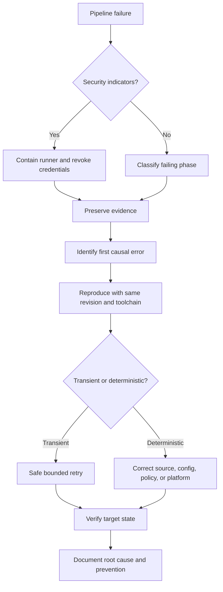

> **文档类型：** CI/CD & 自动化实施指南
> **规范性术语：** **MUST**、**MUST NOT**、**SHOULD**、**SHOULD NOT** 和 **MAY** 是要求级别。
> **适用范围：**跨云和混合环境的 CI/CD 签出、验证、身份、Terraform、部署、GitOps、制品、审批、运行器和发布后故障。
> **例外流程：** 偏离要求需要记录风险评估、补偿控制、指定风险负责人和到期日期。

|控制领域|价值|
|---|---|
|文件编号 | `CICD-09` |
|负责人|云卓越中心 |
|审核周期|至少每年一次，并且在重大平台、提供商、安全性或运营模式发生变化之后 |
|证据|运行 ID、时间戳、提交、日志、决策日志、恢复操作、根本原因和负面测试结果 |

# 流水线故障排除和恢复

> **简要决定：** 在重试之前对证据进行分类和保存；选择最小的可逆恢复操作并随后验证系统。

## 概述

当操作员直接跳到重新运行作业、删除锁、更改凭据或禁用控件时，流水线故障排除会失败。正确的方法是对故障进行分类，保留证据，隔离变量，并选择不增加爆炸半径的恢复措施。

本指南涵盖了 Azure、AWS、GCP、OCI 和混合系统的源检查、验证、依赖项、运行器、身份、Terraform、部署、GitOps、制品、批准和发布后运行状况。

## 目标和非目标

### 目标

- 根据证据而不是猜测来诊断失败。
- 将瞬态故障与确定性缺陷分开。
- 在不破坏状态或削弱安全控制的情况下进行恢复。
- 包含可疑的凭证或运行器泄露。
- 保留足够的证据以进行根本原因分析。
- 将事件转换为经过测试的预防控制。

### 非目标

- 自动重试每个失败的作业。
- 禁用验证以进行发布通过。
- 在不确认活动所有者的情况下强制解锁 Terraform。
- 将可能受到损害的运行器重新输入使用。

## 参考架构

从第一个因果错误开始，而不是最后一个级联错误。失败的部署可能会产生数十个清理错误，这些错误是后果，而不是原因。

## 初始证据清单

重新运行或清理之前采集：

- 流水线运行和作业标识符。
- 仓库、分支、提交 SHA 和拉取请求。
- 触发器类型和执行者。
- 运行器类型、镜像、版本和主机身份。
- 工具和提供商版本。
- 环境和目标账户/订阅/项目/隔间。
- 制品摘要或计划校验和。
- 确切的失败命令和退出代码。
- 相关时间戳和相关 ID。
- 云审计和部署事件。
- Terraform 状态锁定信息。
- 批准和策略结果。

切勿将机密收集到故障排除包中。

## 故障分类

### 来源和结帐

症状：

- 身份验证失败。
- 未找到仓库。
- 子模块故障。
- 浅历史缺少所需的提交。
- 安全目录或所有权错误。
- 自托管代理上的陈旧文件。

检查：

- 授予流水线的仓库权限。
- 正确的结帐令牌范围。
- 子模块 URL 和授权模型。
- `fetchDepth` 足以用于版本控制逻辑。
- 启用干净结帐。
- 工作区所有权和磁盘运行状况。

### Git `extraheader` 失败

CI 平台可以使用 `http.extraheader` 注入 Git 授权。问题包括：

- 标头持续存在并影响不同的遥控器。
- 发送多个授权标头。
- 脚本覆盖预期的标头。
- 自托管运行器保留过时的配置。
- 子模块 URL 与特定于 URL 的标头键不匹配。

检查键名称而不打印值：
```bash
git config --show-origin --name-only --get-regexp '^http\..*\.extraheader$' || true
git config --local --get-regexp '^remote\..*\.url$' || true
```
恢复：
```bash
git config --local --unset-all http.extraheader 2>/dev/null || true
git config --global --unset-all http.extraheader 2>/dev/null || true
```
对于特定于 URL 的键，枚举并取消设置确切的键。在持久运行器上，如果可能存在未经授权的凭证信息，请重建运行器。

### 验证失败

常见原因：

- 工具版本漂移。
- 依赖锁不匹配。
- 平台特定的路径或行结束行为。
- 生成的文件与提交的文件不同。
- 策略工具发出警告，但工作流程预计会出现错误。
- 拉取请求无法访问私有依赖项。

使用相同的镜像和精确的版本进行复制。除非本地环境与流水线匹配，否则“在我的机器上运行”是无关紧要的。

### 依赖关系和注册表失败

分类：

- DNS 或网络。
- TLS 信任。
- 验证。
- 授权。
- 速率限制。
- 未找到包。
- 摘要或校验和不匹配。
- 注册表中断。

不要绕过 TLS 验证。修复信任链、代理、DNS、证书检查或注册表配置。

### 运行器失败

指标：

- 磁盘已满。
- 内存耗尽。
- 孤立进程。
- 镜像更新后工具丢失。
- 陈旧的工作空间。
- Docker 守护进程不可用。
- 时间同步问题。
- 运行器已断开连接或禁用以进行所需的更新。

对于短暂的运行器，证据导出后销毁并更换。对于持久运行器，如果可能受到污染，请在重新使用前进行隔离。

## 身份和机密失败

### OIDC 令牌未发布

检查：

- 作业具有 `id-token: write` 或同等平台权限。
- 事件类型允许发布令牌。
- 工作流不是从不受信任的 fork 上下文运行。
——环境保护工作已完成。
- 运行器时钟已同步。

### 云令牌交换被拒绝

将令牌声明与云信任策略进行比较：

- 发布人。
- 观众。
- 主题。
- 仓库或项目。
- 分支、标签或环境。
- 组织。
- 令牌有效期。

不要仅仅为了测试而削弱对`*`的信任策略。在受控环境中创建临时窄诊断规则或解码非机密令牌有效负载。

### 认证成功但授权失败

这是 IAM 问题，而不是 OIDC 问题。识别：

- 有效的角色或服务账户。
- 目标范围。
- 拒绝策略或组织控制。
- 缺少数据平面与控制平面权限。
- 传播延迟。
- 有条件访问或租户限制。

###疑似机密曝光

- 停止工作流程。
- 撤销和轮换。
- 隔离运行器和制品。
- 查看网络和 Cloud Audit Logs。
- 搜索日志、缓存和制品以获取派生或编码形式。
- 仅在修复执行路径后重新颁发凭据。

## Terraform 故障排除

### 初始化失败

检查：

- 后端端点、DNS 和 TLS。
- 后端身份权限。
- 提供商注册表访问。
- 锁定文件平台兼容性。
- 代理和证书配置。
- 正确的工作目录和后端文件。

仅将 `TF_LOG` 用于受控诊断，因为详细日志可能包含敏感操作数据。分享前进行脱敏。

### 计划失败

常见原因：

- 无效的提供商配置。
- 数据源不可用。
- 读取权限不足。
- 在无效上下文中使用未知值。
- 策略或配额失败。
- 漂移暴露了不一致的假设。

在未确定确切所需权限的情况下，请勿将计划身份切换为完全管理员。

### 状态锁

强制解锁前：

1. 识别锁的所有者和操作。
2. 确认相应的运行已终止。
3. 验证没有进程仍在应用。
4. 备份当前状态版本。
5. 获取同行批准进行生产。
6. 仅对已确认的失效锁 ID 进行强制解锁。
7. 运行新的计划。

强制解锁活动操作可能会允许并发状态突变和损坏。

### 部分应用

Terraform 在进行过程中记录成功的资源操作。失败后：

- 不要假设什么都没有改变。
- 检查状态和云资源。
- 从相同的配置运行新的计划。
- 更喜欢前滚而不是收敛。
- 如有必要，导入外部创建的资源。
- 仅将目标操作用作特殊的恢复技术。

### 已保存的计划无法应用

原因包括：

- 计划后状态发生变化。
- Terraform 或提供程序版本不同。
- 在不兼容的平台上修改或生成的计划制品。
- 变量或配置已更改。
- 计划已根据策略到期。

生成新计划并重复批准。不要绕过一致性错误。

## 部署失败

### 应用部署命令成功，但服务不健康

流水线命令测量的是控制平面的接受度，而不是服务的运行状况。

检查：

- 运行制品版本。
- 就绪和活跃状态。
- 日志和异常率。
- 依赖关系连接。
- 配置和机密版本。
- 数据库迁移状态。
- 流量路由。
- 容量和自动扩缩容。

应用预定义的回滚或前滚阈值。

### Kubernetes 推出陷入困境

用途：
```bash
kubectl rollout status deployment/<name> --timeout=10m
kubectl rollout history deployment/<name>
kubectl describe deployment/<name>
kubectl get pods -l app=<label> -o wide
kubectl get events --sort-by=.lastTimestamp
```
手动 `kubectl rollout undo` 可以恢复服务，但 GitOps 管理的系统将重新应用所需的 Git 状态。立即恢复或更正 Git。

### GitOps 协调失败

检查：

- 协调器源身份验证。
- 精确的 Git 修订版。
- 渲染清单。
- 缺少 CRD。
- 入学策略拒绝。
- 健康检查超时。
- 漂移忽略或所有权冲突。
- 控制器日志和事件。

不要永久禁用协调来隐藏偏差。

## 批准和发布控制失败

症状：

- 工作从不请求批准。
- 使用了错误的环境。
- 审批人无法批准。
- 部署绕过预期检查。
- 并发锁永远不会释放。

检查：

- 准确的环境/资源名称。
- 环境存在并受到保护。
- 乔布斯实际上引用了它。
- 分支满足部署策略。
- 检查开始时批准者成员身份已解决。
- 外部检查端点可用。
- 之前的运行仍然保持锁定。

控件必须在受保护的平台资源上配置，而不仅仅是在可编辑的 YAML 中。

## 制品故障

### 未找到制品

- 确认生产者作业已成功运行。
- 验证制品名称和路径。
- 检查工作流程/作业依赖性。
- 检查保留期限。
- 检查跨工作流程下载权限。
- 确认制品在生成后已上传。

### 摘要不匹配

在得到解释之前，将其视为安全或完整性事件。

- 停止部署。
- 比较源代码、构建版本、注册表和下载的摘要。
- 检查代理和注册表行为。
- 隔离制品。
- 在干净的运行器上重建。
- 审查签名和来源证明日志记录。

## 安全重试策略

仅在以下情况下重试：

- 故障显然是暂时的。
- 操作是幂等的或者其当前状态已知。
- 重试次数和延迟是有限的。
- 目标不会处于未知的部分突变状态。

好的候选人：

- 读取操作临时网络超时。
- 具有退避功能的注册速率限制。
- 幂等调用的云 API 限制。

糟糕的候选人：

- 数据库迁移完成情况未知。
- Terraform 在运行器损失后应用，无需状态检查。
- 制品签名操作，其中重复签名具有策略影响。
- 破坏性操作，结果不明确。

## 恢复决策表

|情况|首选康复 |
|---|---|
|错误的无状态应用版本 |回滚到保留的不可变制品或前滚 |
|错误的 GitOps 期望状态 |恢复或更正 Git，然后协调 |
|部分 Terraform 应用 |全新计划和受控前滚 |
|损坏或丢失的运行器 |更换运行器；对于信任敏感的工作不要进行就地修复|
|泄露的凭证 |撤销、轮换、调查、重建执行路径 |
|损坏的包依赖性 |恢复固定的已知良好依赖项或镜像 |
|数据库迁移失败 |遵循特定于迁移的恢复；避免盲目的二进制回滚|
|云提供商中断 |暂停发布、保留状态、验证恢复后恢复 |

## 根本原因分析

有用的事件后报告包含：

- 用户和系统影响。
- 具有精确时间戳的时间线。
- 第一次因果失败。
——贡献条件。
- 为什么控制没有阻止或遏制它。
- 恢复行动。
- 证据和不确定性。
- 与负责人一起采取的纠正措施和截止日期。
- 验证纠正措施有效。

“人为错误”并不是根本原因。确定允许一项操作产生影响的系统条件。

## 预防性控制

- 固定工具和 Actions 版本。
- 构建签名运行器镜像。
- 使用短暂的运行器。
- 最小化工作流程权限。
- 使用工作负载身份联合。
- 验证计划和呈现的清单。
- 保护环境和服务连接。
- 序列化冲突的部署。
- 添加部署后健康门。
- 测试恢复、回滚和强制解锁过程。
- 在非生产环境中进行故障注入练习。

## 严重性和遏制矩阵

在决定是否重新运行之前对故障进行分类：

|状况 |严重姿势|立即行动 |
|---|---|---|
|确定性测试或 lint 失败 |交付缺陷 |正确来源；没有特权重新运行|
|暂时只读依赖失败 |运营降级|确认后有限重试 |
|未知的部分突变 |操作风险高 |冻结目标并检查实际状态 |
|摘要、签名或来源证明不匹配 |安全事件直至得到解释|停止晋级隔离制品|
|意外的凭证、运行器或网络行为 |安全事件|遏制运行器并撤销访问权限 |
|生产健康回归|服务事件 |执行预定义的回滚或前滚 |

相同的退出代码可能代表不同的风险。上下文和目标突变决定了响应。

## 时间和相关性规则

可靠的诊断需要跨 CI/CD、运行器、云审计、Git、注册表、GitOps、Kubernetes 和应用遥测的同步时间戳。

采集：

- 带有时区的 UTC 时间戳。
- 运行、作业、部署、跟踪和更改标识符。
- 源和制品修订。
- 运行器实例和云会话标识符。
- 目标资源操作或关联 ID。

时钟漂移会使 OIDC 令牌失效并扭曲事件时间线。监控自托管运行器上的时间同步。

## 诊断脱敏

创建安全诊断模式，而不是启用不受限制的调试输出。它应该：

- 打印工具版本和非机密配置名称。
- 显示没有值的 Git 配置键名称。
- 显示令牌声明名称和选定的非敏感声明，而不是原始令牌。
- 对查询字符串、标头、环境值和 Terraform 敏感数据进行脱敏。
- 将捆绑包存储在访问控制的证据存储中。
- 应用保留和删除策略。
- 记录谁生成并访问了该捆绑包。

切勿要求操作员将完整的环境转储粘贴到票证中。

## 恢复验证

技术恢复后，证明目标是可信的：

- 预期的制品摘要和配置修订处于活动状态。
- 不存在未经授权的手动漂移。
- 云会话和临时凭证被撤销或过期。
- 运行器或控制器是根据可信输入重建的。
- 状态数据血缘、锁和资源所有权是正确的。
- 健康和商业交易符合稳定标准。
- 审核事件与授权的恢复操作相匹配。
- 删除了临时绕过和例外情况。

没有目标验证的绿色重新运行并不是恢复证据。

## 操作清单

- [ ] 在重新运行之前确定第一个因果错误。
- [ ] 保留证据而不收集机密。
- [ ] 安全指标触发遏制。
- [ ] 记录运行器、工具和制品版本。
- [ ] OIDC 声明直接与信任策略进行比较。
- [ ] Terraform 锁在强制解锁之前进行验证。
- [ ] 部分应用与新计划一致。
- [ ] 成功的部署命令后会进行运行状况检查。
- [ ] GitOps 回滚在 Git 中表示。
- [ ] 重试是有限的并且被证明是安全的。
- [ ] 根本原因可识别控制和系统故障。
- [ ] 测试纠正措施。

## 相关主题

- [实用的 CI/CD 蓝图](practical-ci-cd-blueprint.md)
- [共享运行器安全与清理规范](shared-runner-security-and-hygiene.md)
- [环境晋级、审批、发布控制](environment-promotion-approval-and-release-controls.md)
- [GitOps 交付模式](gitops-delivery-patterns.md)

## 验证

- 在采用前根据规定的要求、验收标准和证据期望验证指南。

## 参考文档

- [HashiCorp：自动化运行 Terraform](https://developer.hashicorp.com/terraform/tutorials/automation/automate-terraform)
- [HashiCorp：Terraform 应用](https://developer.hashicorp.com/terraform/cli/commands/apply)
- [GitHub：安全使用参考](https://docs.github.com/en/actions/reference/security/secure-use)
- [GitHub：自托管运行器参考](https://docs.github.com/en/actions/reference/runners/self-hosted-runners)
- [Microsoft: 保护 Azure Pipelines](https://learn.microsoft.com/en-us/azure/devops/pipelines/security/overview)
- [Microsoft: 从流水线访问仓库](https://learn.microsoft.com/en-us/azure/devops/pipelines/security/secure-access-to-repos)
- [Microsoft: 流水线审批和检查](https://learn.microsoft.com/en-us/azure/devops/pipelines/process/approvals)
- [Argo CD：自动同步策略](https://argo-cd.readthedocs.io/en/stable/user-guide/auto_sync/)
- [通量：事件](https://fluxcd.io/flux/components/notification/events/)
- [Kubernetes：kubectl 推出](https://kubernetes.io/docs/reference/kubectl/generated/kubectl_rollout/)
