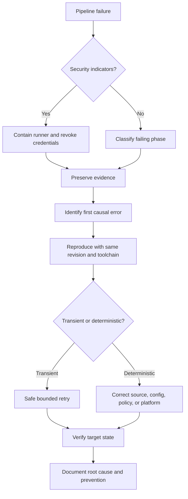

> **Document class:** CI/CD & Automation implementation guide
> **Normative terms:** **MUST**, **MUST NOT**, **SHOULD**, **SHOULD NOT**, and **MAY** are requirements levels.
> **Applicability:** CI/CD checkout, validation, identity, Terraform, deployment, GitOps, artifact, approval, runner, and post-release failures across cloud and hybrid environments.
> **Exception process:** Deviations require a documented risk assessment, compensating controls, named risk owner, and expiry date.

| Control field | Value |
|---|---|
| Document ID | `CICD-09` |
| Owner | Cloud Center of Excellence |
| Review cycle | At least annually and after material platform, provider, security, or operating-model changes |
| Evidence | Run IDs, timestamps, commits, logs, decision records, recovery actions, root causes, and negative-test results |

# Pipeline Troubleshooting and Recovery

> **Decision in brief:** Classify and preserve evidence before retrying; choose the smallest reversible recovery action and verify the system afterward.

## Overview

Pipeline troubleshooting fails when operators jump directly to rerunning jobs, deleting locks, changing credentials, or disabling controls. The correct method is to classify the failure, preserve evidence, isolate variables, and choose a recovery action that does not increase the blast radius.

This guide covers source checkout, validation, dependencies, runners, identities, Terraform, deployments, GitOps, artifacts, approvals, and post-release health across Azure, AWS, GCP, OCI, and hybrid systems.

## Goals and non-goals

### Goals

- Diagnose failures from evidence rather than guesswork.
- Separate transient faults from deterministic defects.
- Recover without corrupting state or weakening security controls.
- Contain suspected credential or runner compromise.
- Preserve enough evidence for root-cause analysis.
- Convert incidents into tested preventive controls.

### Non-goals

- Retrying every failed job automatically.
- Disabling validation to make a release pass.
- Force-unlocking Terraform without confirming the active owner.
- Returning a potentially compromised runner to service.

## Reference architecture



Start with the first causal error, not the last cascading error. A failed deployment may produce dozens of cleanup errors that are consequences, not causes.

## Initial evidence checklist

Capture before rerunning or cleaning:

- Pipeline run and job identifiers.
- Repository, branch, commit SHA, and pull request.
- Trigger type and actor.
- Runner type, image, version, and host identity.
- Tool and provider versions.
- Environment and target account/subscription/project/compartment.
- Artifact digest or plan checksum.
- Exact failing command and exit code.
- Relevant timestamps and correlation IDs.
- Cloud audit and deployment events.
- Terraform state lock information.
- Approval and policy results.

Never collect secrets into a troubleshooting bundle.

## Failure classification

### Source and checkout

Symptoms:

- Authentication failure.
- Repository not found.
- Submodule failure.
- Shallow history missing required commit.
- Safe-directory or ownership errors.
- Stale files on self-hosted agents.

Checks:

- Repository permission granted to the pipeline.
- Correct checkout token scope.
- Submodule URL and authorization model.
- `fetchDepth` sufficient for versioning logic.
- Clean checkout enabled.
- Workspace ownership and disk health.

### Git `extraheader` failures

CI platforms can inject Git authorization with `http.extraheader`. Problems include:

- Header persists and affects a different remote.
- Multiple authorization headers are sent.
- A script overrides the expected header.
- A self-hosted runner retains stale configuration.
- Submodule URL does not match the URL-specific header key.

Inspect key names without printing values:

```bash
git config --show-origin --name-only --get-regexp '^http\..*\.extraheader$' || true
git config --local --get-regexp '^remote\..*\.url$' || true
```

Recovery:

```bash
git config --local --unset-all http.extraheader 2>/dev/null || true
git config --global --unset-all http.extraheader 2>/dev/null || true
```

For URL-specific keys, enumerate and unset the exact key. On a persistent runner, rebuild the runner if unauthorized credential material may have remained.

### Validation failures

Common causes:

- Tool version drift.
- Dependency lock mismatch.
- Platform-specific path or line-ending behavior.
- Generated files differ from committed files.
- Policy tool emits warnings but workflow expects errors.
- Pull request lacks access to a private dependency.

Reproduce with the same image and exact versions. "Works on my machine" is irrelevant unless the local environment matches the pipeline.

### Dependency and registry failures

Classify:

- DNS or network.
- TLS trust.
- Authentication.
- Authorization.
- Rate limit.
- Package not found.
- Digest or checksum mismatch.
- Registry outage.

Do not bypass TLS verification. Fix the trust chain, proxy, DNS, certificate inspection, or registry configuration.

### Runner failures

Indicators:

- Disk full.
- Memory exhaustion.
- Orphaned process.
- Tool missing after image update.
- Stale workspace.
- Docker daemon unavailable.
- Time synchronization issue.
- Runner disconnected or disabled for required update.

For ephemeral runners, destroy and replace after evidence export. For persistent runners, quarantine before reuse when contamination is possible.

## Identity and secret failures

### OIDC token not issued

Check:

- Job has `id-token: write` or equivalent platform permission.
- Event type permits token issuance.
- Workflow is not running from an untrusted fork context.
- Environment protection has completed.
- Runner clock is synchronized.

### Cloud token exchange rejected

Compare token claims with cloud trust policy:

- Issuer.
- Audience.
- Subject.
- Repository or project.
- Branch, tag, or environment.
- Organization.
- Token validity period.

Do not weaken the trust policy to `*` merely to test. Create a temporary narrow diagnostic rule or decode a non-secret token payload in a controlled environment.

### Authentication succeeds but authorization fails

This is an IAM issue, not an OIDC issue. Identify:

- Effective role or service account.
- Target scope.
- Deny policies or organization controls.
- Missing data-plane versus control-plane permission.
- Propagation delay.
- Conditional-access or tenancy restrictions.

### Suspected secret exposure

- Stop the workflow.
- Revoke and rotate.
- Quarantine runner and artifacts.
- Review network and cloud audit logs.
- Search logs, caches, and artifacts for derived or encoded forms.
- Reissue credentials only after the execution path is fixed.

## Terraform troubleshooting

### Initialization failure

Check:

- Backend endpoint, DNS, and TLS.
- Backend identity permissions.
- Provider registry access.
- Lock-file platform compatibility.
- Proxy and certificate configuration.
- Correct working directory and backend file.

Use `TF_LOG` only for controlled diagnostics because verbose logs can contain sensitive operational data. Redact before sharing.

### Plan failure

Common causes:

- Invalid provider configuration.
- Data source unavailable.
- Insufficient read permissions.
- Unknown values used in invalid contexts.
- Policy or quota failure.
- Drift exposing an inconsistent assumption.

Do not switch the plan identity to full administrator without identifying the exact required permission.

### State lock

Before force-unlock:

1. Identify the lock owner and operation.
2. Confirm the corresponding run is terminated.
3. Verify no process is still applying.
4. Back up the current state version.
5. Obtain peer approval for production.
6. Force-unlock only the confirmed stale lock ID.
7. Run a fresh plan.

Force-unlocking an active operation can permit concurrent state mutation and corruption.

### Partial apply

Terraform records successful resource operations as it proceeds. After failure:

- Do not assume nothing changed.
- Inspect state and cloud resources.
- Run a fresh plan from the same configuration.
- Prefer roll forward to convergence.
- Import resources created outside state if necessary.
- Use targeted operations only as an exceptional recovery technique.

### Saved plan cannot apply

Causes include:

- State changed after plan.
- Terraform or provider version differs.
- Plan artifact modified or generated on incompatible platform.
- Variables or configuration changed.
- Plan expired under policy.

Generate a new plan and repeat approval. Do not bypass the consistency error.

## Deployment failures

### Application deployment command succeeded but service is unhealthy

The pipeline command measured control-plane acceptance, not service health.

Check:

- Running artifact version.
- Readiness and liveness state.
- Logs and exception rates.
- Dependency connectivity.
- Configuration and secret versions.
- Database migration status.
- Traffic routing.
- Capacity and autoscaling.

Apply the predefined rollback or roll-forward threshold.

### Kubernetes rollout stuck

Use:

```bash
kubectl rollout status deployment/<name> --timeout=10m
kubectl rollout history deployment/<name>
kubectl describe deployment/<name>
kubectl get pods -l app=<label> -o wide
kubectl get events --sort-by=.lastTimestamp
```

A manual `kubectl rollout undo` can restore service, but a GitOps-managed system will reapply the desired Git state. Revert or correct Git immediately.

### GitOps reconciliation failure

Check:

- Reconciler source authentication.
- Exact Git revision.
- Rendered manifests.
- Missing CRDs.
- Admission-policy denial.
- Health-check timeout.
- Drift ignore or ownership conflicts.
- Controller logs and events.

Do not disable reconciliation permanently to hide drift.

## Approval and release-control failures

Symptoms:

- Job never requests approval.
- Wrong environment used.
- Approver cannot approve.
- Deployment bypasses expected check.
- Concurrency lock never releases.

Checks:

- Exact environment/resource name.
- Environment exists and is protected.
- Job actually references it.
- Branch satisfies deployment policy.
- Approver membership was resolved when the check started.
- External check endpoint is available.
- Prior run still holds the lock.

Controls must be configured on protected platform resources, not solely in editable YAML.

## Artifact failures

### Artifact not found

- Confirm producer job succeeded.
- Verify artifact name and path.
- Check workflow/job dependencies.
- Check retention period.
- Check cross-workflow download permissions.
- Confirm the artifact was uploaded after generation.

### Digest mismatch

Treat as a security or integrity incident until explained.

- Stop deployment.
- Compare source, build, registry, and downloaded digests.
- Review proxy and registry behavior.
- Quarantine the artifact.
- Rebuild on a clean runner.
- Review signing and provenance records.

## Safe retry policy

Retry only when:

- The failure is demonstrably transient.
- The operation is idempotent or its current state is known.
- The retry count and delay are bounded.
- The target is not left in an unknown partially mutated state.

Good candidates:

- Temporary network timeout on a read operation.
- Registry rate limit with backoff.
- Cloud API throttling for idempotent calls.

Bad candidates:

- Database migration with unknown completion.
- Terraform apply after runner loss without state inspection.
- Artifact-signing operation where duplicate signatures have policy implications.
- Destructive operation with ambiguous result.

## Recovery decision table

| Situation | Preferred recovery |
|---|---|
| Bad stateless application version | Roll back to retained immutable artifact or roll forward |
| Bad GitOps desired state | Revert or correct Git, then reconcile |
| Partial Terraform apply | Fresh plan and controlled roll forward |
| Corrupt or lost runner | Replace runner; do not repair in place for trust-sensitive jobs |
| Leaked credential | Revoke, rotate, investigate, rebuild execution path |
| Broken package dependency | Restore pinned known-good dependency or mirror |
| Failed database migration | Follow migration-specific recovery; avoid blind binary rollback |
| Cloud provider outage | Pause release, preserve state, resume after verified recovery |

## Root-cause analysis

A useful post-incident report contains:

- User and system impact.
- Timeline with exact timestamps.
- First causal failure.
- Contributing conditions.
- Why controls did not prevent or contain it.
- Recovery actions.
- Evidence and uncertainty.
- Corrective actions with owners and due dates.
- Validation proving corrective actions work.

"Human error" is not a root cause. Identify the system condition that allowed one action to produce the impact.

## Preventive controls

- Pin tool and action versions.
- Build signed runner images.
- Use ephemeral runners.
- Minimize workflow permissions.
- Use workload federation.
- Validate plans and rendered manifests.
- Protect environments and service connections.
- Serialize conflicting deployments.
- Add post-deployment health gates.
- Test restore, rollback, and force-unlock procedures.
- Run failure-injection exercises in non-production.

## Severity and containment matrix

Classify the failure before deciding whether to rerun:

| Condition | Severity posture | Immediate action |
|---|---|---|
| Deterministic test or lint failure | Delivery defect | Correct source; no privileged rerun |
| Transient read-only dependency failure | Operational degradation | Bounded retry after confirmation |
| Unknown partial mutation | High operational risk | Freeze target and inspect actual state |
| Digest, signature, or provenance mismatch | Security incident until explained | Stop promotion and quarantine artifact |
| Unexpected credential, runner, or network behavior | Security incident | Contain runner and revoke access |
| Production health regression | Service incident | Execute predefined rollback or roll forward |

The same exit code can represent different risk. Context and target mutation determine the response.

## Time and correlation discipline

Reliable diagnosis requires synchronized timestamps across CI/CD, runner, cloud audit, Git, registry, GitOps, Kubernetes, and application telemetry.

Capture:

- UTC timestamps with timezone.
- Run, job, deployment, trace, and change identifiers.
- Source and artifact revision.
- Runner instance and cloud session identifiers.
- Target resource operation or correlation IDs.

Clock drift can invalidate OIDC tokens and distort incident timelines. Monitor time synchronization on self-hosted runners.

## Diagnostic redaction

Create a safe diagnostic mode rather than enabling unrestricted debug output. It should:

- Print tool versions and non-secret configuration names.
- Show Git configuration key names without values.
- Show token claim names and selected non-sensitive claims, not raw tokens.
- Redact query strings, headers, environment values, and Terraform sensitive data.
- Store bundles in access-controlled evidence storage.
- Apply retention and deletion policy.
- Record who generated and accessed the bundle.

Never ask an operator to paste a full environment dump into a ticket.

## Recovery verification

After technical recovery, prove that the target is trustworthy:

- Expected artifact digest and configuration revision are active.
- No unauthorized manual drift remains.
- Cloud sessions and temporary credentials are revoked or expired.
- Runner or controller is rebuilt from trusted inputs.
- State lineage, locks, and resource ownership are correct.
- Health and business transactions meet the stabilization criteria.
- Audit events match the authorized recovery actions.
- Temporary bypasses and exceptions are removed.

A green rerun without target verification is not recovery evidence.

## Operational checklist

- [ ] First causal error is identified before rerun.
- [ ] Evidence is preserved without collecting secrets.
- [ ] Security indicators trigger containment.
- [ ] Runner, tool, and artifact versions are recorded.
- [ ] OIDC claims are compared directly with trust policy.
- [ ] Terraform locks are verified before force-unlock.
- [ ] Partial applies are reconciled with a fresh plan.
- [ ] Successful deployment commands are followed by health checks.
- [ ] GitOps rollback is represented in Git.
- [ ] Retry is bounded and proven safe.
- [ ] Root cause identifies control and system failures.
- [ ] Corrective actions are tested.

## Related topics

- [A Practical CI/CD Blueprint](practical-ci-cd-blueprint.md)
- [Shared Runner Security and Hygiene](shared-runner-security-and-hygiene.md)
- [Environment Promotion, Approval, and Release Controls](environment-promotion-approval-and-release-controls.md)
- [GitOps Delivery Patterns](gitops-delivery-patterns.md)

## Validation

- Validate the guidance against its stated requirements, acceptance criteria, and evidence expectations before adoption.

## References

- [HashiCorp: Running Terraform in automation](https://developer.hashicorp.com/terraform/tutorials/automation/automate-terraform)
- [HashiCorp: Terraform apply](https://developer.hashicorp.com/terraform/cli/commands/apply)
- [GitHub: Secure use reference](https://docs.github.com/en/actions/reference/security/secure-use)
- [GitHub: Self-hosted runners reference](https://docs.github.com/en/actions/reference/runners/self-hosted-runners)
- [Microsoft: Secure Azure Pipelines](https://learn.microsoft.com/en-us/azure/devops/pipelines/security/overview)
- [Microsoft: Access repositories from pipelines](https://learn.microsoft.com/en-us/azure/devops/pipelines/security/secure-access-to-repos)
- [Microsoft: Pipeline approvals and checks](https://learn.microsoft.com/en-us/azure/devops/pipelines/process/approvals)
- [Argo CD: Automated Sync Policy](https://argo-cd.readthedocs.io/en/stable/user-guide/auto_sync/)
- [Flux: Events](https://fluxcd.io/flux/components/notification/events/)
- [Kubernetes: kubectl rollout](https://kubernetes.io/docs/reference/kubectl/generated/kubectl_rollout/)
