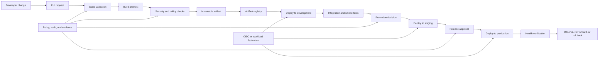
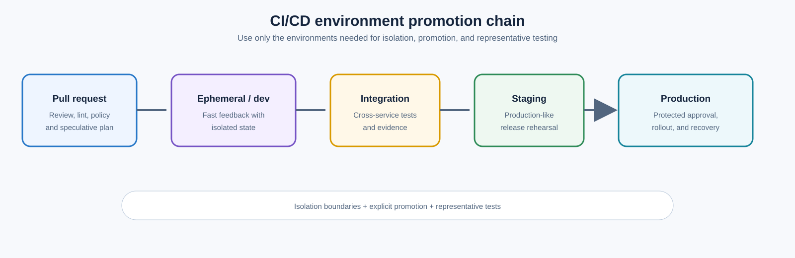
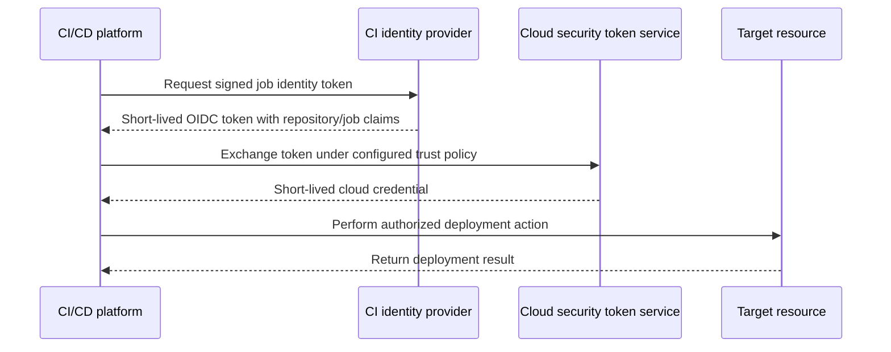

> **文档类型：** CI/CD & 自动化实施指南
> **规范性术语：** **MUST**、**MUST NOT**、**SHOULD**、**SHOULD NOT** 和 **MAY** 是要求级别。
> **适用范围：**跨云和混合环境的应用、基础设施、容器、Kubernetes、静态站点和文档交付。
> **例外流程：** 偏离要求需要记录风险评估、补偿控制、指定风险负责人和到期日期。

|控制领域|价值|
|---|---|
|文件编号 | `CICD-01` |
|负责人|云卓越中心 |
|审核周期|至少每年一次，并且在重大平台、提供商、安全性或运营模式发生变化之后 |
|证据|制品摘要和来源证明、测试和策略结果、批准、部署日志记录和健康证据 |

# 实用的 CI/CD 蓝图

> **简要决定：** 构建一次，通过受保护的环境晋级相同的不可变制品，在每个入口处都提供短暂的身份和证据。

## 概述

可靠的 CI/CD 系统不是单个 YAML 文件。它是一个受控的软件交付系统，可将经过审查的源版本转换为可追踪的版本，同时保持安全性、可重复性和可恢复性。

此蓝图应用于应用代码、容器镜像、Terraform、Kubernetes 清单、静态站点和文档。某些示例中使用了 Azure，但控制模型有意跨 Azure、AWS、GCP、Oracle Cloud Infrastructure (OCI) 和本地平台进行移植。

## 目标和非目标

### 目标

- 生成不可变的、可归因的构建制品。
- 将验证与部署分开。
- 使用短期工作负载身份而不是存储的云凭据。
- 通过环境晋级相同的制品。
- 对于高风险环境需要相应的批准。
- 使故障可诊断并可操作地进行回滚。
- 保持流水线逻辑可复用、可审查和版本化。

### 非目标

- 将成功的流水线运行视为发布安全的证据。
- 单独重建以进行测试、登台和生产。
- 授予单一等水线身份对每个环境的不受限制的访问。
- 通过更多流水线步骤解决应用可观测性差的问题。

## 参考架构

关键区别在于**制品创建**和**制品晋级**。候选版本应该构建一次，分配一个不可变的标识符，并且无需重新编译即可升级。重建引入了未经审查的可变性并削弱了来源。

## 标准流水线生命周期

### 源代码和拉取请求控制

源仓库是第一个安全边界。要求：

- 受保护的默认和发布分支。
- 对应用代码、基础设施、流水线模板和策略文件进行更改的拉取请求。
- 对身份、网络、生产 Terraform 和部署工作流程等高风险路径进行独立审查。
- 必需的状态检查，不能随意绕过。
- 组织威胁模型证明其合理性的签名承诺或验证身份。
- 敏感目录的代码所有者或等效的基于路径的审阅者。

不允许来自不受信任分叉的拉取请求代码在特权自托管运行器上执行。拉取请求是不受信任的输入，直到仓库的信任控制以其他方式建立为止。

### 快速验证

首先运行廉价的检查，以便快速返回故障：

- 格式化和检查。
- 模式验证。
- 单元测试。
- Terraform `fmt`、`validate` 和提供程序锁定文件检查。
- Kubernetes 清单渲染和策略检查。
- 文档链接和拼写检查。
- 工作流语法和策略验证。

验证失败必须关闭。发出错误但以状态零退出的任务是装饰性的，而不是控件。

### 构建并打包

在具有固定工具链和声明的依赖项的确定性环境中构建。构建阶段应该产生：

- 版本化包、容器镜像、站点捆绑包或 Terraform 计划。
- 校验和或摘要。
- 构建包含提交 SHA、工作流程运行、仓库、时间戳和工具链版本的元数据。
- 应用的软件物料清单。
- 测试和安全报告。

使用不可变的制品引用。对于容器，通过摘要而不是可变标签（例如 `latest`）进行提升。

### 安全和策略大门

控件应与制品类型匹配：

|制品|最低限度的控制|
|---|---|
|应用包|单元测试、依赖扫描、静态分析、许可策略 |
|容器镜像|漏洞扫描、SBOM、签名、基础镜像策略 |
|Terraform |格式化、验证、linting、策略即代码、计划审查 |
| Kubernetes 清单 |渲染验证、模式验证、策略即代码、镜像固定 |
|静态站点|构建验证、链接检查、依赖性审查、内容审批 |

扫描结果应通过明确的策略进行评估。仅上传报告而没有执行决定并不能保护发布。

### 制品发布

仅在构建和所需检查成功后才发布。注册管理机构应强制执行：

- 不变性或追加式版本控制。
- 限制写入权限。
- 保留活动版本和回滚版本的保留策略。
- 支持的恶意软件或漏洞扫描。
- 审计日志记录。
- 恢复目标需要时的跨区域或跨账户复制。
典型的目标包括 Azure Container Registry、Amazon ECR、Google Artifact Registry、OCI Container Registry、GitHub Packages 或内部制品仓库。

### 部署方法

谨慎选择部署方法，而不是在没有所有权边界的情况下混合模式。

### 命令式流水线部署

流水线直接调用云、平台或部署 API。

在以下情况下使用它：

- 目标没有持续协调。
- 部署是事务性的且短暂的。
- 组织需要从手动部署到简单的迁移路径。

如果部署状态未外部化，风险包括广泛的流水线凭证、配置漂移和恢复能力弱。

### GitOps 协调

流水线更新 Git 中所需的状态；环境内控制器协调目标。

在以下情况下使用它：

- Kubernetes 或其他声明性平台是目标。
- 需要连续漂移检测。
- 从流水线到运行时环境的直接入站访问是不可取的。

CI 流水线应该构建并验证制品，然后更新配置仓库中的不可变制品引用。协调器执行部署。

### 托管部署服务

云原生或第三方服务使用环境本地身份执行部署。

示例包括 Azure Deployment Stacks 或部署作业、AWS CodeDeploy、GCP Deploy、OCI DevOps 部署流水线和 HCP Terraform。这可以减少凭证暴露，但并不能消除对来源、批准和制品控制的需要。

## 环境模型

一个实用的环境链是：



并非每个系统都需要五个环境。最小可行模型是自动化的底层环境加上受控的生产环境。重要的控制是隔离、显式提升和代表性测试。

当爆炸半径合理时，使用单独的云账户、订阅、项目或隔间：

|提供商|公共隔离边界|
|---|---|
|Azure|管理组、订阅、资源组|
|AWS |组织、账户、组织单位 |
| GCP |组织、文件夹、项目 |
|OCI |租户，隔间|

生产不应与开发共享部署身份、状态存储、可变运行器工作区或不受限制的网络路径。

## 身份和机密模型

首选工作负载身份联合：

信任策略应将令牌绑定到特定声明，例如仓库、分支、环境、组织、工作流或流水线。不要创建接受组织中任何仓库的联合，除非该范围是有意且单独控制的。

长久存在的机密应该是一个例外。当不可避免时：

- 将它们存储在受管理的机密系统中。
- 将它们限定在一种环境和一种目的。
- 自动旋转它们。
- 切勿将它们回显到日志中。
- 防止拉取请求工作流程读取生产机密。

## 可复用的流水线结构

保持编排精简，并将稳定的行为迁移到版本化模板或可复用工作流程中。
```text
.pipeline/
  templates/
    validate.yml
    build.yml
    security.yml
    deploy.yml
    verify.yml
  scripts/
    validate.sh
    smoke-test.sh
    collect-evidence.sh
  policies/
    release-policy.rego
    terraform-policy.rego
```
模板输入必须是明确的。隐藏的约定、神奇的变量名称和无限制的 shell 插值使可复用流水线变得脆弱且不安全。

在可行的情况下，将第三方 Action、任务、模块和容器镜像固定到不可变版本。对于 GitHub Actions，完整提交 SHA 是对 Action 引用最强的不变性控制。

## 部署验证

验证必须在多个层进行。

### 预部署

- 确认制品摘要和来源证明。
- 验证制品是否通过了所需的测试。
- 验证环境配置。
- 检查策略和变更窗口要求。
- 检测冲突或活动部署。
- 确认部署标识的范围正确。

### 部署期间

- 强制执行超时。
- 流结构化日志。
- 采集资源或推出标识符。
- 部分失败时停止，除非部署方法明确支持安全继续。
- 防止同一目标的并发突变。

### 部署后

- 测试健康端点和关键事务。
- 验证指标、日志和错误预算。
- 比较预期版本标识符和实际版本标识符。
- 监控规定的稳定期。
- 日志记录发布结果和证据。

当部署命令退出为零时，部署未完成。当目标运行正常并且预期版本正在提供流量时，它就完成了。

## 发布策略

|战略|优势|主要风险 |契合度|
|---|---|---|---|
|重新创建 |简单|停机时间 |非关键内部系统 |
|滚动|高效|混合版本兼容性 |无状态服务 |
|蓝绿色|快速切换与回滚|双倍容量和数据兼容性 |高价值服务 |
|金丝雀|限制初始爆炸半径 |需要可观测性和流量控制 |面向客户的服务|
|功能开关 |将部署与发布分开 |标记债务和逻辑复杂性 |增量产品交付|

数据库更改需要特殊处理。更喜欢向后兼容的扩展、应用部署、迁移和后期收缩。如果架构已被不兼容地更改，则二进制回滚是不安全的。

## 多云实施映射

|能力|Azure|AWS | GCP |OCI |
|---|---|---|---|---|
|工作负载身份|内部工作负载身份联合| IAM OIDC 提供商和角色承担 |工作负载身份联合|资源/实例主体；支持的外部令牌交换 |
|Artifact Registry | ACR | ECR/CodeArtifact |Artifact Registry | OCI Container Registry/Artifact Registry |
|环境边界 |订阅/资源组 |账户 |项目|隔间|
|Secrets Manager|Key Vault |Secret Manager/参数存储|Secrets Manager|Vault |
|原生部署 | Azure Pipelines/服务 |CodePipeline/CodeDeploy |Cloud Deploy| OCI DevOps |
|审计| Azure Activity Log |CloudTrail| Cloud Audit Logs|审计|

产品名称不同；控制目标则不然。

## 故障处理和恢复

每个生产流水线都应定义：

- 仅针对暂时性故障的重试策略。
- 幂等性假设。
- 回滚或前滚标准。
- 最长部署持续时间。
- 所有权和升级路径。
- 失败后保留证据。
- 卡住锁和部分资源的程序。

在不了解重复操作是否安全的情况下，不要自动重试破坏性或有状态的操作。

## 发布清单和证据包

标准化随制品一起发布的发布包：
```text
source revision
artifact digest or package checksum
build definition and template version
toolchain and dependency lock hashes
test, policy, scan, SBOM, and provenance references
configuration revision
approval and change classification
deployment targets
rollback or roll-forward reference
```
该包必须受到完整性保护并且可以被操作读取而不会泄露机密。它应该支持回答“正在运行什么以及为什么允许它？”无需从临时日志中重建证据。

## 更改分类和比例控制

并非每个变更都需要相同的工作流程，但必须控制决策。

|更改班级 |示例 |额外控制|
|---|---|---|
|日常 |向后兼容应用修正 |标准自动门 |
|敏感|身份、网络、安全策略、机密传递 |专家审查和阴性测试|
|有状态 |数据库、存储、迁移、队列契约|兼容性和恢复证据 |
|广泛|共享模块、模板、集群舰队控制器|金丝雀消费者或发布波次|
|紧急|事件修复|加急审批和回顾性审查 |

分类应该源自更改的路径、计划内容、制品类型和声明的影响，而不仅仅是贡献者的输入。

## 测试组合

实用的流水线平衡了速度和信心：

- 对每次更改进行快速的单元、模式、格式和策略检查。
- 受影响接口的组件和契约测试。
- 针对最终制品的镜像或包测试。
- 部署后的环境集成和烟雾测试。
- 按计划或风险触发进行性能、弹性、恢复和安全测试。
- 关键旅程的综合生产验证。

不要将每项昂贵的测试强加到每个拉取请求中。不要仅仅因为主流水线是绿色的而忽略不常见的故障模式测试。

## 交付指标和反馈

使用与结果相关的指标来度量交付系统：

- 更改交付时间。
- 部署频率。
- 改变故障率。
- 是时候恢复服务了。
- 队列和流水线持续时间。
- 不稳定的测试率。
- 批准等待时间。
- 回滚和前滚频率。
- 模板和运行器的故障率。
- 安全例外年龄。

指标应该推动工程改进，而不是个人绩效评分。设计不当的目标会导致较小的证据窗口、隐藏的故障和不安全的批处理。

## 操作清单

- [ ] 默认和发布分支受到保护。
- [ ] 流水线变更需要审查。
- [ ] 验证失败关闭。
- [ ] 构建制品是不可变的且可归因的。
- [ ] 跨环境晋级相同的制品。
- [ ] 云访问在支持的情况下使用短期身份。
- [ ] 生产身份和环境是隔离的。
- [ ] 批准在可编辑流水线代码之外强制执行。
- [ ] 对同一目标的并发部署受到控制。
- [ ] 验证部署后的运行状况。
- [ ] 测试回滚或前滚过程。
- [ ] 保留日志、证据和部署历史记录。

## 相关主题

- [流水线即代码标准和可复用模板](pipeline-as-code-standards-and-reusable-templates.md)
- [流水线身份和机密处理](pipeline-identity-and-secret-handling.md)
- [环境晋级、审批、发布控制](environment-promotion-approval-and-release-controls.md)
- [流水线故障排除与恢复](pipeline-troubleshooting-and-recovery.md)

## 验证

- 在采用前根据规定的要求、验收标准和证据期望验证指南。

## 参考文档

- [HashiCorp：自动化运行 Terraform](https://developer.hashicorp.com/terraform/tutorials/automation/automate-terraform)
- [GitHub：GitHub Actions 中的安全性](https://docs.github.com/en/actions/concepts/security)
- [GitHub：安全使用参考](https://docs.github.com/en/actions/reference/security/secure-use)
- [Microsoft: 保护 Azure Pipelines](https://learn.microsoft.com/en-us/azure/devops/pipelines/security/overview)
- [OpenGitOps](https://opengitops.dev/)
- [GCP：用于部署流水线的工作负载身份联合](https://cloud.google.com/iam/docs/workload-identity-federation-with-deployment-pipelines)
- [AWS：创建 IAM OIDC 身份提供商](https://docs.aws.amazon.com/IAM/latest/UserGuide/id_roles_providers_create_oidc.html)
