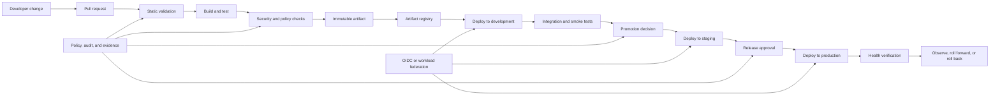
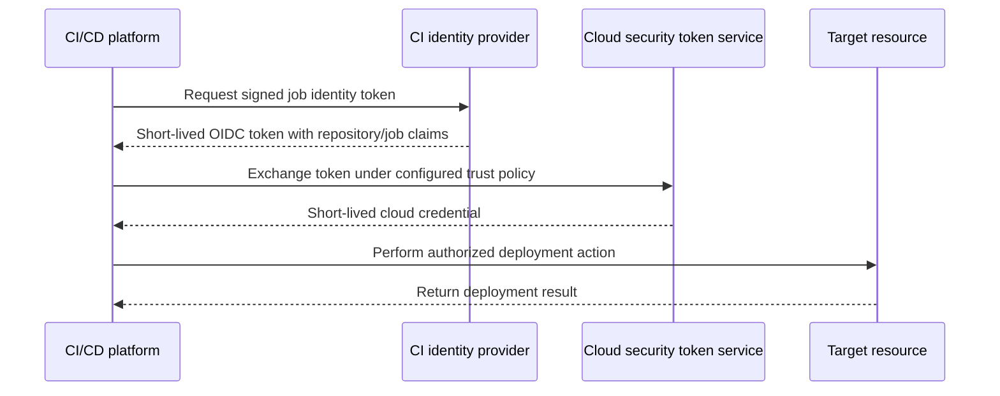

> **Document class:** CI/CD & Automation implementation guide
> **Normative terms:** **MUST**, **MUST NOT**, **SHOULD**, **SHOULD NOT**, and **MAY** are requirements levels.
> **Applicability:** Application, infrastructure, container, Kubernetes, static-site, and documentation delivery across cloud and hybrid environments.
> **Exception process:** Deviations require a documented risk assessment, compensating controls, named risk owner, and expiry date.

| Control field | Value |
|---|---|
| Document ID | `CICD-01` |
| Owner | Cloud Center of Excellence |
| Review cycle | At least annually and after material platform, provider, security, or operating-model changes |
| Evidence | Artifact digest and provenance, test and policy results, approvals, deployment records, and health evidence |

# A Practical CI/CD Blueprint

> **Decision in brief:** Build once, promote the same immutable artifact through protected environments, with short-lived identity and evidence at every gate.

## Overview

A reliable CI/CD system is not a single YAML file. It is a controlled software-delivery system that converts a reviewed source revision into a traceable release while preserving security, reproducibility, and recoverability.

This blueprint applies to application code, container images, Terraform, Kubernetes manifests, static sites, and documentation. Azure is used in some examples, but the control model is intentionally portable across Azure, AWS, GCP, Oracle Cloud Infrastructure (OCI), and on-premises platforms.

## Goals and non-goals

### Goals

- Produce immutable, attributable build artifacts.
- Separate validation from deployment.
- Use short-lived workload identity instead of stored cloud credentials.
- Promote the same artifact through environments.
- Require proportionate approvals for higher-risk environments.
- Make failure diagnosable and rollback operationally realistic.
- Keep pipeline logic reusable, reviewed, and versioned.

### Non-goals

- Treating a successful pipeline run as proof that a release is safe.
- Rebuilding separately for test, staging, and production.
- Granting a single pipeline identity unrestricted access to every environment.
- Solving poor application observability with more pipeline steps.

## Reference architecture



The critical distinction is between **artifact creation** and **artifact promotion**. A release candidate should be built once, assigned an immutable identifier, and promoted without recompilation. Rebuilding introduces unreviewed variability and weakens provenance.

## Standard pipeline lifecycle

### Source and pull-request controls

The source repository is the first security boundary. Require:

- Protected default and release branches.
- Pull requests for changes to application code, infrastructure, pipeline templates, and policy files.
- Independent review for high-risk paths such as identity, networking, production Terraform, and deployment workflows.
- Required status checks that cannot be bypassed casually.
- Signed commits or verified identities where the organizational threat model justifies them.
- CODEOWNERS or equivalent path-based reviewers for sensitive directories.

Do not allow pull-request code from untrusted forks to execute on privileged self-hosted runners. A pull request is untrusted input until the repository's trust controls establish otherwise.

### Fast validation

Run inexpensive checks first so failures are returned quickly:

- Formatting and linting.
- Schema validation.
- Unit tests.
- Terraform `fmt`, `validate`, and provider lock-file checks.
- Kubernetes manifest rendering and policy checks.
- Documentation link and spelling checks.
- Workflow syntax and policy validation.

Validation must fail closed. A task that emits errors but exits with status zero is decorative, not a control.

### Build and package

Build in a deterministic environment with pinned toolchains and declared dependencies. The build stage should produce:

- A versioned package, container image, site bundle, or Terraform plan.
- A checksum or digest.
- Build metadata containing commit SHA, workflow run, repository, timestamp, and toolchain versions.
- A software bill of materials where applicable.
- Test and security reports.

Use immutable artifact references. For containers, promote by digest rather than mutable tags such as `latest`.

### Security and policy gates

Controls should match the artifact type:

| Artifact | Minimum controls |
|---|---|
| Application package | Unit tests, dependency scan, static analysis, license policy |
| Container image | Vulnerability scan, SBOM, signature, base-image policy |
| Terraform | Formatting, validation, linting, policy-as-code, plan review |
| Kubernetes manifests | Render validation, schema validation, policy-as-code, image pinning |
| Static site | Build validation, link checks, dependency review, content approval |

A scanner finding should be evaluated through an explicit policy. Merely uploading a report without an enforcement decision does not protect a release.

### Artifact publication

Publish only after the build and required checks succeed. Registries should enforce:

- Immutability or append-only versioning.
- Restricted write permissions.
- Retention policies that preserve active and rollback versions.
- Malware or vulnerability scanning where supported.
- Audit logging.
- Cross-region or cross-account replication where recovery objectives require it.

Typical destinations include Azure Container Registry, Amazon ECR, Google Artifact Registry, OCI Container Registry, GitHub Packages, or an internal artifact repository.

### Deployment methods

Choose the deployment method deliberately rather than mixing patterns without ownership boundaries.

### Imperative pipeline deployment

The pipeline directly invokes the cloud, platform, or deployment API.

Use it when:

- The target is not continuously reconciled.
- The deployment is transactional and short-lived.
- The organization needs a simple migration path from manual deployment.

Risks include broad pipeline credentials, configuration drift, and weak recovery if deployment state is not externalized.

### GitOps reconciliation

The pipeline updates desired state in Git; an in-environment controller reconciles the target.

Use it when:

- Kubernetes or another declarative platform is the target.
- Continuous drift detection is required.
- Direct inbound access from the pipeline to the runtime environment is undesirable.

The CI pipeline should build and verify the artifact, then update an immutable artifact reference in the configuration repository. The reconciler performs deployment.

### Managed deployment service

A cloud-native or third-party service performs the deployment using an environment-local identity.

Examples include Azure Deployment Stacks or deployment jobs, AWS CodeDeploy, GCP Deploy, OCI DevOps Deployment Pipelines, and HCP Terraform. This can reduce credential exposure, but it does not remove the need for source, approval, and artifact controls.

## Environment model

A practical environment chain is:


Not every system needs five environments. The minimum viable model is an automated lower environment plus a controlled production environment. The important controls are isolation, explicit promotion, and representative testing.

Use separate cloud accounts, subscriptions, projects, or compartments when the blast radius justifies it:

| Provider | Common isolation boundary |
|---|---|
| Azure | Management group, subscription, resource group |
| AWS | Organization, account, organizational unit |
| GCP | Organization, folder, project |
| OCI | Tenancy, compartment |

Production should not share a deployment identity, state store, mutable runner workspace, or unrestricted network path with development.

## Identity and secret model

Prefer workload federation:



The trust policy should bind the token to specific claims, such as repository, branch, environment, organization, workflow, or pipeline. Do not create federation that accepts any repository in an organization unless that breadth is intentional and separately controlled.

Long-lived secrets should be an exception. When unavoidable:

- Store them in a managed secret system.
- Scope them to one environment and one purpose.
- Rotate them automatically.
- Never echo them to logs.
- Prevent pull-request workflows from reading production secrets.

## Reusable pipeline structure

Keep orchestration thin and move stable behavior into versioned templates or reusable workflows.

```text
.pipeline/
  templates/
    validate.yml
    build.yml
    security.yml
    deploy.yml
    verify.yml
  scripts/
    validate.sh
    smoke-test.sh
    collect-evidence.sh
  policies/
    release-policy.rego
    terraform-policy.rego
```

Template inputs must be explicit. Hidden conventions, magic variable names, and unbounded shell interpolation make reusable pipelines fragile and unsafe.

Pin third-party actions, tasks, modules, and container images to immutable versions where feasible. For GitHub Actions, a full commit SHA is the strongest immutability control for an action reference.

## Deployment validation

Validation must occur at several layers.

### Pre-deployment

- Confirm artifact digest and provenance.
- Verify that the artifact passed required tests.
- Validate environment configuration.
- Check policy and change-window requirements.
- Detect conflicting or active deployments.
- Confirm that the deployment identity is scoped correctly.

### During deployment

- Enforce timeouts.
- Stream structured logs.
- Capture resource or rollout identifiers.
- Stop on partial failure unless the deployment method explicitly supports safe continuation.
- Prevent concurrent mutation of the same target.

### Post-deployment

- Test health endpoints and critical transactions.
- Verify metrics, logs, and error budgets.
- Compare expected and actual version identifiers.
- Observe for a defined stabilization period.
- Record the release result and evidence.

A deployment is not complete when the deployment command exits zero. It is complete when the target is healthy and the expected version is serving traffic.

## Release strategies

| Strategy | Strength | Primary risk | Good fit |
|---|---|---|---|
| Recreate | Simple | Downtime | Non-critical internal systems |
| Rolling | Efficient | Mixed-version compatibility | Stateless services |
| Blue-green | Rapid switch and rollback | Double capacity and data compatibility | High-value services |
| Canary | Limits initial blast radius | Requires observability and traffic control | Customer-facing services |
| Feature flags | Separates deployment from release | Flag debt and logic complexity | Incremental product delivery |

Database changes require special treatment. Prefer backward-compatible expansion, application deployment, migration, and later contraction. A binary rollback is unsafe if the schema has already been changed incompatibly.

## Multi-cloud implementation mapping

| Capability | Azure | AWS | GCP | OCI |
|---|---|---|---|---|
| Workload identity | Entra workload identity federation | IAM OIDC provider and role assumption | Workload Identity Federation | Resource/instance principals; external token exchange where supported |
| Artifact registry | ACR | ECR / CodeArtifact | Artifact Registry | OCI Registry / Artifact Registry |
| Environment boundary | Subscription/resource group | Account | Project | Compartment |
| Secret manager | Key Vault | Secrets Manager / Parameter Store | Secret Manager | Vault |
| Native deployment | Azure Pipelines/services | CodePipeline/CodeDeploy | Cloud Deploy | OCI DevOps |
| Audit | Azure Activity Log | CloudTrail | Cloud Audit Logs | Audit |

The product names differ; the control objectives do not.

## Failure handling and recovery

Every production pipeline should define:

- Retry policy for transient failures only.
- Idempotency assumptions.
- Rollback or roll-forward criteria.
- Maximum deployment duration.
- Ownership and escalation path.
- Evidence retained after failure.
- Procedure for stuck locks and partial resources.

Do not automatically retry destructive or stateful operations without understanding whether the operation is safe to repeat.

## Release manifest and evidence bundle

Standardize a release bundle that travels with the artifact:

```text
source revision
artifact digest or package checksum
build definition and template version
toolchain and dependency lock hashes
test, policy, scan, SBOM, and provenance references
configuration revision
approval and change classification
deployment targets
rollback or roll-forward reference
```

The bundle must be integrity-protected and readable by operations without exposing secrets. It should support answering "what is running and why was it allowed?" without reconstructing evidence from temporary logs.

## Change classification and proportional controls

Not every change needs the same workflow, but the decision must be controlled.

| Change class | Examples | Additional control |
|---|---|---|
| Routine | Backward-compatible application correction | Standard automated gates |
| Sensitive | Identity, network, security policy, secret delivery | Specialist review and negative tests |
| Stateful | Database, storage, migration, queue contract | Compatibility and recovery evidence |
| Broad | Shared module, template, fleet controller | Canary consumers or rollout waves |
| Emergency | Incident remediation | Expedited approval and retrospective review |

Classification should be derived from changed paths, plan contents, artifact type, and declared impact—not only contributor input.

## Test portfolio

A practical pipeline balances speed and confidence:

- Fast unit, schema, format, and policy checks on every change.
- Component and contract tests for affected interfaces.
- Image or package tests against the final artifact.
- Environment integration and smoke tests after deployment.
- Performance, resilience, recovery, and security tests on a scheduled or risk-triggered basis.
- Synthetic production verification for critical journeys.

Do not force every expensive test into every pull request. Do not omit infrequent failure-mode tests merely because the main pipeline is green.

## Delivery metrics and feedback

Measure the delivery system using metrics tied to outcomes:

- Change lead time.
- Deployment frequency.
- Change failure rate.
- Time to restore service.
- Queue and pipeline duration.
- Flaky-test rate.
- Approval wait time.
- Rollback and roll-forward frequency.
- Template and runner failure rate.
- Security exception age.

Metrics should drive engineering improvement, not individual performance scoring. Poorly designed targets encourage smaller evidence windows, hidden failures, and unsafe batching.

## Operational checklist

- [ ] Default and release branches are protected.
- [ ] Pipeline changes require review.
- [ ] Validation fails closed.
- [ ] Build artifacts are immutable and attributable.
- [ ] The same artifact is promoted across environments.
- [ ] Cloud access uses short-lived identity wherever supported.
- [ ] Production identities and environments are isolated.
- [ ] Approvals are enforced outside editable pipeline code.
- [ ] Concurrent deployments to the same target are controlled.
- [ ] Post-deployment health is verified.
- [ ] Rollback or roll-forward procedures are tested.
- [ ] Logs, evidence, and deployment history are retained.

## Related topics

- [Pipeline as Code Standards and Reusable Templates](pipeline-as-code-standards-and-reusable-templates.md)
- [Pipeline Identity and Secret Handling](pipeline-identity-and-secret-handling.md)
- [Environment Promotion, Approval, and Release Controls](environment-promotion-approval-and-release-controls.md)
- [Pipeline Troubleshooting and Recovery](pipeline-troubleshooting-and-recovery.md)

## Validation

- Validate the guidance against its stated requirements, acceptance criteria, and evidence expectations before adoption.

## References

- [HashiCorp: Running Terraform in automation](https://developer.hashicorp.com/terraform/tutorials/automation/automate-terraform)
- [GitHub: Security in GitHub Actions](https://docs.github.com/en/actions/concepts/security)
- [GitHub: Secure use reference](https://docs.github.com/en/actions/reference/security/secure-use)
- [Microsoft: Secure Azure Pipelines](https://learn.microsoft.com/en-us/azure/devops/pipelines/security/overview)
- [OpenGitOps](https://opengitops.dev/)
- [GCP: Workload Identity Federation for deployment pipelines](https://cloud.google.com/iam/docs/workload-identity-federation-with-deployment-pipelines)
- [AWS: Create an IAM OIDC identity provider](https://docs.aws.amazon.com/IAM/latest/UserGuide/id_roles_providers_create_oidc.html)
