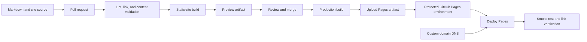

> **文档类型：** CI/CD & 自动化实施指南
> **规范性术语：** **MUST**、**MUST NOT**、**SHOULD**、**SHOULD NOT** 和 **MAY** 是要求级别。
> **适用范围：** 通过 GitHub Pages 和 GitHub Actions 发布公共静态站点和工程文档。
> **例外流程：** 偏离要求需要记录风险评估、补偿控制、指定风险负责人和到期日期。

|控制领域|价值|
|---|---|
|文件编号 | `CICD-08` |
|负责人|云卓越中心 |
|审核周期|至少每年一次，并且在重大平台、提供商、安全性或运营模式发生变化之后 |
|证据|源和发布工作流程、构建锁定文件、元数据和链接检查、页面设置、制品内容、DNS、安全性和恢复测试 |

# 使用 GitHub Pages 发布站点和文档

> **简要决定：** 仅发布来自可复制工作流程的经过验证的公共内容，具有明确的源边界、元数据检查，并且捆绑包中没有机密。

## 概述

GitHub Pages 从分支或 GitHub Actions 工作流程发布静态内容。对于工程文档，基于 Actions 的模式通常更强大，因为它将源与生成的输出分开，支持任意静态站点生成器，并使验证明确。

GitHub Pages 是一种托管服务，而不是一般的应用运行时。请勿将服务器端机密、私有 API 或机密数据放入已发布的捆绑包中。传递到浏览器的任何内容都必须被视为对站点受众公开。

## 目标和非目标

### 目标

- 可重复地构建文档。
- 在发布之前验证链接、结构和生成的输出。
- 仅从受保护的分支或批准的版本发布。
- 使用最低权限工作流程权限。
- 保留构建证据并使回滚变得简单。
- 支持自定义域和安全配置。

### 非目标

- 托管服务器端代码或机密承载逻辑。
- 直接从开发人员工作站发布。
- 在没有明确原因的情况下提交生成的输出。
- 假设私有仓库始终生成私有站点。

## 参考架构

## 发布源选项

### 分支或 `/docs` 文件夹

GitHub 可以从选定的分支以及仓库根目录或 `/docs` 目录进行发布。

使用时：

- 该站点很简单。
- 生成的输出是有意提交的。
- 不需要定制构建流水线。

弱点：

- 源和生成的输出可能会混合。
- 验证更容易绕过。
- 生成器行为受到页面构建模型的约束。

### GitHub Actions 工作流程

使用时：

- 该站点使用 MkDocs、Docusaurus、Hugo、Sphinx、自定义生成器或非默认 Jekyll 构建。
- 需要验证和安全检查。
- 构建输出应该保留为制品而不是提交的文件。
- 组织需要一个受控的部署环境。

这是推荐的企业模式。

## 仓库布局
```text
docs/
  index.md
  architecture/
  guides/
  assets/
site-config.yml
.github/
  workflows/
    docs-pr.yml
    pages-deploy.yml
scripts/
  check-links.sh
  validate-frontmatter.py
```
对于文档门户，规范前文、标题、文件名、导航和链接样式。跨文章强制执行相同的元数据架构。

## 拉取请求验证

合并前验证内容：

- 必需的前题。
- 摘要长度和允许的标签。
- Markdown 语法和风格。
- 内部和外部链接。
- 重复的标题或损坏的锚点。
- Mermaid 或图表语法（如果可行）。
- 静态站点构建。
- 可访问性检查。
- 受控词汇的拼写检查。
- 敏感数据和机密扫描。

概念工作流程示例：
```yaml
name: docs-pr

on:
  pull_request:
    paths:
      - 'docs/**'
      - 'site-config.yml'
      - '.github/workflows/pages-*.yml'

permissions:
  contents: read

jobs:
  validate:
    runs-on: ubuntu-latest
    steps:
      - uses: actions/checkout@<full-commit-sha>
      - name: Install pinned documentation toolchain
        run: ./scripts/install-docs-toolchain.sh
      - name: Validate metadata
        run: python scripts/validate-frontmatter.py docs
      - name: Build site
        run: ./scripts/build-site.sh
      - name: Check generated links
        run: ./scripts/check-links.sh site
```
固定 Action 引用和生成器依赖项。文档流水线仍然是软件供应链。

## GitHub Pages 部署工作流程

GitHub 的自定义页面工作流程使用构建作业和部署作业。部署作业需要 Pages 权限，并且通常以 `github-pages` 环境为目标。
```yaml
name: deploy-pages

on:
  push:
    branches: [main]
    paths:
      - 'docs/**'
      - 'site-config.yml'
  workflow_dispatch:

permissions:
  contents: read

concurrency:
  group: pages
  cancel-in-progress: true

jobs:
  build:
    runs-on: ubuntu-latest
    steps:
      - uses: actions/checkout@<full-commit-sha>
      - name: Build
        run: ./scripts/build-site.sh
      - uses: actions/configure-pages@<full-commit-sha>
      - uses: actions/upload-pages-artifact@<full-commit-sha>
        with:
          path: ./site

  deploy:
    environment:
      name: github-pages
      url: ${{ steps.deployment.outputs.page_url }}
    runs-on: ubuntu-latest
    needs: build
    permissions:
      pages: write
      id-token: write
    steps:
      - name: Deploy to GitHub Pages
        id: deployment
        uses: actions/deploy-pages@<full-commit-sha>
```
工作流程是说明性的。用经过审查的不可变 Action SHA 替换占位符并固定文档工具链。

## 权限模型

构建作业通常只需要 `contents: read`。

部署作业需要：

- `pages: write` 发布。
- `id-token: write` 用于页面部署身份流程。

不要向构建作业授予仓库写入权限，除非它必须创建版本提交或发布。发布生成的内容不应需要通用仓库令牌。

## 建立可重复性

引脚：

- 运行时版本。
- 静态站点生成器。
- 插件和主题。
- 包管理器锁定文件。
- 图表和语法突出显示依赖关系。
- 操作提交 SHA。

日志记录：

- 源代码提交。
- 依赖锁哈希。
- 工具版本。
- 构建时间戳。
- 输出校验和。

避免在每次构建期间从未经验证的分支下载可执行主题或插件。

## 文档元数据验证

对于使用此仓库架构的文章：
```yaml
---
title: Article title
summary: A 30-to-220-character description.
tags: cloud, engineering
status: published
order: 100
---
```
验证：

- `title` 在需要时存在并且是唯一的。
- `summary` 介于 30 到 220 个字符之间。
- `tags` 与允许的分类法匹配。
- `status` 是允许的值。
- `order` 是数字。
- Front Matter 是文件中的第一个内容。

验证逻辑示例：
```python
required = {"title", "summary", "tags", "status", "order"}
assert required.issubset(metadata)
assert 30 <= len(metadata["summary"]) <= 220
assert metadata["status"] in {"draft", "published", "archived"}
```
## 图表处理

Mermaid 图是源代码，需要验证。

规则：

- 保持图表足够小，以便在移动设备上阅读。
- 使用描述性节点标签。
- 避免提供程序特定的图标，除非渲染流水线可靠地支持它们。
- 提供周围的文本，以便在图表未呈现时文档仍然可以理解。
- 实际页面主题中的测试图。

对于不原生渲染 Mermaid 的生成器，请在构建过程中向 SVG 添加固定插件或预渲染图。不要在图中嵌入机密或内部主机名。

## 预览环境

GitHub Pages 本身是面向配置的站点的。对于拉取请求预览，替代方案包括：

- 将构建的站点作为工作流程制品上传。
- 使用单独的预览托管服务。
- 在非生产站点的受控路径下发布预览。
- 运行为审阅者记录在案的本地预览命令。

不受信任的拉取请求的预览工作流不得接收部署机密或对生产页面环境的写入访问权限。

## 自定义域和 DNS

对于自定义域：

- 在仓库页面设置中配置域。
- 创建记录在案的 DNS 记录。
- 验证域所有权（如果适用）。
- DNS 和证书配置完成后强制执行 HTTPS。
- 通过基础设施即代码或受控管理来保护 DNS 更改。
- 监控证书和 DNS 健康状况。

不要在假设模糊域提供访问控制的情况下发布机密内容。

## 多云集成

GitHub Pages 独立于运行时云，但文档通常描述多云基础设施。与云自动化安全集成：

- 在单独的作业中从 Azure、AWS、GCP 或 OCI 生成经过清理的参考数据。
- 切勿发布云凭据或原始状态。
- 查看生成的内部 IP、账户 ID 和安全敏感拓扑的清单。
- 如果必须查询实时云数据，请使用只读联邦身份。
- 在发布之前将生成的公共文档存储为构建制品。

对于私营企业门户，请使用访问控制的托管平台，而不是假设 GitHub Pages 满足身份验证或数据驻留要求。

## 安全控制

- 将 Actions 固定到完整提交 SHA。
- 限制工作流程权限。
- 保护默认分支。
- 需要审查工作流程和站点配置更改。
- 扫描 Markdown、图像和生成的文件以查找机密。
- 清理不受信任的 HTML。
- 检查 JavaScript 依赖项和外部脚本。
- 在托管和站点设计允许的情况下应用内容安全策略。
- 避免违反隐私要求的第三方分析。

静态站点仍然可能因恶意依赖项、注入的 JavaScript 或被污染的构建输出而受到损害。

## 验证

- 确认部署的 URL。
- 检查预期的提交或版本标记。
- 测试关键导航路径。
- 验证自定义域 HTTPS。
- 检查是否有损坏的资源和链接。
- 验证机器人和站点地图行为。
- 确认没有无意中发布源映射或私有文件。
- 保留页面部署记录并构建制品元数据。

## 故障排除和恢复

|症状|调查|
|---|---|
|页面构建失败 |使用固定的本地工具链进行复制；检查生成器日志 |
|站点已部署但资产丢失 |检查基本 URL、项目站点路径和绝对链接 |
|自定义域失败 |验证 DNS 记录、域配置和证书状态 |
|工作流无法部署 |确认`pages: write`、`id-token: write`及环境规则 |
| Jekyll 意外地解释文件 |如果合适，在发布预构建的静态输出时添加 `.nojekyll` |
|损坏的链接仅出现在生产中 |验证配置的基本路径和区分大小写的文件名 |
|不良内容发布 |恢复源并重新部署已知良好的提交 |

回滚通常是 Git 恢复，然后是新的 Pages 部署。保持先前的源版本和构建依赖关系可重现。

## 出版物边界和数据分类

生成的站点即为发布单位。在部署之前，检查完整的输出，而不仅仅是 Markdown 源。

检查：

- 内部主机名、IP 地址、账户或租户标识符。
- 嵌入式 API 响应、Terraform 输出或清单导出。
- 源地图和构建元数据。
- 导航或搜索索引包含的草稿或存档页面。
- 私有图像、附件和可下载文件。
- 隐藏的 HTML、注释或客户端配置。
- 搜索索引 JSON 包含从可见导航中排除的文本。

`robots.txt`、未链接的页面和模糊的 URL 不是访问控制。使用经过身份验证的托管平台来存储非公开或受限文档。

## 版本化文档

对于具有受支持的发布线的产品，定义版本控制模型：

- 一个具有明确存档版本的当前站点。
- 版本化路径，例如 `/v2/` 和 `/v3/`。
- 从批准的元数据生成的产品版本选择器。
- 终止支持横幅和规范链接。
- 云当前指导和历史行为之间的明确区别。

不要为每个版本手动复制整个文档树。将源分支、标签或生成器功能与定义的向后移植策略结合使用。

## 客户端安全

静态托管消除了服务器端执行，但并不能消除浏览器风险。

控制应包括：

- 最小化第三方脚本。
- 固定 JavaScript 和 CSS 依赖项。
- 在加载固定外部资源且操作可行时使用子资源完整性。
- 清理由不受信任的用户贡献的 Markdown 或 HTML。
- 在托管拓扑支持标头或元策略的情况下应用限制性内容安全策略。
- 避免嵌入令牌、私有端点或特权 API 调用。
- 根据隐私要求审查分析、cookie 和外部字体。

受损的主题或搜索插件可以修改每个已发布的页面。

## 备份与恢复

保存：

- 源仓库和受保护的历史记录。
- 依赖锁文件。
- 站点配置和自定义域设置。
- DNS 基础设施和所有权验证。
- 已知良好的构建制品元数据。
- Actions 和生成器版本。
- 发布和部署日志记录。

测试从源头重建旧的已知良好站点。仅当历史工具链和依赖项保持可用且可重现时，Git revert 才有用。

## 操作清单

- [ ] Pages 通过经过审核的 GitHub Actions 工作流程进行发布。
- [ ] 构建和部署作业具有单独的权限。
- [ ] 操作和生成器依赖项已固定。
- [ ] 前言和摘要长度已验证。
- [ ] 链接、图表和生成的输出经过测试。
- [ ] 拉取请求预览没有生产凭据。
- [ ] 默认分支和工作流程文件受到保护。
- [ ] 监控自定义域 DNS 和 HTTPS。
- [ ] 机密和敏感数据扫描包括生成的输出。
- [ ] 运行部署后冒烟测试。
- [ ] 通过 Git 恢复进行回滚已日志记录。

## 相关主题

- [实用的 CI/CD 蓝图](practical-ci-cd-blueprint.md)
- [分支、版本控制和发布策略](branching-versioning-and-release-strategy.md)
- [流水线即代码标准和可复用模板](pipeline-as-code-standards-and-reusable-templates.md)
- [流水线故障排除与恢复](pipeline-troubleshooting-and-recovery.md)

## 参考文档

- [GitHub：配置 GitHub Pages 的发布源](https://docs.github.com/en/pages/getting-started-with-github-pages/configuring-a-publishing-source-for-your-github-pages-site)
- [GitHub：通过 GitHub Pages 使用自定义工作流程](https://docs.github.com/en/pages/getting-started-with-github-pages/using-custom-workflows-with-github-pages)
- [GitHub：创建 GitHub Pages 站点](https://docs.github.com/en/pages/getting-started-with-github-pages/creating-a-github-pages-site)
- [GitHub：GitHub 页面限制](https://docs.github.com/en/pages/getting-started-with-github-pages/github-pages-limits)
- [GitHub：页面的 Jekyll 构建错误](https://docs.github.com/en/pages/setting-up-a-github-pages-site-with-jekyll/about-jekyll-build-errors-for-github-pages-sites)
- [GitHub：安全使用参考](https://docs.github.com/en/actions/reference/security/secure-use)
