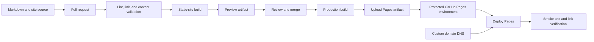

> **Document class:** CI/CD & Automation implementation guide
> **Normative terms:** **MUST**, **MUST NOT**, **SHOULD**, **SHOULD NOT**, and **MAY** are requirements levels.
> **Applicability:** Public static-site and engineering-documentation publication through GitHub Pages and GitHub Actions.
> **Exception process:** Deviations require a documented risk assessment, compensating controls, named risk owner, and expiry date.

| Control field | Value |
|---|---|
| Document ID | `CICD-08` |
| Owner | Cloud Center of Excellence |
| Review cycle | At least annually and after material platform, provider, security, or operating-model changes |
| Evidence | Source and release workflow, build lockfiles, metadata and link checks, Pages settings, artifact contents, DNS, security, and recovery tests |

# Publishing Sites and Documentation with GitHub Pages

> **Decision in brief:** Publish only validated public content from a reproducible workflow, with clear source boundaries, metadata checks, and no secrets in the bundle.

## Overview

GitHub Pages publishes static content from a branch or a GitHub Actions workflow. For engineering documentation, the Actions-based model is usually stronger because it separates source from generated output, supports arbitrary static-site generators, and makes validation explicit.

GitHub Pages is a hosting service, not a general application runtime. Do not place server-side secrets, private APIs, or confidential data in the published bundle. Anything delivered to the browser must be treated as public to the site audience.

## Goals and non-goals

### Goals

- Build documentation reproducibly.
- Validate links, structure, and generated output before publication.
- Publish only from a protected branch or approved release.
- Use least-privilege workflow permissions.
- Retain build evidence and make rollback straightforward.
- Support custom domains and secure configuration.

### Non-goals

- Hosting server-side code or secret-bearing logic.
- Publishing directly from a developer workstation.
- Committing generated output without an explicit reason.
- Assuming a private repository always produces a private website.

## Reference architecture



## Publishing-source options

### Branch or `/docs` folder

GitHub can publish from a selected branch and either the repository root or `/docs` directory.

Use when:

- The site is simple.
- Generated output is intentionally committed.
- No custom build pipeline is required.

Weaknesses:

- Source and generated output can become mixed.
- Validation is easier to bypass.
- Generator behavior is constrained by the Pages build model.

### GitHub Actions workflow

Use when:

- The site uses MkDocs, Docusaurus, Hugo, Sphinx, a custom generator, or a non-default Jekyll build.
- Validation and security checks are required.
- The build output should remain an artifact rather than committed files.
- The organization needs a controlled deployment environment.

This is the recommended enterprise pattern.

## Repository layout

```text
docs/
  index.md
  architecture/
  guides/
  assets/
site-config.yml
.github/
  workflows/
    docs-pr.yml
    pages-deploy.yml
scripts/
  check-links.sh
  validate-frontmatter.py
```

For a documentation portal, normalize front matter, headings, file names, navigation, and link style. Enforce the same metadata schema across articles.

## Pull-request validation

Validate content before merge:

- Required front matter.
- Summary length and allowed tags.
- Markdown syntax and style.
- Internal and external links.
- Duplicate headings or broken anchors.
- Mermaid or diagram syntax where feasible.
- Static-site build.
- Accessibility checks.
- Spell checking for controlled vocabulary.
- Sensitive-data and secret scanning.

Example conceptual workflow:

```yaml
name: docs-pr

on:
  pull_request:
    paths:
      - 'docs/**'
      - 'site-config.yml'
      - '.github/workflows/pages-*.yml'

permissions:
  contents: read

jobs:
  validate:
    runs-on: ubuntu-latest
    steps:
      - uses: actions/checkout@<full-commit-sha>
      - name: Install pinned documentation toolchain
        run: ./scripts/install-docs-toolchain.sh
      - name: Validate metadata
        run: python scripts/validate-frontmatter.py docs
      - name: Build site
        run: ./scripts/build-site.sh
      - name: Check generated links
        run: ./scripts/check-links.sh site
```

Pin action references and generator dependencies. A documentation pipeline is still a software supply chain.

## GitHub Pages deployment workflow

GitHub's custom Pages workflow uses a build job and a deployment job. The deployment job requires Pages permissions and normally targets the `github-pages` environment.

```yaml
name: deploy-pages

on:
  push:
    branches: [main]
    paths:
      - 'docs/**'
      - 'site-config.yml'
  workflow_dispatch:

permissions:
  contents: read

concurrency:
  group: pages
  cancel-in-progress: true

jobs:
  build:
    runs-on: ubuntu-latest
    steps:
      - uses: actions/checkout@<full-commit-sha>
      - name: Build
        run: ./scripts/build-site.sh
      - uses: actions/configure-pages@<full-commit-sha>
      - uses: actions/upload-pages-artifact@<full-commit-sha>
        with:
          path: ./site

  deploy:
    environment:
      name: github-pages
      url: ${{ steps.deployment.outputs.page_url }}
    runs-on: ubuntu-latest
    needs: build
    permissions:
      pages: write
      id-token: write
    steps:
      - name: Deploy to GitHub Pages
        id: deployment
        uses: actions/deploy-pages@<full-commit-sha>
```

The workflow is illustrative. Replace placeholders with reviewed immutable action SHAs and pin the documentation toolchain.

## Permission model

The build job should normally need only `contents: read`.

The deployment job requires:

- `pages: write` to publish.
- `id-token: write` for the Pages deployment identity flow.

Do not grant repository write permissions to the build job unless it must create a version commit or release. Publishing generated content should not require a general repository token.

## Build reproducibility

Pin:

- Runtime version.
- Static-site generator.
- Plugins and themes.
- Package-manager lock files.
- Diagram and syntax-highlighting dependencies.
- Action commit SHAs.

Record:

- Source commit.
- Dependency lock hash.
- Tool versions.
- Build timestamp.
- Output checksum.

Avoid downloading executable themes or plugins from an unverified branch during every build.

## Documentation metadata validation

For articles using this repository's schema:

```yaml
---
title: Article title
summary: A 30-to-220-character description.
tags: cloud, engineering
status: published
order: 100
---
```

Validate:

- `title` is present and unique where required.
- `summary` is between 30 and 220 characters.
- `tags` matches the allowed taxonomy.
- `status` is an allowed value.
- `order` is numeric.
- Front matter is the first content in the file.

Example validation logic:

```python
required = {"title", "summary", "tags", "status", "order"}
assert required.issubset(metadata)
assert 30 <= len(metadata["summary"]) <= 220
assert metadata["status"] in {"draft", "published", "archived"}
```

## Diagram handling

Mermaid diagrams are source code and need validation.

Rules:

- Keep diagrams small enough to read on mobile.
- Use descriptive node labels.
- Avoid provider-specific icons unless the rendering pipeline supports them reliably.
- Provide surrounding text so the document remains understandable if the diagram does not render.
- Test diagrams in the actual Pages theme.

For generators that do not render Mermaid natively, add a pinned plugin or pre-render diagrams to SVG during the build. Do not embed secrets or internal hostnames in diagrams.

## Preview environments

GitHub Pages itself is oriented around the configured site. For pull-request previews, alternatives include:

- Uploading the built site as a workflow artifact.
- Using a separate preview hosting service.
- Publishing previews under controlled paths in a non-production site.
- Running a local preview command documented for reviewers.

Preview workflows for untrusted pull requests must not receive deployment secrets or write access to the production Pages environment.

## Custom domains and DNS

For a custom domain:

- Configure the domain in repository Pages settings.
- Create the documented DNS records.
- Verify domain ownership where applicable.
- Enforce HTTPS after DNS and certificate provisioning complete.
- Protect DNS changes through infrastructure-as-code or controlled administration.
- Monitor certificate and DNS health.

Do not publish confidential content under the assumption that an obscure domain provides access control.

## Multi-cloud integration

GitHub Pages is independent of the runtime cloud, but documentation often describes multi-cloud infrastructure. Integrate safely with cloud automation:

- Generate sanitized reference data from Azure, AWS, GCP, or OCI in a separate job.
- Never publish cloud credentials or raw state.
- Review generated inventories for internal IPs, account IDs, and security-sensitive topology.
- Use a read-only federated identity if live cloud data must be queried.
- Store generated public documentation as a build artifact before publication.

For private enterprise portals, use an access-controlled hosting platform rather than assuming GitHub Pages meets authentication or data-residency requirements.

## Security controls

- Pin actions to full commit SHAs.
- Restrict workflow permissions.
- Protect the default branch.
- Require review for workflow and site-configuration changes.
- Scan Markdown, images, and generated files for secrets.
- Sanitize untrusted HTML.
- Review JavaScript dependencies and external scripts.
- Apply a content security policy where the hosting and site design permit it.
- Avoid third-party analytics that violate privacy requirements.

Static sites can still be compromised through malicious dependencies, injected JavaScript, or poisoned build output.

## Validation

- Confirm the deployed URL.
- Check the expected commit or version marker.
- Test critical navigation paths.
- Validate custom-domain HTTPS.
- Check for broken assets and links.
- Verify robots and sitemap behavior.
- Confirm no source maps or private files were unintentionally published.
- Retain the Pages deployment record and build artifact metadata.

## Troubleshooting and recovery

| Symptom | Investigation |
|---|---|
| Pages build fails | Reproduce with pinned local toolchain; inspect generator logs |
| Site deploys but assets are missing | Check base URL, project-site path, and absolute links |
| Custom domain fails | Verify DNS records, domain configuration, and certificate status |
| Workflow cannot deploy | Confirm `pages: write`, `id-token: write`, and environment rules |
| Jekyll interprets files unexpectedly | Add `.nojekyll` when publishing prebuilt static output if appropriate |
| Broken links appear only in production | Validate configured base path and case-sensitive file names |
| Bad content published | Revert source and redeploy known-good commit |

Rollback is normally a Git revert followed by a new Pages deployment. Keep the previous source revision and build dependencies reproducible.

## Publication boundary and data classification

The generated site is the publication unit. Before deployment, inspect the complete output rather than only Markdown source.

Check for:

- Internal hostnames, IP addresses, account or tenant identifiers.
- Embedded API responses, Terraform outputs, or inventory exports.
- Source maps and build metadata.
- Draft or archived pages included by navigation or search indexing.
- Private images, attachments, and downloadable files.
- Hidden HTML, comments, or client-side configuration.
- Search-index JSON containing text excluded from visible navigation.

`robots.txt`, unlinked pages, and obscure URLs are not access controls. Use an authenticated hosting platform for non-public or restricted documentation.

## Versioned documentation

For products with supported release lines, define a versioning model:

- One current site with explicitly archived versions.
- Versioned paths such as `/v2/` and `/v3/`.
- Product-version selector generated from approved metadata.
- End-of-support banner and canonical links.
- Clear distinction between cloud-current guidance and historical behavior.

Do not copy the entire documentation tree manually for every release. Use source branches, tags, or generator features with a defined backport policy.

## Client-side security

Static hosting removes server-side execution but does not eliminate browser risk.

Controls should include:

- Minimize third-party scripts.
- Pin JavaScript and CSS dependencies.
- Use Subresource Integrity when loading fixed external resources and operationally feasible.
- Sanitize Markdown or HTML contributed by untrusted users.
- Apply a restrictive Content Security Policy where the hosting topology supports headers or meta-policy.
- Avoid embedding tokens, private endpoints, or privileged API calls.
- Review analytics, cookies, and external fonts against privacy requirements.

A compromised theme or search plugin can modify every published page.

## Backup and recovery

Preserve:

- Source repository and protected history.
- Dependency lock files.
- Site configuration and custom-domain settings.
- DNS infrastructure and ownership verification.
- Known-good build artifact metadata.
- Action and generator versions.
- Release and deployment records.

Test rebuilding an older known-good site from source. Git revert is useful only when the historical toolchain and dependencies remain available and reproducible.

## Operational checklist

- [ ] Pages publishes through a reviewed GitHub Actions workflow.
- [ ] Build and deploy jobs have separate permissions.
- [ ] Actions and generator dependencies are pinned.
- [ ] Front matter and summary length are validated.
- [ ] Links, diagrams, and generated output are tested.
- [ ] Pull-request previews have no production credentials.
- [ ] Default branch and workflow files are protected.
- [ ] Custom-domain DNS and HTTPS are monitored.
- [ ] Secret and sensitive-data scans include generated output.
- [ ] Post-deployment smoke tests run.
- [ ] Rollback by Git revert is documented.

## Related topics

- [A Practical CI/CD Blueprint](practical-ci-cd-blueprint.md)
- [Branching, Versioning, and Release Strategy](branching-versioning-and-release-strategy.md)
- [Pipeline as Code Standards and Reusable Templates](pipeline-as-code-standards-and-reusable-templates.md)
- [Pipeline Troubleshooting and Recovery](pipeline-troubleshooting-and-recovery.md)

## References

- [GitHub: Configure a publishing source for GitHub Pages](https://docs.github.com/en/pages/getting-started-with-github-pages/configuring-a-publishing-source-for-your-github-pages-site)
- [GitHub: Use custom workflows with GitHub Pages](https://docs.github.com/en/pages/getting-started-with-github-pages/using-custom-workflows-with-github-pages)
- [GitHub: Creating a GitHub Pages site](https://docs.github.com/en/pages/getting-started-with-github-pages/creating-a-github-pages-site)
- [GitHub: GitHub Pages limits](https://docs.github.com/en/pages/getting-started-with-github-pages/github-pages-limits)
- [GitHub: Jekyll build errors for Pages](https://docs.github.com/en/pages/setting-up-a-github-pages-site-with-jekyll/about-jekyll-build-errors-for-github-pages-sites)
- [GitHub: Secure use reference](https://docs.github.com/en/actions/reference/security/secure-use)
