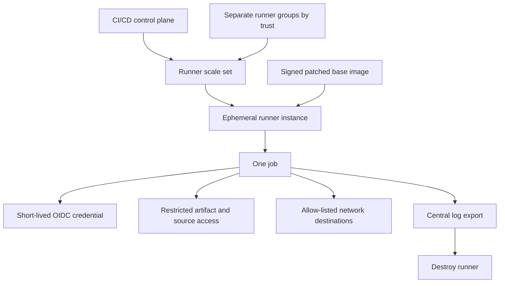
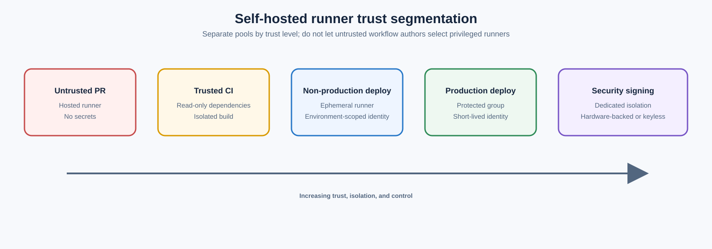
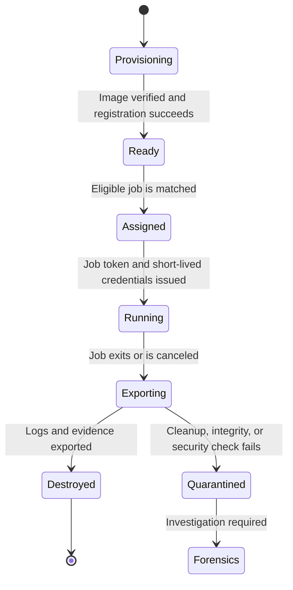

> **文档类型：** CI/CD & 自动化实施指南
> **规范性术语：** **MUST**、**MUST NOT**、**SHOULD**、**SHOULD NOT** 和 **MAY** 是要求级别。
> **适用范围：** 托管、自托管、共享、专用和混合 CI/CD 运行器，包括准入、隔离、清理和生命周期控制。
> **例外流程：** 偏离要求需要记录风险评估、补偿控制、指定风险负责人和到期日期。

|控制领域|价值|
|---|---|
|文件编号 | `CICD-06` |
|负责人|云卓越中心 |
|审核周期|至少每年一次，并且在重大平台、提供商、安全性或运营模式发生变化之后 |
|证据|运行器准入、镜像来源和修补、隔离和清理测试、凭证处理、缓存和日志记录以及事件证据 |

# 共享运行器安全与清理规范

> **决策简述：** 将每个运行器视为代码执行边界：隔离信任级别、更喜欢短暂执行、最小化凭据并验证清理。

## 概述

CI/CD 运行器执行仓库控制的代码，可以访问源、令牌、制品、内部网络和部署系统。因此，共享运行器在设计上就是一个远程代码执行平台。安全性取决于严格的工作负载信任边界、临时执行、最少的凭据和经过验证的清理。

“运行器清理”通常被简化为删除工作空间。这是不够的。凭证、进程、容器、缓存、套接字、Git 配置、包管理器状态、日志和网络会话可以保留在签出目录之外。

## 目标和非目标

### 目标

- 在隔离的、可重现的环境中运行每个作业。
- 防止一个仓库或作业污染另一个仓库或作业。
- 让不受信任的拉取请求代码远离特权网络和凭据。
- 销毁或清理所有作业状态。
- 快速修补运行软件和基础镜像。
- 保留安全日志而不保留机密。

### 非目标

- 将持久虚拟机视为干净虚拟机，因为工作区文件夹已被删除。
- 与任意仓库共享可用于生产环境的运行器。
- 将主机 Docker 套接字安装到不受信任的作业中。
- 将云凭据永久存储在运行器上。

## 威胁模型

假设工作流代码可以尝试：

- 读取环境变量和文件。
- 枚举先前的工作区和缓存。
- 访问本地元数据服务。
- 联系内部网络端点。
- 窃取 Git、包注册表、云或 CI 令牌。
- 留下后台进程或计划任务。
- 修改运行器二进制文件、服务、shell 配置文件或工具链。
- 污染缓存和构建输出。
- 逃离薄弱的容器边界。

私有仓库并不能消除这种威胁。任何能够更改可执行流水线代码的用户或自动化都可以成为攻击者。

## 参考架构

最安全的共享运行器是为一项作业创建的临时运行器，并在导出日志后销毁。

## 运行器类别

### 托管运行器

平台托管的运行器通常为每个作业提供一个新的虚拟机或环境。它们降低了持久性风险和操作负担。限制包括：

- 限制私有网络访问。
- 随时间变化的预装软件。
- 对主机级遥测的有限控制。
- 提供商的地址范围的出口。

固定工具版本并验证关键依赖关系，甚至在托管运行器上也是如此。

### 持久自托管运行器

这些提供了网络和工具的灵活性，但带来了最高的污染风险。仅当临时运行器不可行时才使用，并通过强大的隔离和重建自动化进行补偿。

### 临时自托管运行器

建议用于特权工作负载。使用 VM Scale Sets、具有足够隔离的容器、Kubernetes-based runner controllers、Cloud Build services 或一次性实例来实施。

GitHub 建议对自托管运行器进行临时自动扩缩容。 Azure DevOps 代理还可以通过 scale-set 或自定义编排模式配置为一次性实例。

## 信任分割

按信任级别创建运行器组或池：



切勿按不受信任的工作流作者可以自由选择的标签进行路由，除非平台策略也限制对运行器组的访问。

推荐边界：

- 公开或分叉拉取请求：没有机密的托管运行器。
- 内部拉取请求：具有只读依赖项的隔离 CI 运行器。
- 非生产部署：特定于环境的临时运行器。
- 生产部署：受保护的运行器组、受保护的环境、短暂的身份。
- 签名：具有硬件支持或无密钥签名的专用隔离运行器。

## 基础镜像和补丁

运行器镜像是生产基础设施。将它们作为代码进行管理。

所需控制：

- 最小的操作系统和软件包集。
- 自动镜像构建。
- 漏洞扫描。
- 签名和来源证明。
- 版本化的镜像晋级。
- 快速重建关键的运行器更新。
- 自动运行器应用更新或受监控的固定更新。
- 定义最大镜像年龄。

不要无限期地修补长期运行的运行器并假设它与干净的镜像匹配。定期全面更换是必要的。

## 本地权限

- 在专用的非交互式账户下运行代理。
- 避免无密码 `sudo`。
- 除非记录在案的作业需要，否则请勿将服务账户设置为本地管理员。
- 将编排身份与作业身份分开。
- 保护运行器服务文件免受作业修改。
- 在可行的情况下禁用交互式登录。

需要提升操作的作业应使用专门构建的隔离镜像或受控特权服务，而不是全面的主机管理。

## 容器隔离

容器是进程隔离，不会自动成为强大的敌对代码边界。

避免：

- 将 `/var/run/docker.sock` 安装到不受信任的作业中。
- 特权容器。
- 主机 PID、网络或文件系统命名空间。
- 在信任域之间重用可写容器层。
- 不必要地暴露 Kubernetes 服务账户令牌。

对于恶意代码或第三方代码，请使用更强的虚拟机或沙箱隔离。无根容器工具降低了一些风险，但并不能解决所有逃逸或内核共享问题。

## 网络控制

运行器持有的网络访问权限通常超出了工作所需。应用出口和入口控制。

仅允许：

- CI/CD 控制平面端点。
- 源和 Artifact Registry。
- 所需的云 API。
- 批准的包镜像。
- 目标环境端点。
- 中央日志记录和监控。

阻止或严格控制：

- 云实例元数据端点，除非设计有意使用实例主体。
- 管理网络范围。
- 东西向通道不受限制。
- 来自生产部署运行器的任意出站互联网。
- 运行器的入站连接。

当供应链和可用性要求合理时，使用私有包镜像和制品代理。

## 凭证处理

- 更喜欢 OIDC 或环境本地身份。
- 在受保护的作业启动后而不是在运行器启动时发出凭据。
- 使用较短的会话持续时间。
- 不在磁盘上存储长期云密钥。
- 清除环境变量和临时文件。
- 当运行器被隔离时撤销凭证。
- 限制令牌受众和仓库/工作流程声明。

无凭据的运行器镜像是核心设计目标。

## 工作区清理

作业完成后，删除：

- 源工作区。
- 隐藏文件和嵌套仓库。
- Terraform `.terraform` 目录和计划。
- Cloud CLI 令牌缓存。
- SSH 密钥和 `known_hosts` 更改。
- 包管理器凭据。
- 存在持久性的 Docker 凭据和本地镜像。
- Kubernetes 配置。
- 临时目录。
- 构建输出和故障转储。
- 壳牌历史。

一次性 Linux 运行器的防御性清理示例：
```bash
set +e

# Stop job-owned background processes through the runner orchestrator where possible.
pkill -u "$(id -u)" -f 'job-specific-pattern' 2>/dev/null

# Remove common credential and tool state.
rm -rf "$HOME/.azure" "$HOME/.aws" "$HOME/.config/gcloud"
rm -rf "$HOME/.oci" "$HOME/.kube" "$HOME/.docker"
rm -rf "$HOME/.terraform.d" "$HOME/.cache"

# Remove Git credential material without printing values.
git config --global --unset-all credential.helper 2>/dev/null
git config --global --unset-all http.extraheader 2>/dev/null

# Remove work and temp paths supplied by the runner platform.
rm -rf "${RUNNER_TEMP:-/nonexistent}"/*
rm -rf "${AGENT_TEMPDIRECTORY:-/nonexistent}"/*

set -e
```
这不是全面的清理保证。运行器实例的销毁更强大且更易于验证。

## Git 和 `extraheader` 清理

CI 签出任务可以配置临时 HTTP 授权标头。当持久代理将它们保留在仓库本地或全局 Git 配置中时，就会出现风险。

控制：

- 禁用凭证持久性，除非稍后的 Git 操作需要它。
- 使用命令范围的标头。
- 枚举标题键名称而不打印值。
- 删除运行器账户可以修改的本地、全局和系统级条目。
- 删除 `.git/config` 与工作区。
- 重建发现意外凭证条目的任何运行器。

检查示例：
```bash
git config --local --name-only --get-regexp '^http\..*\.extraheader$' || true
git config --global --name-only --get-regexp '^http\..*\.extraheader$' || true
```
## 缓存安全

缓存可以提高性能，但会产生跨作业状态。

规则：

- 不缓存凭证目录。
- 具有锁定文件哈希和信任上下文的密钥缓存。
- 防止不受信任的拉取请求写入受保护分支使用的缓存。
- 将构建缓存视为不受信任的输入。
- 独立验证下载的依赖项。
- 设置保留和大小限制。
- 单独的生产和非生产缓存。

缓存投毒可以将原本干净的运行器转换为受损的构建。

## 日志记录和可观测性

销毁前导出：

- 运行器注册和生命周期事件。
- 工作分配和仓库身份。
- 图片版本。
- 网络拒绝事件。
- 在可行的情况下处理和容器审核事件。
- 云角色假设。
- 安全工具的发现。

不要收集机密或完整的环境转储。中央日志必须具有足够的不可变性，以便进行事件调查。

告警：

- 使用特权池的意外仓库。
- 长时间运行或孤立的运行器。
- 禁用运行器更新。
- 不寻常的出境目的地。
- 尝试访问元数据端点。
- 更改运行器服务文件。
- 反复清理失败。

## 运行器清理状态的验证

测试控制装置；不要推断它们。

1. 在测试作业中植入良性金丝雀文件和环境标记。
2. 在不同的仓库或身份下运行后续作业。
3. 验证金丝雀不可访问。
4. 测试 Git 配置、云 CLI 缓存、进程持久性、容器、挂载和临时目录。
5. 确认日志在运行器销毁后仍然保留。
6. 确认运行器终止后无法重新注册。

在镜像、代理、编排器或清理更改后运行这些测试。

## 事件响应

如果怀疑存在泄露：

- 禁用运行器组或池。
- 停止接受新工作。
- 如果取证需要，保留受影响的实例和日志。
- 撤销 CI 注册令牌和云会话。
- 轮换运行器可获取的任何凭证。
- 检查在实例上执行的作业和生成的制品。
- 隔离缓存或使缓存无效。
- 从可信镜像重建。
- 在干净的基础设施上重新运行关键构建和签名。

手动文件清理后，请勿将可能受损的运行器返回服务。

## Runner 生命周期和准入控制

共享运行器服务应该将运行器准入建模为受控生命周期而不是静态注册：

当清理、镜像完整性、注册或遥测导出检查失败时，运行器 **MUST NOT** 返回就绪池。协调器应该失败关闭并隔离实例。

准入控制应验证：

- 运行器镜像摘要和签名。
- 预期的代理版本和配置。
- 平台支持的可信启动或主机证明证据。
- 仓库、组织、事件类型和请求的运行器组。
- 网段和目标环境。
- 最长工作持续时间和资源分配。
- 特权构建功能是否得到明确授权。

## 资源耗尽和拒绝服务控制

运行器安全性包括可用性和成本控制。恶意或有缺陷的作业可能会耗尽 CPU、内存、磁盘、inode 计数、进程计数、容器存储、网络连接或制品带宽。

定义：

- 每个作业的 CPU、内存、磁盘、进程和执行时间限制。
- 最大制品和缓存大小。
- 注册表和包下载速率控制。
- 仓库之间的队列限制和公平调度。
- 自动取消被取代的拉取请求作业。
- scale sets 或 Cloud Build 用量的预算告警。
- 为生产恢复流水线单独预留应急容量。

生产部署运行器不应被不受信任的构建队列占用。容量池和配额必须遵循与凭据相同的信任分段。

## 运行器证据日志记录

对于每项特权工作，保留一份紧凑的运行器证据日志记录，其中包含：
```text
runner_instance_id
runner_group
base_image_digest
agent_version
repository_and_revision
workflow_or_pipeline_id
job_start_and_end
issued_identity_subject
network_policy_version
cleanup_or_destruction_result
```
此记录允许事件响应者确定哪些作业共享信任域以及运行器是否已成功销毁。它不得包含原始令牌、完整环境转储或机密值。

## 操作清单

- [ ] 临时单一作业运行器是特权工作负载的默认设置。
- [ ] 运行器群体按信任和环境进行细分。
- [ ] Fork 拉取请求不能使用特权自托管运行器。
- [ ] 定期扫描、签名、版本控制和替换基础镜像。
- [ ] 运行器账户缺乏不必要的本地权限。
- [ ] Docker 套接字和特权容器访问受到限制。
- [ ] 网络出口已列入允许列表。
- [ ] 凭据是短暂的，在作业运行时获取。
- [ ] 工作区、缓存、Git 标头和 CLI 令牌已删除。
- [ ] 清理工作通过金丝雀作业进行测试。
- [ ] 在运行器销毁之前导出日志。
- [ ] 隔离和凭证撤销程序已日志记录。

## 相关主题

- [流水线身份和机密处理](pipeline-identity-and-secret-handling.md)
- [流水线即代码标准和可复用模板](pipeline-as-code-standards-and-reusable-templates.md)
- [流水线故障排除与恢复](pipeline-troubleshooting-and-recovery.md)
- [容器构建和发布最佳实践](container-build-and-release-best-practices.md)

## 验证

- 在采用前根据规定的要求、验收标准和证据期望验证指南。

## 参考文档

- [GitHub：自托管运行器参考](https://docs.github.com/en/actions/reference/runners/self-hosted-runners)
- [GitHub：安全使用参考](https://docs.github.com/en/actions/reference/security/secure-use)
- [GitHub：Actions Runner 控制器](https://docs.github.com/en/actions/concepts/runners/actions-runner-controller)
- [Microsoft: 保护 Azure Pipelines](https://learn.microsoft.com/en-us/azure/devops/pipelines/security/overview)
- [Microsoft: 使用 Azure Pipelines 构建 GitHub 仓库](https://learn.microsoft.com/en-us/azure/devops/pipelines/repos/github)
- [Microsoft: 在 Azure Pipelines 中运行 Git 命令](https://learn.microsoft.com/en-us/azure/devops/pipelines/scripts/git-commands)
