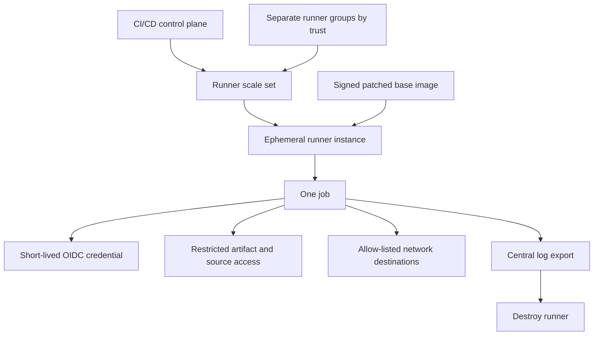
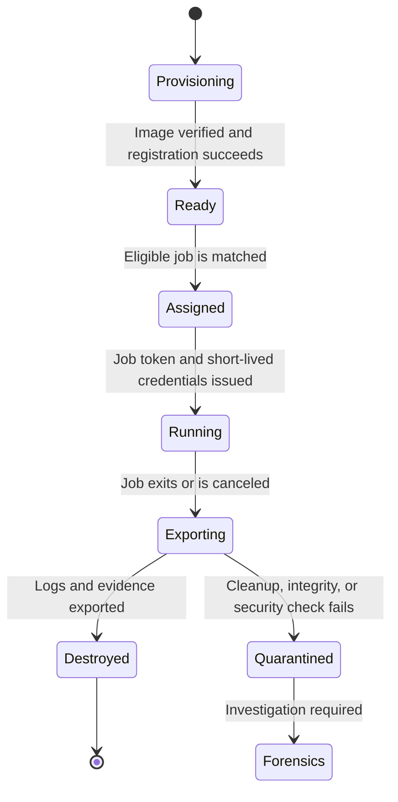

> **Document class:** CI/CD & Automation implementation guide
> **Normative terms:** **MUST**, **MUST NOT**, **SHOULD**, **SHOULD NOT**, and **MAY** are requirements levels.
> **Applicability:** Hosted, self-hosted, shared, dedicated, and hybrid CI/CD runners, including admission, isolation, cleanup, and lifecycle controls.
> **Exception process:** Deviations require a documented risk assessment, compensating controls, named risk owner, and expiry date.

| Control field | Value |
|---|---|
| Document ID | `CICD-06` |
| Owner | Cloud Center of Excellence |
| Review cycle | At least annually and after material platform, provider, security, or operating-model changes |
| Evidence | Runner admission, image provenance and patching, isolation and cleanup tests, credential handling, cache and log records, and incident evidence |

# Shared Runner Security and Hygiene

> **Decision in brief:** Treat every runner as a code-execution boundary: isolate trust levels, prefer ephemeral execution, minimize credentials, and verify cleanup.

## Overview

A CI/CD runner executes repository-controlled code with access to source, tokens, artifacts, internal networks, and deployment systems. A shared runner is therefore a remote-code-execution platform by design. Security depends on strict workload trust boundaries, ephemeral execution, minimal credentials, and verified cleanup.

The phrase "runner hygiene" is often reduced to deleting the workspace. That is insufficient. Credentials, processes, containers, caches, sockets, Git configuration, package-manager state, logs, and network sessions can persist outside the checkout directory.

## Goals and non-goals

### Goals

- Run each job in an isolated, reproducible environment.
- Prevent one repository or job from contaminating another.
- Keep untrusted pull-request code away from privileged networks and credentials.
- Destroy or sanitize all job state.
- Patch runner software and base images rapidly.
- Preserve security logs without preserving secrets.

### Non-goals

- Treating a persistent VM as clean because the workspace folder was deleted.
- Sharing production-capable runners with arbitrary repositories.
- Mounting the host Docker socket into untrusted jobs.
- Storing cloud credentials permanently on the runner.

## Threat model

Assume workflow code can attempt to:

- Read environment variables and files.
- Enumerate prior workspaces and caches.
- Access local metadata services.
- Contact internal network endpoints.
- Steal Git, package-registry, cloud, or CI tokens.
- Leave a background process or scheduled task.
- Modify the runner binary, service, shell profile, or toolchain.
- Poison caches and build outputs.
- Escape a weak container boundary.

A private repository does not eliminate this threat. Any user or automation capable of changing executable pipeline code can become the attacker.

## Reference architecture



The safest shared runner is an ephemeral runner created for one job and destroyed after logs are exported.

## Runner classes

### Hosted runners

Platform-hosted runners usually provide a fresh virtual machine or environment per job. They reduce persistence risk and operational burden. Limitations include:

- Restricted private network access.
- Preinstalled software that changes over time.
- Limited control over host-level telemetry.
- Egress from provider-owned address ranges.

Pin tool versions and verify critical dependencies even on hosted runners.

### Persistent self-hosted runners

These provide network and tooling flexibility but carry the highest contamination risk. Use only when ephemeral runners are not feasible and compensate with strong isolation and rebuild automation.

### Ephemeral self-hosted runners

Recommended for privileged workloads. Implement with VM scale sets, containers with adequate isolation, Kubernetes-based runner controllers, cloud build services, or disposable instances.

GitHub recommends ephemeral autoscaling for self-hosted runners. Azure DevOps agents can also be provisioned as disposable instances through scale-set or custom orchestration patterns.

## Trust segmentation

Create runner groups or pools by trust level:


Never route by labels that untrusted workflow authors can select freely unless platform policies also restrict access to the runner group.

Recommended boundaries:

- Public or fork pull requests: hosted runners with no secrets.
- Internal pull requests: isolated CI runners with read-only dependencies.
- Non-production deployment: environment-specific ephemeral runners.
- Production deployment: protected runner group, protected environment, short-lived identity.
- Signing: dedicated isolated runner with hardware-backed or keyless signing.

## Base image and patching

Runner images are production infrastructure. Manage them as code.

Required controls:

- Minimal OS and package set.
- Automated image build.
- Vulnerability scanning.
- Signature and provenance.
- Versioned image promotion.
- Rapid rebuild for critical runner updates.
- Automatic runner application updates or monitored pinned updates.
- Defined maximum image age.

Do not patch a long-lived runner indefinitely and assume it matches a clean image. Periodic full replacement is necessary.

## Local privilege

- Run the agent under a dedicated non-interactive account.
- Avoid passwordless `sudo`.
- Do not make the service account a local administrator unless a documented job requires it.
- Separate the orchestration identity from the job identity.
- Protect the runner service files from job modification.
- Disable interactive login where feasible.

Jobs requiring elevated operations should use a purpose-built isolated image or controlled privileged service, not blanket host administration.

## Container isolation

Containers are process isolation, not automatically a strong hostile-code boundary.

Avoid:

- Mounting `/var/run/docker.sock` into untrusted jobs.
- Privileged containers.
- Host PID, network, or filesystem namespaces.
- Reusing writable container layers between trust domains.
- Exposing Kubernetes service-account tokens unnecessarily.

For hostile or third-party code, use stronger VM or sandbox isolation. Rootless container tooling reduces some risk but does not solve every escape or kernel-sharing concern.

## Network controls

A runner often has more network access than the job requires. Apply egress and ingress controls.

Allow only:

- CI/CD control-plane endpoints.
- Source and artifact registries.
- Required cloud APIs.
- Approved package mirrors.
- Target environment endpoints.
- Central logging and monitoring.

Block or tightly control:

- Cloud instance metadata endpoints unless the design intentionally uses an instance principal.
- Administrative network ranges.
- Unrestricted east-west access.
- Arbitrary outbound internet from production deployment runners.
- Inbound connections to runners.

Use private package mirrors and artifact proxies when supply-chain and availability requirements justify them.

## Credential handling

- Prefer OIDC or environment-local identity.
- Issue credentials after the protected job starts, not at runner boot.
- Use short session durations.
- Store no long-lived cloud keys on disk.
- Clear environment variables and temporary files.
- Revoke credentials when a runner is quarantined.
- Restrict token audience and repository/workflow claims.

A credential-free runner image is a core design objective.

## Workspace cleanup

At job completion, remove:

- Source workspaces.
- Hidden files and nested repositories.
- Terraform `.terraform` directories and plans.
- Cloud CLI token caches.
- SSH keys and `known_hosts` changes.
- Package-manager credentials.
- Docker credentials and local images where persistence exists.
- Kubernetes configuration.
- Temporary directories.
- Build outputs and crash dumps.
- Shell history.

Example defensive cleanup for a disposable Linux runner:

```bash
set +e

# Stop job-owned background processes through the runner orchestrator where possible.
pkill -u "$(id -u)" -f 'job-specific-pattern' 2>/dev/null

# Remove common credential and tool state.
rm -rf "$HOME/.azure" "$HOME/.aws" "$HOME/.config/gcloud"
rm -rf "$HOME/.oci" "$HOME/.kube" "$HOME/.docker"
rm -rf "$HOME/.terraform.d" "$HOME/.cache"

# Remove Git credential material without printing values.
git config --global --unset-all credential.helper 2>/dev/null
git config --global --unset-all http.extraheader 2>/dev/null

# Remove work and temp paths supplied by the runner platform.
rm -rf "${RUNNER_TEMP:-/nonexistent}"/*
rm -rf "${AGENT_TEMPDIRECTORY:-/nonexistent}"/*

set -e
```

This is not a universal sanitation guarantee. Destruction of the runner instance is stronger and simpler to verify.

## Git and `extraheader` hygiene

CI checkout tasks can configure temporary HTTP authorization headers. Risks arise when a persistent agent retains them in repository-local or global Git configuration.

Controls:

- Disable credential persistence unless a later Git operation requires it.
- Use command-scoped headers.
- Enumerate header key names without printing values.
- Remove local, global, and system-level entries where the runner account can modify them.
- Delete `.git/config` with the workspace.
- Rebuild any runner on which an unexpected credential entry is found.

Example inspection:

```bash
git config --local --name-only --get-regexp '^http\..*\.extraheader$' || true
git config --global --name-only --get-regexp '^http\..*\.extraheader$' || true
```

## Cache security

Caches improve performance but create cross-job state.

Rules:

- Do not cache credential directories.
- Key caches with lock-file hashes and trust context.
- Prevent untrusted pull requests from writing caches consumed by protected branches.
- Treat build caches as untrusted input.
- Verify downloaded dependencies independently.
- Set retention and size limits.
- Separate production and non-production caches.

Cache poisoning can convert an otherwise clean runner into a compromised build.

## Logging and observability

Export before destruction:

- Runner registration and lifecycle events.
- Job assignment and repository identity.
- Image version.
- Network-denial events.
- Process and container audit events where feasible.
- Cloud role assumptions.
- Security-tool findings.

Do not collect secrets or full environment dumps. Central logs must be immutable enough for incident investigation.

Alert on:

- Unexpected repositories using privileged pools.
- Long-running or orphaned runners.
- Disabled runner updates.
- Unusual outbound destinations.
- Attempts to access metadata endpoints.
- Changes to runner service files.
- Repeated cleanup failures.

## Validation of runner hygiene

Test the controls; do not infer them.

1. Plant benign canary files and environment markers in a test job.
2. Run a subsequent job under a different repository or identity.
3. Verify the canaries are inaccessible.
4. Test Git configuration, cloud CLI caches, process persistence, containers, mounts, and temporary directories.
5. Confirm logs survive runner destruction.
6. Confirm the runner cannot re-register after termination.

Run these tests after image, agent, orchestrator, or cleanup changes.

## Incident response

If compromise is suspected:

- Disable the runner group or pool.
- Stop accepting new jobs.
- Preserve the affected instance and logs if forensics requires it.
- Revoke CI registration tokens and cloud sessions.
- Rotate any credential accessible to the runner.
- Review jobs executed on the instance and artifacts produced.
- Quarantine or invalidate caches.
- Rebuild from a trusted image.
- Re-run critical builds and signatures on clean infrastructure.

Do not return a potentially compromised runner to service after manual file cleanup.

## Runner lifecycle and admission control

A shared-runner service should model runner admission as a controlled lifecycle rather than a static registration:



A runner **MUST NOT** return to the ready pool when cleanup, image-integrity, registration, or telemetry export checks fail. The orchestrator should fail closed and quarantine the instance.

Admission controls should verify:

- Runner image digest and signature.
- Expected agent version and configuration.
- Trusted boot or host-attestation evidence where the platform supports it.
- Repository, organization, event type, and requested runner group.
- Network segment and target environment.
- Maximum job duration and resource allocation.
- Whether privileged build features are explicitly authorized.

## Resource-exhaustion and denial-of-service controls

Runner security includes availability and cost containment. A malicious or defective job can exhaust CPU, memory, disk, inode count, process count, container storage, network connections, or artifact bandwidth.

Define:

- Per-job CPU, memory, disk, process, and execution-time limits.
- Maximum artifact and cache sizes.
- Registry and package-download rate controls.
- Queue limits and fair scheduling between repositories.
- Automatic cancellation for superseded pull-request jobs.
- Budget alerts for scale-set or cloud-build consumption.
- A separate emergency capacity reserve for production recovery pipelines.

Production deployment runners should not be consumed by untrusted build queues. Capacity pools and quotas must follow the same trust segmentation as credentials.

## Runner evidence record

For each privileged job, retain a compact runner evidence record containing:

```text
runner_instance_id
runner_group
base_image_digest
agent_version
repository_and_revision
workflow_or_pipeline_id
job_start_and_end
issued_identity_subject
network_policy_version
cleanup_or_destruction_result
```

This record allows incident responders to determine which jobs shared a trust domain and whether the runner was destroyed successfully. It must not contain raw tokens, full environment dumps, or secret values.

## Operational checklist

- [ ] Ephemeral one-job runners are the default for privileged workloads.
- [ ] Runner groups are segmented by trust and environment.
- [ ] Fork pull requests cannot use privileged self-hosted runners.
- [ ] Base images are scanned, signed, versioned, and replaced regularly.
- [ ] Runner accounts lack unnecessary local privilege.
- [ ] Docker socket and privileged container access are restricted.
- [ ] Network egress is allow-listed.
- [ ] Credentials are short-lived and obtained at job runtime.
- [ ] Workspaces, caches, Git headers, and CLI tokens are removed.
- [ ] Cleanup is tested with canary jobs.
- [ ] Logs are exported before runner destruction.
- [ ] Quarantine and credential-revocation procedures are documented.

## Related topics

- [Pipeline Identity and Secret Handling](pipeline-identity-and-secret-handling.md)
- [Pipeline as Code Standards and Reusable Templates](pipeline-as-code-standards-and-reusable-templates.md)
- [Pipeline Troubleshooting and Recovery](pipeline-troubleshooting-and-recovery.md)
- [Container Build and Release Best Practices](container-build-and-release-best-practices.md)

## Validation

- Validate the guidance against its stated requirements, acceptance criteria, and evidence expectations before adoption.

## References

- [GitHub: Self-hosted runners reference](https://docs.github.com/en/actions/reference/runners/self-hosted-runners)
- [GitHub: Secure use reference](https://docs.github.com/en/actions/reference/security/secure-use)
- [GitHub: Actions Runner Controller](https://docs.github.com/en/actions/concepts/runners/actions-runner-controller)
- [Microsoft: Secure Azure Pipelines](https://learn.microsoft.com/en-us/azure/devops/pipelines/security/overview)
- [Microsoft: Build GitHub repositories with Azure Pipelines](https://learn.microsoft.com/en-us/azure/devops/pipelines/repos/github)
- [Microsoft: Run Git commands in Azure Pipelines](https://learn.microsoft.com/en-us/azure/devops/pipelines/scripts/git-commands)
