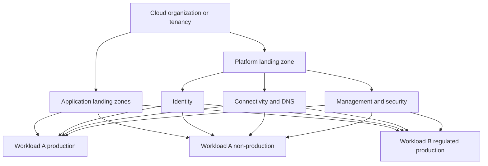
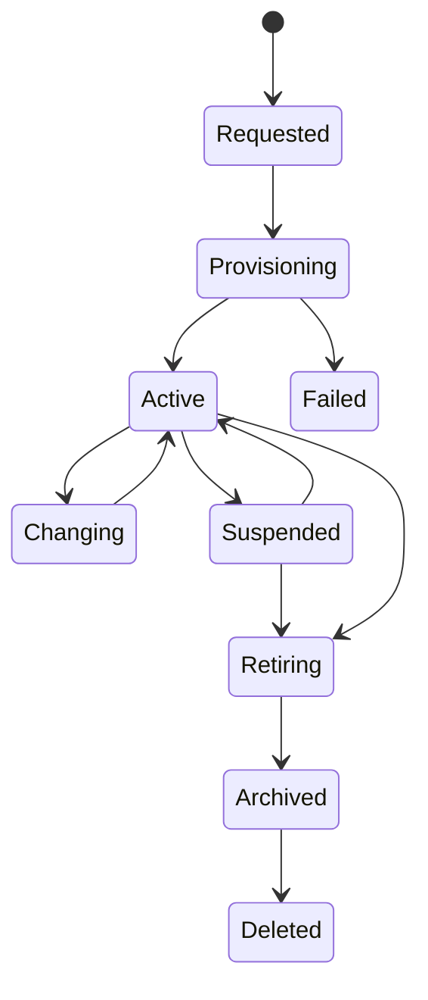

> **文档类型：** 云基础和治理实施指南
> **规范性术语：** **MUST**、**MUST NOT**、**SHOULD**、**SHOULD NOT** 和 **MAY** 是要求级别。
> **适用范围：** Application Landing Zone、环境边界、委派工作负载管理以及跨 Azure、AWS、GCP 和 OCI 的入驻。
> **例外流程：** 偏离要求需要记录风险评估、补偿控制、指定风险负责人和到期日期。

|控制领域|价值|
|---|---|
|文件编号 | `CFG-14` |
|负责人|云卓越中心 |
|审核周期|至少每年一次，并且在重大平台、提供商、数据、安全或运营模式发生变化之后 |
|证据|Landing Zone 概况、请求和发放日志、隔离和验收测试、例外情况和迁移证据 |

# Application Landing Zone 和环境细分

> **简要决定：** 为应用团队提供版本化的 Landing Zone 配置文件，具有明确的所有权、隔离的环境、受控的覆盖和基于证据的入驻。

## 目的

该标准定义了应用团队如何接收受治理的云环境。Application Landing Zone 是一个准备好的管理和安全边界，具有身份、策略、连接、遥测、成本和生命周期控制。它不仅仅是资源组、网络或命名约定。

Azure 可以作为详细的参考实现，但控制模型应用于 AWS 账户、GCP 项目和 OCI 隔间或租户。

## 所需的结果

- 每个工作负载都有一个负责任的业务所有者、技术所有者和成本所有者。
- 只要访问、策略、数据或恢复要求不同，生产就与非生产隔离。
- 平台护栏是继承的，不能被工作负载角色削弱。
- 工作负载团队获取足够的委派控制权，无需常规平台票据即可运行。
- 连接、日志、预算、身份和部署信任在工作负载使用之前准备就绪。
- Landing Zone 通过可审核的生命周期创建、更改、暂停和退役。

## 平台和应用边界

平台团队管理共享基础。工作负载团队在委托边界内管理应用资源。策略和访问必须保持这种分离。

## 提供商边界映射

|控制边界|Azure|AWS | GCP |OCI |
|---|---|---|---|---|
|组织分组|管理组|组织单位|文件夹|隔间层次结构 |
|典型应用边界|订阅 |账户 |项目或项目集 |隔间或租户|
|本地资源分组|资源组|资源标签/堆栈 |标签和服务资源|儿童隔间和标签|
|传承护栏| Azure Policy 和 RBAC | SCP 和 IAM |Organization Policy and IAM | IAM policies、quotas、security zones |
|网络附件| VNet 和中心/Virtual WAN | VPC 和传输 | VPC/共享 VPC | VCN 和 DRG |

通过隔离、配额、所有权、计费和生命周期来选择边界，而不是提供商对称性。

## 环境分割决策

当其中一项或多项存在重大差异时，请使用单独的订阅、账户、项目、隔间或租户：

- 特权管理员或部署批准者；
- 监管范围或数据分类；
- 网络可达性和暴露度；
- 加密、日志、保留或恢复策略；
- 配额、计费或财务所有权；
- 释放节奏并更改权限；
- 提供商服务限制或区域限制；
- 所需的爆炸半径。

生产通常应该与开发和测试有明显的提供商边界。如果身份、网络、数据、配额和成本隔离仍然有效，则共享的非生产边界对于低风险环境可能是可接受的。

## 标准 Landing Zone 剖面

|简介 |预期用途 |附加控制|
|---|---|---|
|沙盒|学习和简短实验|服务受限、预算低、自动过期、无生产数据 |
|标准非生产|开发、集成、测试|授权访问、受控连接、更短的保留时间 |
|标准生产|业务工作负载 | JIT 特权、受保护部署、恢复、增强监控|
|规范生产|敏感或受监管的工作负载 |更强的隔离、证据、钥匙、驻留要求和批准 |
|数据与 AI |分析和模型工作负载 |数据边界、数据血缘、模型和数据集治理 |
|检疫|调查或暂停 |拒绝部署、限制网络、证据保存 |

配置文件是版本化的产品。特定于工作负载的异常不得默默地创建新的非托管配置文件。

## 自动发放契约
```yaml
request:
  workload_id: payments-api
  environment: production
  profile: regulated-production
  cloud: Azure
  regions:
    - canadacentral
  owners:
    business: finance-platform
    technical: payments-engineering
    cost: finops-payments
  connectivity:
    - shared-services
    - approved-egress
  data_classification: confidential
  recovery_tier: tier-1
```
自动预配工作流必须验证请求数据、预留地址空间、创建提供商边界、附加层次结构和策略、分配组、配置预算和遥测、连接批准的网络、建立部署身份、记录清单并返回验收证据。

## 委托管理

工作负载团队可以管理应用资源、批准上限内的本地角色分配、工作负载告警和应用策略扩展。他们不得修改组织护栏、共享中转、中央证据路由、联合信任、紧急访问或企业成本归因。

使用基于组的访问和特定于环境的部署标识。生产变更应该需要受保护的环境、批准的制品以及高风险工作负载的作者和批准者之间的分离。

## 数据和连接规则

- 未经批准的屏蔽或合成替换，不得将生产数据复制到非生产中。
- 生产和非生产网络不得具有广泛的双向路由。
- 共享服务访问必须使用已发布的契约和消费者特定的授权。
- 公共进出需要经过批准的模式和可监控的控制。
- 私有端点必须使用集中管理的 DNS 和生命周期自动化。
- 跨环境依赖性需要记录可用性和恢复影响。

## 生命周期

退役必须撤销访问和部署信任、删除路由和私有 DNS、保留所需的证据和备份、释放许可证和预留、更新清单，并仅在清除依赖项时返回地址空间。

## 执行顺序

1. 定义工作负载分类、配置文件、隔离标准和所需的元数据。
2. 建立提供商层次结构、平台边界和继承护栏。
3. 构建身份、网络、日志、预算、策略和清单的版本化模块。
4. 实施具有批准和回滚功能的幂等预配工作流。
5、试点标准非生产型材和生产型材。
6. 测试委托、隔离、故障处理、暂停和退役。
7. 发布服务目标、支持模型和迁移指南。
8. 通过受控版本度量采用情况并改进配置文件。

## 验证

在切换之前，请证明：

- 元数据、所有者、分类、环境和成本分配完整；
- 所需的策略是继承的，工作负载管理员无法删除它；
- 员工和部署身份仅具有经批准的访问权限；
- 网络路径和 DNS 与请求契约匹配；
- 除非明确批准，否则不会公开曝光；
- 审计和安全事件到达中央遥测基础；
- 预算、配额、备份和恢复控制与所选配置文件相匹配；
- 示例部署通过批准的流水线成功；
- 暂停和退役行动在技术上是可执行的。

## 操作注意事项

平台团队负责配置文件、自动发放、继承控制和共享服务集成。治理和安全批准配置文件要求。工作负载所有者仍然对边界内的应用安全性、可用性、数据和成本负责。跟踪配置提前期、故障率、手动干预、策略漂移、无主边界、过期沙箱和退役完成情况。

## 配置文件继承和工作负载覆盖

Application Landing Zone 应继承版本化配置文件并仅应用批准的覆盖。


工作负载的扩展可能会增加更严格的控制，但绝不能削弱继承的护栏。在 Landing Zone 注册表中记录有效的配置文件和每个覆盖，以便支持团队可以重建预期的行为。

## 入驻准备情况审核

在工作负载接收生产访问权限之前，请确认：

- 应用和数据所有者接受其责任；
- 部署流水线和运行时身份是环境范围内的；
- 入口、出口、私有端点、DNS 和证书使用批准的模式；
- 存在日志、告警、仪表板、备份和恢复所有权；
- 配额和容量足以满足预期负载和故障模式；
- 依赖关系和共享服务 SLO 支持工作负载目标；
- 生产数据不能泄漏到非生产中；
- 注册操作手册和支持联系人。

这次审查应该验证准备情况证据，而不是重复 Landing Zone 架构决策。

## 跨环境依赖异常
跨环境依赖性通常是一种设计缺陷，因为测试或开发失败可能会影响生产，或者生产数据可能会超出其边界。当不可避免时，要求：

- 明确的生产者和消费者环境；
- 流动的方向和目的；
- 数据分类和屏蔽；
- 身份和授权；
- 可用性和恢复后果；
- 监控和过期；
- 迁移计划以消除依赖性。

阻止广泛的双向路由。使用狭窄的服务接口和特定于消费者的授权。

## 迁移现有环境

Application Landing Zone 产品的采用应该分阶段进行：

1. 发现所有者、资源、身份、路由、数据和有效策略。
2. 分配最接近的目标配置文件。
3. 日志记录差距、异常情况和破坏性修复措施。
4. 首先连接中央审计和所有权日志记录。
5. 应用安全身份、元数据、成本和策略控制。
6. 通过计划的变更迁移网络和部署信任。
7. 运行验收和隔离测试。
8. 标记只有在证据通过后才管理的边界。

不要强制立即进行破坏性的正常化。受控的迁移积压比不准确的合规声明更安全。

## 相关主题

- [将 Azure 落地工作区设计为产品](designing-an-azure-landing-zone-as-a-product.md)
- [订阅与账户发放](subscription-and-account-vending.md)
- [管理组、账户与组织结构](management-groups-accounts-and-organizational-structure.md)
- [共享平台服务架构](shared-platform-services-architecture.md)

## 参考文档

- [Azure 落地工作区](https://learn.microsoft.com/en-us/azure/cloud-adoption-framework/ready/landing-zone/)
- [AWS 云基础能力](https://docs.aws.amazon.com/whitepapers/latest/establishing-your-cloud-foundation-on-aws/capabilities.html)
- [Google Cloud Landing Zone 设计](https://docs.cloud.google.com/architecture/landing-zones)
- [OCI Landing Zone 概览](https://docs.oracle.com/en-us/iaas/Content/cloud-adoption-framework/oci-landing-zones-overview.htm)

## 相关仓库

- [andyxuan2010/azure-landingzone](https://github.com/andyxuan2010/azure-landingzone) — 实现受管理的 Azure 平台和可重复的 Landing Zone 基础。
- [andyxuan2010/aws-landingzone](https://github.com/andyxuan2010/aws-landingzone) — 实现可重复的 AWS 多账户 Landing Zone 基础。
- [andyxuan2010/oci-landingzone](https://github.com/andyxuan2010/oci-landingzone) — 提供具有特定于环境的配置和共享基础设施的 OCI Landing Zone。
- [andyxuan2010/azure-template](https://github.com/andyxuan2010/azure-template) — 为 Application Landing Zone 消费者提供可复用的 Terraform 和流水线模式。
