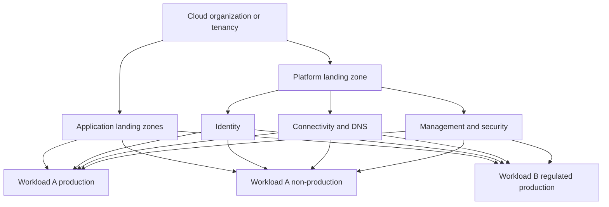
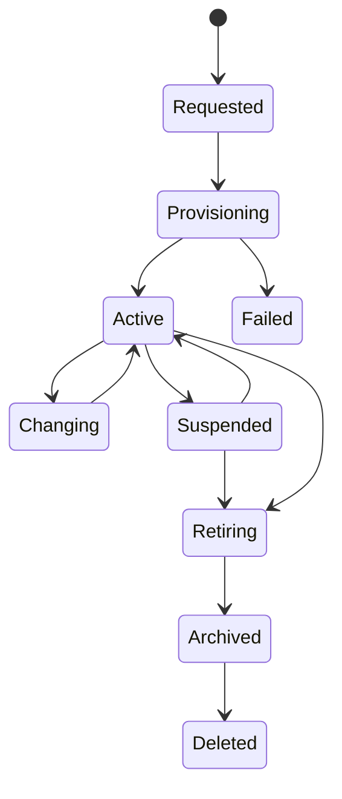
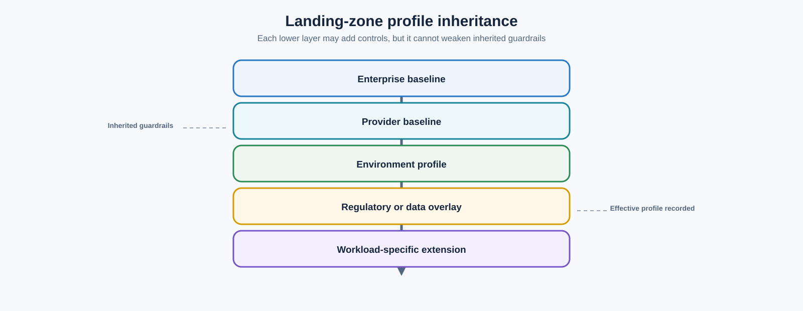

> **Document class:** Cloud Foundations & Governance implementation guide
> **Normative terms:** **MUST**, **MUST NOT**, **SHOULD**, **SHOULD NOT**, and **MAY** are requirements levels.
> **Applicability:** Application landing zones, environment boundaries, delegated workload administration, and onboarding across Azure, AWS, GCP, and OCI.
> **Exception process:** Deviations require a documented risk assessment, compensating controls, named risk owner, and expiry date.

| Control field | Value |
|---|---|
| Document ID | `CFG-14` |
| Owner | Cloud Center of Excellence |
| Review cycle | At least annually and after material platform, provider, data, security, or operating-model changes |
| Evidence | Landing-zone profile, request and vending record, isolation and acceptance tests, exceptions, and migration evidence |

# Application Landing Zones and Environment Segmentation

> **Decision in brief:** Provide application teams versioned landing-zone profiles with clear ownership, isolated environments, controlled overlays, and evidence-based onboarding.

## Purpose

This standard defines how application teams receive governed cloud environments. An application landing zone is a prepared administrative and security boundary with identity, policy, connectivity, telemetry, cost, and lifecycle controls. It is not merely a resource group, network, or naming convention.

Azure can serve as the detailed reference implementation, but the control model applies to AWS accounts, GCP projects, and OCI compartments or tenancies.

## Required outcomes

- Every workload has an accountable business owner, technical owner, and cost owner.
- Production is isolated from non-production wherever access, policy, data, or recovery requirements differ.
- Platform guardrails are inherited and cannot be weakened by workload roles.
- Workload teams receive enough delegated control to operate without routine platform tickets.
- Connectivity, logging, budgets, identity, and deployment trust are ready before workload use.
- Landing zones are created, changed, suspended, and retired through an auditable lifecycle.

## Platform and application boundary



Platform teams manage shared foundations. Workload teams manage application resources inside delegated boundaries. Policy and access must preserve this separation.

## Provider boundary mapping

| Control boundary | Azure | AWS | GCP | OCI |
|---|---|---|---|---|
| Organization grouping | Management group | Organizational unit | Folder | Compartment hierarchy |
| Typical application boundary | Subscription | Account | Project or project set | Compartment or tenancy |
| Local resource grouping | Resource group | Resource tags/stacks | Labels and service resources | Child compartments and tags |
| Inherited guardrails | Azure Policy and RBAC | SCPs and IAM | Organization Policy and IAM | IAM policies, quotas, security zones |
| Network attachment | VNet and hub/Virtual WAN | VPC and transit | VPC/Shared VPC | VCN and DRG |

Choose boundaries by isolation, quotas, ownership, billing, and lifecycle—not provider symmetry.

## Environment segmentation decision

Use a separate subscription, account, project, compartment, or tenancy when one or more of these materially differ:

- privileged administrators or deployment approvers;
- regulatory scope or data classification;
- network reachability and exposure;
- encryption, logging, retention, or recovery policy;
- quota, billing, or financial ownership;
- release cadence and change authority;
- provider service limits or regional constraints;
- required blast radius.

Production should normally have a distinct provider boundary from development and test. A shared non-production boundary may be acceptable for low-risk environments if identity, network, data, quota, and cost isolation are still effective.

## Standard landing-zone profiles

| Profile | Intended use | Additional controls |
|---|---|---|
| Sandbox | Learning and short experiments | Restricted services, low budget, automatic expiry, no production data |
| Standard non-production | Development, integration, test | Delegated access, controlled connectivity, shorter retention |
| Standard production | Business workloads | JIT privilege, protected deployment, recovery, enhanced monitoring |
| Regulated production | Sensitive or regulated workloads | Stronger isolation, evidence, keys, residency, and approval |
| Data and AI | Analytics and model workloads | Data perimeter, lineage, model and dataset governance |
| Quarantine | Investigation or suspension | Denied deployment, restricted network, evidence preservation |

Profiles are versioned products. Workload-specific exceptions must not silently create new unmanaged profiles.

## Vending contract

```yaml
request:
  workload_id: payments-api
  environment: production
  profile: regulated-production
  cloud: Azure
  regions:
    - canadacentral
  owners:
    business: finance-platform
    technical: payments-engineering
    cost: finops-payments
  connectivity:
    - shared-services
    - approved-egress
  data_classification: confidential
  recovery_tier: tier-1
```

The vending workflow must validate request data, reserve address space, create the provider boundary, attach hierarchy and policy, assign groups, configure budget and telemetry, connect approved networks, establish deployment identity, record inventory, and return acceptance evidence.

## Delegated administration

Workload teams may manage application resources, local role assignments within an approved ceiling, workload alerts, and application policy extensions. They must not modify organization guardrails, shared transit, central evidence routing, federation trust, emergency access, or enterprise cost attribution.

Use group-based access and environment-specific deployment identities. Production changes should require protected environments, approved artifacts, and separation between author and approver for high-risk workloads.

## Data and connectivity rules

- Production data must not be copied into non-production without approved masking or synthetic replacement.
- Production and non-production networks must not have broad bidirectional routing.
- Shared service access must use published contracts and consumer-specific authorization.
- Public ingress and egress require approved patterns and observable controls.
- Private endpoints must use centrally governed DNS and lifecycle automation.
- Cross-environment dependencies require documented availability and recovery impact.

## Lifecycle



Retirement must revoke access and deployment trust, remove routes and private DNS, preserve required evidence and backups, release licenses and reservations, update inventory, and return address space only when dependencies are cleared.

## Implementation sequence

1. Define workload taxonomy, profiles, isolation criteria, and required metadata.
2. Establish provider hierarchy, platform boundaries, and inherited guardrails.
3. Build versioned modules for identity, network, logging, budget, policy, and inventory.
4. Implement an idempotent vending workflow with approval and rollback.
5. Pilot standard non-production and production profiles.
6. Test delegation, isolation, failure handling, suspension, and retirement.
7. Publish service objectives, support model, and migration guidance.
8. Measure adoption and evolve profiles through controlled versions.

## Validation

Before handoff, prove that:

- metadata, owners, classification, environment, and cost allocation are complete;
- required policy is inherited and workload administrators cannot remove it;
- workforce and deployment identities have only approved access;
- network paths and DNS match the request contract;
- public exposure is absent unless explicitly approved;
- audit and security events reach the central telemetry foundation;
- budget, quota, backup, and recovery controls match the selected profile;
- a sample deployment succeeds through the approved pipeline;
- suspension and retirement actions are technically executable.

## Operational considerations

The platform team owns profiles, vending, inherited controls, and shared-service integration. Governance and security approve profile requirements. Workload owners remain accountable for application security, availability, data, and cost within the boundary. Track provisioning lead time, failure rate, manual intervention, policy drift, unowned boundaries, expired sandboxes, and retirement completion.

## Profile inheritance and workload overlays

Application landing zones should inherit a versioned profile and apply only approved overlays.



The workload extension may add stricter controls, but it must not weaken inherited guardrails. Record the effective profile and every overlay in the landing-zone registry so support teams can reconstruct intended behavior.

## Onboarding readiness review

Before a workload receives production access, confirm:

- application and data owners accept their responsibilities;
- deployment pipeline and runtime identities are environment-scoped;
- ingress, egress, private endpoints, DNS, and certificates use approved patterns;
- logs, alerts, dashboards, backup, and recovery ownership exist;
- quota and capacity are sufficient for expected load and failure modes;
- dependencies and shared-service SLOs support the workload objective;
- production data cannot leak into non-production;
- runbooks and support contacts are registered.

This review should validate readiness evidence rather than repeat the landing-zone architecture decision.

## Cross-environment dependency exceptions

Cross-environment dependencies are usually a design defect because test or development failure can affect production, or production data can escape its boundary. When unavoidable, require:

- explicit producer and consumer environments;
- direction and purpose of the flow;
- data classification and masking;
- identity and authorization;
- availability and recovery consequence;
- monitoring and expiration;
- migration plan to remove the dependency.

Block broad bidirectional routing. Use narrow service interfaces and consumer-specific authorization.

## Migrating existing environments

Adoption into an application landing-zone product should proceed in waves:

1. Discover owners, resources, identities, routes, data, and effective policy.
2. Assign the closest target profile.
3. Record gaps, exceptions, and disruptive remediation.
4. Connect central audit and ownership records first.
5. Apply safe identity, metadata, cost, and policy controls.
6. Migrate network and deployment trust through planned changes.
7. Run acceptance and isolation tests.
8. Mark the boundary managed only after evidence passes.

Do not force immediate destructive normalization. A controlled migration backlog is safer than an inaccurate claim of compliance.

## Related topics

- [Designing an Azure Landing Zone as a Product](designing-an-azure-landing-zone-as-a-product.md)
- [Subscription and Account Vending](subscription-and-account-vending.md)
- [Management Groups, Accounts, and Organizational Structure](management-groups-accounts-and-organizational-structure.md)
- [Shared Platform Services Architecture](shared-platform-services-architecture.md)

## References

- [Azure landing zones](https://learn.microsoft.com/en-us/azure/cloud-adoption-framework/ready/landing-zone/)
- [AWS cloud foundation capabilities](https://docs.aws.amazon.com/whitepapers/latest/establishing-your-cloud-foundation-on-aws/capabilities.html)
- [Google Cloud landing zone design](https://docs.cloud.google.com/architecture/landing-zones)
- [OCI landing zones overview](https://docs.oracle.com/en-us/iaas/Content/cloud-adoption-framework/oci-landing-zones-overview.htm)

## Related repos

- [andyxuan2010/azure-landingzone](https://github.com/andyxuan2010/azure-landingzone) — implements a governed Azure platform and repeatable landing-zone foundation.
- [andyxuan2010/aws-landingzone](https://github.com/andyxuan2010/aws-landingzone) — implements a repeatable AWS multi-account landing-zone foundation.
- [andyxuan2010/oci-landingzone](https://github.com/andyxuan2010/oci-landingzone) — provisions an OCI landing zone with environment-specific configurations and shared infrastructure.
- [andyxuan2010/azure-template](https://github.com/andyxuan2010/azure-template) — provides reusable Terraform and pipeline patterns for application landing-zone consumers.
