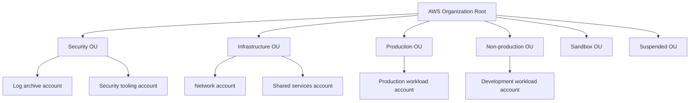
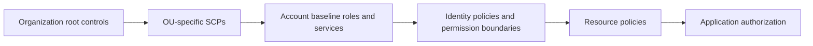
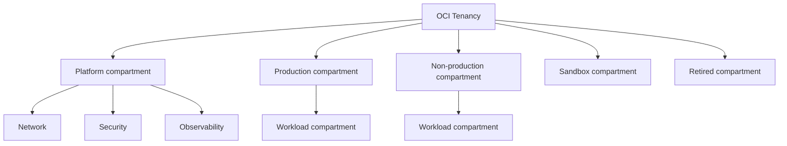

> **文档类型：** 云基础与治理架构参考模型
> **规范性术语：** **MUST**、**MUST NOT**、**SHOULD**、**SHOULD NOT** 和 **MAY** 是要求级别。
> **适用范围：** AWS Organizations 和 OCI 租户或隔间 Landing Zone 设计、治理、运营和恢复。
> **例外流程：** 偏离要求需要记录风险评估、补偿控制、指定风险负责人和到期日期。

|控制领域|价值|
|---|---|
|文件编号 | `CFG-03` |
|负责人|云卓越中心 |
|审核周期|至少每年一次，并且在重大平台、提供商、数据、安全或运营模式发生变化之后 |
|证据| AWS Organizations 和 OCI 层次结构、身份、策略、日志、网络和自动发放证据 |

# AWS 和 OCI Landing Zone 模式

> **决策简述：** 使用提供商原生的 AWS 和 OCI 层次结构，同时在身份、隔离、日志、网络、策略、成本和生命周期方面实施相同的企业结果。

## 目的

AWS 和 Oracle Cloud Infrastructure 使用不同的组织和身份模型，但应用相同的 Landing Zone 控制目标：职责分离、账户隔离、集中审计、安全身份联合、网络分段、策略执行、成本所有权和自动化生命周期管理。

本文定义了提供商原生模式，而不是将 Azure 术语强加到 AWS 或 OCI 上。

## 文档约定

本文一致使用以下术语：

- **平台团队**：构建和运营共享云能力的团队。
- **工作负载团队**：使用平台的应用、数据、产品或业务团队。
- **Landing Zone**：为工作负载准备的受管云环境。
- **护栏**：通过策略和自动化一致应用的预防性、检测性或纠正性控制。
- **自动发放**：订阅、账户、项目、隔间及其基线配置的自动创建和生命周期管理。

提供商示例是说明性的。控制目标具有权威性；特定于提供商的实现是可替换的。

## AWS Landing Zone 模式

### 组织层次结构

将 AWS Organizations 与符合策略和生命周期边界的组织单位结合使用。一个常见的结构是：

组织管理账户应包含最少的工作负载。尽可能将支持的服务委托给专门构建的管理账户。

### 核心 AWS 控制

- **人工访问**：通过 IAM Identity Center 或企业身份提供商进行联合。
- **工作负载身份**：使用 IAM 角色和短期凭证；避免访问键。
- **预防性控制**：使用服务控制策略来定义最大权限。
- **配置保证**：根据需要使用 AWS Config、Security Hub 和组织范围的服务集成。
- **审核**：将 CloudTrail、Config 和安全结果集中在专用账户和受保护的存储中。
- **网络**：在合理的情况下使用 Transit Gateway、集中式 DNS、受控出口和共享入口模式。
- **自动发放**：使用 Account Factory、Control Tower 自定义或具有组织 API 和 IaC 的企业流水线。

### AWS 策略分层

SCP 不授予权限。它们限制成员账户中主体可用的最大权限。工作负载访问仍然需要身份或资源策略。

## OCI Landing Zone 模式

### 租户和隔间模型

OCI 隔间是租户内的分层资源容器和策略范围。它们并不等同于 AWS 账户或 Azure 订阅，因为计费、身份和一些租户级服务仍然是共享的。

对于强烈的隔离要求，请使用单独的租户，而不是过深的隔间树。租户分离可能因独立计费、法律边界、主权运营、合并分离或实质上不同的身份管理而合理。

### 核心 OCI 控制

- **人工访问**：使用 IAM identity domains 以及与企业身份提供商的联合。
- **工作负载身份**：使用实例主体、资源主体和动态组。
- **授权**：使用最小权限在租户或隔间范围内定义策略。
- **预防性和检测性控制**：使用 Security Zones、Cloud Guard、漏洞扫描和策略控制。
- **审核**：将 OCI Audit 事件和服务日志收集到集中日志记录和 SIEM 集成中。
- **网络**：使用 Dynamic Routing Gateway、中心辐射式虚拟云网络、网络防火墙、服务网关、私有 DNS 和受控出口。
- **自动发放**：自动化隔间、组、动态组、策略、配额、预算、日志记录和网络配置文件配置。

### OCI 策略模型

OCI 策略声明使用主语、动词、资源类型和位置。使用策略即代码维护策略，并避免广泛的租户范围声明，例如不受限制的 `manage all-resources`（严格控制的紧急角色除外）。

## AWS 和 OCI 比较

|能力|AWS |OCI |设计寓意 |
|---|---|---|---|
|主要隔离单元 |账户 |隔间或租户| OCI 隔间隔离通常弱于独立租户隔离 |
|组织架构|组织和 OU |嵌套隔间|两者都支持继承策略，但身份和计费边界不同 |
|人类联邦| IAM Identity Center/federation | IAM identity domains/federation |集中加入者、移动者、离开者流程 |
|工作负载身份| IAM 角色 |实例/资源主体和动态组 |更喜欢短暂的平台原生身份 |
|预防控制| SCP 和选定的控制服务 |Security Zones、配额、策略 |定义共同目标，本地实施 |
|中央网络 | Transit Gateway 和网络账户 | DRG 和网络隔间 |将共享网络所有权与工作负载分开 |
|中央审计| CloudTrail 和 Config 聚合 |审计和日志记录|保护日志免受工作负载管理员的侵害 |
|自动发放 |Account Factory或自定义自动化|隔间/租户自动化 |使用具有特定于提供商的执行的通用请求契约 |

## 提供商中立的 Landing Zone 功能

标准化的 Enterprise Landing Zone 服务应该公开这些功能，无论提供商如何：

1. 组织布局和生命周期状态。
2. 人员和工作负载身份集成。
3. 策略和合规基线。
4. 成本中心、预算和所有权元数据。
5.审计和安全遥测导出。
6. 网络配置文件和 DNS 集成。
7. 备份、恢复和弹性分类。
8. 资产盘点和配置登记。
9. 退役和证据保留。

## AWS 实施顺序
1. 建立组织所有权和受保护的管理账户程序。
2. 为安全、基础设施、工作负载、沙箱和暂停账户创建 OU。
3. 启用组织范围内的审计和安全服务。
4. 配置身份联合和权限集生命周期。
5. 在审计安全阶段部署基线 SCP。
6. 建立网络和共享服务账户。
7. 实施账户发放和配置后测试。
8. 定义账户关闭、隔离和日志保留工作流程。

## OCI 实现顺序

1. 建立租户管理和紧急通道。
2. 定义隔间和租户分离标准。
3. 配置身份域、联合、组和动态组。
4. 为网络、安全性和可观测性创建平台分区。
5. 部署 DRG、DNS、防火墙和服务网关模式。
6. 启用集中审核、日志、Cloud Guard 和扫描服务。
7. 通过策略、配额、标签和预算实施隔间或租户发放。
8. 测试舱移动、策略继承、退役和证据保留。

## 控制到 Azure 和 GCP 的映射

|目标|AWS |OCI |Azure| GCP |
|---|---|---|---|---|
|组织分组|组织单位 |隔间|管理组 |文件夹|
|工作负载边界|账户 |隔间或租户|订阅 |项目|
|预防策略| SCP |Security Zones/策略/配额 | Azure Policy |Organization Policy|
|中央审计|CloudTrail|Audit|Activity Log | Cloud Audit Logs|
|中转网络|Transit Gateway| DRG |Virtual WAN/中心 |Network Connectivity Center|
|工作负载身份| IAM 角色 |资源/实例主体 |托管身份|服务账户和 WIF |

## 反模式

- 将工作负载放入 AWS 管理账户中。
- 将 AWS SCP 视为身份权限授予。
- 对所有环境和团队使用一个 OCI 隔间。
- 向普通工作负载管理员分配广泛的 OCI 租户策略。
- 允许工作负载管理员修改或删除中央审计日志。
- 将账户或隔间创建作为手动服务台流程。
- 在 CI/CD 中重复使用长期存在的云访问密钥。
- 假设提供商概念在结构上是等效的，因为名称看起来相似。

## 验证

- [ ] AWS 管理账户工作负载最小化。
- [ ] AWS OU 对应于控制或生命周期差异。
- [ ] OCI 隔间深度仍然是可以理解和可执行的。
- [ ] 当隔间隔离不足时，使用单独的 OCI 租户。
- [ ] 人员访问是联合的，工作负载访问是短暂的。
- [ ] 中央审计存储不受工作负载管理员的影响。
- [ ] 网络中转和 DNS 所有权是明确的。
- [ ] 自动发放自动应用策略、成本、安全性和可观测性基线。
- [ ] 测试账户、隔间和租户退休程序。

## AWS Control Tower 和自定义平台边界
AWS Control Tower 可以提供 Landing Zone 编排、控制、账户注册和 Account Factory 功能。它并不能消除定义企业特定 SCP、权限边界、网络模式、证据保留、账户元数据或生命周期流程的需要。

慎重选择：

|方法|适当的时候 |主要义务|
|---|---|---|
|以 Control Tower 为中心 |标准 AWS Organizations 模型适合企业 |管理 Landing Zone 更新、注册账户漂移和自定义 |
|AWS Organizations + 自定义自动化|现有的结构或控制模型无法安全地适应Control Tower |负责每一个基线、生命周期和兼容性功能 |
|混合动力| Control Tower 负责核心 Landing Zone 功能，企业自动化增加了产品配置文件 |防止重复控制器和冲突配置 |

必须检测在批准的发放路径之外创建的账户。仅在 OU 中注册并不能证明账户基线、控制或自定义是健康的。

## OCI 隔间与租户决策

当隔间无法安全地实现以下一项或多项要求时，请使用单独的 OCI 租户：

- 独立的身份管理或联合；
- 法律、合同、主权或合并分离；
- 独立的计费和商业所有权；
- 实质上更强的爆炸半径隔离；
- 不兼容的根级策略、归属区域或安全服务所有权；
- 独立的紧急访问和审计管理。

隔间仍然适合一个受管租户内的大多数工作负载和平台分离。保持策略范围狭窄，并避免使用深间隔嵌套来替代显式租户设计。

## 漂移和生命周期协调

维护每个 AWS 账户和 OCI 隔间或租户的所需状态日志记录。协调应验证：

- 组织布局和生命周期状态；
- 基线角色、组、动态组和策略；
- 审计和安全服务注册；
- 网络和 DNS 附件；
- 预算、配额、标签和所有者；
- 批准的区域和服务准入；
- Landing Zone 或基线版本。

提供商管理的基线和企业 IaC 必须明确所有权。尝试管理相同资源或策略的两个系统将导致反复出现的偏差和不安全的回滚行为。

## 提供商特定的故障模式

AWS 和 OCI 恢复计划应明确涵盖：

- 没有组织或租户管理；
- 账户/隔间配置陈旧或失败；
- 委派管理员服务失败；
- 审计路由中断；
- SCP、Security Zones、配额或 IAM 策略阻止紧急工作；
- 网络中转或 DNS 故障；
- Landing Zone 更新或模块推出失败；
- 失去对工作负载边界的访问。

恢复访问不能完全依赖于正在恢复的组件。在生产事故发生前测试应急管理和证据收集。

## 相关主题

- [多云架构与治理](multi-cloud-architecture-and-governance.md)
- [管理组、账户与组织结构](management-groups-accounts-and-organizational-structure.md)
- [订阅与账户发放](subscription-and-account-vending.md)
- [策略、护栏和合规性](policy-guardrails-and-compliance.md)
