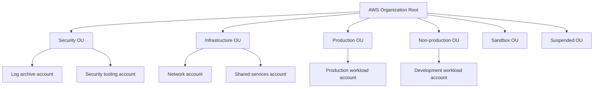
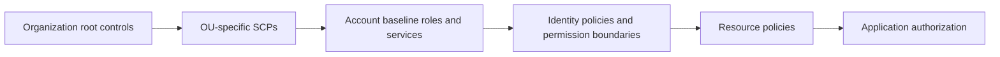
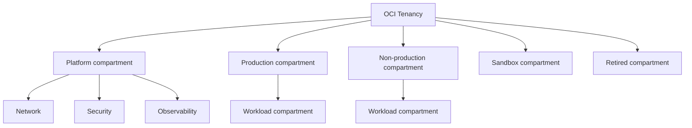

> **Document class:** Cloud Foundations & Governance architecture reference model
> **Normative terms:** **MUST**, **MUST NOT**, **SHOULD**, **SHOULD NOT**, and **MAY** are requirements levels.
> **Applicability:** AWS Organizations and OCI tenancy or compartment landing-zone design, governance, operations, and recovery.
> **Exception process:** Deviations require a documented risk assessment, compensating controls, named risk owner, and expiry date.

| Control field | Value |
|---|---|
| Document ID | `CFG-03` |
| Owner | Cloud Center of Excellence |
| Review cycle | At least annually and after material platform, provider, data, security, or operating-model changes |
| Evidence | AWS Organizations and OCI hierarchy, identity, policy, logging, network, and vending evidence |

# AWS and OCI Landing Zone Patterns

> **Decision in brief:** Use provider-native AWS and OCI hierarchies while enforcing the same enterprise outcomes for identity, isolation, logging, networking, policy, cost, and lifecycle.

## Purpose

AWS and Oracle Cloud Infrastructure use different organizational and identity models, but the same landing-zone control objectives apply: separation of duties, account isolation, centralized audit, secure identity federation, network segmentation, policy enforcement, cost ownership, and automated lifecycle management.

This article defines provider-native patterns rather than forcing Azure terminology onto AWS or OCI.

## Document conventions

This article uses the following terms consistently:

- **Platform team**: the team that builds and operates shared cloud capabilities.
- **Workload team**: an application, data, product, or business team consuming the platform.
- **Landing zone**: a governed cloud environment prepared for workloads.
- **Guardrail**: a preventive, detective, or corrective control applied consistently through policy and automation.
- **Vending**: the automated creation and lifecycle management of subscriptions, accounts, projects, compartments, and their baseline configuration.

Provider examples are illustrative. The control objective is authoritative; the provider-specific implementation is replaceable.

## AWS landing-zone pattern

### Organizational hierarchy

Use AWS Organizations with organizational units aligned to policy and lifecycle boundaries. A common structure is:

The organization management account should contain minimal workloads. Delegate supported services to purpose-built administration accounts where possible.

### Core AWS controls

- **Human access**: federate through IAM Identity Center or an enterprise identity provider.
- **Workload identity**: use IAM roles and short-lived credentials; avoid access keys.
- **Preventive controls**: use service control policies to define maximum permissions.
- **Configuration assurance**: use AWS Config, Security Hub, and organization-wide service integration as required.
- **Audit**: centralize CloudTrail, Config, and security findings in dedicated accounts and protected storage.
- **Network**: use Transit Gateway, centralized DNS, controlled egress, and shared ingress patterns where justified.
- **Vending**: use Account Factory, Control Tower customization, or an enterprise pipeline with Organizations APIs and IaC.

### AWS policy layering

SCPs do not grant permissions. They restrict the maximum permissions available to principals in member accounts. Workload access still requires identity or resource policies.

## OCI landing-zone pattern

### Tenancy and compartment model

OCI compartments are hierarchical resource containers and policy scopes within a tenancy. They are not equivalent to AWS accounts or Azure subscriptions because billing, identity, and some tenancy-level services remain shared.

For strong isolation requirements, use separate tenancies rather than excessively deep compartment trees. Tenancy separation may be justified for independent billing, legal boundaries, sovereign operations, merger separation, or materially different identity administration.

### Core OCI controls

- **Human access**: use IAM identity domains and federation with the enterprise identity provider.
- **Workload identity**: use instance principals, resource principals, and dynamic groups.
- **Authorization**: define policies at tenancy or compartment scope using least privilege.
- **Preventive and detective controls**: use Security Zones, Cloud Guard, Vulnerability Scanning, and policy controls.
- **Audit**: collect OCI Audit events and service logs into centralized logging and SIEM integrations.
- **Network**: use Dynamic Routing Gateway, hub-and-spoke virtual cloud networks, network firewalls, service gateways, private DNS, and controlled egress.
- **Vending**: automate compartment, group, dynamic-group, policy, quota, budget, logging, and network-profile configuration.

### OCI policy model

OCI policy statements use subjects, verbs, resource types, and locations. Maintain policies through code and avoid broad tenancy-wide statements such as unrestricted `manage all-resources` except for tightly controlled emergency roles.

## AWS and OCI comparison

| Capability | AWS | OCI | Design implication |
|---|---|---|---|
| Primary isolation unit | Account | Compartment or tenancy | OCI compartment isolation is generally weaker than separate-tenancy isolation |
| Organizational hierarchy | Organizations and OUs | Nested compartments | Both support inherited policy, but identities and billing boundaries differ |
| Human federation | IAM Identity Center / federation | IAM identity domains / federation | Centralize joiner, mover, leaver processes |
| Workload identity | IAM roles | Instance/resource principals and dynamic groups | Prefer short-lived platform-native identity |
| Preventive controls | SCPs and selected control services | Security Zones, quotas, policies | Define common objectives, implement natively |
| Central networking | Transit Gateway and network accounts | DRG and network compartments | Separate shared network ownership from workloads |
| Central audit | CloudTrail and Config aggregation | Audit and Logging | Protect logs from workload administrators |
| Vending | Account Factory or custom automation | Compartment/tenancy automation | Use a common request contract with provider-specific execution |

## Provider-neutral landing-zone capabilities

A standardized enterprise landing-zone service should expose these capabilities regardless of provider:

1. Organizational placement and lifecycle state.
2. Human and workload identity integration.
3. Policy and compliance baseline.
4. Cost center, budget, and ownership metadata.
5. Audit and security telemetry export.
6. Network profile and DNS integration.
7. Backup, recovery, and resilience classification.
8. Asset inventory and configuration registration.
9. Decommissioning and evidence retention.

## AWS implementation sequence

1. Establish organization ownership and protected management-account procedures.
2. Create OUs for security, infrastructure, workloads, sandboxes, and suspended accounts.
3. Enable organization-wide audit and security services.
4. Configure identity federation and permission-set lifecycle.
5. Deploy baseline SCPs in audit-safe stages.
6. Build network and shared-services accounts.
7. Implement account vending and post-provisioning tests.
8. Define account closure, quarantine, and log-retention workflows.

## OCI implementation sequence

1. Establish tenancy administration and emergency access.
2. Define compartment and tenancy-separation criteria.
3. Configure identity domains, federation, groups, and dynamic groups.
4. Create platform compartments for network, security, and observability.
5. Deploy DRG, DNS, firewall, and service-gateway patterns.
6. Enable centralized Audit, Logging, Cloud Guard, and scanning services.
7. Implement compartment or tenancy vending with policies, quotas, tags, and budgets.
8. Test compartment moves, policy inheritance, decommissioning, and evidence retention.

## Control mapping to Azure and GCP

| Objective | AWS | OCI | Azure | GCP |
|---|---|---|---|---|
| Organizational grouping | OUs | Compartments | Management groups | Folders |
| Workload boundary | Account | Compartment or tenancy | Subscription | Project |
| Preventive policy | SCP | Security Zone/policy/quota | Azure Policy | Organization Policy |
| Central audit | CloudTrail | Audit | Activity Log | Cloud Audit Logs |
| Transit networking | Transit Gateway | DRG | Virtual WAN/hub | Network Connectivity Center |
| Workload identity | IAM role | Resource/instance principal | Managed identity | Service account and WIF |

## Anti-patterns

- Placing workloads in the AWS management account.
- Treating an AWS SCP as an identity permission grant.
- Using one OCI compartment for all environments and teams.
- Assigning broad OCI tenancy policies to ordinary workload administrators.
- Allowing workload administrators to modify or delete central audit logs.
- Building account or compartment creation as a manual service desk process.
- Reusing long-lived cloud access keys in CI/CD.
- Assuming provider concepts are structurally equivalent because names appear similar.

## Validation

- [ ] AWS management-account workloads are minimized.
- [ ] AWS OUs correspond to control or lifecycle differences.
- [ ] OCI compartment depth remains understandable and enforceable.
- [ ] Separate OCI tenancies are used where compartment isolation is insufficient.
- [ ] Human access is federated and workload access is short-lived.
- [ ] Central audit stores are protected from workload administrators.
- [ ] Network transit and DNS ownership are explicit.
- [ ] Vending applies policy, cost, security, and observability baselines automatically.
- [ ] Account, compartment, and tenancy retirement procedures are tested.

## AWS Control Tower and custom-platform boundary

AWS Control Tower can provide landing-zone orchestration, controls, account enrollment, and Account Factory capabilities. It does not eliminate the need to define enterprise-specific SCPs, permission boundaries, network patterns, evidence retention, account metadata, or lifecycle processes.

Choose deliberately:

| Approach | Appropriate when | Main obligation |
|---|---|---|
| Control Tower centered | Standard AWS Organizations model fits the enterprise | Govern landing-zone updates, enrolled-account drift, and customizations |
| Organizations plus custom automation | Existing structure or control model cannot fit Control Tower safely | Own every baseline, lifecycle, and compatibility function |
| Hybrid | Control Tower owns core landing-zone capabilities and enterprise automation adds product profiles | Prevent duplicate controllers and conflicting configuration |

Accounts created outside the approved vending path must be detected. Registration in an OU alone does not prove that account baselines, controls, or customizations are healthy.

## OCI compartment-versus-tenancy decision

Use a separate OCI tenancy when one or more of these requirements cannot be safely implemented with compartments:

- independent identity administration or federation;
- legal, contractual, sovereign, or merger separation;
- independent billing and commercial ownership;
- materially stronger blast-radius isolation;
- incompatible root-level policy, home-region, or security-service ownership;
- separate emergency-access and audit administration.

Compartments remain suitable for most workload and platform separation inside one governed tenancy. Keep policies narrow and avoid using deep compartment nesting as a substitute for explicit tenancy design.

## Drift and lifecycle reconciliation

Maintain a desired-state record for every AWS account and OCI compartment or tenancy. Reconciliation should verify:

- organizational placement and lifecycle state;
- baseline roles, groups, dynamic groups, and policies;
- audit and security-service enrollment;
- network and DNS attachment;
- budgets, quotas, tags, and owners;
- approved regions and service access;
- landing-zone or baseline version.

Provider-managed baselines and enterprise IaC must have clear ownership. Two systems attempting to manage the same resource or policy will create recurrent drift and unsafe rollback behavior.

## Provider-specific failure modes

AWS and OCI recovery plans should explicitly cover:

- unavailable organization or tenancy administration;
- stale or failed account/compartment provisioning;
- delegated-administrator service failure;
- audit routing interruption;
- SCP, Security Zone, quota, or IAM policy blocking emergency work;
- network transit or DNS failure;
- landing-zone update or module rollout failure;
- loss of access to a workload boundary.

Recovery access must not depend exclusively on the component being recovered. Test emergency administration and evidence collection before a production incident.

## Related topics

- [Multi-Cloud Architecture and Governance](multi-cloud-architecture-and-governance.md)
- [Management Groups, Accounts, and Organizational Structure](management-groups-accounts-and-organizational-structure.md)
- [Subscription and Account Vending](subscription-and-account-vending.md)
- [Policy, Guardrails, and Compliance](policy-guardrails-and-compliance.md)
