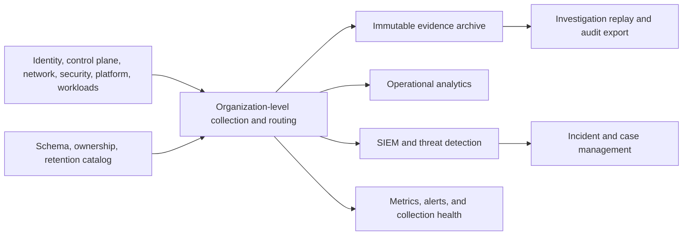
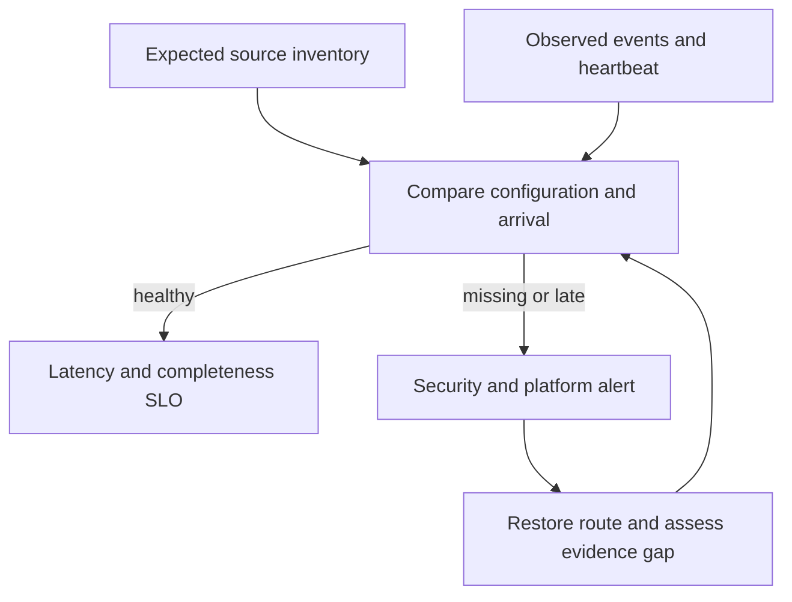
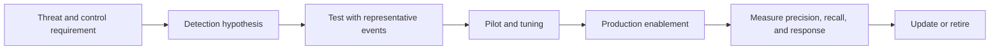

> **文档类型：** 云基础和治理实施指南
> **规范性术语：** **MUST**、**MUST NOT**、**SHOULD**、**SHOULD NOT** 和 **MAY** 是要求级别。
> **适用范围：** 用于操作、检测、合规性和调查的云控制平面、身份、网络、安全和平台遥测。
> **例外流程：** 偏离要求需要记录风险评估、补偿控制、指定风险负责人和到期日期。

|控制领域|价值|
|---|---|
|文件编号 | `CFG-12` |
|负责人|云卓越中心 |
|审核周期|至少每年一次，并且在重大平台、提供商、数据、安全或运营模式发生变化之后 |
|证据|集合运行状况、不可变存档、解析器版本、检测测试和调查导出 |

# 集中审计日志和安全遥测基础

> **决策简述：** 将遥测视为证据：集中收集、保存原始事件、保护完整性、监控收集状况并控制成本。

## 目的

该标准定义了云控制平面、身份、网络、安全和平台日志如何成为值得信赖的操作和合规证据。集中化意味着一致的治理和访问；它不需要将每个事件复制到一个昂贵的分析系统中。

## 所需的结果

- 在最高实际组织范围内采集管理和数据访问事件。
- 工作负载管理员无法更改其审计证据的权威副本。
- 收集失败、配置漂移和传送延迟会生成告警。
- 保留遵循法律、安全、隐私和事件响应要求。
- 高价值事件在商定的延迟目标内到达检测系统。
- 原始证据仍然可以以开放、记录在案的格式导出。
- 敏感日志字段接收与其源数据等效的访问和处理控制。

## 参考架构

档案是日志记录证据的系统。分析和 SIEM 层是优化的副本，在适当的情况下保留时间较短。

## 最低遥测基线

|来源 |最少活动 |优先|
|---|---|---|
|身份 |登录、MFA、联合、角色和策略更改、权限提升 |关键|
|组织|层次结构、账户、订阅、项目、隔间和策略更改 |关键|
|控制平面|资源创建、更新、删除和拒绝操作 |高|
|网络|防火墙、流、DNS、网关、负载均衡器和公共暴露变化 |基于风险|
|关键和机密服务|管理操作和数据访问（如果可用）|关键|
|保安服务|结果、姿势变化、抑制和探测器健康状况 |关键|
|数据服务|管理和敏感数据访问 |基于分类|
|工作负载 |身份验证、授权、业务安全事件和错误 |服务为本|

如果没有明确的要求和处理设计，请勿收集有效负载、令牌、机密或受监管的数据。

## 提供商实现映射

|能力|Azure|AWS | GCP |OCI |
|---|---|---|---|---|
|控制平面审计| Azure Activity Log | AWS CloudTrail | Cloud Audit Logs| OCI Audit |
|资源/服务日志 |诊断设置和 Azure Monitor | CloudWatch Logs 和服务日志 |Cloud Logging| OCI Logging |
|配置状态| Azure Policy 和 Resource Graph | AWS Config |Cloud Asset Inventory 和 Security Command Center| Cloud Guard 和配置服务 |
|中央路由|数据收集规则、Event Hubs、存储 |组织级 CloudTrail 跟踪、订阅、Firehose/Security Lake |聚合 Sink、Pub/Sub、存储 |Service Connector Hub 和对象存储|
|检测|Microsoft Sentinel/Defender for Cloud | GuardDuty、Security Hub、SIEM 集成 |Security Command Center 和 Google 安全运营 | Cloud Guard 和 SIEM 集成 |

## 证据层

使用显式层而不是一个保留值：

- **检测层：** 告警和调查所需的可搜索、低延迟事件。
- **操作层：**用于可靠性、性能和支持的诊断。
- **存档层：** 保留不可变或一次性写入的证据以供调查和审计。
- **调试层：** 具有定义的过期和隐私审查的临时详细日志记录。

每个来源的目录必须记录所有者、模式、分类、区域、收集路由、检测延迟、保留、合法保留支持以及估计数量和成本。

## 完整性和职责分离

将档案放置在专用的安全边界内。工作负载角色可以发送证据，但不得删除证据、削弱保留、更改加密或禁用组织级收集。通过更改批准、支持的多方删除、版本控制和告警来保护路由和存档策略。

仅在设计好密钥所有权、可用性、轮换、恢复和成本后才使用客户管理的密钥。没有可恢复密钥操作的加密可能会导致事件期间证据不可用。

## 归一化和相关性
保留原始事件并添加标准化字段，而不是重写源证据。至少标准化：

- 事件时间和摄取时间；
- 云、组织边界、区域和环境；
- 参与者类型、参与者 ID、会话和源身份提供商；
- 行动、目标资源、结果和原因；
- 源 IP、网络区域、相关 ID 和部署标识符；
- 模式版本和解析器版本。

使用协调的时间、稳定的资源标识符和部署元数据来关联跨提供商的事件。

## 收集健康状况

没有告警并不能证明收集有效。使用综合管理事件或支持的传递状态信号来测试端到端路径。

## 执行顺序

1. 盘点所需来源并将其映射到风险和控制证据。
2. 定义证据层、延迟、保留、驻留和访问要求。
3. 通过独立管理创建隔离的存档和分析边界。
4. 在工作负载启动之前启用组织级审计源。
5. 部署提供商原生路由、加密和运行状况监控。
6. 标准化高价值领域并建立检测用例。
7. 测试丢失、重放、合法保留、调查访问和灾难恢复。
8. 在平台运营中添加数量、质量、覆盖范围和成本审核。

## 验证

验证：

- 每个管理边界出现在源清单中；
- 代表创建、更新、删除、拒绝、登录和特权事件到达；
- 源时间戳、标准化字段和原始事件仍然可用；
- 工作负载管理员无法更改或删除权威证据；
- 保留和合法保留行为符合策略；
- 在商定的目标内收集中断告警；
- 调查人员可以通过批准的访问查询和导出证据；
- 在受控练习中进行档案恢复和重放工作。

跟踪源覆盖范围、事件到达延迟、丢弃或拒绝的事件、解析器故障、检测覆盖范围、证据访问审查、存储增长以及每个遥测层的成本。

## 操作注意事项

安全部门负责证据要求、检测和调查访问权限。云平台团队负责提供商收集和路由。工作负载团队负责应用事件质量。隐私和日志记录团队批准敏感字段和保留。架构或路由更改需要兼容性测试和记录在案的回滚。

## 模式和解析器治理

将解析器和规范化模式视为生产代码。解析器更改可以更改检测、证据查询和合规性报告，而无需更改源事件。

所需控制：

- 版本化源和标准化模式；
- 每个提供商和事件版本的代表性赛程；
- 向后兼容性测试；
- 拒绝事件的死信处理；
- 解析器失败指标和抽样有效负载审查；
- 受控的推出和回滚；
- 保留原始的不可变事件。

不要默默地丢弃未知的字段。保留它们或标记事件以供审核。

## 检测工程生命周期

每个检测都需要所有者、严重性、所需的数据源、响应手册、抑制规则和验证计划。当规则的来源丢失、延迟超出响应目标或噪音太大而无法采取行动时，规则就无效。

## 遥测成本和数据最小化

通过将数据值与层匹配来控制成本：

- 保留高价值审计证据的时间长于冗长的调试数据；
- 在进行昂贵的分析之前过滤已知的噪声场，同时在需要时保留原始证据；
- 仅在不会削弱安全性或审计结果的情况下对性能遥测进行采样；
- 按数量、基数和查询成本监控主要来源；
- 临时调试集合自动过期；
- 避免在没有使用记录在案的情况下在多个平台上重复同一事件。

降低成本不得禁用强制证据或隐藏收集失败。

## 监管链和调查出口

对于调查或法律程序中使用的证据，日志记录：

- 源系统和组织边界；
- 收集和摄取时间戳；
- 不可变的对象标识符和校验和；
- 加密和存储位置；
- 访问、导出、转换和保留事件；
- 解析器或丰富版本；
- 调查员和案例参考。

导出应该可以从档案中复制，并且应该包括原始事件和记录在案的丰富内容。避免将证据复制到不受控制的工作空间中。

## 相关主题

- [策略、护栏和合规性](policy-guardrails-and-compliance.md)
- [平台所有权及运营模式](platform-ownership-and-operating-model.md)
- [资源命名、标签和元数据标准](resource-naming-tagging-and-metadata-standards.md)

## 参考文档

- [Azure 落地工作区管理和监控](https://learn.microsoft.com/en-us/azure/cloud-adoption-framework/ready/landing-zone/design-area/management)
- [AWS 云基础能力](https://docs.aws.amazon.com/whitepapers/latest/establishing-your-cloud-foundation-on-aws/capabilities.html)
- [Google Cloud Landing Zone 设计](https://docs.cloud.google.com/architecture/landing-zones)
- [OCI 核心 Landing Zone 可观测性](https://docs.oracle.com/en-us/iaas/Content/cloud-adoption-framework/oci-core-landing-zone.htm)

## 相关仓库

- [andyxuan2010/azure-landingzone](https://github.com/andyxuan2010/azure-landingzone) — 包括 Azure Log Analytics 和适合集中式遥测的共享管理基础。
- [andyxuan2010/aws-landingzone](https://github.com/andyxuan2010/aws-landingzone) — 为组织级审计收集提供受管控的 AWS 多账户基础。
- [andyxuan2010/oci-landingzone](https://github.com/andyxuan2010/oci-landingzone) — 提供可建立集中式记录在案的 OCI 共享平台基础设施。
