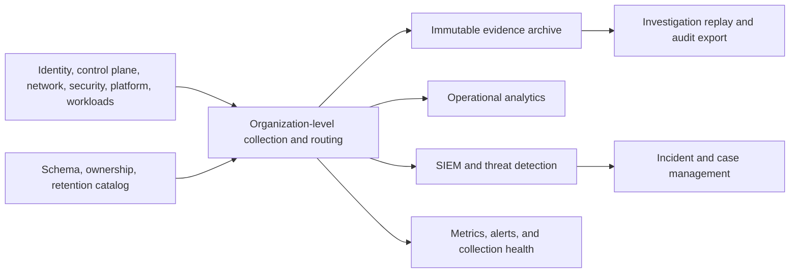
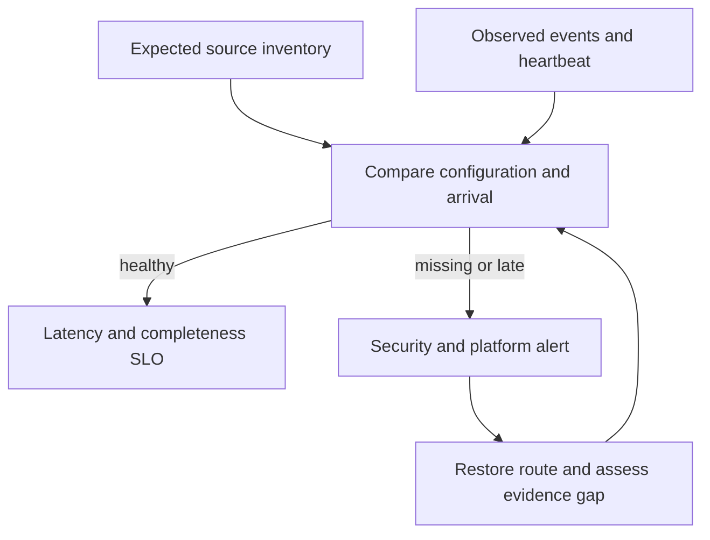
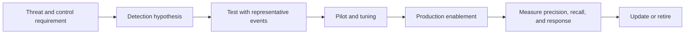

> **Document class:** Cloud Foundations & Governance implementation guide
> **Normative terms:** **MUST**, **MUST NOT**, **SHOULD**, **SHOULD NOT**, and **MAY** are requirements levels.
> **Applicability:** Cloud control-plane, identity, network, security, and platform telemetry used for operations, detection, compliance, and investigations.
> **Exception process:** Deviations require a documented risk assessment, compensating controls, named risk owner, and expiry date.

| Control field | Value |
|---|---|
| Document ID | `CFG-12` |
| Owner | Cloud Center of Excellence |
| Review cycle | At least annually and after material platform, provider, data, security, or operating-model changes |
| Evidence | Collection health, immutable archive, parser versions, detection tests, and investigation exports |

# Centralized Audit Logging and Security Telemetry Foundation

> **Decision in brief:** Treat telemetry as evidence: collect centrally, preserve raw events, protect integrity, monitor collection health, and control cost.

## Purpose

This standard defines how cloud control-plane, identity, network, security, and platform logs become trustworthy operational and compliance evidence. Centralization means consistent governance and access; it does not require every event to be copied into one expensive analytics system.

## Required outcomes

- Administrative and data-access events are captured at the highest practical organizational scope.
- Workload administrators cannot alter the authoritative copy of their audit evidence.
- Collection failure, configuration drift, and delivery delay generate alerts.
- Retention follows legal, security, privacy, and incident-response requirements.
- High-value events reach detection systems within an agreed latency objective.
- Raw evidence remains exportable in an open, documented format.
- Sensitive log fields receive access and handling controls equivalent to their source data.

## Reference architecture

The archive is the evidence system of record. Analytics and SIEM tiers are optimized copies with shorter retention where appropriate.

## Minimum telemetry baseline

| Source | Minimum events | Priority |
|---|---|---|
| Identity | Sign-in, MFA, federation, role and policy changes, privilege elevation | Critical |
| Organization | Hierarchy, account, subscription, project, compartment, and policy changes | Critical |
| Control plane | Resource create, update, delete, and denied action | High |
| Network | Firewall, flow, DNS, gateway, load balancer, and public exposure changes | Risk based |
| Key and secret services | Administrative actions and data access where available | Critical |
| Security services | Findings, posture changes, suppression, and detector health | Critical |
| Data services | Administrative and sensitive data access | Classification based |
| Workloads | Authentication, authorization, business security events, and errors | Service based |

Do not collect payloads, tokens, secrets, or regulated data without an explicit requirement and handling design.

## Provider implementation mapping

| Capability | Azure | AWS | GCP | OCI |
|---|---|---|---|---|
| Control-plane audit | Azure Activity Log | AWS CloudTrail | Cloud Audit Logs | OCI Audit |
| Resource/service logs | Diagnostic settings and Azure Monitor | CloudWatch Logs and service logs | Cloud Logging | OCI Logging |
| Configuration posture | Azure Policy and Resource Graph | AWS Config | Cloud Asset Inventory and Security Command Center | Cloud Guard and configuration services |
| Central routing | Data Collection Rules, Event Hubs, storage | Organization trails, subscriptions, Firehose/Security Lake | Aggregated sinks, Pub/Sub, storage | Service Connector Hub and Object Storage |
| Detection | Microsoft Sentinel/Defender for Cloud | GuardDuty, Security Hub, SIEM integrations | Security Command Center and Google Security Operations | Cloud Guard and SIEM integrations |

## Evidence tiers

Use explicit tiers instead of one retention value:

- **Detection tier:** searchable, low-latency events required for alerts and investigation.
- **Operations tier:** diagnostics used for reliability, performance, and support.
- **Archive tier:** immutable or write-once evidence retained for investigation and audit.
- **Debug tier:** temporary verbose logging with a defined expiration and privacy review.

The catalog for each source must record owner, schema, classification, regions, collection route, detection latency, retention, legal hold support, and estimated volume and cost.

## Integrity and separation of duties

Place archives in dedicated security-owned boundaries. Workload roles may send evidence but must not delete it, weaken retention, change encryption, or disable organization-level collection. Protect routing and archive policy with change approval, multi-party deletion where supported, versioning, and alerts.

Use customer-managed keys only when key ownership, availability, rotation, recovery, and cost have been designed. Encryption without recoverable key operations can make evidence unavailable during an incident.

## Normalization and correlation

Preserve the original event and add normalized fields rather than rewriting source evidence. At minimum normalize:

- event time and ingestion time;
- cloud, organization boundary, region, and environment;
- actor type, actor ID, session, and source identity provider;
- action, target resource, result, and reason;
- source IP, network zone, correlation ID, and deployment identifier;
- schema version and parser version.

Use coordinated time, stable resource identifiers, and deployment metadata to correlate events across providers.

## Collection health

An absence of alerts is not evidence that collection works. Use synthetic administrative events or supported delivery status signals to test the path end to end.

## Implementation sequence

1. Inventory required sources and map them to risks and control evidence.
2. Define evidence tiers, latency, retention, residency, and access requirements.
3. Create isolated archive and analytics boundaries with independent administration.
4. Enable organization-level audit sources before workload onboarding.
5. Deploy provider-native routing, encryption, and health monitoring.
6. Normalize high-value fields and establish detection use cases.
7. Test loss, replay, legal hold, investigation access, and disaster recovery.
8. Add volume, quality, coverage, and cost reviews to platform operations.

## Validation

Validate that:

- every managed boundary appears in the source inventory;
- representative create, update, delete, deny, sign-in, and privilege events arrive;
- source timestamps, normalized fields, and original events remain available;
- workload administrators cannot change or delete authoritative evidence;
- retention and legal hold behavior match policy;
- collection interruption alerts within the agreed objective;
- investigators can query and export evidence through approved access;
- archive recovery and replay work in a controlled exercise.

Track source coverage, event arrival latency, dropped or rejected events, parser failure, detection coverage, evidence-access reviews, storage growth, and cost per telemetry tier.

## Operational considerations

Security owns evidence requirements, detections, and investigation access. The cloud platform team owns provider collection and routing. Workload teams own application event quality. Privacy and records teams approve sensitive fields and retention. Schema or routing changes require compatibility testing and a documented rollback.

## Schema and parser governance

Treat parsers and normalized schemas as production code. A parser change can alter detections, evidence queries, and compliance reports without changing the source event.

Required controls:

- versioned source and normalized schemas;
- representative fixtures for each provider and event version;
- backward-compatibility tests;
- dead-letter handling for rejected events;
- parser-failure metrics and sampled payload review;
- controlled rollout and rollback;
- preservation of the original immutable event.

Do not silently drop unknown fields. Preserve them or flag the event for review.

## Detection engineering lifecycle

Every detection requires an owner, severity, required data sources, response playbook, suppression rules, and validation schedule. A rule is ineffective when its source is missing, delayed beyond the response objective, or too noisy to action.

## Telemetry cost and data minimization

Control cost by matching data value to tier:

- retain high-value audit evidence longer than verbose debug data;
- filter known-noise fields before expensive analytics while preserving raw evidence where required;
- sample performance telemetry only when it does not weaken security or audit outcomes;
- monitor top sources by volume, cardinality, and query cost;
- expire temporary debug collection automatically;
- avoid duplicating the same event across multiple platforms without a documented use.

Cost reduction must not disable mandatory evidence or hide collection failure.

## Chain of custody and investigation export

For evidence used in investigations or legal processes, record:

- source system and organization boundary;
- collection and ingestion timestamps;
- immutable object identifier and checksum;
- encryption and storage location;
- access, export, transformation, and retention events;
- parser or enrichment version;
- investigator and case reference.

Exports should be reproducible from the archive and should include both original events and documented enrichment. Avoid copying evidence into uncontrolled workspaces.

## Related topics

- [Policy, Guardrails, and Compliance](policy-guardrails-and-compliance.md)
- [Platform Ownership and Operating Model](platform-ownership-and-operating-model.md)
- [Resource Naming, Tagging, and Metadata Standards](resource-naming-tagging-and-metadata-standards.md)

## References

- [Azure landing zone management and monitoring](https://learn.microsoft.com/en-us/azure/cloud-adoption-framework/ready/landing-zone/design-area/management)
- [AWS cloud foundation capabilities](https://docs.aws.amazon.com/whitepapers/latest/establishing-your-cloud-foundation-on-aws/capabilities.html)
- [Google Cloud landing zone design](https://docs.cloud.google.com/architecture/landing-zones)
- [OCI Core Landing Zone observability](https://docs.oracle.com/en-us/iaas/Content/cloud-adoption-framework/oci-core-landing-zone.htm)

## Related repos

- [andyxuan2010/azure-landingzone](https://github.com/andyxuan2010/azure-landingzone) — includes Azure Log Analytics and shared management foundations suitable for centralized telemetry.
- [andyxuan2010/aws-landingzone](https://github.com/andyxuan2010/aws-landingzone) — supplies a governed AWS multi-account base for organization-level audit collection.
- [andyxuan2010/oci-landingzone](https://github.com/andyxuan2010/oci-landingzone) — provides OCI shared platform infrastructure on which centralized logging can be established.
