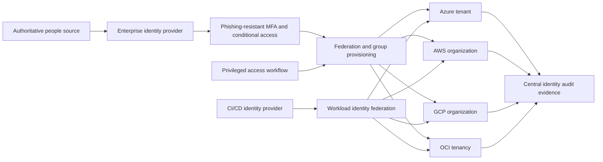
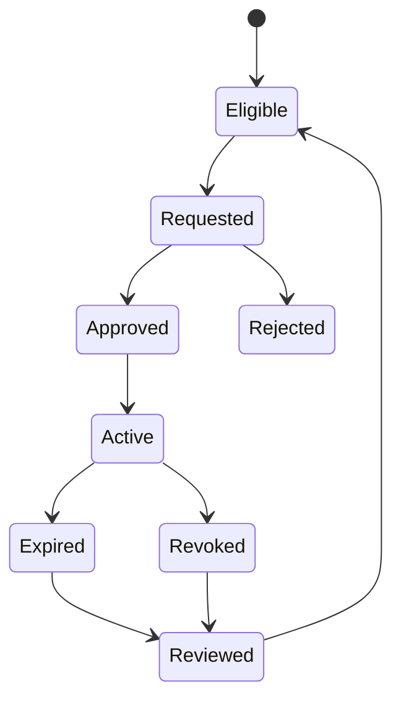

> **文档类型：** 云基础和治理实施指南
> **规范性术语：** **MUST**、**MUST NOT**、**SHOULD**、**SHOULD NOT** 和 **MAY** 是要求级别。
> **适用范围：** 跨云提供商的员工联合、特权管理、工作负载身份、紧急访问和访问证据。
> **例外流程：** 偏离要求需要记录风险评估、补偿控制、指定风险负责人和到期日期。

|控制领域|价值|
|---|---|
|文件编号 | `CFG-10` |
|负责人|云卓越中心 |
|审核周期|至少每年一次，并且在重大平台、提供商、数据、安全或运营模式发生变化之后 |
|证据|身份清单、访问审查、特权提升、联合和紧急访问测试结果 |

# 云身份和特权访问基础

> **简要决定：** 联合员工和工作负载身份，使特权短暂且可审查，并保持紧急访问独立并经过测试。

## 目的

该标准定义了多云资产的身份控制平面。它涵盖员工身份联合、特权管理、工作负载身份、紧急访问和证据。目标是建立一个具有提供商原生授权的受管身份生命周期，而不是每个云中都具有相同的角色名称。

## 设计原则

- 使用企业身份提供商作为权威的员工身份源。
- 向同步组授予权限，而不是直接向指定用户授予权限。
- 独立的身份验证、云授权和应用授权。
- 使特权访问符合条件、有时限、经过批准并记录。
- 优先选择短期令牌和工作负载身份联合，而不是存储的访问密钥。
- 将紧急身份保存在云本地、严格控制并定期测试。
- 拒绝通过租户或组织根管理员进行例行工作负载部署。

## 参考架构

## 身份类

|班级 |认证|授权模式|所需的控制|
|---|---|---|---|
|员工|企业单点登录 |组到角色映射 | MFA、生命周期自动化、会话策略 |
|特权用户| SSO + 权限提升 |合格的角色范围 |审批、时限、日志、提醒|
|工作负载|原生身份或联盟|资源范围的服务角色 |令牌寿命短暂，受众限制 |
|持续集成/持续交付 | OIDC 联盟 |每个环境的部署角色 |受保护的分支/环境，声明验证 |
|紧急|云本地身份 |最小的恢复作用|离线凭证、双重托管、经过测试的流程 |
|外部方|联邦嘉宾|经赞助者批准的组|过期、访问审查、限制范围 |

人和机器身份不得共享凭证或角色分配。

## 提供商实现映射

|控制目标|Azure|AWS | GCP |OCI |
|---|---|---|---|---|
|员工身份联合 |Microsoft Entra ID |具有外部 IdP 的 IAM Identity Center | Cloud Identity 或外部 IdP | IAM identity domains 或 federation |
|资源授权| Azure RBAC | IAM 角色和策略 |Cloud IAM roles | IAM 策略和组 |
|即时特权|Entra PIM |经监管批准的临时角色会话 |Privileged Access Manager|有时间限制的策略/流程集成|
|工作负载身份|托管身份和工作负载身份联合 | IAM 角色和 Web 身份联合 |服务账户和工作负载身份联合|实例/资源主体和动态组 |
|策略边界|管理组和订阅 |组织、OU 和账户 |组织、文件夹和项目 |租户和隔间|
|获取证据| Entra 和 Azure Activity Log | CloudTrail 和身份中心日志 | Cloud Audit Logs|审计日志|

提供商功能是实现选择。强制性结果是集中的生命周期、最小特权、短期身份验证、可追踪的提升和可恢复的紧急访问。

## 特权访问标准

特权访问必须遵循以下顺序：

每次提升都必须采集请求者、角色、目标范围、原因、批准、开始时间、到期时间以及生成的审核事件。生产提升应需要票据或事件标识符，并且不应超出操作任务窗口。

永久的高权限任务需要有记录在案的技术例外情况。当风险评估允许时，只读安全和计费角色可能会保留。

## 角色和范围设计

在实施云角色之前定义提供商中立的角色：

- 组织治理管理员；
- 身份管理员；
- 网络平台运维人员；
- 安全监控和事件响应者；
- 工作负载所有者和工作负载操作员；
- 部署自动化身份；
- 成本管理分析师；
- 审核读者。

将每个角色映射到最窄的提供商本地角色和范围。当托管角色提供所需的权限且没有过多的内容时，请避免自定义角色。每当提供商添加或更改操作时，请检查自定义角色。

## 工作负载和流水线身份

自动化必须将可信身份令牌交换为短期云令牌。联合策略必须验证仓库或项目、分支或环境、目标受众和受信任的发布者。为每个生产信任边界使用单独的部署角色。

仅在联邦身份或原生身份不可用的情况下，才允许使用静态凭据。将凭证存储在经批准的机密服务中，限制其范围和来源，自动轮换并监控每次使用。

## 紧急访问

在提供商支持的情况下，维护至少两个可独立恢复的紧急身份。他们必须：

- 被排除在普通联邦依赖之外；
- 使用强大的、单独受保护的凭证；
- 没有日常操作用途；
- 向安全团队发出有关身份验证或配置更改的告警；
- 每年至少两次通过受控练习进行测试；
- 有记录在案的调用、遏制和凭证重置程序。

## 执行顺序

1. 清单员工、服务、流水线、外部和紧急身份。
2. 定义角色、范围、职责分离冲突和访问所有者。
3. 建立联盟和自动化的组生命周期管理。
4. 部署基准角色并禁止非托管直接用户授权。
5. 启用特权提升、批准、到期和访问审查。
6. 将工作负载和流水线迁移到原生身份或联合。
7. 配置中央身份遥测和高风险告警。
8. 测试取消配置、权限到期和紧急恢复。

## 验证

最低限度的证据包括：

- 在每个云中成功进行加入者、移动者和离开者测试；
- 直接用户分配和长期特权授予的清单；
- 凭证和服务身份的年龄和上次使用数据；
- 提升批准和到期日志记录；
- 联盟信任配置和令牌声明限制；
- 紧急访问测试结果；
- 针对 root、所有者、紧急情况和策略管理活动的告警。
跟踪常设权限计数、休眠身份、无主服务身份、取消配置失败、访问审核完成情况以及撤销访问的平均时间。

## 操作注意事项

身份工程负责联合和生命周期服务。平台团队负责提供商角色映射和工作负载身份模式。安全团队负责特权访问策略和告警。工作负载所有者批准在其委派范围内的访问。对根级信任、紧急访问或联合的更改需要同行评审和经过测试的回滚。

## 加入者、移动者和离开者控件

身份生命周期必须跨提供商分配和本地云组传播。

最少测试：

- 新员工仅获取批准的基线访问权限；
- 角色更改会在添加不兼容的新访问权限之前删除过时的权限；
- 终止会撤销联盟会话、直接授权、令牌、密钥和紧急授权；
- 外部方访问权限自动过期；
- 组删除或重命名不会孤立特权访问；
- 取消配置失败会产生自有事件。

测量端到端撤销时间，而不仅仅是 HR 或身份提供商更新时间。

## 特权会话控制

对于高风险提升，定义：

- 合格角色和最大范围；
- 批准和职责分离规则；
- 认证强度和设备条件；
- 最大会话持续时间；
- 所需的原因和事件或变更参考文档；
- 会话日志记录和告警；
- 需要额外控制的操作，例如角色分配或日志删除；
- 自动过期和使用后审查。

AWS 临时提升访问权限、Google Cloud Privileged Access Manager 和 Microsoft Entra PIM 可以实现此模型的部分内容。 OCI 环境可能需要身份域、访问治理或外部特权访问工作流程。验证确切的提供商能力，而不是声称相同的行为。

## 服务身份生命周期

每个工作负载身份必须具有：

- 负责任的所有者和应用；
- 发布人、主体、受众和信任策略；
- 环境和资源范围；
- 创建方法和源码库；
- 最后使用和预期使用模式；
- 凭证或联合过期（如果支持）；
- 停用触发器和依赖项清单。

检测未使用的服务账户、角色、托管身份、动态组、联合凭据和 API 密钥。在永久删除之前，禁用身份应在有限的隔离期内是可逆的。

## 跨云访问审核

单一访问审查应将员工身份与所有提供商原生授权相关联。审稿人需要：

- 业务角色和经理；
- 组合员资格；
- 云角色和范围；
- 地位与资格特权；
- 最后一次使用和最近的权限提升；
- 直接分配和策略例外；
- 职责分离冲突；
- 外部或访客状态。

仅提供商报告很少揭示从企业集团到有效资源许可的完整权利路径。

## 相关主题

- [管理组、账户与组织结构](management-groups-accounts-and-organizational-structure.md)
- [策略、护栏和合规性](policy-guardrails-and-compliance.md)
- [订阅与账户发放](subscription-and-account-vending.md)

## 参考文档

- [Azure 落地工作区身份和访问管理](https://learn.microsoft.com/en-us/azure/cloud-adoption-framework/ready/landing-zone/design-area/identity-access-landing-zones)
- [AWS 云基础能力](https://docs.aws.amazon.com/whitepapers/latest/establishing-your-cloud-foundation-on-aws/capabilities.html)
- [Google Cloud Landing Zone 设计](https://docs.cloud.google.com/architecture/landing-zones)
- [OCI Landing Zone 概览](https://docs.oracle.com/en-us/iaas/Content/cloud-adoption-framework/oci-landing-zones-overview.htm)

## 相关仓库

- [andyxuan2010/azure-landingzone](https://github.com/andyxuan2010/azure-landingzone) — 使用 Terraform 实现 Azure 落地工作区身份和治理基础。
- [andyxuan2010/aws-landingzone](https://github.com/andyxuan2010/aws-landingzone) — 为身份和治理控制提供可重复的 AWS 多账户基础。
- [andyxuan2010/oci-landingzone](https://github.com/andyxuan2010/oci-landingzone) — 规定 OCI Landing Zone 基础，包括共享平台边界。
