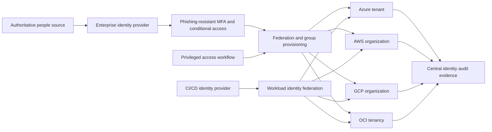
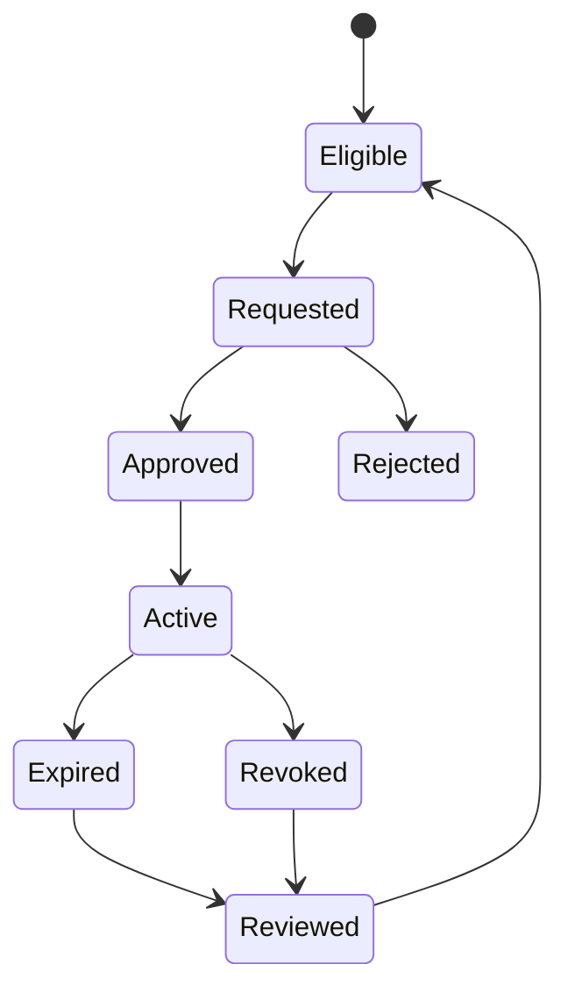

> **Document class:** Cloud Foundations & Governance implementation guide
> **Normative terms:** **MUST**, **MUST NOT**, **SHOULD**, **SHOULD NOT**, and **MAY** are requirements levels.
> **Applicability:** Workforce federation, privileged administration, workload identity, emergency access, and access evidence across cloud providers.
> **Exception process:** Deviations require a documented risk assessment, compensating controls, named risk owner, and expiry date.

| Control field | Value |
|---|---|
| Document ID | `CFG-10` |
| Owner | Cloud Center of Excellence |
| Review cycle | At least annually and after material platform, provider, data, security, or operating-model changes |
| Evidence | Identity inventory, access reviews, privileged elevation, federation, and emergency-access test results |

# Cloud Identity and Privileged Access Foundation

> **Decision in brief:** Federate workforce and workload identity, make privilege short-lived and reviewable, and keep emergency access independent and tested.

## Purpose

This standard defines the identity control plane for a multi-cloud estate. It covers workforce federation, privileged administration, workload identity, emergency access, and evidence. The objective is one governed identity lifecycle with provider-native authorization, not identical role names in every cloud.

## Design principles

- Use the enterprise identity provider as the authoritative workforce identity source.
- Grant permissions to synchronized groups, not directly to named users.
- Separate authentication, cloud authorization, and application authorization.
- Make privileged access eligible, time-bound, approved, and recorded.
- Prefer short-lived tokens and workload federation over stored access keys.
- Keep emergency identities cloud-local, tightly controlled, and regularly tested.
- Deny routine workload deployment through tenant or organization root administrators.

## Reference architecture

## Identity classes

| Class | Authentication | Authorization pattern | Required controls |
|---|---|---|---|
| Workforce | Enterprise SSO | Group-to-role mapping | MFA, lifecycle automation, session policy |
| Privileged workforce | SSO plus elevation | Eligible scoped role | Approval, time limit, recording, alerting |
| Workload | Native identity or federation | Resource-scoped service role | Short-lived token, audience restriction |
| CI/CD | OIDC federation | Deployment role per environment | Protected branch/environment, claims validation |
| Emergency | Cloud-local identity | Minimal recovery role | Offline credential, dual custody, tested procedure |
| External party | Federated guest | Sponsor-approved group | Expiration, access review, restricted scope |

Human and machine identities must not share credentials or role assignments.

## Provider implementation mapping

| Control objective | Azure | AWS | GCP | OCI |
|---|---|---|---|---|
| Workforce federation | Microsoft Entra ID | IAM Identity Center with external IdP | Cloud Identity or external IdP | IAM identity domains or federation |
| Resource authorization | Azure RBAC | IAM roles and policies | Cloud IAM roles | IAM policies and groups |
| Just-in-time privilege | Entra PIM | Temporary role sessions with governed approval | Privileged Access Manager | Time-bound policy/process integration |
| Workload identity | Managed identities and workload identity federation | IAM roles and web identity federation | Service accounts and Workload Identity Federation | Instance/resource principals and dynamic groups |
| Policy boundary | Management group and subscription | Organization, OU, and account | Organization, folder, and project | Tenancy and compartment |
| Access evidence | Entra and Azure activity logs | CloudTrail and Identity Center logs | Cloud Audit Logs | Audit logs |

Provider features are implementation choices. The mandatory outcomes are centralized lifecycle, least privilege, short-lived authentication, traceable elevation, and recoverable emergency access.

## Privileged access standard

Privileged access must follow this sequence:

Every elevation must capture the requester, role, target scope, reason, approval, start time, expiration, and resulting audit events. Production elevation should require a ticket or incident identifier and should not exceed the operational task window.

Permanent high-privilege assignments require a documented technical exception. Read-only security and billing roles may be standing when their risk assessment permits it.

## Role and scope design

Define provider-neutral personas before implementing cloud roles:

- organization governance administrator;
- identity administrator;
- network platform operator;
- security monitoring and incident responder;
- workload owner and workload operator;
- deployment automation identity;
- cost management analyst;
- audit reader.

Map each persona to the narrowest provider-native role and scope. Avoid custom roles when a managed role provides the required permissions without material excess. Review custom roles whenever providers add or change actions.

## Workload and pipeline identities

Automation must exchange a trusted identity token for a short-lived cloud token. Federation policy must validate repository or project, branch or environment, intended audience, and trusted issuer. Use a separate deployment role for each production trust boundary.

Static credentials are allowed only for a time-limited exception where federation or native identity is unavailable. Store the credential in an approved secrets service, restrict its scope and source, rotate it automatically, and monitor every use.

## Emergency access

Maintain at least two independently recoverable emergency identities where the provider supports them. They must:

- be excluded from ordinary federation dependencies;
- use strong, separately protected credentials;
- have no daily operational use;
- alert the security team on authentication or configuration change;
- be tested through a controlled exercise at least twice a year;
- have a documented invocation, containment, and credential-reset procedure.

## Implementation sequence

1. Inventory workforce, service, pipeline, external, and emergency identities.
2. Define personas, scopes, separation-of-duty conflicts, and access owners.
3. Establish federation and automated group lifecycle management.
4. Deploy baseline roles and prohibit unmanaged direct user grants.
5. Enable privileged elevation, approval, expiration, and access reviews.
6. Migrate workloads and pipelines to native identity or federation.
7. Configure central identity telemetry and high-risk alerts.
8. Test deprovisioning, privilege expiration, and emergency recovery.

## Validation

Minimum evidence includes:

- successful joiner, mover, and leaver tests across every cloud;
- inventory of direct user assignments and standing privileged grants;
- age and last-used data for credentials and service identities;
- elevation approval and expiration records;
- federation trust configurations and token-claim restrictions;
- emergency-access test results;
- alerts for root, owner, emergency, and policy-administration activity.

Track standing privilege count, dormant identities, unowned service identities, failed deprovisioning, access-review completion, and mean time to revoke access.

## Operational considerations

Identity engineering owns federation and lifecycle services. Platform teams own provider role mappings and workload identity patterns. Security owns privileged-access policy and alerting. Workload owners approve access within their delegated boundaries. Changes to root-level trust, emergency access, or federation require peer review and tested rollback.

## Joiner, mover, and leaver controls

Identity lifecycle must propagate across provider assignments and local cloud groups.

Minimum tests:

- a new employee receives only approved baseline access;
- a role change removes obsolete permissions before adding incompatible new access;
- termination revokes federation sessions, direct grants, tokens, keys, and emergency delegation;
- external-party access expires automatically;
- group deletion or rename does not orphan privileged access;
- deprovisioning failure generates an owned incident.

Measure end-to-end revocation time, not only HR or identity-provider update time.

## Privileged-session controls

For high-risk elevation, define:

- eligible role and maximum scope;
- approval and separation-of-duty rules;
- authentication strength and device conditions;
- maximum session duration;
- required reason and incident or change reference;
- session logging and alerting;
- actions that require an additional control, such as role assignment or log deletion;
- automatic expiration and post-use review.

AWS temporary elevated access, Google Cloud Privileged Access Manager, and Microsoft Entra PIM can implement parts of this model. OCI environments may require identity-domain, access-governance, or external privileged-access workflows. Validate the exact provider capability rather than claiming identical behavior.

## Service-identity lifecycle

Every workload identity must have:

- accountable owner and application;
- issuer, subject, audience, and trust policy;
- environment and resource scope;
- creation method and source repository;
- last-used and expected-use pattern;
- credential or federation expiration where supported;
- decommission trigger and dependency inventory.

Detect unused service accounts, roles, managed identities, dynamic groups, federated credentials, and API keys. Disabling an identity should be reversible for a bounded quarantine period before permanent deletion.

## Cross-cloud access review

A single access review should correlate the workforce identity with all provider-native grants. Reviewers need:

- business role and manager;
- group memberships;
- cloud roles and scopes;
- standing versus eligible privilege;
- last use and recent elevation;
- direct assignments and policy exceptions;
- segregation-of-duty conflicts;
- external or guest status.

Provider reports alone rarely reveal the complete entitlement path from enterprise group to effective resource permission.

## Related topics

- [Management Groups, Accounts, and Organizational Structure](management-groups-accounts-and-organizational-structure.md)
- [Policy, Guardrails, and Compliance](policy-guardrails-and-compliance.md)
- [Subscription and Account Vending](subscription-and-account-vending.md)

## References

- [Azure landing zone identity and access management](https://learn.microsoft.com/en-us/azure/cloud-adoption-framework/ready/landing-zone/design-area/identity-access-landing-zones)
- [AWS cloud foundation capabilities](https://docs.aws.amazon.com/whitepapers/latest/establishing-your-cloud-foundation-on-aws/capabilities.html)
- [Google Cloud landing zone design](https://docs.cloud.google.com/architecture/landing-zones)
- [OCI landing zones overview](https://docs.oracle.com/en-us/iaas/Content/cloud-adoption-framework/oci-landing-zones-overview.htm)

## Related repos

- [andyxuan2010/azure-landingzone](https://github.com/andyxuan2010/azure-landingzone) — implements Azure landing-zone identity and governance foundations with Terraform.
- [andyxuan2010/aws-landingzone](https://github.com/andyxuan2010/aws-landingzone) — provides a repeatable AWS multi-account foundation for identity and governance controls.
- [andyxuan2010/oci-landingzone](https://github.com/andyxuan2010/oci-landingzone) — provisions OCI landing-zone foundations, including shared platform boundaries.
