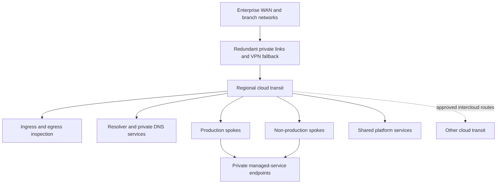
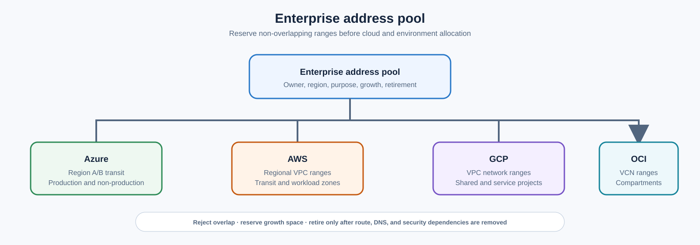

> **文档类型：** 云基础与治理架构参考模型
> **规范性术语：** **MUST**、**MUST NOT**、**SHOULD**、**SHOULD NOT** 和 **MAY** 是要求级别。
> **适用范围：** IP 地址管理、分段、混合和云间连接、路由、DNS、检查和私有服务访问。
> **例外流程：** 偏离要求需要记录风险评估、补偿控制、指定风险负责人和到期日期。

|控制领域|价值|
|---|---|
|文件编号 | `CFG-11` |
|负责人|云卓越中心 |
|审核周期|至少每年一次，并且在重大平台、提供商、数据、安全或运营模式发生变化之后 |
|证据| IPAM 日志、拓扑、路由和 DNS 更改、连接测试、检查和私有端点证据 |

# 云网络基础及连接架构

> **决策简述：** 通过权威 IPAM、分段路由、受管理的 DNS、检查的路径和测试的故障行为构建连接。

## 目的

该标准定义了可路由、可检查、有弹性和自动化的多云网络基础。它建立了 IP 分配、拓扑、DNS、混合连接、流量检查、私有端点和委派工作负载网络的控制目标。

## 架构原则

- 从企业 IP 地址管理系统分配不重叠的地址空间。
- 将连接视为显式服务请求，而不是对等互连的意外结果。
- 将路由可达性与安全授权分开。
- 更喜欢私有服务访问和托管服务的受控出口。
- 集中共享中转，降低复杂性，但避免单一全局故障域。
- 将生产、非生产、管理和管制交通保持在不同的 Security Zones。
- 通过版本控制的自动化管理路由、防火墙策略、DNS 和连接。

## 参考拓扑

部署区域中转单元，以便区域故障不会消除不相关的连接。云间路由必须经过精心规划、过滤和监控，并明确责任归属。

## 提供商实现映射

|能力|Azure|AWS | GCP |OCI |
|---|---|---|---|---|
|工作负载网|虚拟网络|专有网络|专有网络|维网|
|中央中转 |Virtual WAN 或中心 VNet |Transit Gateway 或 Cloud WAN |Network Connectivity Center|Dynamic Routing Gateway|
|私有连接 | ExpressRoute 和 VPN 网关 |Direct Connect 和站点到站点 VPN |Cloud Interconnect 和 Cloud VPN | FastConnect 和站点到站点 VPN |
|私有服务接入 |私有链接/私有端点 | PrivateLink/VPC 端点 |私有服务连接/私有访问模式|私有端点和服务网关|
|域名解析 | Azure DNS Private Resolver | Route 53 Resolver | Cloud DNS | OCI DNS |
|原生检验| Azure Firewall | AWS Network Firewall |Cloud NGFW/防火墙策略| OCI Network Firewall|
|知识产权管理| Azure Virtual Network Manager IPAM | VPC IPAM |内部范围和企业 IPAM 集成 | IP 清单和企业 IPAM 集成 |

不要假设类似命名的构造具有相同的路由、可用性、规模或计费行为。

## 地址管理

IP 规划必须记录所有者、云、区域、环境、网络用途、分配、使用和退役状态。在分配之前预留增长空间和提供商所需的子网。切勿通过在普通工作负载区域之间添加不受控制的网络地址转换来解决重叠问题。



自动发放必须拒绝重叠范围，并仅在删除路由、DNS、安全性和保留依赖项后才返回已停用的范围。

## 细分模型

使用多层：

1. 组织边界：订阅、账户、项目或隔间。
2. 网络边界：VNet、VPC 或 VCN。
3. 区域边界：子网和路由表。
4. 工作负载边界：安全组、应用安全组、NSG 或防火墙身份。
5. 服务边界：私有端点和资源策略。

默认规则应拒绝未经请求的入站访问并限制横向流量。环境标签本身并不能造成隔离。

## 路由和流量检查

维护一个路由意图矩阵，列出源区域、目标区域、业务目的、所需协议、检查点、所有者和到期时间。通过状态检查防止不对称路径。有选择地使用路由传播并在每次公交变更后验证有效路由。

互联网入口必须终止于经批准的边缘服务，并具有 TLS 策略、应用层保护和适合风险的拒绝服务控制。互联网出口应通过经批准的控制，在可行的情况下日志记录目的地和工作负载身份。

## DNS 架构

权威的公共 DNS、私有区域、递归解析和注册是单独的职责。定义：

- 命名空间所有权和委托；
- 入站和出站解析器路径；
- 水平分割规则和碰撞处理；
- 云端和本地之间的条件转发；
- 私有端点日志记录生命周期；
- DNS 查询日志记录和故障监控。

应用团队不得创建重叠的私有区域，从而默默地覆盖共享的企业名称。

## 可用性和容量

在恢复目标需要的地方使用冗余电路、设备、区域和提供商连接点。调整中转、网关、检查、NAT 和 DNS 的吞吐量、连接数、每秒数据包数、路由和故障模式流量。测试负载下的故障转移；配置的备份路径并不能证明可用的恢复。

## 执行顺序

1. 盘点现有范围、路由、DNS 区域、电路和 Security Zones。
2. 定义区域地址池和分配工作流程。
3. 部署区域中转、弹性混合附件和管理访问。
4. 建立 DNS 解析和私有区域治理。
5. 添加检查、入口、出口和私有服务访问模式。
6. 发布工作负载网络模块和连接请求契约。
7. 在具有回滚点的受控波中迁移路由。
8. 测试故障、吞吐量、隔离和遥测。

## 验证

通过自动检查来验证基础：

- 重叠前缀和未经授权的公共地址；
- 有效路由、路由表漂移和非预期传递路径；
- 来自每个批准的源和故障域的 DNS 解析；
- 生产与非生产隔离；
- 防火墙默认拒绝行为和批准的流日志记录；
- 私有端点名称解析；
- 代表性负载下的电路和 VPN 故障转移；
- 路径对称性和最大传输单元行为。

保留拓扑导出、路由和规则更改、连接测试、流日志、容量趋势和恢复练习结果。

## 操作注意事项

网络平台团队负责中转、共享 DNS、地址管理和混合连接。安全团队负责检查策略目标。工作负载团队在委派的护栏内负责自己的本地规则。每个跨境路由和防火墙例外都需要负责任的所有者和到期或定期审查。

## 连接请求契约

每个跨境流量都应该通过结构化数据进行请求：
```yaml
source:
  zone: azure-prod-payments
  cidr_or_identity: workload-payments-api
destination:
  service: onprem-core-banking
  port_protocol: tcp/443
purpose: payment authorization
inspection: required
data_classification: confidential
owner: payments-platform
review_date: 2027-02-01
```
工作流应解析路由、防火墙规则、DNS、源转换、日志记录和依赖项所有权。单独的防火墙规则并不能建立端到端连接。

## 路由和 DNS 变更安全

在中转、路由、解析器或私有区域更改之前：

1.导出当前有效路由和 DNS 解析。
2. 识别受影响的前缀、名称和消费者。
3. 检测重叠、不对称、环路和更具体的路由变化。
4. 验证检查和返回路径行为。
5. 从代表性源网络进行测试。
6. 定义回滚和缓存过期注意事项。
7. 部署后监控流量、DNS、延迟和错误信号。

即使立即恢复配置，DNS 回滚也可能会因缓存而延迟。如果状态检查会话或广告仍然过时，路由回滚可能会失败。

## 私有端点生命周期

私有服务访问需要协调所有权：

- 端点资源和子网容量；
- 提供商服务批准；
- 私有 DNS 记录和解析器路径；
- 资源防火墙或公共访问设置；
- 消费者授权；
- 证书主机名行为；
- 监控和清单；
- 删除和孤立日志记录清理。

在未删除或明确接受公共路径的情况下，请勿创建私有端点。私有端点添加路径；它不会自动禁用其他路径。

## IPAM 实施注意事项

Azure Virtual Network Manager 和 Amazon VPC IPAM 提供商原生池和分配功能。 Google Cloud 提供内部范围和网络清单功能，而组织通常保留企业 IPAM 作为权威分配器。 OCI 提供 IP 清单和重叠信息，但企业分配工作流程可能仍需要外部编排。

因此，提供商映射应被解释为一种实施选项，而不是证明所有四种云都提供等效的端到端 IPAM 产品。

## 云间连接决策

仅当应用、迁移或操作要求无法使用本地服务或异步数据交换时，云间路由才是合理的。记录带宽、延迟、可用性、加密、出口成本、路由所有权、DNS、检查和故障行为。

避免使一朵云成为另一朵云的默认中转路径。这种设计造成了集中的故障、成本和操作依赖性。

## 相关主题

- [管理组、账户与组织结构](management-groups-accounts-and-organizational-structure.md)
- [订阅与账户发放](subscription-and-account-vending.md)
- [策略、护栏和合规性](policy-guardrails-and-compliance.md)

## 参考文档

- [Azure 落地工作区网络拓扑和连接](https://learn.microsoft.com/en-us/azure/cloud-adoption-framework/ready/landing-zone/design-area/network-topology-and-connectivity)
- [AWS 云基础能力](https://docs.aws.amazon.com/whitepapers/latest/establishing-your-cloud-foundation-on-aws/capabilities.html)
- [Google Cloud Landing Zone 网络设计](https://docs.cloud.google.com/architecture/landing-zones/implement-network-design)
- [OCI 核心 Landing Zone](https://docs.oracle.com/en-us/iaas/Content/cloud-adoption-framework/oci-core-landing-zone.htm)

## 相关仓库

- [andyxuan2010/azure-landingzone](https://github.com/andyxuan2010/azure-landingzone) — 实现 Azure 中心辐射网络、私有 DNS 和受管理的共享连接。
- [andyxuan2010/aws-landingzone](https://github.com/andyxuan2010/aws-landingzone) — 为可重复的多账户连接提供 AWS Landing Zone 基础。
- [andyxuan2010/oci-landingzone](https://github.com/andyxuan2010/oci-landingzone) — 提供 OCI 共享网络和 Landing Zone 基础设施。
