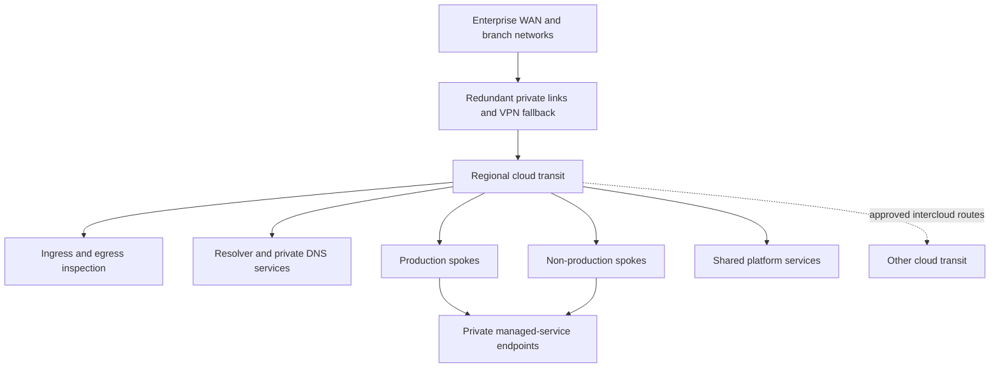

> **Document class:** Cloud Foundations & Governance architecture reference model
> **Normative terms:** **MUST**, **MUST NOT**, **SHOULD**, **SHOULD NOT**, and **MAY** are requirements levels.
> **Applicability:** IP address management, segmentation, hybrid and intercloud connectivity, routing, DNS, inspection, and private service access.
> **Exception process:** Deviations require a documented risk assessment, compensating controls, named risk owner, and expiry date.

| Control field | Value |
|---|---|
| Document ID | `CFG-11` |
| Owner | Cloud Center of Excellence |
| Review cycle | At least annually and after material platform, provider, data, security, or operating-model changes |
| Evidence | IPAM records, topology, route and DNS changes, connectivity tests, inspection, and private-endpoint evidence |

# Cloud Network Foundation and Connectivity Architecture

> **Decision in brief:** Build connectivity from authoritative IPAM, segmented routing, governed DNS, inspected paths, and tested failure behavior.

## Purpose

This standard defines a multi-cloud network foundation that is routable, inspectable, resilient, and automatable. It establishes control objectives for IP allocation, topology, DNS, hybrid connectivity, traffic inspection, private endpoints, and delegated workload networking.

## Architecture principles

- Allocate non-overlapping address space from an enterprise IP address management system.
- Treat connectivity as an explicit service request, not an accidental result of peering.
- Separate routing reachability from security authorization.
- Prefer private service access and controlled egress for managed services.
- Centralize shared transit where it reduces complexity, but avoid a single global failure domain.
- Keep production, non-production, management, and regulated traffic in distinct security zones.
- Manage routes, firewall policy, DNS, and connectivity through version-controlled automation.

## Reference topology



Deploy regional transit units so a regional failure does not remove unrelated connectivity. Intercloud routing must be deliberately advertised, filtered, observed, and owned.

## Provider implementation mapping

| Capability | Azure | AWS | GCP | OCI |
|---|---|---|---|---|
| Workload network | Virtual Network | VPC | VPC network | VCN |
| Central transit | Virtual WAN or hub VNet | Transit Gateway or Cloud WAN | Network Connectivity Center | Dynamic Routing Gateway |
| Private connectivity | ExpressRoute and VPN Gateway | Direct Connect and Site-to-Site VPN | Cloud Interconnect and Cloud VPN | FastConnect and Site-to-Site VPN |
| Private service access | Private Link/private endpoints | PrivateLink/VPC endpoints | Private Service Connect/private access patterns | Private endpoints and service gateways |
| DNS | Azure DNS Private Resolver | Route 53 Resolver | Cloud DNS | OCI DNS |
| Native inspection | Azure Firewall | AWS Network Firewall | Cloud NGFW/firewall policies | OCI Network Firewall |
| IP management | Azure Virtual Network Manager IPAM | VPC IPAM | Internal ranges and enterprise IPAM integration | IP inventory and enterprise IPAM integration |

Do not assume that similarly named constructs have identical routing, availability, scale, or billing behavior.

## Address management

The IP plan must record owner, cloud, region, environment, network purpose, allocation, utilization, and retirement state. Reserve growth space and provider-required subnets before allocation. Never resolve overlap by adding uncontrolled network address translation between ordinary workload zones.


Automated vending must reject overlapping ranges and return retired ranges only after route, DNS, security, and retention dependencies are removed.

## Segmentation model

Use multiple layers:

1. Organization boundary: subscription, account, project, or compartment.
2. Network boundary: VNet, VPC, or VCN.
3. Zone boundary: subnet and route table.
4. Workload boundary: security group, application security group, NSG, or firewall identity.
5. Service boundary: private endpoint and resource policy.

Default rules should deny unsolicited inbound access and restrict lateral traffic. Environment labels alone do not create isolation.

## Routing and traffic inspection

Maintain a route-intent matrix listing source zone, destination zone, business purpose, required protocol, inspection point, owner, and expiration. Prevent asymmetric paths through stateful inspection. Use route propagation selectively and validate effective routes after every transit change.

Internet ingress must terminate at an approved edge service with TLS policy, application-layer protection, and denial-of-service controls appropriate to risk. Internet egress should pass through an approved control that records destination and workload identity where feasible.

## DNS architecture

Authoritative public DNS, private zones, recursive resolution, and registration are separate responsibilities. Define:

- namespace ownership and delegation;
- inbound and outbound resolver paths;
- split-horizon rules and collision handling;
- conditional forwarding between clouds and on-premises;
- private endpoint record lifecycle;
- DNS query logging and failure monitoring.

Application teams must not create overlapping private zones that silently override shared enterprise names.

## Availability and capacity

Use redundant circuits, devices, zones, and provider attachment points where the recovery objective requires them. Size transit, gateways, inspection, NAT, and DNS for throughput, connections, packets per second, routes, and failure-mode traffic. Test failover under load; a configured backup path is not proof of usable recovery.

## Implementation sequence

1. Inventory existing ranges, routes, DNS zones, circuits, and security zones.
2. Define regional address pools and allocation workflow.
3. Deploy regional transit, resilient hybrid attachments, and management access.
4. Establish DNS resolution and private-zone governance.
5. Add inspection, ingress, egress, and private service access patterns.
6. Publish workload network modules and connectivity request contracts.
7. Migrate routes in controlled waves with rollback points.
8. Test failure, throughput, isolation, and telemetry.

## Validation

Validate the foundation with automated checks for:

- overlapping prefixes and unauthorized public addresses;
- effective routes, route-table drift, and unintended transitive paths;
- DNS resolution from every approved source and failure domain;
- production-to-non-production isolation;
- firewall default-deny behavior and approved flow logging;
- private endpoint name resolution;
- circuit and VPN failover under representative load;
- path symmetry and maximum transmission unit behavior.

Retain topology exports, route and rule changes, connectivity tests, flow logs, capacity trends, and recovery exercise results.

## Operational considerations

The network platform team owns transit, shared DNS, address management, and hybrid connectivity. Security owns inspection policy objectives. Workload teams own their local rules within delegated guardrails. Every cross-boundary route and firewall exception requires an accountable owner and expiry or periodic review.

## Connectivity request contract

Every cross-boundary flow should be requested through structured data:

```yaml
source:
  zone: azure-prod-payments
  cidr_or_identity: workload-payments-api
destination:
  service: onprem-core-banking
  port_protocol: tcp/443
purpose: payment authorization
inspection: required
data_classification: confidential
owner: payments-platform
review_date: 2027-02-01
```

The workflow should resolve routes, firewall rules, DNS, source translation, logging, and dependency ownership. A firewall rule alone does not establish end-to-end connectivity.

## Route and DNS change safety

Before a transit, route, resolver, or private-zone change:

1. Export current effective routes and DNS resolution.
2. Identify affected prefixes, names, and consumers.
3. Detect overlap, asymmetry, loops, and more-specific route changes.
4. Validate inspection and return-path behavior.
5. Test from representative source networks.
6. Define rollback and cache-expiry considerations.
7. Monitor flow, DNS, latency, and error signals after deployment.

DNS rollback can be delayed by caching even when the configuration is restored immediately. Route rollback can fail if stateful inspection sessions or advertisements remain stale.

## Private-endpoint lifecycle

Private service access requires coordinated ownership of:

- endpoint resource and subnet capacity;
- provider service approval;
- private DNS records and resolver paths;
- resource firewall or public-access settings;
- consumer authorization;
- certificate hostname behavior;
- monitoring and inventory;
- deletion and orphan-record cleanup.

Do not create private endpoints without removing or explicitly accepting the public path. A private endpoint adds a path; it does not automatically disable other paths.

## IPAM implementation caveat

Azure Virtual Network Manager and Amazon VPC IPAM provide provider-native pool and allocation capabilities. Google Cloud provides internal ranges and network inventory capabilities, while organizations often retain an enterprise IPAM as the authoritative allocator. OCI provides IP inventory and overlap information, but enterprise allocation workflows may still require external orchestration.

Therefore, the provider mapping should be interpreted as an implementation option, not proof that all four clouds provide equivalent end-to-end IPAM products.

## Intercloud connectivity decision

Intercloud routing is justified only when application, migration, or operational requirements cannot use local services or asynchronous data exchange. Record bandwidth, latency, availability, encryption, egress cost, routing ownership, DNS, inspection, and failure behavior.

Avoid making one cloud the default transit path for another. That design creates concentrated failure, cost, and operational dependencies.

## Related topics

- [Management Groups, Accounts, and Organizational Structure](management-groups-accounts-and-organizational-structure.md)
- [Subscription and Account Vending](subscription-and-account-vending.md)
- [Policy, Guardrails, and Compliance](policy-guardrails-and-compliance.md)

## References

- [Azure landing zone network topology and connectivity](https://learn.microsoft.com/en-us/azure/cloud-adoption-framework/ready/landing-zone/design-area/network-topology-and-connectivity)
- [AWS cloud foundation capabilities](https://docs.aws.amazon.com/whitepapers/latest/establishing-your-cloud-foundation-on-aws/capabilities.html)
- [Google Cloud landing zone network design](https://docs.cloud.google.com/architecture/landing-zones/implement-network-design)
- [OCI Core Landing Zone](https://docs.oracle.com/en-us/iaas/Content/cloud-adoption-framework/oci-core-landing-zone.htm)

## Related repos

- [andyxuan2010/azure-landingzone](https://github.com/andyxuan2010/azure-landingzone) — implements Azure hub-spoke networking, private DNS, and governed shared connectivity.
- [andyxuan2010/aws-landingzone](https://github.com/andyxuan2010/aws-landingzone) — provides an AWS landing-zone foundation for repeatable multi-account connectivity.
- [andyxuan2010/oci-landingzone](https://github.com/andyxuan2010/oci-landingzone) — provisions OCI shared networking and landing-zone infrastructure.
