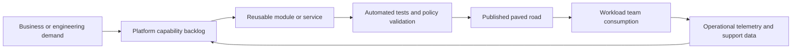
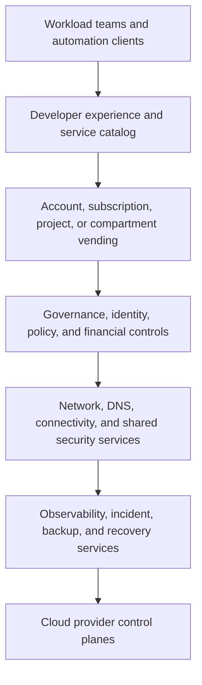

> **文档类型：** 云基础与治理架构参考模型
> **规范性术语：** **MUST**、**MUST NOT**、**SHOULD**、**SHOULD NOT** 和 **MAY** 是要求级别。
> **适用范围：** 企业云平台战略、产品管理、工程、自动化、自助服务和运营成熟度。
> **例外流程：** 偏离要求需要记录风险评估、补偿控制、指定风险负责人和到期日期。

|控制领域|价值|
|---|---|
|文件编号 | `CFG-01` |
|负责人|云卓越中心 |
|审核周期|至少每年一次，并且在重大平台、提供商、数据、安全或运营模式发生变化之后 |
|证据|平台路线图、服务目录、SLO、采用和可靠性指标以及架构审查日志记录 |

# 云平台工程原则

> **决策简述：** 将云平台视为版本化的内部产品，具有黄金路径、可测量的可靠性和明确的逃生路径。

## 目的

云平台工程将云基础变为内部产品。目标不是集中每个部署决策。它提供安全的默认设置、黄金路径、自动化和运营服务，让工作负载团队快速交付，而无需重新创建治理、网络、身份和可观测性控制。

当团队可以通过记录在案的接口使用它、接收可预测的结果并在明确的边界内运行时，平台就是成功的。大量脚本、票据和架构图的集合不是一个平台，除非它具有所有权、版本控制、服务级别和可度量的采用率。


## 文档约定

本文一致使用以下术语：

- **平台团队**：构建和运营共享云能力的团队。
- **工作负载团队**：使用平台的应用、数据、产品或业务团队。
- **Landing Zone**：为工作负载准备的受管云环境。
- **护栏**：通过策略和自动化一致应用的预防性、检测性或纠正性控制。
- **自动发放**：订阅、账户、项目、隔间及其基线配置的自动创建和生命周期管理。

提供商示例是说明性的。控制目标具有权威性；特定于提供商的实现是可替换的。


## 核心原则

### 将平台视为产品

定义用户、服务边界、路线图、支持模型和可度量的结果。平台待办事项必须由工作负载团队摩擦、安全要求、监管义务和可靠性数据驱动，而不是仅由提供商功能可用性驱动。

最少的产品制品包括：

- 描述支持的平台功能的服务目录；
- 版本化接口、模板、模块和策略；
- 入驻和迁移路径；
- 关键共享服务的服务级别目标；
- 采用率、交付时间、可靠性和异常指标；
- 明确的弃用和升级策略。

### 比起无限制的选择，更喜欢黄金路径
黄金路径是完成重复任务的支持方式。它应该比构建替代方案更容易、更安全、更快。示例包括批准的 Terraform 模块、账户自动预配工作流、标准 CI/CD 流水线、集中式身份联合、私有连接模式和默认日志记录集成。

黄金路径并不是绝对的限制。当无法满足书面要求时，团队可以离开黄金路径，但例外情况必须有时间限制、经过风险评估并分配给负责人。

### 自动化控制平面

手动门户配置无法扩展并且产生的证据薄弱。组织层次结构、身份分配、网络基线、日志、预算和账户创建应通过代码和自动化工作流程进行管理；策略应采用策略即代码方式管理。

自动化必须：

- 幂等且可重复；
- 同行评审；
- 部署前可测试；
- 可追溯至已批准的变更；
- 可逆或可恢复；
- 通过工作负载身份而不是长期凭证进行保护。

### 将策略意图与提供商实施分开

使用提供商中立的目标定义控制，然后将它们映射到原生服务。例如，目标是“除非获取批准，否则禁止公共对象存储”。 Azure Policy、AWS Organizations 策略、GCP Organization Policy 和 OCI Security Zones 都是实施。

### 针对生命周期进行设计，而不是针对初始部署

每个平台功能都需要所有者、升级路径、监控模型、故障模式和退役流程。易于创建但难以修补、审核或关闭的 Landing Zone 是不完整的。

### 将安全设置为默认路径

默认配置应实现最小权限、合理的私有连接、加密、集中日志、漏洞管理和策略实施。只要技术上可行，安全控制就应该嵌入到模板和流水线中，而不是作为单独的审查门提供。

### 在有界上下文中保留工作负载自主权

中央团队应控制企业范围内的不变量：身份联合、层次结构、基线策略、审计日志、批准的连接、计费集成和紧急访问。工作负载团队应该在这些边界内控制应用架构和日常交付。

## 平台价值流

反馈循环是强制性的。如果没有使用情况和运营遥测，平台团队会优化假设而不是结果。

## 标准平台层

|平台层|企业责任 |典型的提供商实施 |
|---|---|---|
|组织|层次结构、计费、委派管理 | Azure 管理组、AWS Organizations、GCP 组织/文件夹、OCI 租户/隔间 |
|身份 |联合、特权访问、工作负载身份 | Microsoft Entra ID、AWS IAM Identity Center、Cloud Identity/IAM、OCI IAM 域 |
|治理|策略、合规性、例外、证据 | Azure Policy、AWS SCP/Config、Organization Policy/Policy Controller、OCI Cloud Guard/Security Zones |
|连接性|传输、DNS、出口、私有服务 | Azure Virtual WAN/中心、AWS Transit Gateway、Network Connectivity Center、OCI DRG |
|交付|模板、模块、流水线、制品控件 | Terraform/OpenTofu、原生 IaC、GitHub Actions、Azure DevOps、GitLab CI、云原生流水线 |
|运营|日志、指标、告警、事件、恢复 |原生监控以及企业 SIEM、ITSM、备份和灾难恢复工具 |

## 设计决策框架

评估平台功能时请使用以下顺序：

1. 定义用户问题和预期结果。
2. 识别企业不变量或风险约束。
3. 确定最小的可复用抽象。
4. 决定哪些提供商原生功能应对消费者保持可见。
5. 定义接口：门户、API、拉取请求、流水线或服务目录。
6. 指定所有权、支持、SLO、遥测和生命周期。
7. 在广泛发布之前使用代表性工作负载进行测试。

## 平台 API 和契约模型

平台契约应定义输入、输出、约束和所有权。例如，账户出售请求可能需要：
```yaml
request:
  workload_name: payments-api
  environment: production
  owner_group: payments-platform
  data_classification: confidential
  regions:
    - ca-central
  connectivity_profile: private-enterprise
  cost_center: CC-1042
  recovery_tier: tier-1
```
平台应返回稳定的标识符、部署状态、策略结果、网络详细信息、日志记录目的地和生命周期元数据。可能会返回特定于提供商的 ID，但请求语义应在云中保持一致。

## 工程标准

### 仓库和发布标准

- 对组织控制、平台服务和工作负载模板使用单独的仓库或明确分隔的目录。
- 引脚提供商和模块版本。
- 发布说明和迁移指南。
- 针对代表性 Landing Zone 测试升级路径。
- 在工具链支持的情况下签署或验证已发布的制品。
- 防止直接修改生产分支和控制平面资源。

### 测试金字塔

1. 静态检查：格式、模式、策略即代码、机密检测。
2. 单元测试：模块逻辑、命名、标签、生成配置。
3.集成测试：部署到隔离的测试组织或沙箱账户。
4. 合规性测试：验证有效的策略和证据收集。
5. 弹性测试：测试回滚、break-glass 访问、提供商中断和部分故障。

## 运营指标

度量结果而不是活动：

|公制|为什么这很重要 |
|---|---|
|自动发放前置时间中位数 |显示团队是否可以在没有工单延迟的情况下开始工作 |
|通过该平台创建的账户百分比 |测量控制平面覆盖范围|
|黄金路径采用|显示该平台是否有用，而不仅仅是可用 |
|策略违规再次发生 |揭示控制是否正确的根本原因|
|异常年龄和计数 |确定治理债务|
|平台变更失败率|发布安全措施 |
|恢复共享服务的平均时间|度量运营弹性 |
|工作负载入驻满意度 |检测技术遥测中不可见的摩擦 |

## 反模式

- **门户优先管理**：更改未经审查、难以复制且证据不足。
- **中央团队作为部署 Gatekeeper**：创建队列并消除工作负载责任。
- **每个工作负载一个模块**：产生具有过多条件逻辑的严格抽象。
- **最低公分母多云平台**：隐藏有用的原生功能并创建薄弱的内部云。
- **没有修复路径的控制**：团队收到拒绝，但没有支持的遵守方式。
- **永久例外**：将临时风险接受变为非托管架构。
- **没有产品管理的平台**：工作由内部偏好驱动，而不是由用户结果驱动。

## 验证

- [ ] 日志记录平台用户和优先旅程。
- [ ] 支持的功能在服务目录中发布。
- [ ] 组织控制是自动化的和版本控制的。
- [ ] 身份使用联合和短期工作负载凭据。
- [ ] 黄金路径包括示例、测试、升级指南和支持所有权。
- [ ] 例外情况有到期日和负责人。
- [ ] 操作遥测涵盖平台采用、可靠性和合规性。
- [ ] 特定于提供商的服务在创造物质价值的地方公开。
- [ ] 平台版本使用分阶段验证和回滚程序。

## 黄金路径、延伸点和逃生舱口

黄金路径必须定义消费者可以在不分叉平台的情况下将其延伸到哪里。将每个支持的功能视为具有三层的契约：

|层 |平台承诺 |消费者责任 |
|---|---|---|
|强制性基线 |身份、审计、策略、元数据、安全默认设置 |不得绕过或禁用 |
|可配置选项|支持的区域、规模、弹性层、网络配置文件 |在记录在案的限制内选择值 |
|扩展点|特定于工作负载的模块、挂钩、策略添加 |自己的测试、支持和生命周期|

自由格式的 shell 命令、任意策略排除和不受限制的模块覆盖不是有效的扩展点。它们将隐藏的平台风险迁移给消费者，并使升级变得不可预测。

逃生舱口必须确定未满足的需求、替代设计、风险负责人、支持边界、审查日期以及返回支持模式的迁移路径。平台团队应分析重复的逃生舱请求作为产品证据。如果多个团队需要相同的例外，则平台目录可能不完整。

## 平台成熟度模型

使用功能成熟度模型来避免在初始部署后宣布平台完成。

|舞台|特点 |退出标准|
|---|---|---|
|脚本化 |工程师操作的脚本和手动审批|可重复的代码、所有权、基本测试 |
|标准化|版本化模块和日志记录模式 |通用接口和基线策略|
|自助服务 |自动发放和支持的消费者工作流程 |自动化验收测试和支持模型 |
|管理产品| SLO、遥测、路线图、弃用、单位成本 |度量的采用率和可靠性|
|自适应 |数据驱动的改进和自动化安全修复|异常复发率低，恢复能力经过考验 |

成熟度是特定于能力的。账户出售可以是自适应的，而网络异常处理仍然是手动的。按服务报告成熟度，而不是为整个平台分配一个乐观的评分。

## 消费者入驻和架构反馈

平台应提供明确的入驻旅程：

1. 对工作负载、环境、数据、连接和恢复要求进行分类。
2. 选择最近的支持的产品配置文件。
3. 验证身份组、资金和所有权。
4. 通过发放完成预配并进行验收测试。
5. 通过批准的交付路径部署代表性工作负载。
6. 日志记录未解决的差距、例外决策并支持所有权。
7. 审查第一个生产版本并将结果反馈到平台积压工作中。

架构审查应重点关注偏差和高影响力的依赖关系，而不是重新批准标准模式。目标是制定共同的工作常规，并为真正的特殊风险保留专家审查。

## 相关主题

- [将 Azure 落地工作区设计为产品](designing-an-azure-landing-zone-as-a-product.md)
- [AWS 和 OCI Landing Zone 模式](aws-and-oci-landing-zone-patterns.md)
- [多云架构与治理](multi-cloud-architecture-and-governance.md)
- [平台所有权及运营模式](platform-ownership-and-operating-model.md)
