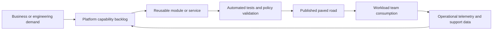
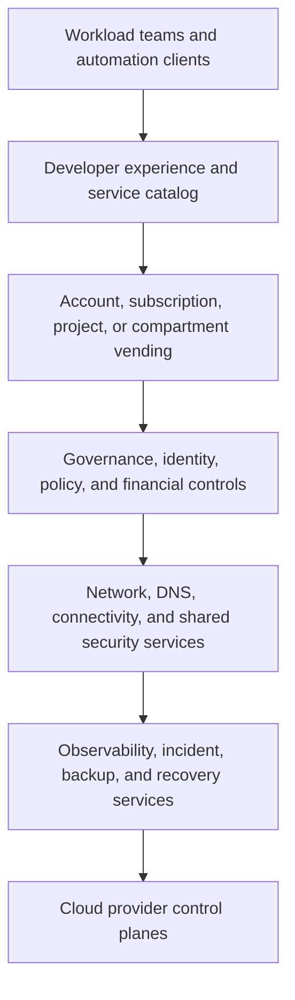

> **Document class:** Cloud Foundations & Governance architecture reference model
> **Normative terms:** **MUST**, **MUST NOT**, **SHOULD**, **SHOULD NOT**, and **MAY** are requirements levels.
> **Applicability:** Enterprise cloud platform strategy, product management, engineering, automation, self-service, and operational maturity.
> **Exception process:** Deviations require a documented risk assessment, compensating controls, named risk owner, and expiry date.

| Control field | Value |
|---|---|
| Document ID | `CFG-01` |
| Owner | Cloud Center of Excellence |
| Review cycle | At least annually and after material platform, provider, data, security, or operating-model changes |
| Evidence | Platform roadmap, service catalog, SLOs, adoption and reliability metrics, and architecture review records |

# Cloud Platform Engineering Principles

> **Decision in brief:** Treat the cloud platform as a versioned internal product with paved roads, measurable reliability, and explicit escape paths.

## Purpose

Cloud platform engineering turns cloud foundations into an internal product. The objective is not to centralize every deployment decision. It is to provide secure defaults, paved roads, automation, and operational services that let workload teams deliver quickly without recreating governance, networking, identity, and observability controls.

A platform is successful when teams can consume it through documented interfaces, receive predictable outcomes, and operate within clear boundaries. A large collection of scripts, tickets, and architecture diagrams is not a platform unless it has ownership, versioning, service levels, and measurable adoption.


## Document conventions

This article uses the following terms consistently:

- **Platform team**: the team that builds and operates shared cloud capabilities.
- **Workload team**: an application, data, product, or business team consuming the platform.
- **Landing zone**: a governed cloud environment prepared for workloads.
- **Guardrail**: a preventive, detective, or corrective control applied consistently through policy and automation.
- **Vending**: the automated creation and lifecycle management of subscriptions, accounts, projects, compartments, and their baseline configuration.

Provider examples are illustrative. The control objective is authoritative; the provider-specific implementation is replaceable.


## Core principles

### Treat the platform as a product

Define users, service boundaries, roadmaps, support models, and measurable outcomes. The platform backlog must be driven by workload-team friction, security requirements, regulatory obligations, and reliability data rather than by provider feature availability alone.

Minimum product artifacts include:

- a service catalog describing supported platform capabilities;
- versioned interfaces, templates, modules, and policies;
- onboarding and migration paths;
- service-level objectives for critical shared services;
- adoption, lead-time, reliability, and exception metrics;
- an explicit deprecation and upgrade policy.

### Prefer paved roads over unrestricted choice

A paved road is the supported way to complete a recurring task. It should be easier, safer, and faster than building an alternative. Examples include approved Terraform modules, account vending workflows, standard CI/CD pipelines, centralized identity federation, private connectivity patterns, and default logging integrations.

Paved roads are not absolute restrictions. Teams may leave the paved road when a documented requirement cannot be met, but the exception must be time-bound, risk-assessed, and assigned to an owner.

### Automate the control plane

Manual portal configuration does not scale and produces weak evidence. Organizational hierarchy, identity assignments, policies, network baselines, logging, budgets, and account creation should be managed through code and automated workflows.

Automation must be:

- idempotent and repeatable;
- peer reviewed;
- testable before deployment;
- traceable to an approved change;
- reversible or recoverable;
- protected by workload identity rather than long-lived credentials.

### Separate policy intent from provider implementation

Define controls using provider-neutral objectives, then map them to native services. For example, “public object storage is prohibited unless approved” is the objective. Azure Policy, AWS Organizations policies, GCP organization policies, and OCI Security Zones are implementations.

### Design for lifecycle, not initial deployment

Every platform capability requires an owner, upgrade path, monitoring model, failure mode, and retirement process. A landing zone that is easy to create but difficult to patch, audit, or close is incomplete.

### Make security the default path

Default configurations should implement least privilege, private connectivity where justified, encryption, centralized logging, vulnerability management, and policy enforcement. Security controls should be embedded in templates and pipelines rather than delivered as separate review gates whenever technically possible.

### Preserve workload autonomy within bounded contexts

Central teams should control enterprise-wide invariants: identity federation, hierarchy, baseline policy, audit logging, approved connectivity, billing integration, and emergency access. Workload teams should control application architecture and day-to-day delivery inside those boundaries.

## Platform value stream



The feedback loop is mandatory. Without consumption and operational telemetry, platform teams optimize assumptions rather than outcomes.

## Standard platform layers



| Platform layer | Enterprise responsibility | Typical provider implementations |
|---|---|---|
| Organization | Hierarchy, billing, delegated administration | Azure management groups, AWS Organizations, GCP organization/folders, OCI tenancy/compartments |
| Identity | Federation, privileged access, workload identity | Microsoft Entra ID, AWS IAM Identity Center, Cloud Identity/IAM, OCI IAM domains |
| Governance | Policy, compliance, exceptions, evidence | Azure Policy, AWS SCP/Config, Organization Policy/Policy Controller, OCI Cloud Guard/Security Zones |
| Connectivity | Transit, DNS, egress, private services | Azure Virtual WAN/Hub, AWS Transit Gateway, Network Connectivity Center, OCI DRG |
| Delivery | Templates, modules, pipelines, artifact controls | Terraform/OpenTofu, native IaC, GitHub Actions, Azure DevOps, GitLab CI, cloud-native pipelines |
| Operations | Logs, metrics, alerts, incidents, recovery | Native monitoring plus enterprise SIEM, ITSM, backup, and disaster-recovery tooling |

## Design decision framework

Use the following order when evaluating a platform capability:

1. Define the user problem and expected outcome.
2. Identify the enterprise invariant or risk constraint.
3. Determine the smallest reusable abstraction.
4. Decide which provider-native capability should remain visible to consumers.
5. Define the interface: portal, API, pull request, pipeline, or service catalog.
6. Specify ownership, support, SLOs, telemetry, and lifecycle.
7. Test with representative workloads before broad release.

## Platform API and contract model

A platform contract should define inputs, outputs, constraints, and ownership. For example, an account-vending request may require:

```yaml
request:
  workload_name: payments-api
  environment: production
  owner_group: payments-platform
  data_classification: confidential
  regions:
    - ca-central
  connectivity_profile: private-enterprise
  cost_center: CC-1042
  recovery_tier: tier-1
```

The platform should return stable identifiers, deployment status, policy results, network details, logging destinations, and lifecycle metadata. Provider-specific IDs may be returned, but request semantics should remain consistent across clouds.

## Engineering standards

### Repository and release standards

- Use separate repositories or clearly separated directories for organization controls, platform services, and workload templates.
- Pin provider and module versions.
- Publish release notes and migration guidance.
- Test upgrade paths against representative landing zones.
- Sign or verify released artifacts where the toolchain supports it.
- Prevent direct modification of production branches and control-plane resources.

### Testing pyramid

1. Static checks: formatting, schema, policy-as-code, secret detection.
2. Unit tests: module logic, naming, tags, generated configuration.
3. Integration tests: deploy to isolated test organizations or sandbox accounts.
4. Compliance tests: verify effective policy and evidence collection.
5. Resilience tests: test rollback, break-glass access, provider outages, and partial failures.

## Operating metrics

Measure outcomes rather than activity:

| Metric | Why it matters |
|---|---|
| Median vending lead time | Shows whether teams can start work without ticket delay |
| Percentage of accounts created through the platform | Measures control-plane coverage |
| Paved-road adoption | Shows whether the platform is useful, not merely available |
| Policy violation recurrence | Reveals whether controls correct root causes |
| Exception age and count | Identifies governance debt |
| Platform change failure rate | Measures release safety |
| Mean time to restore shared services | Measures operational resilience |
| Workload onboarding satisfaction | Detects friction not visible in technical telemetry |

## Anti-patterns

- **Portal-first administration**: changes are unreviewed, difficult to reproduce, and weakly evidenced.
- **Central team as deployment gatekeeper**: creates queues and removes workload accountability.
- **One module for every workload**: produces a rigid abstraction with excessive conditional logic.
- **Lowest-common-denominator multi-cloud platform**: hides useful native capabilities and creates a weak internal cloud.
- **Controls without remediation paths**: teams receive denials but no supported way to comply.
- **Permanent exceptions**: convert temporary risk acceptance into unmanaged architecture.
- **Platform without product management**: work is driven by internal preferences rather than user outcomes.

## Validation

- [ ] Platform users and priority journeys are documented.
- [ ] Supported capabilities are published in a service catalog.
- [ ] Organizational controls are automated and version controlled.
- [ ] Identity uses federation and short-lived workload credentials.
- [ ] Paved roads include examples, tests, upgrade guidance, and support ownership.
- [ ] Exceptions have expiry dates and accountable owners.
- [ ] Operational telemetry covers platform adoption, reliability, and compliance.
- [ ] Provider-specific services are exposed where they create material value.
- [ ] Platform releases use staged validation and rollback procedures.

## Golden paths, extension points, and escape hatches

A paved road must define where consumers may extend it without forking the platform. Treat each supported capability as a contract with three layers:

| Layer | Platform commitment | Consumer responsibility |
|---|---|---|
| Mandatory baseline | Identity, audit, policy, metadata, secure defaults | Must not bypass or disable |
| Configurable options | Supported regions, sizes, resilience tiers, network profiles | Select values within documented limits |
| Extension points | Workload-specific modules, hooks, policy additions | Own testing, support, and lifecycle |

Free-form shell commands, arbitrary policy exclusions, and unrestricted module overrides are not valid extension points. They transfer hidden platform risk to consumers and make upgrades unpredictable.

An escape hatch must identify the unmet requirement, alternative design, risk owner, support boundary, review date, and migration path back to a supported pattern. The platform team should analyze repeated escape-hatch requests as product evidence. If several teams need the same exception, the platform catalog is probably incomplete.

## Platform maturity model

Use a capability maturity model to avoid declaring the platform complete after initial deployment.

| Stage | Characteristics | Exit criteria |
|---|---|---|
| Scripted | Engineer-operated scripts and manual approvals | Repeatable code, ownership, basic tests |
| Standardized | Versioned modules and documented patterns | Common interfaces and baseline policy |
| Self-service | Vending and supported consumer workflows | Automated acceptance tests and support model |
| Managed product | SLOs, telemetry, roadmap, deprecation, unit cost | Measured adoption and reliability |
| Adaptive | Data-driven improvement and automated safe remediation | Low exception recurrence and tested resilience |

Maturity is capability-specific. Account vending may be adaptive while network exception handling remains manual. Report maturity by service rather than assigning one optimistic score to the entire platform.

## Consumer onboarding and architecture feedback

A platform should provide a defined onboarding journey:

1. Classify the workload, environment, data, connectivity, and recovery requirements.
2. Select the nearest supported product profile.
3. Validate identity groups, funding, and ownership.
4. Provision through vending and run acceptance tests.
5. Deploy a representative workload through the approved delivery path.
6. Record unresolved gaps, exception decisions, and support ownership.
7. Review the first production release and feed findings into the platform backlog.

Architecture reviews should focus on deviations and high-impact dependencies rather than re-approving standard patterns. The objective is to make common work routine and reserve expert review for genuinely exceptional risk.

## Related topics

- [Designing an Azure Landing Zone as a Product](designing-an-azure-landing-zone-as-a-product.md)
- [AWS and OCI Landing Zone Patterns](aws-and-oci-landing-zone-patterns.md)
- [Multi-Cloud Architecture and Governance](multi-cloud-architecture-and-governance.md)
- [Platform Ownership and Operating Model](platform-ownership-and-operating-model.md)
