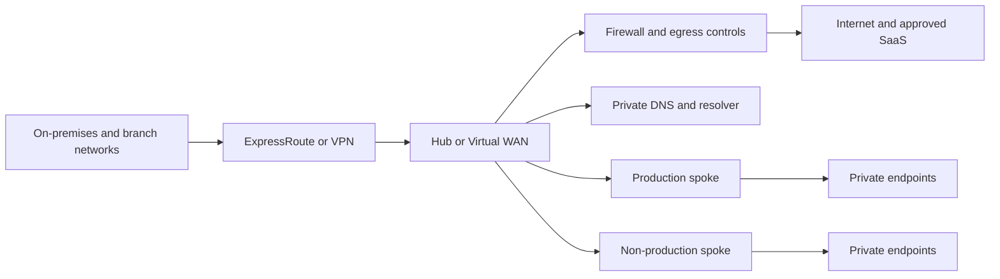
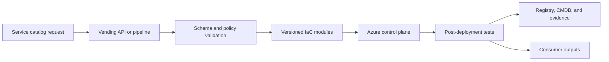

> **文档类型：** 云基础和治理实施指南
> **规范性术语：** **MUST**、**MUST NOT**、**SHOULD**、**SHOULD NOT** 和 **MAY** 是要求级别。
> **适用范围：** Azure 落地工作区产品设计、交付、运营、版本控制、服务级别和工作负载入驻。
> **例外流程：** 偏离要求需要记录风险评估、补偿控制、指定风险负责人和到期日期。

|控制领域|价值|
|---|---|
|文件编号 | `CFG-02` |
|负责人|云卓越中心 |
|审核周期|至少每年一次，并且在重大平台、提供商、数据、安全或运营模式发生变化之后 |
|证据|产品目录、基线清单、兼容性日志、服务级别和操作验收测试 |

# 将 Azure 落地工作区设计为产品

> **简要决定：** 将 Azure 落地工作区作为版本化平台产品提供，具有自助服务入驻、兼容性门和可度量的服务级别。

## 目的

Azure 落地工作区不是一次性层次结构和网络部署。它是一个持续管理的平台产品，为工作负载团队提供受管理的订阅、身份集成、连接、安全控制、可观测性和生命周期服务。

产品模型很重要，因为 Landing Zone 域会发生变化。 Azure 服务不断发展，策略不断修订，网络需求不断扩大，工作负载团队需要更安全的自助服务。静态的“基础项目”通常会退化为未记录的异常和手动操作。


## 文档约定

本文一致使用以下术语：

- **平台团队**：构建和运营共享云能力的团队。
- **工作负载团队**：使用平台的应用、数据、产品或业务团队。
- **Landing Zone**：为工作负载准备的受管云环境。
- **护栏**：通过策略和自动化一致应用的预防性、检测性或纠正性控制。
- **自动发放**：订阅、账户、项目、隔间及其基线配置的自动创建和生命周期管理。

提供商示例是说明性的。控制目标具有权威性；特定于提供商的实现是可替换的。


## 产品定义

Azure 落地工作区产品应发布少量的使用配置文件，而不是一组不受限制的组件。

|产品简介 |预期用途 |典型控制|
|---|---|---|
|互联生产 |需要私有连接和中央安全集成的企业工作负载|中心连接、集中式 DNS、强制诊断、限制性策略、生产支持 |
|互联非生产 |需要企业集成的开发和测试工作负载|共享连接、低成本弹性、更广泛的开发人员权限 |
|隔离沙箱|具有严格成本和数据限制的实验和培训|无企业路由传播、有效期短、限制区域/SKU、自动关闭 |
|协调工作负载|具有增强证据、数据或隔离要求的工作负载 |专用的层次结构、更强有力的策略、限制区域、额外的日志记录和批准 |

每个配置文件必须定义资格、输入、输出、继承控制、服务级别、成本责任和退出路径。

## 参考架构


确切的层次结构取决于规模和监管。不要仅仅为了反映组织结构图而创建管理组。在策略、访问权限或生命周期存在重大差异的地方创建它们。

## 产品能力

### 订阅发放

自动预配工作流应创建和配置无需门户门票的订阅。至少应该：

- 创建订阅或将其与正确的计费范围关联；
- 将其置于正确的管理组中；
- 分配所有者和操作员组；
- 应用预算、联系人、标签和元数据；
- 配置活动日志导出和诊断基线；
- 连接到选定的网络配置文件；
- 注册所需的资源提供商；
- 部署基线资源组和自动化身份；
- 在配置注册表或 CMDB 中记录订阅；
- 返回验证结果和操作联系人。

### 身份和访问

使用 Microsoft Entra 组进行人员访问和托管身份或工作负载身份联合以实现自动化。避免特定于用户的角色分配和长期存在的服务主体机密。特权角色应在支持的情况下使用资格、批准和时间限制。

推荐的访问边界：

- 租户和平台管理范围内的平台所有者；
- 具有读取、策略和响应权限的中央安全团队；
- 共享连接范围的网络团队；
- 其订阅或资源组范围内的工作负载团队；
- 正常联盟依赖性之外的紧急访问账户。

### 网络连接

Landing Zone 产品应提供记录在案的连接配置文件。常见选项包括：

1. 具有集中出口和 DNS 的中心辐射式。
2. Azure Virtual WAN，用于大规模或地理分布的连接。
3、隔离订阅，无企业路由。
4. 具有专门检查和路由控制的监管飞地。

默认情况下不要连接每个订阅。连接性增加了爆炸半径、DNS 耦合、路由复杂性和事件影响。

### 策略与合规性

使用与控制目标一致的 Azure Policy 计划。将策略分为：

- 全球强制控制；
- 特定于配置文件的控制；
- 仅监控和审计控制；
- 修复或配置资源的部署控制；
- 正在评估临时预览控制。

策略分配应通过策略即代码进行部署。豁免需要理由、所有者、范围、补偿控制和有效期。

### 管理和可观测性

确定哪些遥测是集中式的，哪些遥测仍由工作负载负责。集中审计、安全和平台运行状况数据。如果满足保留、访问和导出要求，工作负载应用日志可能保留在工作负载负责的工作区中。

基线应包括：

- Azure Activity Log 导出；
- 策略合规数据；
- Defender for Cloud 配置（已获取许可和批准）；
- 关键平台服务的诊断设置；
- 服务健康和资源健康路由；
- 预算告警和异常处理；
- 清单和所有权元数据；
- 备份和恢复策略集成。

## 多云控制映射

|控制目标| Azure 实施 |类似的 AWS、GCP 或 OCI 模式 |
|---|---|---|
|组织架构|管理组和订阅| AWS OU/账户、Google 文件夹/项目、OCI 隔间 |
|预防策略| Azure Policy 拒绝/修改/deployIfNotExists | AWS SCP、Google Organization Policy、OCI Security Zones |
|中央审计日志|活动日志导出和诊断设置 | AWS CloudTrail、GCP 审计日志、OCI Audit |
|联合人员访问 | Microsoft Entra ID 和 PIM | IAM Identity Center、Cloud Identity/IAM、OCI IAM domains |
|工作负载身份|托管身份和联合凭证 | IAM 角色、工作负载身份联合、OCI 实例/资源主体 |
|网络中转|中心辐射或 Virtual WAN |Transit Gateway、Network Connectivity Center、OCI DRG |

产品接口和治理目标应在跨云中保持一致，但实施细节应保持提供商原生。

## 交付架构

建议的仓库分离：

- 租户和管理组层次结构；
- 策略定义和分配；
- 平台订阅和共享服务；
- 订阅发放工作流程；
- 工作负载参考实现；
- 操作手册和测试。

## 生命周期状态

|状态|所需行为|
|---|---|
|已请求 |验证所有权、资金、数据分类、环境和连接需求 |
|预配|应用层次结构、访问权限、策略、预算、日志记录和网络基线 |
|活跃|监控合规性、所有权、成本和平台兼容性 |
|受限制 |防止新部署，同时保留调查或迁移所需的访问权限 |
|退役 |删除路由和特权访问、保留日志、导出所需数据以及取消资源 |
|关闭 |确认账单关闭、证据保留和注册状态 |

## 升级和版本控制模型

Landing Zone 产品应使用显式版本。变更应分类为：

- **不间断**：新的可选功能或更严格的诊断不会中断工作负载；
- **行为**：需要工作负载测试的默认更改；
- **破坏**：需要迁移规划的策略、网络、身份或层次结构更改。

使用金丝雀订阅、非生产队列和分阶段管理组部署。在未测试其有效影响的情况下，请勿在大范围内分配新的拒绝策略。

## 服务级别目标

示例：

- 95%的标准订阅请求在30分钟内自动完成；
- 平台 DNS 和中转服务满足记录在案的可用性目标；
- 15 分钟内检测到关键策略部署失败；
- 所有权元数据的完整性保持在 98% 以上；
- 过期的豁免在过期前被删除或更新；
- 支持的 Landing Zone 版本保留在已发布的维护窗口内。

## 反模式

- 为不相关的工作负载构建单一的“企业订阅”。
- 使用管理组来镜像部门，没有控制差异。
- 将订阅所有者直接授予个人。
- 无限期地仅在审核模式下使用策略。
- 集中所有应用日志，无需成本和访问模型。
- 默认情况下将沙箱连接到企业网络。
- 将 Landing Zone 部署视为完整，无需生命周期自动化。
- 每个工作负载分叉核心模块，而不是维护版本化产品。

## 验证

- [ ] 记录 Landing Zone 概况和资格。
- [ ] 订阅自动发放并返回证据。
- [ ] 管理组放置遵循控制边界。
- [ ] 人员和工作负载访问使用联邦身份。
- [ ] 连接配置文件是明确的并经过测试。
- [ ] 策略分配和豁免通过策略即代码进行管理。
- [ ] 审计、安全、成本、所有权和运行状况遥测得到适当集中。
- [ ] 存在升级、回滚和停用程序。
- [ ] 映射多云控制目标，无需强制实施相同的实施。

## 订阅配置文件和个人文档覆盖
订阅产品线应该将稳定的基础与小的、明确的覆盖结合起来。该基础通常提供层次结构放置、活动日志导出、所有权元数据、预算配置、部署标识、基线策略和支持注册。

典型的叠加包括：

|覆盖|额外成果 |
|---|---|
|已连接 |中心或 Virtual WAN 连接、私有 DNS、受控出口 |
|面向互联网|批准的入口、WAF、证书、DDoS、公共 DNS 工作流程 |
|受监管|限制区域、增强保留、更强特权和证据 |
|数据平台|私有数据服务、更高的吞吐量、数据血缘和恢复控制|
|沙盒|过期、SKU 有限、航线受限、自动关闭 |

不要为每个工作负载偏好创建单独的产品线。仅当策略、访问、连接、生命周期或支持承诺存在重大差异时才创建一个。

## 基线配置清单

对于每个订阅，保留预期基线的机器可读清单：
```yaml
landing_zone_version: 3.4.0
subscription_profile: connected-production
management_group: landing-zones/corp/production
network_profile: regional-hub-canada
policy_profile: enterprise-production
diagnostic_profile: central-security-and-local-operations
identity_profile: workload-rbac-v2
owners:
  technical: payments-platform
  business: finance-operations
acceptance_revision: 2026-08-04.1
```
清单应识别配置文件版本，而不是复制每个生成的设置。协调会比较清单、有效的 Azure 配置和批准的例外。这支持机群升级并解释了为什么两个订阅存在合理差异。

## 升级环和兼容性

使用部署环来更改 Landing Zone：

1.平台工程沙箱。
2. 自动集成订阅。
3. 金丝雀非生产订阅。
4. 广泛的非生产群体。
5. 低关键性生产队列。
6、生产关键性高、规范化。

每个版本都需要策略、网络、身份、监控和自动发放模块的兼容性标准。记录目标版本、订阅、阻止依赖项、所有者、补偿控制和所需的迁移日期。

高范围的 Azure Policy、路由、DNS、角色和诊断更改应具有明确的暂停条件。当部署失败、意外拒绝、遥测差距或工作负载 SLO 降级超过发布阈值时，必须停止推出。

## 操作验收测试

仅在证明有效行为后，预配置订阅才准备就绪。最低限度的测试应确认：

- 预期的管理层血统和策略分配；
- 部署身份可以执行预期的操作，但不能更改平台护栏；
- 活动日志和所需的诊断信息到达目的地；
- DNS 和路由与所选的连接配置文件相匹配；
- 禁止的公开暴露被拒绝或检测到；
- 存在预算、所有权、Defender 和清单日志记录；
- 示例 IaC 部署可以创建和删除已批准的测试资源；
- 授权操作员可以调用限制或退役操作。

将验收结果与 Landing Zone 版本和订阅记录一起存储。

## 相关主题

- [云平台工程原则](cloud-platform-engineering-principles.md)
- [管理组、账户与组织结构](management-groups-accounts-and-organizational-structure.md)
- [订阅与账户发放](subscription-and-account-vending.md)
- [策略、护栏和合规性](policy-guardrails-and-compliance.md)
