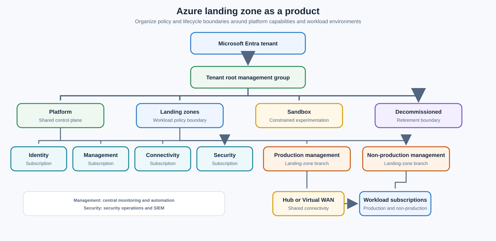
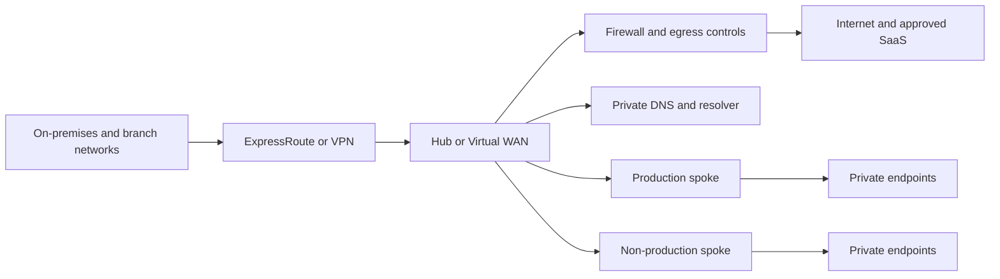
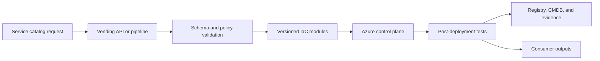

> **Document class:** Cloud Foundations & Governance implementation guide
> **Normative terms:** **MUST**, **MUST NOT**, **SHOULD**, **SHOULD NOT**, and **MAY** are requirements levels.
> **Applicability:** Azure landing-zone product design, delivery, operations, versioning, service levels, and workload onboarding.
> **Exception process:** Deviations require a documented risk assessment, compensating controls, named risk owner, and expiry date.

| Control field | Value |
|---|---|
| Document ID | `CFG-02` |
| Owner | Cloud Center of Excellence |
| Review cycle | At least annually and after material platform, provider, data, security, or operating-model changes |
| Evidence | Product catalog, baseline manifest, compatibility records, service levels, and operational acceptance tests |

# Designing an Azure Landing Zone as a Product

> **Decision in brief:** Deliver the Azure landing zone as a versioned platform product with self-service onboarding, compatibility gates, and measurable service levels.

## Purpose

An Azure landing zone is not a one-time hierarchy and network deployment. It is a continuously managed platform product that provides governed subscriptions, identity integration, connectivity, security controls, observability, and lifecycle services to workload teams.

The product model matters because landing zones change. Azure services evolve, policies are revised, network requirements expand, and workload teams need safer self-service. A static “foundation project” usually degrades into undocumented exceptions and manual operations.


## Document conventions

This article uses the following terms consistently:

- **Platform team**: the team that builds and operates shared cloud capabilities.
- **Workload team**: an application, data, product, or business team consuming the platform.
- **Landing zone**: a governed cloud environment prepared for workloads.
- **Guardrail**: a preventive, detective, or corrective control applied consistently through policy and automation.
- **Vending**: the automated creation and lifecycle management of subscriptions, accounts, projects, compartments, and their baseline configuration.

Provider examples are illustrative. The control objective is authoritative; the provider-specific implementation is replaceable.


## Product definition

The Azure landing-zone product should publish a small number of consumption profiles rather than an unrestricted set of components.

| Product profile | Intended use | Typical controls |
|---|---|---|
| Connected production | Enterprise workloads requiring private connectivity and central security integration | Hub connectivity, centralized DNS, mandatory diagnostics, restrictive policy, production support |
| Connected non-production | Development and test workloads requiring enterprise integration | Shared connectivity, lower-cost resilience, broader developer permissions |
| Isolated sandbox | Experiments and training with strict cost and data limits | No enterprise route propagation, short expiry, limited regions/SKUs, automatic shutdown |
| Regulated workload | Workloads with enhanced evidence, data, or segregation requirements | Dedicated hierarchy, stronger policy, restricted regions, additional logging and approvals |

Each profile must define eligibility, inputs, outputs, inherited controls, service levels, cost responsibilities, and an exit path.

## Reference architecture



The exact hierarchy depends on scale and regulation. Do not create management groups solely to mirror an organization chart. Create them where policy, access, or lifecycle differs materially.

## Product capabilities

### Subscription vending

The vending workflow should create and configure subscriptions without portal tickets. At minimum it should:

- create or associate the subscription with the correct billing scope;
- place it in the correct management group;
- assign owner and operator groups;
- apply budgets, contacts, tags, and metadata;
- configure activity-log export and diagnostic baselines;
- connect to the selected network profile;
- register required resource providers;
- deploy baseline resource groups and automation identities;
- record the subscription in the configuration registry or CMDB;
- return validation results and operational contacts.

### Identity and access

Use Microsoft Entra groups for human access and managed identities or workload identity federation for automation. Avoid user-specific role assignments and long-lived service-principal secrets. Privileged roles should use eligibility, approval, and time limits where supported.

Recommended access boundaries:

- platform owners at tenant and platform-management scopes;
- central security teams with read, policy, and response permissions;
- network teams at shared connectivity scopes;
- workload teams at their subscription or resource-group scopes;
- emergency access accounts outside normal federation dependencies.

### Network connectivity

A landing-zone product should offer documented connectivity profiles. Common options include:

1. Hub-and-spoke with centralized egress and DNS.
2. Azure Virtual WAN for large-scale or geographically distributed connectivity.
3. Isolated subscription with no enterprise routes.
4. Regulated enclave with dedicated inspection and route controls.

Do not connect every subscription by default. Connectivity increases blast radius, DNS coupling, route complexity, and incident impact.



### Policy and compliance

Use Azure Policy initiatives aligned to control objectives. Separate policies into:

- global mandatory controls;
- profile-specific controls;
- monitoring and audit-only controls;
- deployment controls that remediate or configure resources;
- temporary preview controls under evaluation.

Policy assignments should be deployed through code. Exemptions require justification, owner, scope, compensating controls, and expiration.

### Management and observability

Decide which telemetry is centralized and which remains workload-owned. Centralize audit, security, and platform health data. Workload application logs may remain in workload-owned workspaces if retention, access, and export requirements are met.

The baseline should include:

- Azure Activity Log export;
- policy compliance data;
- Defender for Cloud configuration where licensed and approved;
- diagnostic settings for critical platform services;
- service health and resource health routing;
- budget alerts and anomaly handling;
- inventory and ownership metadata;
- backup and recovery policy integration.

## Multi-cloud control mapping

| Control objective | Azure implementation | Comparable AWS, GCP, or OCI pattern |
|---|---|---|
| Organizational hierarchy | Management groups and subscriptions | AWS OUs/accounts, Google folders/projects, OCI compartments |
| Preventive policy | Azure Policy deny/modify/deployIfNotExists | AWS SCP, Google Organization Policy, OCI Security Zones |
| Central audit logs | Activity Log export and diagnostic settings | AWS CloudTrail, GCP Audit Logs, OCI Audit |
| Federated human access | Microsoft Entra ID and PIM | IAM Identity Center, Cloud Identity/IAM, OCI IAM domains |
| Workload identity | Managed identity and federated credentials | IAM roles, Workload Identity Federation, OCI instance/resource principals |
| Network transit | Hub-spoke or Virtual WAN | Transit Gateway, Network Connectivity Center, OCI DRG |

The product interface and governance objective should be consistent across clouds, but implementation details should remain provider native.

## Delivery architecture



Recommended repository separation:

- tenant and management-group hierarchy;
- policy definitions and assignments;
- platform subscriptions and shared services;
- subscription-vending workflow;
- workload reference implementations;
- operational runbooks and tests.

## Lifecycle states

| State | Required behavior |
|---|---|
| Requested | Validate ownership, funding, data classification, environment, and connectivity need |
| Provisioning | Apply hierarchy, access, policy, budget, logging, and network baseline |
| Active | Monitor compliance, ownership, cost, and platform compatibility |
| Restricted | Prevent new deployment while preserving required access for investigation or migration |
| Decommissioning | Remove routes and privileged access, retain records, export required data, and cancel resources |
| Closed | Confirm billing closure, evidence retention, and registry status |

## Upgrade and versioning model

The landing-zone product should use explicit versions. Changes should be classified as:

- **non-breaking**: new optional capabilities or stricter diagnostics that do not interrupt workloads;
- **behavioral**: default changes requiring workload testing;
- **breaking**: policy, networking, identity, or hierarchy changes requiring migration planning.

Use canary subscriptions, non-production cohorts, and staged management-group rollout. Do not assign a new deny policy at a high scope without testing its effective impact.

## Service-level objectives

Examples:

- 95% of standard subscription requests completed automatically within 30 minutes;
- platform DNS and transit services meet documented availability targets;
- critical policy deployment failures detected within 15 minutes;
- ownership metadata remains above 98% completeness;
- expired exemptions are removed or renewed before expiration;
- supported landing-zone versions remain within the published maintenance window.

## Anti-patterns

- Building a single “enterprise subscription” for unrelated workloads.
- Using management groups to mirror departments with no control difference.
- Granting subscription Owner directly to individuals.
- Using policy only in audit mode indefinitely.
- Centralizing all application logs without a cost and access model.
- Connecting sandboxes to enterprise networks by default.
- Treating landing-zone deployment as complete without lifecycle automation.
- Forking core modules per workload instead of maintaining versioned products.

## Validation

- [ ] Landing-zone profiles and eligibility are documented.
- [ ] Subscription vending is automated and returns evidence.
- [ ] Management-group placement follows control boundaries.
- [ ] Human and workload access use federated identities.
- [ ] Connectivity profiles are explicit and tested.
- [ ] Policy assignments and exemptions are managed through code.
- [ ] Audit, security, cost, ownership, and health telemetry are centralized appropriately.
- [ ] Upgrade, rollback, and decommissioning procedures exist.
- [ ] Multi-cloud control objectives are mapped without forcing identical implementations.

## Subscription archetypes and profile overlays

A subscription product line should combine a stable base with small, explicit overlays. The base normally provides hierarchy placement, Activity Log export, ownership metadata, budget configuration, deployment identity, baseline policy, and support registration.

Typical overlays include:

| Overlay | Additional outcome |
|---|---|
| Connected | Hub or Virtual WAN attachment, private DNS, controlled egress |
| Internet-facing | Approved ingress, WAF, certificate, DDoS, public-DNS workflow |
| Regulated | Restricted regions, enhanced retention, stronger privilege and evidence |
| Data platform | Private data services, higher throughput, lineage and recovery controls |
| Sandbox | Expiry, limited SKUs, restricted routes, automatic shutdown |

Do not create a separate product line for every workload preference. Create one only when policy, access, connectivity, lifecycle, or support commitments differ materially.

## Baseline configuration manifest

For each subscription, retain a machine-readable manifest of the intended baseline:

```yaml
landing_zone_version: 3.4.0
subscription_profile: connected-production
management_group: landing-zones/corp/production
network_profile: regional-hub-canada
policy_profile: enterprise-production
diagnostic_profile: central-security-and-local-operations
identity_profile: workload-rbac-v2
owners:
  technical: payments-platform
  business: finance-operations
acceptance_revision: 2026-08-04.1
```

The manifest should identify the profile version rather than copy every generated setting. Reconciliation compares the manifest, effective Azure configuration, and approved exceptions. This supports fleet upgrades and explains why two subscriptions legitimately differ.

## Upgrade rings and compatibility

Use deployment rings for landing-zone changes:

1. Platform engineering sandbox.
2. Automated integration subscriptions.
3. Canary non-production subscriptions.
4. Broad non-production cohort.
5. Low-criticality production cohort.
6. High-criticality and regulated production.

Each release requires compatibility criteria for policy, network, identity, monitoring, and vending modules. Record subscriptions that cannot adopt the target version, the blocking dependency, owner, compensating control, and required migration date.

High-scope Azure Policy, route, DNS, role, and diagnostic changes should have an explicit pause condition. The rollout must stop when deployment failures, unexpected denials, telemetry gaps, or workload SLO degradation exceed the release threshold.

## Operational acceptance tests

A provisioned subscription is ready only after effective behavior is proven. Minimum tests should confirm:

- expected management-group ancestry and policy assignments;
- deployment identity can perform intended actions but cannot alter platform guardrails;
- Activity Log and required diagnostics arrive at their destinations;
- DNS and routing match the selected connectivity profile;
- prohibited public exposure is denied or detected;
- budget, ownership, Defender, and inventory records are present;
- a sample IaC deployment can create and remove an approved test resource;
- restricted or decommissioning actions can be invoked by authorized operators.

Store the acceptance result with the landing-zone version and subscription record.

## Related topics

- [Cloud Platform Engineering Principles](cloud-platform-engineering-principles.md)
- [Management Groups, Accounts, and Organizational Structure](management-groups-accounts-and-organizational-structure.md)
- [Subscription and Account Vending](subscription-and-account-vending.md)
- [Policy, Guardrails, and Compliance](policy-guardrails-and-compliance.md)
