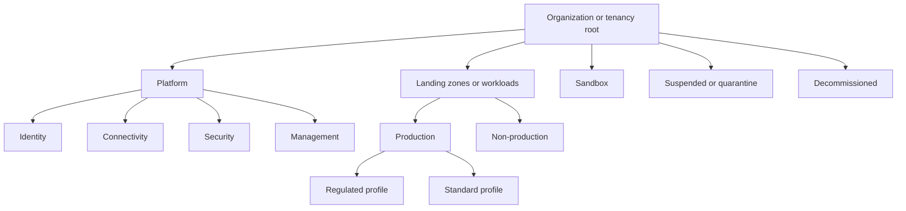
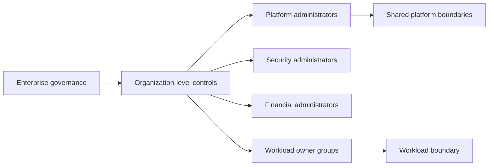

> **文档类型：** 云基础和治理实施指南
> **规范性术语：** **MUST**、**MUST NOT**、**SHOULD**、**SHOULD NOT** 和 **MAY** 是要求级别。
> **适用范围：** Azure 管理组和订阅、AWS Organizations 和账户、GCP 文件夹和项目以及 OCI 租户和隔间。
> **例外流程：** 偏离要求需要记录风险评估、补偿控制、指定风险负责人和到期日期。

|控制领域|价值|
|---|---|
|文件编号 | `CFG-05` |
|负责人|云卓越中心 |
|审核周期|至少每年一次，并且在重大平台、提供商、数据、安全或运营模式发生变化之后 |
|证据|层次结构注册表、策略祖先、访问授权、计费映射和结构迁移日志记录 |

# 管理组、账户与组织结构

> **决策简述：** 围绕策略、访问、计费、生命周期和爆炸半径边界形成层次结构，而不是更改组织结构图。

## 目的

云组织结构决定策略继承、访问边界、计费分配、委派管理和工作负载爆炸半径。糟糕的等级制度会造成广泛的特权、重复的策略、复杂的迁移和模糊的所有权。

层次结构应围绕控制差异和生命周期状态进行设计，而不是围绕每个部门、项目或报告线变更进行设计。


## 文档约定

本文一致使用以下术语：

- **平台团队**：构建和运营共享云能力的团队。
- **工作负载团队**：使用平台的应用、数据、产品或业务团队。
- **Landing Zone**：为工作负载准备的受管云环境。
- **护栏**：通过策略和自动化一致应用的预防性、检测性或纠正性控制。
- **自动发放**：订阅、账户、项目、隔间及其基线配置的自动创建和生命周期管理。

提供商示例是说明性的。控制目标具有权威性；特定于提供商的实现是可替换的。


## 提供商资源层次结构

|提供商|顶层构造 |分组构造 |常见工作负载边界 |
|---|---|---|---|
|Azure|Microsoft Entra 租户|管理组|订阅 |
|AWS |组织|组织单位|账户 |
| GCP |组织|文件夹|项目|
|OCI |租户 |隔间|隔间或单独租户，取决于隔离要求 |

这些边界并不等同。例如，AWS 账户是比 OCI 隔间更强的隔离和配额边界。

## 设计原则

### 最小化层次结构深度

每个级别都会增加策略继承、访问评估、命名、自动化和故障排除的复杂性。仅当以下至少一项发生更改时才创建关卡：

- 策略或合规基线；
- 授权管理；
- 生命周期状态；
- 连接模型；
- 计费或法律边界；
- 区域或主权限制。

### 独立的平台和工作负载
共享身份、网络、安全、管理和可观测性功能应驻留在专用平台边界内。工作负载团队不应管理审计或约束他们的系统。

### 将生产和非生产分开，控制不同

生产通常需要更强的访问、变更、恢复和策略控制。当这些控制在组织级别继承时，在结构上将其分离。如果唯一的区别是资源名称，则不要创建单独的层次结构级别。

### 包括生命周期容器

创建明确的沙箱、隔离或暂停和退役位置。将边界移动到这些容器之一应该会以可预测的方式改变策略和访问。

## 参考层次结构

这是一个控制模型，而不是强制的精确树。提供商的限制和企业规模可能需要不同的形状。

## Azure 管理组和订阅

使用管理组来继承策略和访问权限。使用订阅作为工作负载、环境、计费和配额边界。避免嵌套超出管理员可以快速推理的范围。

管理组范围内建议的控制包括：

- 允许的区域和资源类型；
- 强制诊断和安全配置；
- 网络暴露限制；
- 特权角色限制；
- 批准的身份和密钥管理模式；
- 合规举措。

订阅级控制包括工作负载所有权、预算、本地角色分配和特定于工作负载的策略扩展。

## AWS Organizations 和账户

使用组织单位对具有通用 SCP 和服务集成的账户进行分组。使用账户实现强隔离、配额、计费和运营所有权。

专用账户通常包括：

- 组织管理；
- 日志存档；
- 安全工具；
- 网络和 DNS；
- 共享服务；
- 部署工具；
- 单独的生产和非生产工作负载。

不要将普通工作负载放置在管理账户或安全日志存档中。

## GCP 组织、文件夹和项目

使用文件夹进行策略和 IAM 继承，并使用项目作为工作负载和计费相关的资源边界。共享网络可以将共享 VPC 宿主项目与服务项目一起使用。

文件夹设计应区分平台、生产、非生产、沙箱和控制不同的受监管工作负载。防止在发放流程之外创建不受控制的项目。

## OCI 租户和隔间

使用隔间实现组织、策略范围、配额和委派管理。保持层次结构浅显易懂。如果法律、账单、身份或隔离要求超出了隔间所能提供的范围，请考虑单独租户。

通用结构使用顶级平台、生产、非生产、沙箱和退役隔间，以及特定于工作负载的子隔间。

## 委托管理

授权必须遵循最小特权和职责分离：

- 企业治理控制层次结构和强制性策略；
- 平台团队管理共享服务和发放；
- 安全团队收到证据和响应权限；
- 财务团队管理账单、预算和分配数据；
- 工作负载团队在其指定范围内管理资源；
- 紧急访问受到限制、监控和测试。

## 环境隔离

慎重选择环境模型：

|模型|优势 |风险 |
|---|---|---|
|每个环境都有单独的边界 |强大的通道、策略、成本和爆炸半径分离 |更多账户/项目/订阅和共享服务集成 |
|共享非生产边界|降低小团队的管理费用 |所有权、配额和爆炸半径分离较弱|
|共享生产边界|很少合适|广泛的特权、困难的成本分配、高事件影响 |

生产工作负载通常应该有专用的强边界。仅当所有权和风险明确时，小型开发环境才可能共享非生产边界。

## 结构决策记录

记录每个主要层次结构级别：
```yaml
node: production-regulated
purpose: Hosts production workloads subject to enhanced data and audit controls.
inherited_controls:
  - restricted_regions
  - mandatory_private_connectivity
  - enhanced_log_retention
administration:
  platform_owner: cloud-platform
  security_owner: cyber-governance
allowed_children:
  - workload-boundary
lifecycle:
  movement_requires_approval: true
```
## 搬迁和重组

组织变动可以改变有效的策略、路由、服务集成和访问。将移动视为生产变化：

1. 在移动之前评估继承的策略和 IAM。
2. 在有代表性的非生产边界中进行测试。
3. 验证日志记录和安全服务的连续性。
4. 确认计费和承诺影响。
5. 通过代码或受控自动化执行。
6. 运行移动后合规性和连接测试。
7. 保留审计日志记录和回滚计划。

## 反模式

- 准确反映人类组织结构图。
- 为每个应用创建一个层次结构级别。
- 在同一管理边界下混合平台和工作负载资源。
- 为工作负载团队分配广泛的根级角色。
- 仅通过一个大账户内的资源标签创建单独的环境。
- 省略暂停和退役的生命周期位置。
- 手动移动边界而不评估继承的控件。
- 假设账户、项目、订阅和隔间边界是等效的。

## 验证

- [ ] 每个层次结构级别都有记录在案的控制或生命周期目的。
- [ ] 平台、工作负载、沙箱、暂停和退役边界是不同的。
- [ ] 生产分离符合风险和运营需求。
- [ ] 根或组织级权限受到严格限制。
- [ ] 工作负载团队仅在其负责的边界内委派访问权限。
- [ ] 强制执行计费、所有权和环境元数据。
- [ ] 结构变更经过测试并实现自动化。
- [ ] 记录了特定于提供商的隔离限制。
- [ ] 层次结构图和决策记录是最新的。

## 层次结构规模和容量规划

组织结构具有提供商限制和运营成本。计划：

- 预期账户、订阅、项目、隔间和文件夹增长；
- 策略和 IAM 继承评估；
- 委派管理员和服务注册范围；
- 计费和配额边界；
- 自动化并发和配置率；
- 移动或重新划分边界所需的时间；
- 大规模集群清单和证据收集。

为未来的监管、区域、采购和生命周期配置文件保留层次结构空间。不要创造没有控制目的的投机水平，而要避免一棵只能通过破坏性重组才能生长的树。

## 委托管理护栏

委派的管理员应该收到明确的能力上限。设计必须说明它们是否可以：

- 分配本地角色以及分配给哪些组；
- 创建子边界；
- 连接网络或共享服务；
- 创建公共端点；
- 管理密钥、机密和证书；
- 变更记录目的地或保留；
- 请求策略例外；
- 移动或删除边界。

使用提供商原生拒绝控制、权限边界、条件和策略继承来强制执行上限。文档本身并不是授权控制。

## 结构迁移手册
在移动订阅、账户、项目或隔间之前，为策略、IAM、日志、网络、安全服务注册、计费和配额生成生效前/生效后报告。

迁移计划应包括：

1. 依赖性和所有者确认。
2. 目标层次结构和配置文件验证。
3.有效对照比较。
4. 非生产演练或隔离测试边界。
5. 更改冻结和回滚标准。
6. 自动移动或重新关联。
7. 迁移后的接入、网络、证据和计费测试。
8. 注册表和图表更新。

某些提供程序的移动不是完全可逆的，或者可能会留下继承的配置漂移。将回滚可行性视为已验证的事实，而不是假设。

## 权威盘点

维护一个注册表，将每个强大的云边界映射到：

- 稳定的工作负载或平台标识符；
- 层次结构路径；
- 环境和生命周期状态；
- 业务、技术、安全和财务所有者；
- Landing Zone 或基线版本；
- 数据分类和重要性；
- 网络和恢复配置文件；
- 批准的例外情况；
- 创建、审查和停用日期。

提供商层次结构是一种执行结构，而不是完整的所有权数据库。不断地与注册表进行协调。

## 相关主题

- [将 Azure 落地工作区设计为产品](designing-an-azure-landing-zone-as-a-product.md)
- [AWS 和 OCI Landing Zone 模式](aws-and-oci-landing-zone-patterns.md)
- [订阅与账户发放](subscription-and-account-vending.md)
- [策略、护栏和合规性](policy-guardrails-and-compliance.md)
