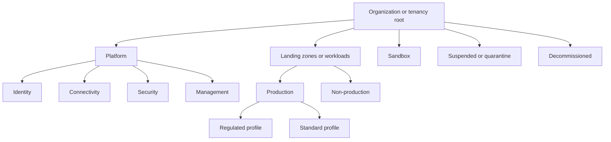
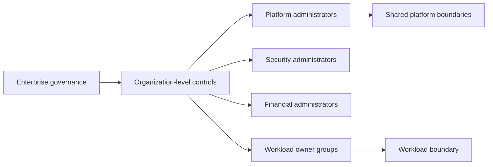

> **Document class:** Cloud Foundations & Governance implementation guide
> **Normative terms:** **MUST**, **MUST NOT**, **SHOULD**, **SHOULD NOT**, and **MAY** are requirements levels.
> **Applicability:** Azure management groups and subscriptions, AWS Organizations and accounts, GCP folders and projects, and OCI tenancies and compartments.
> **Exception process:** Deviations require a documented risk assessment, compensating controls, named risk owner, and expiry date.

| Control field | Value |
|---|---|
| Document ID | `CFG-05` |
| Owner | Cloud Center of Excellence |
| Review cycle | At least annually and after material platform, provider, data, security, or operating-model changes |
| Evidence | Hierarchy registry, policy ancestry, access delegation, billing mapping, and structural migration records |

# Management Groups, Accounts, and Organizational Structure

> **Decision in brief:** Shape hierarchies around policy, access, billing, lifecycle, and blast-radius boundaries, not changing organization charts.

## Purpose

Cloud organizational structures determine policy inheritance, access boundaries, billing allocation, delegated administration, and workload blast radius. A poor hierarchy creates broad privileges, duplicated policies, complex migrations, and ambiguous ownership.

The hierarchy should be designed around control differences and lifecycle states, not around every department, project, or reporting-line change.


## Document conventions

This article uses the following terms consistently:

- **Platform team**: the team that builds and operates shared cloud capabilities.
- **Workload team**: an application, data, product, or business team consuming the platform.
- **Landing zone**: a governed cloud environment prepared for workloads.
- **Guardrail**: a preventive, detective, or corrective control applied consistently through policy and automation.
- **Vending**: the automated creation and lifecycle management of subscriptions, accounts, projects, compartments, and their baseline configuration.

Provider examples are illustrative. The control objective is authoritative; the provider-specific implementation is replaceable.


## Provider resource hierarchy

| Provider | Top-level construct | Grouping construct | Common workload boundary |
|---|---|---|---|
| Azure | Microsoft Entra tenant | Management group | Subscription |
| AWS | Organization | Organizational unit | Account |
| GCP | Organization | Folder | Project |
| OCI | Tenancy | Compartment | Compartment or separate tenancy, depending on isolation requirements |

These boundaries are not equivalent. For example, an AWS account is a stronger isolation and quota boundary than an OCI compartment.

## Design principles

### Minimize hierarchy depth

Every level adds policy inheritance, access evaluation, naming, automation, and troubleshooting complexity. Create a level only when at least one of these changes:

- policy or compliance baseline;
- delegated administration;
- lifecycle state;
- connectivity model;
- billing or legal boundary;
- regional or sovereign restriction.

### Separate platform and workloads

Shared identity, network, security, management, and observability capabilities should reside in dedicated platform boundaries. Workload teams should not administer the systems that audit or constrain them.

### Separate production and non-production where controls differ

Production usually requires stronger access, change, recovery, and policy controls. Separate it structurally when those controls are inherited at organization level. Do not create separate hierarchy levels if the only difference is a resource name.

### Include lifecycle containers

Create explicit sandbox, quarantine or suspended, and decommissioned locations. Moving a boundary into one of these containers should change policy and access predictably.

## Reference hierarchy



This is a control model, not a mandatory exact tree. Provider limitations and enterprise scale may require different shapes.

## Azure management groups and subscriptions

Use management groups for inherited policy and access. Use subscriptions as workload, environment, billing, and quota boundaries. Avoid nesting beyond what administrators can reason about quickly.

Recommended controls at management-group scope include:

- allowed regions and resource types;
- mandatory diagnostic and security configuration;
- network exposure restrictions;
- privileged role limits;
- approved identity and key-management patterns;
- compliance initiatives.

Subscription-level controls include workload ownership, budgets, local role assignments, and workload-specific policy extensions.

## AWS Organizations and accounts

Use organizational units to group accounts with common SCPs and service integrations. Use accounts for strong isolation, quotas, billing, and operational ownership.

Dedicated accounts commonly include:

- organization management;
- log archive;
- security tooling;
- network and DNS;
- shared services;
- deployment tooling;
- individual production and non-production workloads.

Do not place ordinary workloads in the management account or security log archive.

## GCP organization, folders, and projects

Use folders for policy and IAM inheritance, and projects as workload and billing-related resource boundaries. Shared networking may use Shared VPC host projects with service projects.

Folder design should distinguish platform, production, non-production, sandbox, and regulated workloads where controls differ. Prevent uncontrolled project creation outside the vending process.

## OCI tenancy and compartments

Use compartments for organization, policy scope, quotas, and delegated administration. Keep the tree shallow and understandable. Consider separate tenancies where legal, billing, identity, or isolation requirements exceed what compartments provide.

A common structure uses top-level platform, production, non-production, sandbox, and retired compartments, with workload-specific child compartments.

## Delegated administration



Delegation must follow least privilege and separation of duties:

- enterprise governance controls hierarchy and mandatory policies;
- platform teams manage shared services and vending;
- security teams receive evidence and response permissions;
- financial teams manage billing, budgets, and allocation data;
- workload teams administer resources inside their assigned boundary;
- emergency access is limited, monitored, and tested.

## Environment separation

Choose an environment model deliberately:

| Model | Advantages | Risks |
|---|---|---|
| Separate boundary per environment | Strong access, policy, cost, and blast-radius separation | More accounts/projects/subscriptions and shared-service integration |
| Shared non-production boundary | Lower overhead for small teams | Weaker ownership, quotas, and blast-radius separation |
| Shared production boundary | Rarely appropriate | Broad privileges, difficult cost allocation, high incident impact |

Production workloads should normally have dedicated strong boundaries. Small development environments may share a non-production boundary only when ownership and risk remain clear.

## Structural decision record

Document every major hierarchy level:

```yaml
node: production-regulated
purpose: Hosts production workloads subject to enhanced data and audit controls.
inherited_controls:
  - restricted_regions
  - mandatory_private_connectivity
  - enhanced_log_retention
administration:
  platform_owner: cloud-platform
  security_owner: cyber-governance
allowed_children:
  - workload-boundary
lifecycle:
  movement_requires_approval: true
```

## Moves and restructuring

Organizational moves can change effective policy, routes, service integrations, and access. Treat moves as production changes:

1. Evaluate inherited policy and IAM before the move.
2. Test in a representative non-production boundary.
3. Validate logging and security-service continuity.
4. Confirm billing and commitment impacts.
5. Execute through code or controlled automation.
6. Run post-move compliance and connectivity tests.
7. Preserve an audit record and rollback plan.

## Anti-patterns

- Mirroring the human organization chart exactly.
- Creating a hierarchy level for every application.
- Mixing platform and workload resources under the same administration boundary.
- Assigning broad root-level roles to workload teams.
- Creating separate environments only by resource tags inside one large account.
- Omitting suspended and decommissioned lifecycle locations.
- Moving boundaries manually without evaluating inherited controls.
- Assuming account, project, subscription, and compartment boundaries are equivalent.

## Validation

- [ ] Every hierarchy level has a documented control or lifecycle purpose.
- [ ] Platform, workload, sandbox, suspended, and retired boundaries are distinct.
- [ ] Production separation matches risk and operational needs.
- [ ] Root or organization-level privileges are tightly restricted.
- [ ] Workload teams have delegated access only within owned boundaries.
- [ ] Billing, ownership, and environment metadata are enforced.
- [ ] Structural moves are tested and automated.
- [ ] Provider-specific isolation limitations are documented.
- [ ] Hierarchy diagrams and decision records are current.

## Hierarchy scale and capacity planning

Organizational structures have provider limits and operational costs. Plan for:

- expected account, subscription, project, compartment, and folder growth;
- policy and IAM inheritance evaluation;
- delegated-administrator and service-registration scope;
- billing and quota boundaries;
- automation concurrency and provisioning rate;
- time required to move or reclassify boundaries;
- inventory and evidence collection at fleet scale.

Reserve hierarchy space for future regulatory, regional, acquisition, and lifecycle profiles. Do not create speculative levels with no control purpose, but avoid a tree that can grow only through disruptive restructuring.

## Delegated-administration guardrails

Delegated administrators should receive an explicit capability ceiling. The design must state whether they can:

- assign local roles and to which groups;
- create child boundaries;
- attach networks or shared services;
- create public endpoints;
- manage keys, secrets, and certificates;
- change logging destinations or retention;
- request policy exceptions;
- move or delete the boundary.

Use provider-native deny controls, permission boundaries, conditions, and policy inheritance to enforce the ceiling. Documentation alone is not an authorization control.

## Structural migration playbook

Before moving a subscription, account, project, or compartment, generate an effective-before/effective-after report for policy, IAM, logging, network, security-service enrollment, billing, and quotas.

The migration plan should include:

1. Dependency and owner confirmation.
2. Target hierarchy and profile validation.
3. Effective-control comparison.
4. Non-production rehearsal or isolated test boundary.
5. Change freeze and rollback criteria.
6. Automated move or reassociation.
7. Post-move access, network, evidence, and billing tests.
8. Registry and diagram update.

Some provider moves are not fully reversible or can leave inherited configuration drift. Treat rollback feasibility as a verified fact, not an assumption.

## Authoritative inventory

Maintain a registry that maps every strong cloud boundary to:

- stable workload or platform identifier;
- hierarchy path;
- environment and lifecycle state;
- business, technical, security, and financial owner;
- landing-zone or baseline version;
- data classification and criticality;
- network and recovery profile;
- approved exceptions;
- creation, review, and retirement dates.

Provider hierarchy is an enforcement structure, not a complete ownership database. Reconcile it with the registry continuously.

## Related topics

- [Designing an Azure Landing Zone as a Product](designing-an-azure-landing-zone-as-a-product.md)
- [AWS and OCI Landing Zone Patterns](aws-and-oci-landing-zone-patterns.md)
- [Subscription and Account Vending](subscription-and-account-vending.md)
- [Policy, Guardrails, and Compliance](policy-guardrails-and-compliance.md)
