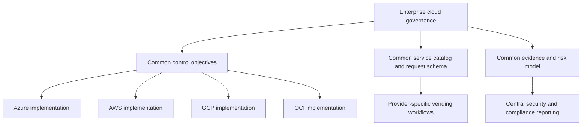
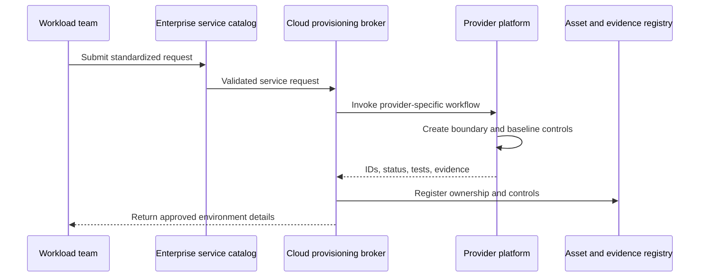
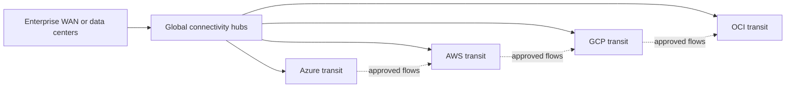

> **文档类型：** 云基础与治理架构参考模型
> **规范性术语：** **MUST**、**MUST NOT**、**SHOULD**、**SHOULD NOT** 和 **MAY** 是要求级别。
> **适用范围：** 跨多个云提供商的工作负载放置、通用治理控制、身份、网络、数据、策略、成本、运营和退出规划。
> **例外流程：** 偏离要求需要记录风险评估、补偿控制、指定风险负责人和到期日期。

|控制领域|价值|
|---|---|
|文件编号 | `CFG-04` |
|负责人|云卓越中心 |
|审核周期|至少每年一次，并且在重大平台、提供商、数据、安全或运营模式发生变化之后 |
|证据|安置日志、控制映射、依赖性和退出风险登记册以及综合证据报告 |

# 多云架构和治理

> **决策简述：** 跨云标准化治理目标、接口、证据和所有权，同时保留提供商原生实施选择。

## 目的

当业务、监管、弹性、采购、数据或产品需求需要多个提供商时，多云是合理的。它并不是自动的弹性策略，也不应该仅仅为了提高谈判筹码而采用。每增加一个云都会增加身份、网络、策略、技能、事件和运营模型的复杂性。

健全的多云架构标准化了治理目标、接口、证据和所有权，同时允许提供商本地实施。


## 文档约定

本文一致使用以下术语：

- **平台团队**：构建和运营共享云能力的团队。
- **工作负载团队**：使用平台的应用、数据、产品或业务团队。
- **Landing Zone**：为工作负载准备的受管云环境。
- **护栏**：通过策略和自动化一致应用的预防性、检测性或纠正性控制。
- **自动发放**：订阅、账户、项目、隔间及其基线配置的自动创建和生命周期管理。

提供商示例是说明性的。控制目标具有权威性；特定于提供商的实现是可替换的。


## 多云决策标准

仅当至少存在一种重大要求时才使用多个提供商：

- 监管、主权或客户指定的托管；
- 无法立即巩固的收购或业务部门自主权；
- 访问具有可度量商业价值的特定于提供商的托管服务；
- 地理或合作伙伴生态系统要求；
- 工作负载的独立故障域，可以在技术和操作上支持它们；
- 通过经过测试的迁移机制，为一小部分工作负载提供战略可移植性。

“云不可知论”过于模糊，不足以成为架构要求。定义哪些组件必须是可移植的、在什么时间内、以什么成本以及在哪种故障情况下。

## 治理运营模式

企业层定义了必须实现的目标。提供商平台团队定义如何实现该功能以及消费者如何使用该功能。

## 公共控制域

|领域 |共同目标 |特定于提供商的示例 |
|---|---|---|
|组织|工作负载被置于受控、有明确负责人的、计费的边界内 |管理组/订阅； OU/账户；文件夹/项目；隔间/租户|
|身份 |人员访问是联合的，工作负载凭证是短暂的 | Entra ID、IAM Identity Center、Cloud Identity、OCI IAM domains |
|策略 |强制控制在安全且可度量的情况下是预防性的 | Azure Policy、SCP/Config、Organization Policy、Security Zones/Cloud Guard |
|网络|连接性定义明确、经过分段、可监控且责任清晰 |Virtual WAN、Transit Gateway、NCC、DRG |
|数据|强制执行分类、局部性、加密、保留和访问 |原生密钥管理、存储策略、DLP、目录和审计服务 |
|运营|审计、运行状况、事件、成本和恢复数据可用 |与企业系统集成的原生遥测|
|交付|基础设施变更经过版本控制、经过测试且可追踪 | Terraform/OpenTofu 和通过受控流水线提供的原生 IaC |

## 架构模式

### 模式 1：共同治理的独立提供商平台

每个提供商都有专门的平台团队或能力所有者。企业治理定义了控制目标和证据。这种模式保留了提供商的专业知识，对于大型组织来说通常是最可持续的。

### 模式 2：具有提供商分会的中央平台

中央平台组织负责产品管理、开发人员体验、服务目录、标准和治理。提供商分会负责 Azure、AWS、GCP 和 OCI 实现。这提高了一致性，而无需假装提供商是相同的。

### 模式 3：代理云服务

中央服务目录将请求代理到特定于提供商的自动发放系统。所有者、环境、数据分类、成本中心、连接性和恢复层等请求字段很常见。最终的实现仍然是提供商原生的。

## 可移植性层

不要对每个工作负载应用相同的可移植性要求。

|等级 |定义 |典型技术|
|---|---|---|
| P0：提供商优化 |没有计划的可移植性；使用战略性本地服务 |原生 PaaS、特定于提供商的身份和操作 |
| P1：可部署在其他地方|基础设施和应用可以通过计划的工程工作进行重建 |容器、IaC 抽象、记录在案的依赖关系 |
| P2：操作便携|工作负载可以在经过测试的恢复窗口内在另一个提供程序上运行 |复制数据、双工具链、预演的故障转移 |
| P3：同时多云 |工作负载主动服务于多个提供商 |全球流量控制、一致的数据模型、复杂的可观测性和事件流程 |

P3 价格昂贵，应保留用于具有量化业务需求的工作负载。数据库一致性、身份、出口和操作复杂性经常主导设计。

## 身份架构

使用人类企业联盟。在每个提供商内部保留云原生授权。避免构建自定义跨云角色引擎，除非原生联合和权利治理无法满足要求。

对于工作负载，使用原生短期身份：

- Azure 托管身份或联合凭据；
- AWS IAM 角色和 Web 身份联合；
- 具有工作负载身份联合的 GCP 服务账户；
- OCI instance principals、资源主体和动态组。

工作负载身份清单应记录所有者、颁发者、受众、范围、环境、上次使用以及轮换或信任到期元数据。

## 网络架构

跨云连接并不能替代应用架构。仅将其用于记录在案的流程。与跨云传递路由相比，更喜欢本地使用云原生服务。

所需的控制包括路由所有权、DNS 权限、IP 分配、加密、吞吐量监控、出口成本分析、防火墙策略和故障模式测试。

## 数据治理

多云数据移动会带来成本、一致性、隐私和数据血缘风险。定义：

- 权威数据位置；
- 允许的副本和区域；
- 加密和密钥所有权；
- 跨境和跨提供商迁移规则；
- 恢复点和恢复时间目标；
- 目录和谱系集成；
- 删除传播和合法保留行为；
- 出口成本所有权。

## 策略正常化

维护一个具有稳定 ID 的控制目录，例如：
```yaml
control_id: NET-004
objective: Public administrative access to managed databases is prohibited.
severity: high
mode: preventive
exceptions:
  maximum_days: 30
  compensating_controls_required: true
implementations:
  azure: Azure Policy deny public network access
  aws: SCP and Config rules for public database exposure
  gcp: Organization Policy and Security Command Center detection
  oci: Security Zone recipe and Cloud Guard detector
```
这允许共同报告，而无需假装执行机制是相同的。

## 工具策略

标准化产生杠杆作用的地方：

- 源代码控制、拉取请求控制、制品来源和变更记录；
- 当资源得到良好支持时，Terraform/OpenTofu 约定；
- 策略和合规证据架构；
- 所有权和元数据模式；
- 事件严重性和升级模型；
- 服务目录和请求契约。

不要标准化掉有用的提供商功能。原生模板、策略语言和托管服务在降低风险或运营负担的情况下仍然应用。

## 成本治理

多云成本报告需要标准化的分配模型。至少，将提供商计费日志记录映射到：

- 业务负责人；
- 技术负责人；
- 成本中心；
- 产品或应用；
- 环境;
- 共享服务分配规则；
- 承诺和保留所有权；
- 货币和汇率基础。

成本比较必须包括网络出口、支持计划、安全服务、可观测性摄取、人员配置和迁移工作。仅比较虚拟机标价是没有用的。

## 反模式

- 选择多个没有工作负载级别要求的提供商。
- 要求每个提供商提供相同的服务和控制。
- 无需测试数据和操作故障模式即可构建主动-主动多云系统。
- 通过另一个云路由普通提供商流量。
- 创建隐藏所有原生身份、网络和操作的单一抽象。
- 通过统计策略来报告合规性，而不是验证有效的控制结果。
- 将 Kubernetes 视为完整的可移植性解决方案，同时忽略数据和托管服务依赖性。

## 验证

- [ ] 每个提供商都有书面的业务理由和所有者。
- [ ] 共同的治理目标具有稳定的控制标识符。
- [ ] 提供商原生实现和证据映射已日志记录。
- [ ] 可移植性要求按工作负载层分配。
- [ ] 人类联合和工作负载身份使用短期凭证。
- [ ] 记录跨云网络流、DNS、路由和故障模式。
- [ ] 数据位置、复制、删除和出口规则明确。
- [ ] 成本包括运营和传输开销。
- [ ] 执行多云事件和恢复练习。

## 工作负载安置决策

应按工作负载级别记录提供商的选择。实际的决策记录包括：

|尺寸|所需证据|
|---|---|
|业务需求|客户、监管、产品、收购或弹性驱动因素 |
|服务契合|提供商能力及运营优势|
|数据|驻留、迁移、一致性、备份、删除和密钥所有权 |
|身份 |员工、工作负载、流水线和紧急通道设计 |
|连接性|延迟、吞吐量、路由、DNS、检查和出口成本 |
|运营|技能、支持、可观测性、事件、修补和恢复 |
|经济学 |完整生命周期成本、承诺、支持、工具和迁移 |
|退出 |触发器、目标、数据移动、依赖项替换和测试持续时间 |

仅基于标价或架构偏好来选择提供商是不够的。

## 退出和迁移准备

退出准备与持续可移植性不同。对于每个战略工作负载，定义：

- 引发迁移的条件；
- 可接受的最大迁移持续时间；
- 权威来源、数据导出、补液方法；
- 需要更换的提供商特定服务；
- 身份、网络、证书、DNS 和密钥转换；
- 源提供商的保留和删除义务；
- 测试节奏和保持计划可行的成本。

已日志记录但未经测试的退出计划是推测性的。按照与业务需求相称的频率测试风险最高的部分，通常是数据导出和恢复。

## 跨云依赖风险登记册

跟踪跨云依赖项，因为它们创建普通提供商仪表板不会公开的故障路径。
```yaml
dependency_id: MC-DEP-014
consumer: gcp-analytics-production
provider: azure-identity-broker
purpose: workforce federation
failure_effect: administrators cannot obtain new cloud sessions
degraded_mode: existing sessions remain valid for bounded duration
owner: identity-platform
recovery_objective: 60m
test_frequency: semiannual
```
优先考虑身份、DNS、互连、Artifact Registry、关键服务、遥测和集中式自动化。避免每个云都需要另一个云来恢复的循环依赖。

## 统一证据模型

标准化控制证据而不丢弃提供商原生细节。每份证据日志记录应包括：

- 稳定的控制 ID；
- 提供商、组织边界、区域和环境；
- 资源和所有者标识符；
- 收集时间和观测到的配置时间；
- 来源服务和查询或收集方法；
- 结果、严重性和异常参考；
- 解析器或规范化版本；
- 原始提供商记录在案的链接。

共同报告应汇总结果。调查人员仍然必须能够检索原始事件或配置。

## 相关主题

- [云平台工程原则](cloud-platform-engineering-principles.md)
- [AWS 和 OCI Landing Zone 模式](aws-and-oci-landing-zone-patterns.md)
- [策略、护栏和合规性](policy-guardrails-and-compliance.md)
- [平台所有权及运营模式](platform-ownership-and-operating-model.md)
