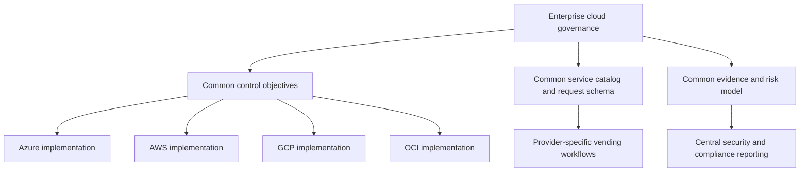
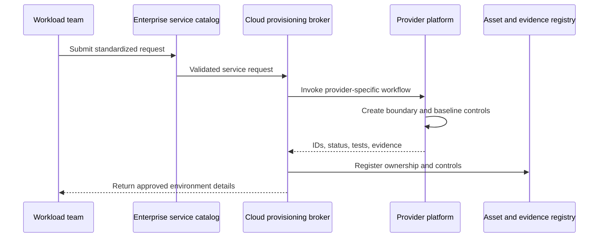
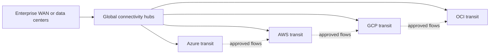

> **Document class:** Cloud Foundations & Governance architecture reference model
> **Normative terms:** **MUST**, **MUST NOT**, **SHOULD**, **SHOULD NOT**, and **MAY** are requirements levels.
> **Applicability:** Workload placement, common governance controls, identity, networking, data, policy, cost, operations, and exit planning across multiple cloud providers.
> **Exception process:** Deviations require a documented risk assessment, compensating controls, named risk owner, and expiry date.

| Control field | Value |
|---|---|
| Document ID | `CFG-04` |
| Owner | Cloud Center of Excellence |
| Review cycle | At least annually and after material platform, provider, data, security, or operating-model changes |
| Evidence | Placement records, control mappings, dependency and exit-risk register, and consolidated evidence reports |

# Multi-Cloud Architecture and Governance

> **Decision in brief:** Standardize governance objectives, interfaces, evidence, and ownership across clouds while keeping provider-native implementation choices.

## Purpose

Multi-cloud is justified when business, regulatory, resilience, acquisition, data, or product requirements require more than one provider. It is not automatically a resilience strategy and should not be adopted merely to improve negotiation leverage. Every additional cloud increases identity, network, policy, skill, incident, and operating-model complexity.

A sound multi-cloud architecture standardizes governance objectives, interfaces, evidence, and ownership while allowing provider-native implementations.


## Document conventions

This article uses the following terms consistently:

- **Platform team**: the team that builds and operates shared cloud capabilities.
- **Workload team**: an application, data, product, or business team consuming the platform.
- **Landing zone**: a governed cloud environment prepared for workloads.
- **Guardrail**: a preventive, detective, or corrective control applied consistently through policy and automation.
- **Vending**: the automated creation and lifecycle management of subscriptions, accounts, projects, compartments, and their baseline configuration.

Provider examples are illustrative. The control objective is authoritative; the provider-specific implementation is replaceable.


## Multi-cloud decision criteria

Use multiple providers only when at least one material requirement exists:

- regulatory, sovereignty, or customer-mandated hosting;
- acquisition or business-unit autonomy that cannot be consolidated immediately;
- access to a provider-specific managed service with measurable business value;
- geographic or partner ecosystem requirements;
- independent failure domains for a workload that can technically and operationally support them;
- strategic portability for a narrow set of workloads with a tested migration mechanism.

“Cloud agnostic” is too vague to be an architecture requirement. Define which components must be portable, within what time, at what cost, and under which failure scenario.

## Governance operating model



The enterprise layer defines what must be achieved. Provider platform teams define how it is achieved and how consumers use the capability.

## Common control domains

| Domain | Common objective | Provider-specific examples |
|---|---|---|
| Organization | Workloads are placed in controlled, owned, billable boundaries | Management groups/subscriptions; OUs/accounts; folders/projects; compartments/tenancies |
| Identity | Human access is federated and workload credentials are short-lived | Entra ID, IAM Identity Center, Cloud Identity, OCI IAM domains |
| Policy | Mandatory controls are preventive where safe and measurable | Azure Policy, SCP/Config, Organization Policy, Security Zones/Cloud Guard |
| Network | Connectivity is explicit, segmented, observable, and owned | Virtual WAN, Transit Gateway, NCC, DRG |
| Data | Classification, locality, encryption, retention, and access are enforced | Native key management, storage policy, DLP, catalog, and audit services |
| Operations | Audit, health, incident, cost, and recovery data are available | Native telemetry integrated with enterprise systems |
| Delivery | Infrastructure changes are versioned, tested, and traceable | Terraform/OpenTofu and provider-native IaC through controlled pipelines |

## Architecture patterns

### Pattern 1: Independent provider platforms with common governance

Each provider has a dedicated platform team or capability owner. Enterprise governance defines control objectives and evidence. This pattern preserves provider expertise and is generally the most sustainable for large organizations.

### Pattern 2: Central platform with provider chapters

A central platform organization owns product management, developer experience, service catalog, standards, and governance. Provider chapters own Azure, AWS, GCP, and OCI implementations. This improves consistency without pretending the providers are identical.

### Pattern 3: Brokered cloud services

A central service catalog brokers requests to provider-specific vending systems. Request fields such as owner, environment, data classification, cost center, connectivity, and recovery tier are common. The resulting implementations remain provider native.



## Portability tiers

Do not apply the same portability requirement to every workload.

| Tier | Definition | Typical techniques |
|---|---|---|
| P0: Provider optimized | No planned portability; uses strategic native services | Native PaaS, provider-specific identity and operations |
| P1: Deployable elsewhere | Infrastructure and application can be rebuilt with planned engineering work | Containers, IaC abstractions, documented dependencies |
| P2: Operationally portable | Workload can operate on another provider within a tested recovery window | Replicated data, dual toolchains, rehearsed failover |
| P3: Simultaneously multi-cloud | Workload actively serves from multiple providers | Global traffic control, consistent data model, complex observability and incident processes |

P3 is expensive and should be reserved for workloads with quantified business need. Database consistency, identity, egress, and operational complexity frequently dominate the design.

## Identity architecture

Use enterprise federation for humans. Keep cloud-native authorization within each provider. Avoid building a custom cross-cloud role engine unless native federation and entitlement governance cannot meet requirements.

For workloads, use native short-lived identity:

- Azure managed identities or federated credentials;
- AWS IAM roles and web identity federation;
- GCP service accounts with Workload Identity Federation;
- OCI instance principals, resource principals, and dynamic groups.

A workload identity inventory should record owner, issuer, audience, scope, environment, last use, and rotation or trust-expiry metadata.

## Network architecture

Cross-cloud connectivity is not a substitute for application architecture. Use it only for documented flows. Prefer local consumption of cloud-native services over transitive routing across clouds.



Required controls include route ownership, DNS authority, IP allocation, encryption, throughput monitoring, egress cost analysis, firewall policy, and failure-mode testing.

## Data governance

Multi-cloud data movement creates cost, consistency, privacy, and lineage risks. Define:

- authoritative data location;
- permitted replicas and regions;
- encryption and key ownership;
- cross-border and cross-provider transfer rules;
- recovery-point and recovery-time objectives;
- catalog and lineage integration;
- deletion propagation and legal-hold behavior;
- egress-cost ownership.

## Policy normalization

Maintain a control catalog with stable IDs, for example:

```yaml
control_id: NET-004
objective: Public administrative access to managed databases is prohibited.
severity: high
mode: preventive
exceptions:
  maximum_days: 30
  compensating_controls_required: true
implementations:
  azure: Azure Policy deny public network access
  aws: SCP and Config rules for public database exposure
  gcp: Organization Policy and Security Command Center detection
  oci: Security Zone recipe and Cloud Guard detector
```

This permits common reporting without pretending the enforcement mechanisms are identical.

## Tooling strategy

Standardize where it produces leverage:

- source control, pull-request controls, artifact provenance, and change records;
- Terraform/OpenTofu conventions when the resource is well supported;
- policy and compliance evidence schema;
- ownership and metadata schema;
- incident severity and escalation model;
- service catalog and request contracts.

Do not standardize away useful provider capabilities. Native templates, policy languages, and managed services remain appropriate where they reduce risk or operational burden.

## Cost governance

Multi-cloud cost reporting requires a normalized allocation model. At minimum, map provider billing records to:

- business owner;
- technical owner;
- cost center;
- product or application;
- environment;
- shared-service allocation rule;
- commitment and reservation ownership;
- currency and exchange-rate basis.

Cost comparisons must include network egress, support plans, security services, observability ingestion, staffing, and migration effort. Comparing only virtual-machine list prices is useless.

## Anti-patterns

- Selecting multiple providers without a workload-level requirement.
- Demanding identical services and controls in every provider.
- Building active-active multi-cloud systems without testing data and operational failure modes.
- Routing ordinary provider traffic through another cloud.
- Creating a single abstraction that hides all native identity, networking, and operations.
- Reporting compliance by counting policies rather than validating effective control outcomes.
- Treating Kubernetes as a complete portability solution while ignoring data and managed-service dependencies.

## Validation

- [ ] Each provider has a documented business justification and owner.
- [ ] Common governance objectives have stable control identifiers.
- [ ] Provider-native implementations and evidence mappings are documented.
- [ ] Portability requirements are assigned by workload tier.
- [ ] Human federation and workload identity use short-lived credentials.
- [ ] Cross-cloud network flows, DNS, routes, and failure modes are documented.
- [ ] Data location, replication, deletion, and egress rules are explicit.
- [ ] Costs include operational and transfer overhead.
- [ ] Multi-cloud incident and recovery exercises are performed.

## Workload placement decision

Provider selection should be recorded at workload level. A practical decision record includes:

| Dimension | Required evidence |
|---|---|
| Business requirement | Customer, regulatory, product, acquisition, or resilience driver |
| Service fit | Provider capability and operational advantage |
| Data | Residency, transfer, consistency, backup, deletion, and key ownership |
| Identity | Workforce, workload, pipeline, and emergency-access design |
| Connectivity | Latency, throughput, routes, DNS, inspection, and egress cost |
| Operations | Skills, support, observability, incident, patching, and recovery |
| Economics | Full lifecycle cost, commitments, support, tooling, and migration |
| Exit | Trigger, target, data movement, dependency replacement, and tested duration |

A provider choice based only on list price or an architecture preference is not sufficient.

## Exit and migration readiness

Exit readiness is not the same as continuous portability. For each strategic workload, define:

- conditions that would trigger migration;
- maximum acceptable migration duration;
- authoritative source, data export, and rehydration method;
- provider-specific services that require replacement;
- identity, network, certificate, DNS, and key transition;
- retention and deletion obligations in the source provider;
- test cadence and cost of keeping the plan viable.

A documented but untested exit plan is speculative. Test the highest-risk part, usually data export and restore, at a frequency proportionate to business need.

## Cross-cloud dependency risk register

Track cross-cloud dependencies because they create failure paths that ordinary provider dashboards do not expose.

```yaml
dependency_id: MC-DEP-014
consumer: gcp-analytics-production
provider: azure-identity-broker
purpose: workforce federation
failure_effect: administrators cannot obtain new cloud sessions
degraded_mode: existing sessions remain valid for bounded duration
owner: identity-platform
recovery_objective: 60m
test_frequency: semiannual
```

Prioritize identity, DNS, interconnects, artifact registries, key services, telemetry, and centralized automation. Avoid circular dependencies where each cloud requires another cloud to recover.

## Unified evidence model

Normalize control evidence without discarding provider-native detail. Every evidence record should include:

- stable control ID;
- provider, organization boundary, region, and environment;
- resource and owner identifiers;
- collection time and observed configuration time;
- source service and query or collection method;
- result, severity, and exception reference;
- parser or normalization version;
- link to the original provider record.

Common reporting should aggregate outcomes. Investigators must still be able to retrieve the original event or configuration.

## Related topics

- [Cloud Platform Engineering Principles](cloud-platform-engineering-principles.md)
- [AWS and OCI Landing Zone Patterns](aws-and-oci-landing-zone-patterns.md)
- [Policy, Guardrails, and Compliance](policy-guardrails-and-compliance.md)
- [Platform Ownership and Operating Model](platform-ownership-and-operating-model.md)
