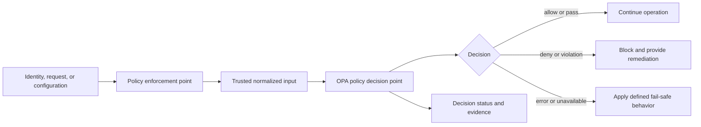
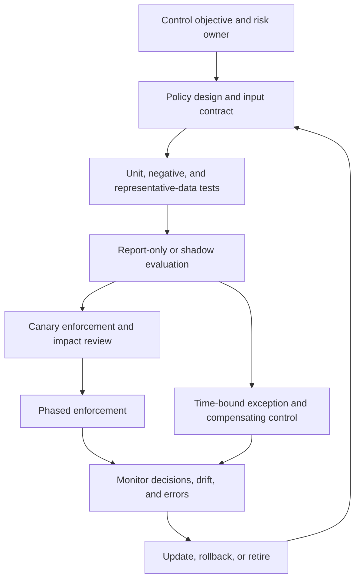

> **Document class:** Cloud Foundations & Governance implementation guide
> **Normative terms:** **MUST**, **MUST NOT**, **SHOULD**, **SHOULD NOT**, and **MAY** are requirements levels.
> **Applicability:** Policy decisions for cloud infrastructure, delivery pipelines, Kubernetes, APIs, and other structured enterprise inputs across Azure, AWS, GCP, and OCI.
> **Exception process:** Deviations require a documented risk assessment, compensating controls, named risk owner, and expiry date.

| Control field | Value |
|---|---|
| Document ID | `CFG-15` |
| Owner | Cloud Center of Excellence |
| Review cycle | At least annually and after material OPA, policy, provider, security, or operating-model changes |
| Evidence | Policy source and tests, release records, decision outcomes, enforcement results, exceptions, and rollback evidence |

# Open Policy Agent for Enterprise Cloud Governance

> **Decision in brief:** Use OPA as a portable policy decision component close to the enforcement point, while keeping policy ownership, review, release, evidence, and exceptions under centralized governance.

## Purpose

Cloud governance requirements are often written as standards but implemented inconsistently across infrastructure pipelines, Kubernetes clusters, APIs, and applications. Open Policy Agent (OPA) turns suitable requirements into versioned policy decisions that can be tested and evaluated consistently.

OPA is a policy decision engine, not an identity provider, cloud control plane, or complete governance platform. The surrounding system supplies trusted input, invokes the decision, enforces the result, records evidence, and defines safe behavior when policy data or evaluation is unavailable.

This guide describes where OPA fits in an enterprise cloud governance model, which controls are good candidates, and how to operate policy as a governed product. It complements the broader [Policy, Guardrails, and Compliance](policy-guardrails-and-compliance.md) guide rather than replacing provider-native controls.

## Document conventions

This article uses the following terms consistently:

- **Policy decision point (PDP):** The component that evaluates structured input against policy and returns a decision. OPA is a PDP.
- **Policy enforcement point (PEP):** The component that applies the decision, such as a pipeline gate, API gateway, application, or Kubernetes admission controller.
- **Policy bundle:** A versioned, distributable package containing policy modules and optional data.
- **Control owner:** The person or team accountable for the control objective, evidence, and exception decision.
- **Policy operator:** The team responsible for policy packaging, distribution, runtime health, telemetry, and rollback.

The control objective remains authoritative. A Rego module, provider feature, or integration is an implementation of that objective and may change independently.

## Policy decision model

OPA evaluates structured input against Rego policy and returns a defined result such as allow, deny, warn, or a set of violation messages. It does not automatically enforce the result.



The enforcement point MUST define the input schema, validate the decision, and handle errors explicitly. A locally run policy command that engineers may skip is useful feedback but is not an enterprise guardrail. A required pipeline stage, admission check, or authorization middleware creates an enforceable control boundary.

## Governance boundary and control selection

Use OPA when the control needs provider-neutral logic, custom data, a shared decision model across different enforcement points, or evaluation outside a provider-native control plane. Prefer native controls when they already provide the required scope, enforcement, audit integration, and operational behavior.

| Governance need | Preferred control or enforcement point | OPA role |
|---|---|---|
| Azure resource configuration and compliance | Azure Policy and Azure Resource Manager | Add custom or cross-platform checks where native policy is insufficient |
| Azure resource authorization | Microsoft Entra ID and Azure RBAC | Evaluate application-specific or cross-platform authorization decisions |
| Infrastructure change validation | Terraform or Bicep pipeline | Evaluate normalized plan or template data before approval and deployment |
| Kubernetes admission and audit | Kubernetes API server with Gatekeeper | Supply policy logic and admission or audit decisions |
| API or application authorization | Application, gateway, or service middleware | Act as the PDP for contextual authorization |
| Central evidence and investigation | Audit logging, telemetry, and SIEM | Emit decision metadata without exposing unnecessary sensitive input |

OPA MUST NOT be used as a reason to duplicate or weaken an effective native control. Where layered controls are intentional, the ownership, precedence, failure behavior, and evidence for each layer must be explicit.

## Suitable enterprise control domains

Prioritize controls that have a stable input schema, an unambiguous outcome, and a useful remediation path. Common candidates include:

- approved cloud regions, service tiers, images, registries, and module sources;
- encryption, minimum TLS versions, private connectivity, and public exposure;
- ownership, environment, application, cost, and data-classification metadata;
- Kubernetes privilege, host access, identity, resource limits, labels, and storage settings;
- deployment provenance, protected environments, change conditions, and artifact integrity;
- API subject, action, resource, tenant, environment, and risk-context authorization;
- separation of duties and restrictions on production or emergency operations.

Do not encode requirements that cannot be evaluated from trustworthy input. For example, a policy cannot prove business ownership if the ownership attribute is user-controlled and not correlated with an authoritative registry.

## Policy lifecycle and operating model

Treat policy as a controlled software product. The lifecycle should move from a control objective to tested implementation, measured rollout, enforced decision, and eventual retirement.



The control owner defines the objective, scope, severity, evidence, and exception authority. The policy operator maintains Rego modules, input contracts, bundles, test harnesses, integrations, telemetry, and rollback. Workload teams provide representative inputs, remediate violations, and identify valid operating paths that the policy must preserve.

Policies MUST be reviewed like production code. Pull requests should include the control rationale, affected schemas, positive and negative fixtures, expected decision changes, migration impact, and release notes. High-impact deny policies SHOULD begin in report-only or shadow mode and move through a canary before broad enforcement.

## Implementation guidance

### Define stable inputs and explicit decisions

An input contract should identify the subject, action, resource, environment, and relevant context. The contract should distinguish authoritative data from user-provided claims and should define behavior for missing or unknown values.

```json
{
  "subject": {"id": "workload-123", "groups": ["platform-team"]},
  "action": "deploy",
  "resource": {"name": "orders-api", "environment": "production"},
  "context": {"change_id": "chg-1042", "source": "protected-pipeline"}
}
```

Decision schemas SHOULD be narrow and versioned. A consuming system must not infer that an absent field means allow. Default-deny behavior is a useful authorization baseline, but every policy package must document its decision schema and error behavior.

### Keep policy modules testable and composable

Rego modules should separate reusable data, decision rules, and presentation of remediation messages. Tests should cover allowed, denied, boundary, missing-data, and malformed-input cases.

```rego
package cloud.tags

required := {"application", "environment", "owner", "cost-center"}

deny contains msg if {
    some tag in required
    not input.tags[tag]
    msg := sprintf("Required tag is missing: %s", [tag])
}
```

The example demonstrates a deterministic validation rule; a production implementation must also define the accepted tag schema, case normalization, resource context, and how the enforcement point renders or records the message.

### Select the right input representation

For Terraform, plan JSON usually provides better visibility into computed resource changes than raw source, but the policy must account for unknown values and the specific provider schema. For Bicep, compile to the ARM JSON representation before evaluating resource properties. For Kubernetes, distinguish admission review input from existing-resource audit input.

The policy package MUST declare the input kind and schema version. A policy written for Terraform plan JSON is not interchangeable with one written for HCL, ARM JSON, Kubernetes admission review objects, or an API authorization request.

### Enforce at more than one useful stage

Shift-left checks provide fast feedback, while runtime controls protect against changes that bypass the pipeline or occur after deployment. Apply the same control objective at multiple stages only when each input and evidence path is understood.

```text
Pull request -> plan/template validation -> approval -> deployment
                                                |
                                                v
                                   runtime admission or authorization
                                                |
                                                v
                                      audit, metrics, and evidence
```

Conftest or another pipeline integration can evaluate structured artifacts before deployment. Gatekeeper can enforce Kubernetes admission and audit controls. Applications or gateways can call OPA for contextual authorization. These integrations share governance practices, but their policies need not be identical.

### Distribute policy safely

Centralized governance does not require a single remote OPA instance for every decision. Evaluate policy close to the protected system when latency, availability, or data locality matters, while centralizing source control, review, bundle release, ownership, and reporting.

Policy distribution MUST provide:

- versioned and integrity-protected bundles;
- authenticated retrieval and least-privilege access;
- compatibility checks between policy, data, and input schemas;
- health and status reporting for bundle freshness;
- rollback to a known-good release;
- separation of policy authoring, approval, and production release where risk requires it.

Decision logs and input data may contain identities, tenant identifiers, resource names, or sensitive configuration. Minimize collected data, restrict access, protect transport and storage, and define retention with the security and compliance owners.

## Operational considerations

OPA governance depends on the enforcement path around the engine. For each integration, document:

- the owner and service-level expectation for policy availability;
- whether an evaluation error fails open, fails closed, or enters a controlled degraded mode;
- the maximum acceptable policy or bundle staleness;
- the alert for evaluation errors, input-contract failures, and distribution lag;
- the emergency path for disabling or rolling back a harmful policy;
- the evidence retained for allow, deny, exception, and remediation outcomes;
- the cost and performance impact of evaluation, logging, and bundle distribution.

Do not silently fail open for controls protecting production authorization, privileged operations, or sensitive data. Where fail-closed behavior would cause unacceptable availability risk, use a documented degraded mode with compensating controls, clear alerts, and an expiry for the exception.

## Validation

- [ ] Each policy maps to a named control objective, owner, scope, severity, and evidence source.
- [ ] Input schemas distinguish authoritative attributes from untrusted request data and define missing-data behavior.
- [ ] Tests include compliant, noncompliant, boundary, missing-data, and evaluation-error scenarios.
- [ ] Enforcement is mandatory at the selected pipeline, admission, gateway, application, or control-plane boundary.
- [ ] Policy packages are versioned, reviewed, integrity-protected, observable, and rollback-capable.
- [ ] Report-only, canary, and production enforcement results are compared before high-impact deny rules are expanded.
- [ ] Exceptions include scope, rationale, risk owner, compensating controls, approval, and expiry.
- [ ] Decision evidence is protected, retained, and correlated with the change, request, or resource being evaluated.

## Related topics

- [Policy, Guardrails, and Compliance](policy-guardrails-and-compliance.md) (`CFG-07`) — provider-neutral control objectives, enforcement modes, exceptions, and compliance evidence.
- [Subscription and Account Vending](subscription-and-account-vending.md) (`CFG-06`) — applying governance baselines when cloud boundaries are created and updated.
- [Cloud Identity and Privileged Access Foundation](cloud-identity-and-privileged-access-foundation.md) (`CFG-10`) — authoritative identity, federation, workload authentication, and privileged access.
- [Centralized Audit Logging and Security Telemetry Foundation](centralized-audit-logging-and-security-telemetry.md) (`CFG-12`) — telemetry, retention, and investigation evidence for policy decisions.
- [Infrastructure as Code Engineering Standards](../infrastructure-as-code/iac-infrastructure-as-code-engineering-standards.md) (`IAC-01`) — engineering controls for Terraform and other infrastructure delivery workflows.

## References

- [OPA policy language](https://www.openpolicyagent.org/docs/policy-language) — Rego policy concepts and syntax.
- [OPA management](https://www.openpolicyagent.org/docs/management-introduction) — bundles, discovery, status, and distributed management concepts.
- [OPA decision logs](https://www.openpolicyagent.org/docs/management-decision-logs) — decision logging and reporting considerations.
- [Gatekeeper documentation](https://open-policy-agent.github.io/gatekeeper/website/docs/) — Kubernetes admission and audit integration.
