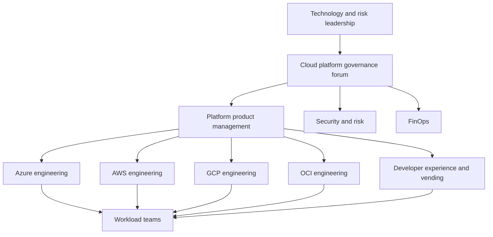
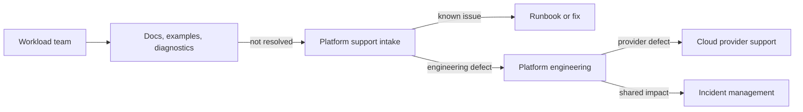

> **文档类型：** Cloud Foundations & Governance 操作模型参考
> **规范性术语：** **MUST**、**MUST NOT**、**SHOULD**、**SHOULD NOT** 和 **MAY** 是要求级别。
> **适用范围：** 平台所有权、团队职责、服务边界、支持、资金、可靠性、风险、文档和持续改进。
> **例外流程：** 偏离要求需要记录风险评估、补偿控制、指定风险负责人和到期日期。

|控制领域|价值|
|---|---|
|文件编号 | `CFG-09` |
|负责人|云卓越中心 |
|审核周期|至少每年一次，并且在重大平台、提供商、数据、安全或运营模式发生变化之后 |
|证据|服务日志、责任矩阵、SLO、事件和变更记录、路线图和债务登记册 |

# 平台所有权和运营模式

> **简要决定：** 为每个平台服务指定所有者、消费者契约、支持模型、可靠性目标、融资路径和退休计划。

## 目的

云基础需要持续的所有权。如果没有定义的运营模型，平台服务就会退化为每个人都依赖但无人负责的共享基础设施。运营模型必须指定产品所有权、工程责任、安全责任、支持、资金、服务级别和决策权。

中央平台团队应该实现工作负载自治，而不是成为永久的票务队列或审批瓶颈。


## 文档约定

本文一致使用以下术语：

- **平台团队**：构建和运营共享云能力的团队。
- **工作负载团队**：使用平台的应用、数据、产品或业务团队。
- **Landing Zone**：为工作负载准备的受管云环境。
- **护栏**：通过策略和自动化一致应用的预防性、检测性或纠正性控制。
- **自动发放**：订阅、账户、项目、隔间及其基线配置的自动创建和生命周期管理。

提供商示例是说明性的。控制目标具有权威性；特定于提供商的实现是可替换的。


## 团队拓扑

实用模型包括：

- **云平台产品团队**：负责路线图、服务目录、用户体验和平台成果。
- **提供商工程团队或分会**：负责 Azure、AWS、GCP 和 OCI 实施。
- **安全工程和治理**：定义控制、审查例外情况并运行安全功能。
- **网络和身份平台团队**：负责企业范围的共享服务和集成。
- **站点可靠性或运营职能**：负责可观测性、事件流程、可靠性工程和恢复测试。
- **FinOps 职能**：负责分配标准、预算、承诺治理和优化流程。
- **工作负载团队**：自己的应用架构、部署、数据、待命职责以及所提供护栏内的合规性。

## 决策权

|决定|负责任的所有者 |所需参与者 |
|---|---|---|
|平台路线图和服务目录|平台产品负责人|提供商领导、安全、工作负载代表 |
|企业云管控目标|安全或风险所有者 |平台工程、架构、法律/合规 |
|提供商实施 |提供商平台领先|安全工程、运营 |
|共享网络架构|网络平台主|云平台、安全、工作负载代表|
|身份联合和特权访问 |身份平台所有者|安全、云平台、审计|
|标准工作负载异常 |风险责任人 |平台和工作负载所有者 |
|平台发布审批|平台服务主|工程和运营|
|工作负载生产准备情况 |工作负载所有者 |安全、平台、运营按需 |

避免批准普通部署的委员会。治理论坛应制定标准、解决跨团队决策并审查重大风险。

## 服务所有权模型

每个平台服务都应该有一个服务日志记录：
```yaml
service: cloud-account-vending
product_owner: cloud-platform-product
engineering_owner: developer-experience
operations_owner: cloud-sre
security_owner: cloud-security
consumers: all-workload-teams
support_tier: tier-1
slo:
  availability: 99.9%
  standard_request_completion: 95% within 30 minutes
on_call: cloud-platform-primary
repository: platform/account-vending
runbook: runbooks/account-vending.md
recovery_plan: recovery/account-vending.md
```
所有权必须包括路线图、代码、生产操作、漏洞响应、升级、文档和退役。

## 责任矩阵

|能力|平台团队|安全|工作负载团队 |FinOps |运营|
|---|---|---|---|---|---|
|组织架构| A/R | C | I | C | I |
|自动预配工作流| A/R | C | C | C | C |
|基线策略| R | A | C | I | C |
|特定于工作负载的控制 | C | C | A/R | I | C |
|共享中转和 DNS | A/R | C | C | I | C |
|应用部署| C | C | A/R | I | C |
|成本分配标准| C | I | C | A/R | I |
|共享服务事件响应| A/R | C | I | I | R |
|应用事件响应 | C | C | A/R | I | C |

A = 最终负责，R = 负责，C = 征求意见，I = 知会。

## 产品管理

平台路线图应优先考虑可度量的用户和风险结果。输入包括：

- 入驻准备时间和放弃；
- 定期支持票；
- 策略违规和例外需求；
- 平台事件数据；
- 工作负载架构审查；
- 提供商服务变更；
- 安全和审计结果；
- 成本异常和共享服务利用；
- 开发者反馈和采用数据。

不要仅仅因为提供商发布了功能就优先考虑这些功能。

## 支持模型

使用分层支持：

1. 自助文档、示例和诊断。
2.工作负载-团队支持渠道和办公时间。
3.平台工程升级。
4. 提供商对服务缺陷的支持升级。
5. 共享服务影响的事件指挥。

支持数据应该提供给产品待办事项列表。重复的票证表明界面有缺陷、自动化缺失或文档薄弱。

## 可靠性模型

关键平台服务需要：

- 服务级别指标和目标；
- 依赖关系图；
- 监测和综合测试；
- 记录在案的降解模式；
- 备份和恢复程序；
- 容量和配额监控；
- 随叫随到的所有权；
- 事件审查和纠正措施；
- 定期灾难恢复演习。

关键服务的示例包括身份联合、DNS、中转网络、策略部署、Artifact Registry、自动发放、机密平台和集中式日志记录。

## 变更和发布管理

平台更改可能会影响许多工作负载。使用渐进式交付：

1. 在隔离的工程环境中验证更改。
2. 运行集成和策略测试。
3. 部署到金丝雀订阅、账户、项目或隔间。
4. 监控技术和消费者影响。
5. 扩展到非生产群体。
6. 通过迁移指导安排破坏性生产变更。
7. 保留回滚或前向修复程序。

不需要传统的变更板来进行低风险、完全自动化、经过测试的变更。对层次结构、身份、路由、DNS 和大范围策略变更进行更严格的审查。

## 融资模式

将平台产品成本与工作负载使用量分开：

- 用于强制性企业控制和核心共享服务的中央资金；
- 直接消费服务的透明分配；
- 可选高级功能的公开定价或成本分摊；
- 提供商承诺和支持计划的明确所有权；
- 生命周期升级、技术债务和弹性测试的预算。

即使最初实施成功，资金不足的平台维护也会产生安全性和可靠性债务。

## 风险和异常治理

平台团队不应单方面承担业务风险。它提供技术分析和支持的替代方案。风险负责人批准例外情况，但必须有时间限制并进行跟踪。

在以下情况下升级：

- 工作负载需要禁止的架构；
- 提供商的限制阻止了强制控制；
- 平台能力无法满足监管要求；
- 异常影响共享服务或其他工作负载；
- 提议的更改会实质性改变恢复、数据或身份风险。

## 文档所有权

文档是产品的一部分。每篇文章、模块、API 和操作手册都需要所有者和审核日期。文档应根据其描述的功能进行版本控制。

最低文档集：

- 服务目录条目；
- 架构和依赖图；
- 入驻和使用指南；
- API 或请求模式；
- 操作手册；
- 事故和恢复程序；
- 升级和弃用策略；
- 安全和合规性映射；
- 故障排除指南；
- 所有权和升级联系人。

## 指标

|结果|指标示例|
|---|---|
|交付速度|账户发放前置时间、入驻完成时间 |
|领养|使用受支持的铺装道路的工作负载百分比 |
|可靠性 | SLO 达到、变更失败率、平均恢复时间 |
|安全|严重违规年龄、工作负载身份采用、例外年龄 |
|用户体验 |每个消费者的支持量、满意度、重复摩擦点|
|财务控制|所有权覆盖范围、预算覆盖范围、共享服务单位成本|
|可持续发展 |支持版本采用、技术债务消除、文档新鲜度 |

## 反模式

- 平台团队负责每个工作负载部署。
- 共享服务没有指定的待命或恢复所有者。
- 安全性定义了无需工程实施支持的控制。
- 工作负载团队可以使用服务，但无法提供路线图反馈。
- 该平台仅作为一次性转型项目获取资助。
- 支持工单应反馈给产品改进。
- 委员会批准自动化可以验证的常规技术行动。
- 文档与版本化平台版本分离。

## 验证

- [ ] 列出平台产品、工程、运营、安全和财务所有者。
- [ ] 记录决策权和升级路径。
- [ ] 每个共享服务都有 SLO、监控、操作手册和恢复所有权。
- [ ] 工作负载职责明确。
- [ ] 路线图优先级使用采用、摩擦、风险、可靠性和成本数据。
- [ ] 平台版本使用渐进式部署。
- [ ] 例外情况由负责任的风险负责人批准。
- [ ] 资金用于维护、升级和恢复工作。
- [ ] 文档经过版本控制，有明确负责人并接受审查。

## 服务分级和支持承诺

按消费者影响对平台服务进行分类：

|等级 |示例|所需的运营模式 |
|---|---|---|
| 0 级 |身份联合、紧急访问、DNS、核心中转 |持续所有权、独立恢复、严格变更控制|
| 1 级 |自动发放、策略部署、制品注册、中央日志记录 |待命、SLO、测试恢复、容量管理 |
| 2 级 |可选的开发人员工具和咨询服务|工作时间支持和记录在案的解决方法 |
|实验|预览功能 |指定赞助商、有限消费者、无隐性生产承诺 |

依赖可以提高有效层。作为恢复第 0 层身份服务的唯一方法的第 2 层门户被错误分类。

## 平台能力和技能

运营计划必须涵盖的不仅仅是初始工程。预测容量：

- 产品管理和消费者研究；
- 提供商工程和 IaC 维护；
- 身份、网络、安全和可观测性专业知识；
- 发布工程和测试自动化；
- 值班、事件审查和恢复演习；
- 文档、支持和支持；
- 提供商路线图和弃用跟踪；
- 合规证据和异常处理。

关键人员依赖是一种运营风险。关键服务需要至少两名有能力的维护人员和记录在案的恢复程序。

## 消费者参与和路线图治理

使用多种证据渠道：

- 服务的使用和放弃；
- 入驻渠道和交付时间；
- 支持工单和重复失败类别；
- 例外请求；
- 工作负载架构和事件审查；
- 开发商调查和办公时间；
- 提供商变更和安全调查结果。

发布包含用户问题、预期结果、目标消费者和成功指标的路线图决策。拒绝请求应包括理由和支持的替代方案（如果存在）。

## 技术债务和可持续性

维护平台债务登记册，涵盖不受支持的版本、手动控制、永久异常、未经测试的恢复、重复的服务、过时的文档和非联合凭证。

每个债务项目需要：

- 受影响的服务和消费者；
- 风险和失败后果；
- 所有者和目标日期；
- 临时补偿控制；
- 迁移或退休计划；
- 验证已关闭。

储备资金用于维护的能力。将所有工程时间分配给新功能的路线图保证了共享基础的退化。

## 相关主题

- [云平台工程原则](cloud-platform-engineering-principles.md)
- [订阅与账户发放](subscription-and-account-vending.md)
- [策略、护栏和合规性](policy-guardrails-and-compliance.md)
- [资源命名、标签和元数据标准](resource-naming-tagging-and-metadata-standards.md)
