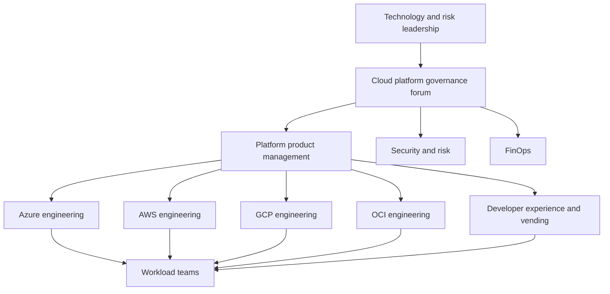
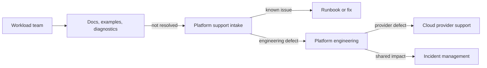

> **Document class:** Cloud Foundations & Governance operating model reference
> **Normative terms:** **MUST**, **MUST NOT**, **SHOULD**, **SHOULD NOT**, and **MAY** are requirements levels.
> **Applicability:** Platform ownership, team responsibilities, service boundaries, support, funding, reliability, risk, documentation, and continuous improvement.
> **Exception process:** Deviations require a documented risk assessment, compensating controls, named risk owner, and expiry date.

| Control field | Value |
|---|---|
| Document ID | `CFG-09` |
| Owner | Cloud Center of Excellence |
| Review cycle | At least annually and after material platform, provider, data, security, or operating-model changes |
| Evidence | Service records, responsibility matrix, SLOs, incident and change records, roadmap, and debt registers |

# Platform Ownership and Operating Model

> **Decision in brief:** Give every platform service a named owner, consumer contract, support model, reliability target, funding path, and retirement plan.

## Purpose

Cloud foundations require continuous ownership. Without a defined operating model, platform services degrade into shared infrastructure that everyone depends on and nobody owns. The operating model must specify product ownership, engineering responsibility, security accountability, support, funding, service levels, and decision rights.

The central platform team should enable workload autonomy, not become a permanent ticket queue or approval bottleneck.


## Document conventions

This article uses the following terms consistently:

- **Platform team**: the team that builds and operates shared cloud capabilities.
- **Workload team**: an application, data, product, or business team consuming the platform.
- **Landing zone**: a governed cloud environment prepared for workloads.
- **Guardrail**: a preventive, detective, or corrective control applied consistently through policy and automation.
- **Vending**: the automated creation and lifecycle management of subscriptions, accounts, projects, compartments, and their baseline configuration.

Provider examples are illustrative. The control objective is authoritative; the provider-specific implementation is replaceable.


## Team topology

A practical model includes:

- **Cloud platform product team**: owns the roadmap, service catalog, user experience, and platform outcomes.
- **Provider engineering teams or chapters**: own Azure, AWS, GCP, and OCI implementations.
- **Security engineering and governance**: define controls, review exceptions, and operate security capabilities.
- **Network and identity platform teams**: own enterprise-wide shared services and integrations.
- **Site reliability or operations function**: owns observability, incident processes, reliability engineering, and recovery tests.
- **FinOps function**: owns allocation standards, budgets, commitment governance, and optimization processes.
- **Workload teams**: own application architecture, deployment, data, on-call responsibilities, and compliance within the provided guardrails.



## Decision rights

| Decision | Accountable owner | Required participants |
|---|---|---|
| Platform roadmap and service catalog | Platform product owner | Provider leads, security, workload representatives |
| Enterprise cloud control objective | Security or risk owner | Platform engineering, architecture, legal/compliance |
| Provider implementation | Provider platform lead | Security engineering, operations |
| Shared network architecture | Network platform owner | Cloud platform, security, workload representatives |
| Identity federation and privileged access | Identity platform owner | Security, cloud platform, audit |
| Standard workload exception | Risk owner | Platform and workload owner |
| Platform release approval | Platform service owner | Engineering and operations |
| Workload production readiness | Workload owner | Security, platform, operations as required |

Avoid committees that approve ordinary deployments. Governance forums should set standards, resolve cross-team decisions, and review material risk.

## Service ownership model

Every platform service should have a service record:

```yaml
service: cloud-account-vending
product_owner: cloud-platform-product
engineering_owner: developer-experience
operations_owner: cloud-sre
security_owner: cloud-security
consumers: all-workload-teams
support_tier: tier-1
slo:
  availability: 99.9%
  standard_request_completion: 95% within 30 minutes
on_call: cloud-platform-primary
repository: platform/account-vending
runbook: runbooks/account-vending.md
recovery_plan: recovery/account-vending.md
```

Ownership must include roadmap, code, production operations, vulnerability response, upgrades, documentation, and retirement.

## Responsibility matrix

| Capability | Platform team | Security | Workload team | FinOps | Operations |
|---|---|---|---|---|---|
| Organizational hierarchy | A/R | C | I | C | I |
| Vending workflow | A/R | C | C | C | C |
| Baseline policy | R | A | C | I | C |
| Workload-specific controls | C | C | A/R | I | C |
| Shared transit and DNS | A/R | C | C | I | C |
| Application deployment | C | C | A/R | I | C |
| Cost allocation standards | C | I | C | A/R | I |
| Shared-service incident response | A/R | C | I | I | R |
| Application incident response | C | C | A/R | I | C |

A = accountable, R = responsible, C = consulted, I = informed.

## Product management

The platform roadmap should prioritize measurable user and risk outcomes. Inputs include:

- onboarding lead time and abandonment;
- recurring support tickets;
- policy violations and exception demand;
- platform incident data;
- workload architecture reviews;
- provider service changes;
- security and audit findings;
- cost anomalies and shared-service utilization;
- developer feedback and adoption data.

Do not prioritize capabilities solely because a provider released them.

## Support model

Use layered support:

1. Self-service documentation, examples, and diagnostics.
2. Workload-team support channel and office hours.
3. Platform engineering escalation.
4. Provider support escalation for service defects.
5. Incident command for shared-service impact.



Support data should feed the product backlog. Repeated tickets indicate a defective interface, missing automation, or weak documentation.

## Reliability model

Critical platform services require:

- service-level indicators and objectives;
- dependency maps;
- monitoring and synthetic tests;
- documented degradation modes;
- backup and recovery procedures;
- capacity and quota monitoring;
- on-call ownership;
- incident review and corrective actions;
- regular disaster-recovery exercises.

Examples of critical services include identity federation, DNS, transit networking, policy deployment, artifact registries, vending, secrets platforms, and centralized logging.

## Change and release management

Platform changes can affect many workloads. Use progressive delivery:

1. Validate changes in isolated engineering environments.
2. Run integration and policy tests.
3. Deploy to canary subscriptions, accounts, projects, or compartments.
4. Monitor technical and consumer impact.
5. Expand to non-production cohorts.
6. Schedule breaking production changes with migration guidance.
7. Preserve rollback or forward-fix procedures.

Do not require traditional change boards for low-risk, fully automated, tested changes. Apply stronger review to hierarchy, identity, routing, DNS, and high-scope policy changes.

## Funding model

Separate platform product costs from workload consumption:

- central funding for mandatory enterprise controls and core shared services;
- transparent allocation for directly consumed services;
- published pricing or chargeback for optional premium capabilities;
- explicit ownership of provider commitments and support plans;
- budget for lifecycle upgrades, technical debt, and resilience testing.

Underfunded platform maintenance produces security and reliability debt even when initial implementation was successful.

## Risk and exception governance

The platform team should not unilaterally accept business risk. It provides technical analysis and supported alternatives. Risk owners approve exceptions, which must be time-bound and tracked.

Escalate when:

- a workload requires a prohibited architecture;
- a provider limitation prevents a mandatory control;
- a platform capability cannot meet a regulatory requirement;
- an exception affects shared services or other workloads;
- a proposed change materially alters recovery, data, or identity risk.

## Documentation ownership

Documentation is part of the product. Each article, module, API, and runbook requires an owner and review date. Documentation should be versioned with the capability it describes.

Minimum documentation set:

- service catalog entry;
- architecture and dependency diagram;
- onboarding and usage guide;
- API or request schema;
- operational runbook;
- incident and recovery procedure;
- upgrade and deprecation policy;
- security and compliance mapping;
- troubleshooting guide;
- ownership and escalation contacts.

## Metrics

| Outcome | Example metric |
|---|---|
| Delivery speed | Account-vending lead time, onboarding completion time |
| Adoption | Percentage of workloads using supported paved roads |
| Reliability | SLO attainment, change failure rate, mean time to restore |
| Security | Critical violation age, workload-identity adoption, exception age |
| User experience | Support volume per consumer, satisfaction, repeated friction points |
| Financial control | Ownership coverage, budget coverage, shared-service unit cost |
| Sustainability | Supported-version adoption, technical-debt burn-down, documentation freshness |

## Anti-patterns

- Platform team owns every workload deployment.
- Shared services have no named on-call or recovery owner.
- Security defines controls without engineering implementation support.
- Workload teams can consume services but cannot provide roadmap feedback.
- The platform is funded only as a one-time transformation project.
- Support tickets do not feed product improvement.
- Committees approve routine technical actions that automation can validate.
- Documentation is detached from versioned platform releases.

## Validation

- [ ] Platform product, engineering, operations, security, and financial owners are named.
- [ ] Decision rights and escalation paths are documented.
- [ ] Every shared service has SLOs, monitoring, runbooks, and recovery ownership.
- [ ] Workload responsibilities are explicit.
- [ ] Roadmap prioritization uses adoption, friction, risk, reliability, and cost data.
- [ ] Platform releases use progressive deployment.
- [ ] Exceptions are approved by accountable risk owners.
- [ ] Funding covers maintenance, upgrades, and resilience work.
- [ ] Documentation is versioned, owned, and reviewed.

## Service tiering and support commitments

Classify platform services by consumer impact:

| Tier | Example | Required operating model |
|---|---|---|
| Tier 0 | Identity federation, emergency access, DNS, core transit | Continuous ownership, independent recovery, strict change control |
| Tier 1 | Vending, policy deployment, artifact registry, central logging | On-call, SLOs, tested restoration, capacity management |
| Tier 2 | Optional developer tooling and advisory services | Business-hours support and documented workaround |
| Experimental | Preview capability | Named sponsor, limited consumers, no implicit production commitment |

A dependency can raise the effective tier. A Tier 2 portal that is the only way to recover a Tier 0 identity service is incorrectly classified.

## Platform capacity and skills

The operating plan must cover more than initial engineering. Forecast capacity for:

- product management and consumer research;
- provider engineering and IaC maintenance;
- identity, network, security, and observability expertise;
- release engineering and test automation;
- on-call, incident review, and recovery exercises;
- documentation, enablement, and support;
- provider roadmap and deprecation tracking;
- compliance evidence and exception handling.

Key-person dependency is an operational risk. Critical services require at least two capable maintainers and documented recovery procedures.

## Consumer engagement and roadmap governance

Use several evidence channels:

- service usage and abandonment;
- onboarding funnel and lead time;
- support tickets and repeated failure categories;
- exception requests;
- workload architecture and incident reviews;
- developer surveys and office hours;
- provider change and security findings.

Publish roadmap decisions with the user problem, expected outcome, target consumers, and success metric. Declining a request should include the rationale and a supported alternative when one exists.

## Technical debt and sustainability

Maintain a platform debt register covering unsupported versions, manual controls, permanent exceptions, untested recovery, duplicated services, stale documentation, and non-federated credentials.

Each debt item needs:

- affected service and consumers;
- risk and failure consequence;
- owner and target date;
- interim compensating control;
- migration or retirement plan;
- validation proving closure.

Reserve funded capacity for maintenance. A roadmap that allocates all engineering time to new features guarantees degradation of shared foundations.

## Related topics

- [Cloud Platform Engineering Principles](cloud-platform-engineering-principles.md)
- [Subscription and Account Vending](subscription-and-account-vending.md)
- [Policy, Guardrails, and Compliance](policy-guardrails-and-compliance.md)
- [Resource Naming, Tagging, and Metadata Standards](resource-naming-tagging-and-metadata-standards.md)
