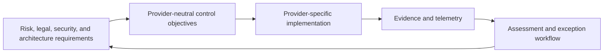
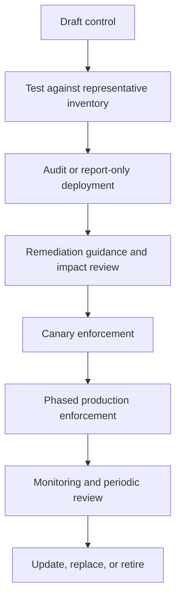
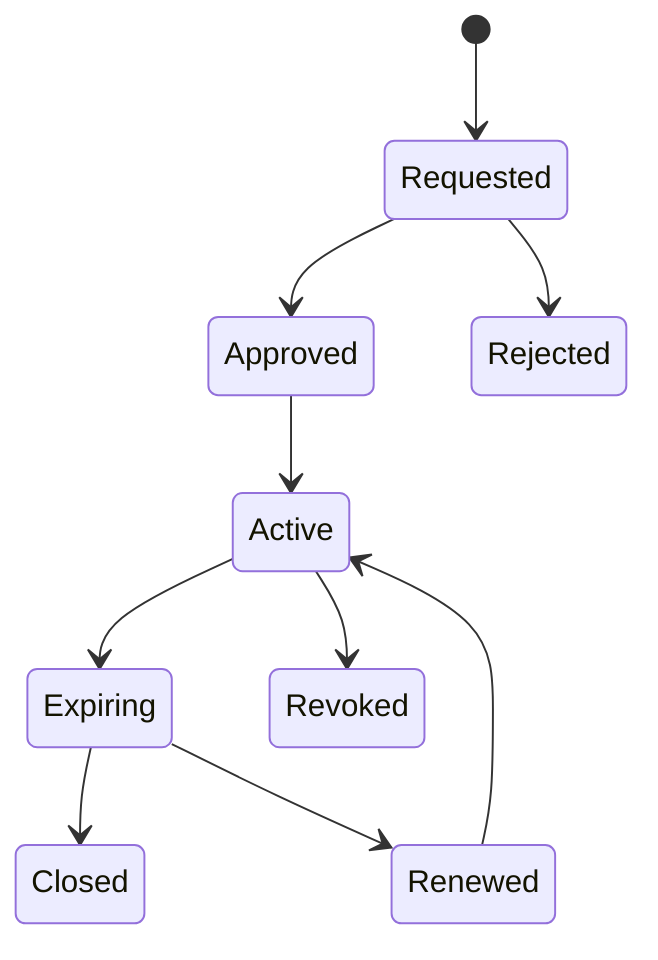

> **文档类型：** 云基础和治理实施指南
> **规范性术语：** **MUST**、**MUST NOT**、**SHOULD**、**SHOULD NOT** 和 **MAY** 是要求级别。
> **适用范围：** 预防性、检测性和纠正性云控制、策略即代码、例外、证据、合规性度量和修复。
> **例外流程：** 偏离要求需要记录风险评估、补偿控制、指定风险负责人和到期日期。

|控制领域|价值|
|---|---|
|文件编号 | `CFG-07` |
|负责人|云卓越中心 |
|审核周期|至少每年一次，并且在重大平台、提供商、数据、安全或运营模式发生变化之后 |
|证据|控制目录、策略测试、违规历史记录、例外情况、修复结果和有效性审查 |

# 策略、护栏和合规性

> **决策简述：** 将控制作为经过测试的策略即代码进行管理，具有明确的执行模式、安全修复、有时限的例外情况和可重现的证据。

## 目的

云策略应将风险和合规性要求转换为明确的技术成果。成熟的护栏计划使用预防性控制（可了解影响）、检测性控制（预防不安全）以及纠正性控制（可在不损害工作负载的情况下自动进行修复）。

策略计数并不是一个有用的成功指标。有效覆盖范围、异常质量、违规重复率和修复时间是实质上更好的措施。


## 文档约定

本文一致使用以下术语：

- **平台团队**：构建和运营共享云能力的团队。
- **工作负载团队**：使用平台的应用、数据、产品或业务团队。
- **Landing Zone**：为工作负载准备的受管云环境。
- **护栏**：通过策略和自动化一致应用的预防性、检测性或纠正性控制。
- **自动发放**：订阅、账户、项目、隔间及其基线配置的自动创建和生命周期管理。

提供商示例是说明性的。控制目标具有权威性；特定于提供商的实现是可替换的。


## 控制模型

每个控制都应有稳定的标识符、目标、理由、范围、执行模式、证据来源、所有者、严重性、修复指南和例外规则。

## 护栏类型

|类型 |目的|示例|
|---|---|---|
|预防|阻止不安全的创建或更改 |拒绝公共数据库端点 |
|侦探|识别违规行为 |检测无需保留的存储 |
|矫正|修复安全、易于理解的漂移 |启用诊断导出或应用所需标签 |
|补偿 |当无法满足主要控制时降低风险 |临时防火墙限制加上增强监控|

在没有显式测试和回滚的情况下，请勿对可能中断服务、删除数据、轮换密钥、更改路由或更改身份的更改使用自动修复。

## 控制分类

推荐域名：

- 组织和账户治理；
- 身份和特权访问；
- 网络暴露和分段；
- 加密和密钥管理；
- 日志、监控和证据保留；
- 漏洞和配置管理；
- 数据位置、分类和保留；
- 备份、恢复和弹性；
- 财务控制和所有权元数据；
- 软件供应链和部署完整性。

## 控制规范
```yaml
control_id: IAM-007
name: Workload automation uses short-lived identity
objective: CI/CD and cloud workloads must authenticate without reusable static credentials.
severity: high
scope: all-managed-cloud-boundaries
mode: preventive-and-detective
owner: cloud-security
remediation: Replace access keys or secrets with workload identity federation or native workload identity.
exception:
  approver: cloud-risk-owner
  maximum_days: 60
  compensating_controls:
    - secret stored in approved vault
    - rotation interval <= 30 days
    - restricted source network
```
## 提供商实现映射

|目标|Azure|AWS | GCP |OCI |
|---|---|---|---|---|
|限制地区 | Azure Policy | SCP |Organization Policy|配额和策略控制|
|防止公共存储 | Azure Policy | SCP plus Config/resource policy |Organization Policy and SCC |Security Zones 和 Cloud Guard|
|中央审计日志|Activity Log/diagnostics| CloudTrail/Config | Cloud Audit Logs|Audit/Logging|
|需要工作负载身份 |Managed identity/federation policy checks | IAM role and access-key detection | WIF 和 service-account controls |Dynamic groups and resource principals |
|强制加密 |Policy and service configuration| SCP/Config/KMS policy |Organization Policy/CMEK controls |Security Zones、Vault、service policy |
|检测配置漂移 |Policy compliance and Resource Graph |Config and Security Hub|Asset Inventory and SCC | Cloud Guard 和 configuration queries |

## 策略生命周期

高范围拒绝控制永远不应该直接从草案迁移到企业实施。测试现有资源影响、部署行为、提供商例外和紧急操作。

## 范围和继承

在最高安全范围内应用控制。广泛的范围可以提高一致性，但也会放大错误。使用层次结构放置继承公共控件并在树的较低位置应用特定于工作负载的扩展。

推荐分层：

1.企业强制控制。
2. 提供商平台控制。
3. 环境或监管概况控制。
4. 特定于工作负载的控制。
5. 临时异常或迁移覆盖。

## 例外情况

例外是风险决策，而不是策略绕行。要求：

- 控制标识符和受影响的资源；
- 技术和商业理由；
- 负责任的所有者；
- 风险负责人批准；
- 补偿控制；
- 开始日期和到期日期；
- 修复或迁移计划；
- 证据和审查节奏。

永久豁免应建模为明确的替代控制或架构配置文件，而不是作为无休止的临时例外。

## 合规证据

证据应证明控制的有效性并具有可重复性。常见的证据包括：

- 有效的组织策略和 IAM 状态；
- 云审计事件；
- 配置清单；
- 策略合规结果；
- 漏洞和安全发现；
- 网络暴露和路由数据；
- 加密和密钥所有权数据；
- 异常日志记录；
- 部署和变更记录；
- 备份和恢复测试结果。

使用时间戳、源标识符、收集方法、控制映射和保留策略来存储证据。屏幕截图是薄弱的证据，因为它们难以复制和验证。

## 策略即代码

策略库应包含：

- 提供商中立的控制目录；
- 提供商原生定义；
- 任务和范围；
- 测试装置和预期结果；
- 异常数据或参考文档；
- 版本和发布说明；
- 所有权和升级元数据。

测试应该验证允许和拒绝的场景。阻止有效平台操作的策略即使降低了风险，也是有缺陷的。

## 修复模型

在修复之前对发现的结果进行分类：

|类别 |响应 |
|---|---|
|新资源被封锁 |提供合规模式和清晰的错误消息 |
|现有的安全修复漂移|通过日志记录和回滚功能自动修复 |
|现有的颠覆性漂移|创建所有者任务、风险严重性和截止日期 |
|不支持的业务需求 |架构和风险审查之路|
|误报或策略缺陷 |正确的策略并重新评估受影响的清单|

## 运营指标

- 每个关键控制覆盖的管理清单的百分比；
- 严重违规行为的数量和年龄；
- 按严重程度划分的平均修复时间；
- 修复后的复发率；
- 按年龄、所有者和控制权划分的例外情况；
- 具有自动化测试的策略的百分比；
- 策略导致的部署失败率；
- 误报率和回滚率；
- 证据收集的完整性。

## 反模式

- 通过策略定义的数量来度量成熟度。
- 在没有影响测试的情况下执行大范围拒绝策略。
- 在没有稳定控制目标的情况下编写特定于提供商的策略。
- 允许无期限和所有者的例外情况。
- 自动修复破坏性设置。
- 将仅审计结果视为无限期可接受。
- 使用屏幕截图作为主要合规证据。
- 阻止团队不发布合规的实施模式。

## 验证

- [ ] 每项策略都映射到记录在案的控制目标。
- [ ] 控制具有所有者、严重性、证据和修复指南。
- [ ] 高影响力控制使用分阶段推出和金丝雀测试。
- [ ] 例外情况有时间限制且风险已批准。
- [ ] 证据是自动的、带有时间戳的且可复制的。
- [ ] 策略仓库包括测试和发布历史记录。
- [ ] 纠正性自动化仅限于安全、可逆的更改。
- [ ] 指标跟踪覆盖范围、重复情况、异常情况和修复时间。
- [ ] 当云服务发生变化时，会审查提供商的实施情况。

## 执行模式和推出门

明确定义强制模式：

|模式|行为 |适合用途 |
|---|---|---|
|监控|收集清单和违规行为而不影响部署 |发现与控制设计|
|警告 |在变更完成之前显示可操作的反馈 |开发者反馈和迁移 |
|否认|块创建或更新 |高可信度、高影响力的预防 |
|修改|添加或更改安全字段 |确定性元数据或配置|
|部署/修复 |创建支持配置 |具有经过测试的所有权的诊断或代理 |
|检疫|限制有风险的边界或资源|事件或严重违规 |

模式之间的升级需要度量标准：已知的清单影响、低误报率、合规参考实施、修复指南、经过测试的紧急操作和回滚。

## 策略依赖和优先级

控制可以依赖于身份、网络、服务注册或其他策略。记录依赖关系和执行顺序。

示例：

- 诊断策略取决于目的地和授权；
- 私有端点要求取决于 DNS 和网络容量；
- 拒绝策略可能会阻止使资源合规的修复部署；
- 标签修改策略可能与 IaC 模块或提供程序默认值冲突。

测试有效的组合策略集，而不是孤立的定义。维护代表平台资源、普通工作负载、受监管工作负载、沙箱和紧急操作的固定装置。

## 异常实现

风险日志记录和技术豁免必须保持同步。在两个系统中存储稳定的异常 ID。

技术豁免控制应当：

- 仅匹配批准的资源或狭窄的范围；
- 参考控制和风险日志记录；
- 自动过期；
- 在风险需要独立性的情况下，防止受影响的工作负载团队进行自我批准；
- 到期前后提醒；
- 当资源、所有者或架构发生变化时重新评估。

风险批准到期后在技术上仍然有效的豁免是控制失败。

## 控制有效性测试

测试不仅仅是策略部署的成功。对于每个关键控制，验证：

1. 禁止的更改被拒绝或检测到。
2. 审核通过的配置成功。
3. 证据已出示并可归属。
4. 例外情况仅应用于其批准的范围。
5. 修复行为安全且幂等。
6. 检测到控制故障或禁用采集。
7. 紧急程序仍然是可能的。
8. 提供商的改变不会意外地改变语义。

通过控制版本和提供程序实施安排测试并保留结果。

## 相关主题

- [多云架构与治理](multi-cloud-architecture-and-governance.md)
- [管理组、账户与组织结构](management-groups-accounts-and-organizational-structure.md)
- [订阅与账户发放](subscription-and-account-vending.md)
- [资源命名、标签和元数据标准](resource-naming-tagging-and-metadata-standards.md)
