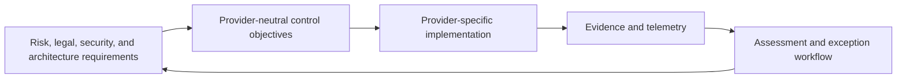
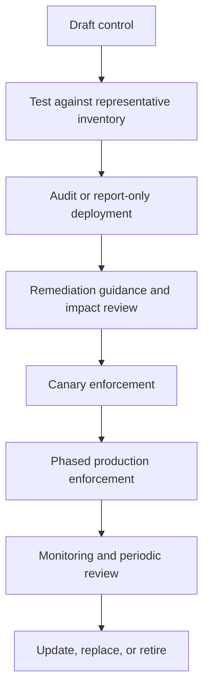
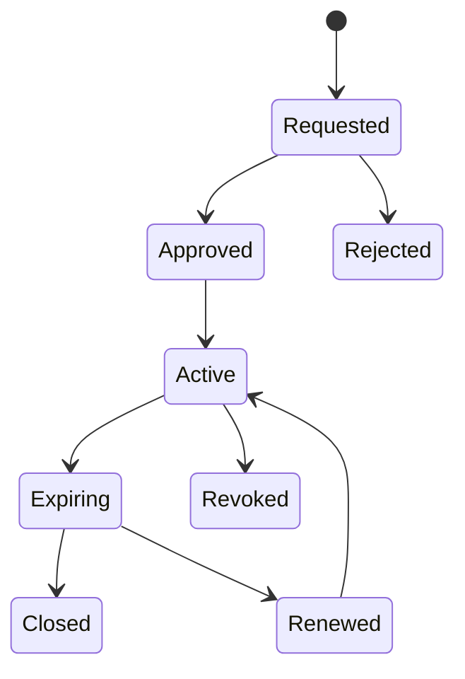

> **Document class:** Cloud Foundations & Governance implementation guide
> **Normative terms:** **MUST**, **MUST NOT**, **SHOULD**, **SHOULD NOT**, and **MAY** are requirements levels.
> **Applicability:** Preventive, detective, and corrective cloud controls, policy-as-code, exceptions, evidence, compliance measurement, and remediation.
> **Exception process:** Deviations require a documented risk assessment, compensating controls, named risk owner, and expiry date.

| Control field | Value |
|---|---|
| Document ID | `CFG-07` |
| Owner | Cloud Center of Excellence |
| Review cycle | At least annually and after material platform, provider, data, security, or operating-model changes |
| Evidence | Control catalog, policy tests, violation history, exceptions, remediation results, and effectiveness reviews |

# Policy, Guardrails, and Compliance

> **Decision in brief:** Manage controls as tested policy code with explicit enforcement modes, safe remediation, time-bound exceptions, and reproducible evidence.

## Purpose

Cloud policy should convert risk and compliance requirements into clear technical outcomes. A mature guardrail program uses preventive controls where the impact is understood, detective controls where prevention would be unsafe, and corrective controls where remediation can be automated without damaging workloads.

Policy count is not a useful success metric. Effective coverage, exception quality, violation recurrence, and remediation time are materially better measures.


## Document conventions

This article uses the following terms consistently:

- **Platform team**: the team that builds and operates shared cloud capabilities.
- **Workload team**: an application, data, product, or business team consuming the platform.
- **Landing zone**: a governed cloud environment prepared for workloads.
- **Guardrail**: a preventive, detective, or corrective control applied consistently through policy and automation.
- **Vending**: the automated creation and lifecycle management of subscriptions, accounts, projects, compartments, and their baseline configuration.

Provider examples are illustrative. The control objective is authoritative; the provider-specific implementation is replaceable.


## Control model



Each control should have a stable identifier, objective, rationale, scope, enforcement mode, evidence source, owner, severity, remediation guidance, and exception rules.

## Guardrail types

| Type | Purpose | Example |
|---|---|---|
| Preventive | Blocks unsafe creation or change | Deny public database endpoints |
| Detective | Identifies non-compliance | Detect storage without required retention |
| Corrective | Repairs safe, well-understood drift | Enable diagnostic export or apply required tag |
| Compensating | Reduces risk when the primary control cannot be met | Temporary firewall restriction plus enhanced monitoring |

Do not use automatic remediation for changes that can interrupt service, delete data, rotate keys, alter routes, or change identity without explicit testing and rollback.

## Control taxonomy

Recommended domains:

- organization and account governance;
- identity and privileged access;
- network exposure and segmentation;
- encryption and key management;
- logging, monitoring, and evidence retention;
- vulnerability and configuration management;
- data location, classification, and retention;
- backup, recovery, and resilience;
- financial controls and ownership metadata;
- software supply chain and deployment integrity.

## Control specification

```yaml
control_id: IAM-007
name: Workload automation uses short-lived identity
objective: CI/CD and cloud workloads must authenticate without reusable static credentials.
severity: high
scope: all-managed-cloud-boundaries
mode: preventive-and-detective
owner: cloud-security
remediation: Replace access keys or secrets with workload identity federation or native workload identity.
exception:
  approver: cloud-risk-owner
  maximum_days: 60
  compensating_controls:
    - secret stored in approved vault
    - rotation interval <= 30 days
    - restricted source network
```

## Provider implementation mapping

| Objective | Azure | AWS | GCP | OCI |
|---|---|---|---|---|
| Restrict regions | Azure Policy | SCP | Organization Policy | Quotas and policy controls |
| Prevent public storage | Azure Policy | SCP plus Config/resource policy | Organization Policy and SCC | Security Zones and Cloud Guard |
| Central audit logs | Activity Log/diagnostics | CloudTrail/Config | Cloud Audit Logs | Audit/Logging |
| Require workload identity | Managed identity/federation policy checks | IAM role and access-key detection | WIF and service-account controls | Dynamic groups and resource principals |
| Enforce encryption | Policy and service configuration | SCP/Config/KMS policy | Organization Policy/CMEK controls | Security Zones, Vault, service policy |
| Detect configuration drift | Policy compliance and Resource Graph | Config and Security Hub | Asset Inventory and SCC | Cloud Guard and configuration queries |

## Policy lifecycle



A high-scope deny control should never move directly from draft to enterprise enforcement. Test existing-resource impact, deployment behavior, provider exceptions, and emergency operations.

## Scope and inheritance

Apply controls at the highest safe scope. Broad scope improves consistency but magnifies mistakes. Use hierarchy placement to inherit common controls and apply workload-specific extensions lower in the tree.

Recommended layering:

1. Enterprise mandatory controls.
2. Provider platform controls.
3. Environment or regulatory profile controls.
4. Workload-specific controls.
5. Temporary exception or migration overlays.

## Exceptions

An exception is a risk decision, not a policy bypass. Require:

- control identifier and affected resources;
- technical and business justification;
- accountable owner;
- risk owner approval;
- compensating controls;
- start and expiration dates;
- remediation or migration plan;
- evidence and review cadence.



Permanent exemptions should be modeled as explicit alternative controls or architecture profiles, not left as endless temporary exceptions.

## Compliance evidence

Evidence should prove control effectiveness and be reproducible. Common evidence includes:

- effective organization policy and IAM state;
- cloud audit events;
- configuration inventory;
- policy compliance results;
- vulnerability and security findings;
- network exposure and route data;
- encryption and key ownership data;
- exception records;
- deployment and change records;
- backup and recovery test results.

Store evidence with timestamps, source identifiers, collection method, control mapping, and retention policy. Screenshots are weak evidence because they are difficult to reproduce and validate.

## policy-as-code

Policy repositories should contain:

- provider-neutral control catalog;
- provider-native definitions;
- assignments and scopes;
- test fixtures and expected outcomes;
- exception data or references;
- version and release notes;
- ownership and escalation metadata.

Tests should verify both allowed and denied scenarios. A policy that blocks valid platform operations is defective even if it reduces risk.

## Remediation model

Classify findings before remediation:

| Category | Response |
|---|---|
| New resource blocked | Provide a compliant pattern and clear error message |
| Existing safe-to-fix drift | Automate remediation with logging and rollback capability |
| Existing disruptive drift | Create owner task, risk severity, and deadline |
| Unsupported business requirement | Route to architecture and risk review |
| False positive or policy defect | Correct policy and reassess affected inventory |

## Operational metrics

- percentage of managed inventory covered by each critical control;
- number and age of critical violations;
- mean time to remediate by severity;
- recurrence rate after remediation;
- exceptions by age, owner, and control;
- percentage of policies with automated tests;
- policy-caused deployment failure rate;
- false-positive and rollback rate;
- evidence-collection completeness.

## Anti-patterns

- Measuring maturity by the number of policy definitions.
- Enforcing high-scope deny policies without impact testing.
- Writing provider-specific policies without a stable control objective.
- Allowing exceptions without expiry and owner.
- Automatically remediating disruptive settings.
- Treating audit-only findings as acceptable indefinitely.
- Using screenshots as primary compliance evidence.
- Blocking teams without publishing compliant implementation patterns.

## Validation

- [ ] Every policy maps to a documented control objective.
- [ ] Controls have owners, severity, evidence, and remediation guidance.
- [ ] High-impact controls use staged rollout and canary testing.
- [ ] Exceptions are time-bound and risk approved.
- [ ] Evidence is automated, timestamped, and reproducible.
- [ ] Policy repositories include tests and release history.
- [ ] Corrective automation is limited to safe, reversible changes.
- [ ] Metrics track coverage, recurrence, exceptions, and remediation time.
- [ ] Provider implementations are reviewed when cloud services change.

## Enforcement modes and rollout gates

Define the enforcement mode explicitly:

| Mode | Behavior | Suitable use |
|---|---|---|
| Observe | Collects inventory and violations without deployment impact | Discovery and control design |
| Warn | Surfaces actionable feedback before change completion | Developer feedback and migration |
| Deny | Blocks creation or update | High-confidence, high-impact prevention |
| Modify | Adds or changes safe fields | Deterministic metadata or configuration |
| Deploy/remediate | Creates supporting configuration | Diagnostics or agents with tested ownership |
| Quarantine | Restricts a risky boundary or resource | Incident or severe non-compliance |

Promotion between modes requires measured criteria: known inventory impact, low false-positive rate, compliant reference implementations, remediation guidance, tested emergency operations, and rollback.

## Policy dependencies and precedence

A control can depend on identity, networking, service registration, or another policy. Document dependencies and execution order.

Examples:

- a diagnostic policy depends on a destination and authorization;
- a private-endpoint requirement depends on DNS and network capacity;
- a deny policy may block the remediation deployment that would make a resource compliant;
- a tag-modification policy can conflict with an IaC module or provider default.

Test the effective combined policy set, not definitions in isolation. Maintain fixtures representing platform resources, ordinary workloads, regulated workloads, sandboxes, and emergency operations.

## Exception implementation

The risk record and technical exemption must remain synchronized. Store a stable exception ID in both systems.

Technical exemption controls should:

- match only the approved resource or narrow scope;
- reference the control and risk record;
- have an automated expiration;
- prevent self-approval by the affected workload team where risk requires independence;
- alert before and after expiration;
- be reevaluated when the resource, owner, or architecture changes.

An exemption that remains technically active after the risk approval expires is a control failure.

## Control effectiveness testing

Test more than policy deployment success. For each critical control, verify:

1. A prohibited change is denied or detected.
2. An approved configuration succeeds.
3. Evidence is produced and attributable.
4. An exception applies only to its approved scope.
5. Remediation behaves safely and idempotently.
6. Control failure or disabled collection is detected.
7. Emergency procedures remain possible.
8. Provider changes do not alter semantics unexpectedly.

Schedule tests and retain results by control version and provider implementation.

## Related topics

- [Multi-Cloud Architecture and Governance](multi-cloud-architecture-and-governance.md)
- [Management Groups, Accounts, and Organizational Structure](management-groups-accounts-and-organizational-structure.md)
- [Subscription and Account Vending](subscription-and-account-vending.md)
- [Resource Naming, Tagging, and Metadata Standards](resource-naming-tagging-and-metadata-standards.md)
