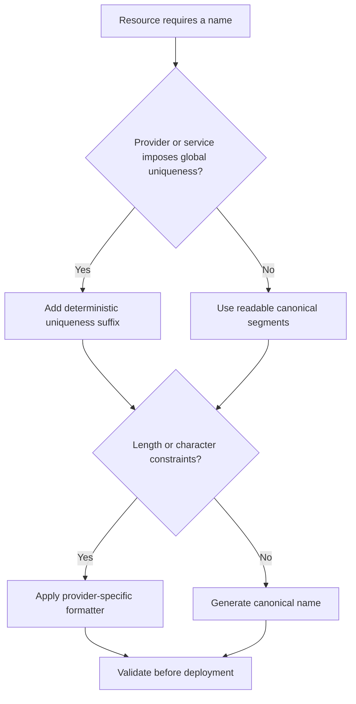
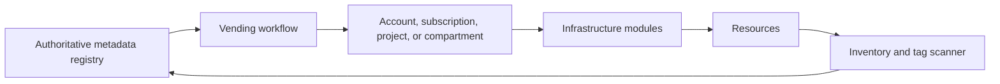

> **文档类型：** Cloud Foundations & Governance 强制性工程标准
> **规范性术语：** **MUST**、**MUST NOT**、**SHOULD**、**SHOULD NOT** 和 **MAY** 是要求级别。
> **适用范围：** 资源名称、Tags、Labels、元数据注册表、所有权、成本分配、发现、自动化和生命周期管理。
> **例外流程：** 偏离要求需要记录风险评估、补偿控制、指定风险负责人和到期日期。

|控制领域|价值|
|---|---|
|文件编号 | `CFG-08` |
|负责人|云卓越中心 |
|审核周期|至少每年一次，并且在重大平台、提供商、数据、安全或运营模式发生变化之后 |
|证据|命名和元数据架构、合规性报告、所有者和成本协调以及迁移证据 |

# 资源命名、标记和元数据标准

> **简要决定：** 使用简短的稳定名称进行身份识别和搜索；将可变的所有权、成本和生命周期数据保存在受管理的元数据中。

## 目的

名称和元数据支持自动化、所有权、成本分配、事件响应、合规性、搜索和生命周期管理。它们不是装饰惯例。标准应该足够严格以实现自动化，但又足够简单以实现一致应用。

不要对资源名称中的每个属性进行编码。名称通常是不可变的、长度受限的、全局唯一的或暴露给客户的。将可变或敏感属性放入元数据系统和标签中。


## 文档约定

本文一致使用以下术语：

- **平台团队**：构建和运营共享云能力的团队。
- **工作负载团队**：使用平台的应用、数据、产品或业务团队。
- **Landing Zone**：为工作负载准备的受管云环境。
- **护栏**：通过策略和自动化一致应用的预防性、检测性或纠正性控制。
- **自动发放**：订阅、账户、项目、隔间及其基线配置的自动创建和生命周期管理。

提供商示例是说明性的。控制目标具有权威性；特定于提供商的实现是可替换的。


## 设计原则

1. 对人类必须识别的资源使用简短的、确定性的名称。
2. 将可变的业务信息存储在标签或权威注册表中。
3. 避免个人数据、机密项目名称以及名称或标签中的机密。
4. 对环境、区域、重要性和分类使用稳定的受控词汇。
5. 考虑提供程序的长度、特征、唯一性和大小写限制。
6. 通过模块和自动预配工作流生成名称和强制标签。
7. 自动化使用时将标签视为不可信输入；验证允许的值。

## 命名模型

通用资源名称可以使用以下模式：
```text
<org>-<workload>-<environment>-<region>-<resource>-<instance>
```
例子：
```text
acme-claims-prd-cac-app-01
```
并非每个资源都应该使用每个段。规范模式是确定性生成的来源，而不是超出提供商限制的要求。

### 受控缩写

|尺寸|示例值 |
|---|---|
|环境 | prd、stg、tst、dev、sbx |
|地区 | cac、cae、use1、usw2、uks、fra |
|资源类型| rg、vnet、snet、应用、func、vm、db、kv、日志、fw |
|实例| 01, 02, a, b |

维护一份企业缩写注册表。不要让每个团队发明自己的代码。

## 命名决策流程

## 提供商约束

提供商和服务的命名规则各不相同并且会发生变化。为每种资源类型实现验证器，而不是依赖一个通用正则表达式。

典型的约束包括：

- 全球唯一的对象存储或应用端点；
- 名称仅小写；
- 限制标点符号；
——最大长度短于企业模式；
- 创建后不能更改的名称；
- 服务生成的名称或 ID。

当可读性与所需的唯一性冲突时，保留可读前缀并添加从稳定输入派生的确定性短哈希。

## 强制元数据

以下字段应存在于注册表中，并且在支持的情况下作为云标记或标签：

|关键|目的|示例|
|---|---|---|
|负责人技术 |负责任的工程团队 |声明平台|
|负责人企业 |企业责任|保险业务|
|产品 ID |稳定的应用或产品标识符 | APP-0148 |
|环境 |生命周期环境 |生产|
|成本中心 |财政拨款| CC-4402 |
|数据分类 |数据保护要求 |保密|
|关键性|恢复和运营层|一级 |
|管理者 |发放系统|云平台|
|仓库 |源码库参考|平台/声明基础设施 |
|生命周期状态 |活跃、沙盒、隔离、退休 |活跃 |
|评论日期 |所有权或合规审查日期 | 2027-08-01 |

不要假设所有提供程序都支持相同的标签数量、长度、继承或字符集。必要时将权威元数据模型保留在提供商标签之外。

## 标签传播和继承

云标签继承不一致。一些提供商支持组织默认标签或策略驱动的注入；其他需要部署时传播。定义事实来源和协调过程。

当资源级计费或策略依赖于资源标签时，高范围的标签是不够的。相反，将每个组织属性复制到每个资源会产生噪音和成本。

## 提供商映射

|企业理念 |Azure|AWS | GCP |OCI |
|---|---|---|---|---|
|资源元数据 |标签 |标签 |标签和标记|定义的和自由格式的标签 |
|组织元数据 |订阅和管理数据 |账户标签和组织元数据 |项目标签/标签|隔间和租户标签 |
|策略执行| Azure Policy |Tag policies、SCP support、Config |Organization Policy and custom controls|Tag defaults、policies、Cloud Guard/custom checks |
|成本分配|成本管理标签|成本分配标签|开票出口标签|成本跟踪标签|

提供商原生标签策略功能不会取代权威的所有权注册表。

## 命名示例

### Azure
```text
Resource group: rg-claims-prd-cac-01
Virtual network: vnet-claims-prd-cac-01
Key vault: kvclaimsprdcac7f2a
Log Analytics workspace: log-claims-prd-cac-01
```
### AWS
```text
Account alias: acme-claims-prd
VPC Name tag: vpc-claims-prd-use1-01
IAM role: claims-prd-deployer
S3 bucket: acme-claims-prd-use1-artifacts-7f2a
```
### GCP
```text
Project ID: acme-claims-prd-7f2a
VPC: vpc-claims-prd-nam1-01
Service account: claims-prd-deployer
```
### OCI
```text
Compartment: claims-production
VCN display name: vcn-claims-prd-yyz-01
Defined tag: Governance.OwnerTechnical=claims-platform
```
## 元数据治理

### 词汇所有权

为每个受控字段分配一个所有者。例如：

- 财务团队负责成本中心和分配规则。
- 安全团队负责数据分类。
- 服务管理负责产品标识符和生命周期状态。
- 平台工程负责环境、区域和管理价值。
- 工作负载所有者保留技术和业务所有权。

### 验证

在请求和部署时验证元数据：

- 受控词汇中存在值；
- 所有者组存在；
- 成本中心处于活动状态；
- 审核日期有效；
- 环境与层次结构布局相匹配；
- 数据分类与策略概况相匹配；
- 不存在禁止或敏感内容。

### 和解

运行定期清单扫描。自动更正安全遗漏，并为不明确或冲突的元数据创建所有者任务。请勿在未经验证的情况下覆盖基于过时注册表的工作负载数据。

## 名称更改和生命周期

由于许多名称是不可变的，因此请勿在标识符中使用团队名称、员工名称、临时计划或可变部门。所有权变更应该更新元数据，而不是强制更换资源。

对于退役，请在注册表中保留足够长的标识符，以关联审计日志、成本、DNS、证书和事件。

## 反模式

- 完全在名称中编码所有者、成本中心和分类。
- 跨团队使用不一致的缩写。
- 在标签中包含电子邮件地址或个人姓名。
- 部署后依赖手动标记。
- 同时使用自由格式环境值，例如 `prod`、`production`、`live` 和 `prd`。
- 将提供商标签视为唯一的事实来源。
- 创建超出服务限制的名称，然后不可预测地截断它们。
- 在不可变资源标识符中使用可变部门名称。

## 验证

- [ ] 发布规范命名段和缩写注册表。
- [ ] 特定于资源的验证器处理提供商约束。
- [ ] 强制元数据已定义所有者和受控词汇表。
- [ ] Vending 和 IaC 模块自动生成名称和标签。
- [ ] 名称和标签中禁止使用敏感数据。
- [ ] 权威注册表与云清单一致。
- [ ] 成本分配字段已启用并验证。
- [ ] 所有权更改不需要资源重命名。
- [ ] 退役的标识符仍可追踪以实现所需的保留。

## 规范元数据模式

独立于提供商标签格式定义企业模式。注册表记录可以包含比任何云所允许的更丰富的字段：
```yaml
resource_identity:
  product_id: APP-0148
  environment: production
  component: claims-api
ownership:
  technical_group: claims-platform
  business_unit: insurance-operations
  cost_center: CC-4402
governance:
  data_classification: confidential
  criticality: tier-1
  lifecycle_state: active
  review_date: 2027-08-01
automation:
  managed_by: terraform
  repository: platform/claims-infra
  module_release: network-v4.2.1
```
提供商标签应仅包含本地策略、搜索、自动化和成本所需的字段。注册表对于超出提供商限制的关系、历史记录和值仍然具有权威性。

## 不可变的名称和可变的别名

区分三个概念：

- **资源标识符：** 提供商生成的 ID，用于自动化和证据。
- **技术名称：** 受提供商约束的稳定部署名称。
- **人类别名：** 操作员使用的可变显示或目录标签。

使用 DNS、服务发现、配置和目录来满足重命名需求。不要仅仅为了反映组织重塑而更换基础设施，除非该名称会造成法律、安全或重大运营问题。

## 元数据合规性评分

按领域和业务影响度量元数据质量：

|结果 |解读|
|---|---|
|完整并经过验证 |价值存在且符合权威来源 |
|存在但未经证实 |标签存在，但无法验证所有者或成本中心 |
|冲突|提供商元数据与注册表或计费来源不同 |
|失踪|缺少所需值 |
|陈旧|审核日期已过期或所有者不再存在 |
|禁止 |存在敏感或格式错误的内容 |

不要将非空标签视为合规。根据身份组协调所有者、根据财务日志记录协调成本中心、根据实际资源使用协调生命周期状态。

## 遗留资源迁移

对于现有屋村：

1. 清单名称、标签、别名、所有者和账单日志记录。
2. 将自由格式值映射到受控词汇表。
3. 识别无法在不替换的情况下重命名的资源。
4. 自动应用安全元数据更正。
5. 将不明确的所有权和分类传递给责任团队。
6. 添加别名或注册表日志记录，而不是破坏性重命名。
7. 为无主或未分类资源设定最后期限。
8. 验证迁移后的成本分配和策略行为。

重命名应该是最后的手段。元数据标准化通常会在不中断服务的情况下产生大部分运营价值。

## 相关主题

- [订阅与账户发放](subscription-and-account-vending.md)
- [策略、护栏和合规性](policy-guardrails-and-compliance.md)
- [平台所有权及运营模式](platform-ownership-and-operating-model.md)
