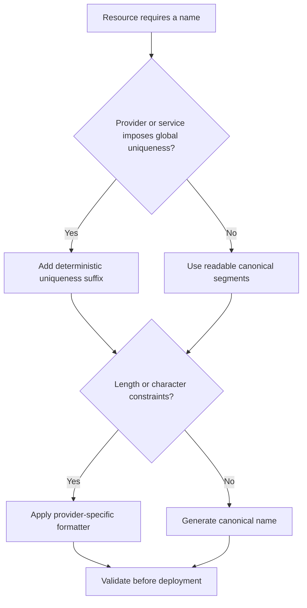
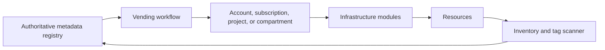

> **Document class:** Cloud Foundations & Governance mandatory engineering standard
> **Normative terms:** **MUST**, **MUST NOT**, **SHOULD**, **SHOULD NOT**, and **MAY** are requirements levels.
> **Applicability:** Resource names, tags, labels, metadata registries, ownership, cost allocation, discovery, automation, and lifecycle management.
> **Exception process:** Deviations require a documented risk assessment, compensating controls, named risk owner, and expiry date.

| Control field | Value |
|---|---|
| Document ID | `CFG-08` |
| Owner | Cloud Center of Excellence |
| Review cycle | At least annually and after material platform, provider, data, security, or operating-model changes |
| Evidence | Naming and metadata schema, compliance reports, owner and cost reconciliation, and migration evidence |

# Resource Naming, Tagging, and Metadata Standards

> **Decision in brief:** Use short stable names for identity and search; keep mutable ownership, cost, and lifecycle data in governed metadata.

## Purpose

Names and metadata support automation, ownership, cost allocation, incident response, compliance, search, and lifecycle management. They are not decorative conventions. A standard should be strict enough to automate but simple enough to apply consistently.

Do not encode every attribute in a resource name. Names are often immutable, length constrained, globally unique, or exposed to clients. Put mutable or sensitive attributes in metadata systems and tags instead.


## Document conventions

This article uses the following terms consistently:

- **Platform team**: the team that builds and operates shared cloud capabilities.
- **Workload team**: an application, data, product, or business team consuming the platform.
- **Landing zone**: a governed cloud environment prepared for workloads.
- **Guardrail**: a preventive, detective, or corrective control applied consistently through policy and automation.
- **Vending**: the automated creation and lifecycle management of subscriptions, accounts, projects, compartments, and their baseline configuration.

Provider examples are illustrative. The control objective is authoritative; the provider-specific implementation is replaceable.


## Design principles

1. Use short, deterministic names for resources that humans must recognize.
2. Store mutable business information in tags or an authoritative registry.
3. Avoid personal data, confidential project names, and secrets in names or tags.
4. Use stable controlled vocabularies for environment, region, criticality, and classification.
5. Account for provider length, character, uniqueness, and case restrictions.
6. Generate names and mandatory tags through modules and vending workflows.
7. Treat tags as untrusted input when used by automation; validate allowed values.

## Naming model

A general resource name can use this pattern:

```text
<org>-<workload>-<environment>-<region>-<resource>-<instance>
```

Example:

```text
acme-claims-prd-cac-app-01
```

Not every resource should use every segment. The canonical schema is a source for deterministic generation, not a requirement to exceed provider limits.

### Controlled abbreviations

| Dimension | Example values |
|---|---|
| Environment | prd, stg, tst, dev, sbx |
| Region | cac, cae, use1, usw2, uks, fra |
| Resource type | rg, vnet, snet, app, func, vm, db, kv, log, fw |
| Instance | 01, 02, a, b |

Maintain one enterprise abbreviation registry. Do not let each team invent its own codes.

## Naming decision flow



## Provider constraints

Provider and service naming rules vary and change. Implement validators per resource type rather than relying on one generic regex.

Typical constraints include:

- globally unique object-storage or application endpoints;
- lowercase-only names;
- restricted punctuation;
- maximum lengths shorter than the enterprise pattern;
- names that cannot be changed after creation;
- service-generated names or IDs.

When readability conflicts with required uniqueness, preserve readable prefixes and add a deterministic short hash derived from stable inputs.

## Mandatory metadata

The following fields should exist in a registry and, where supported, as cloud tags or labels:

| Key | Purpose | Example |
|---|---|---|
| owner_technical | Accountable engineering group | claims-platform |
| owner_business | Business accountability | insurance-operations |
| product_id | Stable application or product identifier | APP-0148 |
| environment | Lifecycle environment | production |
| cost_center | Financial allocation | CC-4402 |
| data_classification | Data protection requirement | confidential |
| criticality | Recovery and operational tier | tier-1 |
| managed_by | Provisioning system | cloud-platform |
| repository | Source repository reference | platform/claims-infra |
| lifecycle_state | Active, sandbox, quarantine, retiring | active |
| review_date | Ownership or compliance review date | 2027-08-01 |

Do not assume all providers support the same number, length, inheritance, or character set for tags. Keep the authoritative metadata model outside provider tags when necessary.

## Tag propagation and inheritance

Cloud tag inheritance is inconsistent. Some providers support organizational default tags or policy-driven injection; others require deployment-time propagation. Define a source of truth and reconciliation process.



Tagging at high scope is insufficient when resource-level billing or policy depends on resource tags. Conversely, copying every organizational attribute to every resource creates noise and cost.

## Provider mappings

| Enterprise concept | Azure | AWS | GCP | OCI |
|---|---|---|---|---|
| Resource metadata | Tags | Tags | Labels and tags | Defined and free-form tags |
| Organizational metadata | Subscription and management data | Account tags and Organizations metadata | Project labels/tags | Compartment and tenancy tags |
| Policy enforcement | Azure Policy | Tag policies, SCP support, Config | Organization Policy and custom controls | Tag defaults, policies, Cloud Guard/custom checks |
| Cost allocation | Cost Management tags | Cost allocation tags | Billing export labels | Cost-tracking tags |

Provider-native tag-policy features do not replace an authoritative ownership registry.

## Naming examples

### Azure

```text
Resource group: rg-claims-prd-cac-01
Virtual network: vnet-claims-prd-cac-01
Key vault: kvclaimsprdcac7f2a
Log Analytics workspace: log-claims-prd-cac-01
```

### AWS

```text
Account alias: acme-claims-prd
VPC Name tag: vpc-claims-prd-use1-01
IAM role: claims-prd-deployer
S3 bucket: acme-claims-prd-use1-artifacts-7f2a
```

### GCP

```text
Project ID: acme-claims-prd-7f2a
VPC: vpc-claims-prd-nam1-01
Service account: claims-prd-deployer
```

### OCI

```text
Compartment: claims-production
VCN display name: vcn-claims-prd-yyz-01
Defined tag: Governance.OwnerTechnical=claims-platform
```

## Metadata governance

### Vocabulary ownership

Assign an owner for each controlled field. For example:

- Finance owns cost center and allocation rules.
- Security owns data classification.
- Service management owns product identifiers and lifecycle states.
- Platform engineering owns environment, region, and managed-by values.
- Workload owners maintain technical and business ownership.

### Validation

Validate metadata at request and deployment time:

- value exists in the controlled vocabulary;
- owner group exists;
- cost center is active;
- review date is valid;
- environment matches hierarchy placement;
- data classification matches policy profile;
- no prohibited or sensitive content is present.

### Reconciliation

Run recurring inventory scans. Correct safe omissions automatically and create owner tasks for ambiguous or conflicting metadata. Do not overwrite workload data based on stale registries without verification.

## Name changes and lifecycle

Because many names are immutable, do not use team names, employee names, temporary initiatives, or mutable departments in identifiers. Ownership changes should update metadata, not force resource replacement.

For decommissioning, preserve identifiers in the registry long enough to correlate audit records, costs, DNS, certificates, and incidents.

## Anti-patterns

- Encoding owner, cost center, and classification entirely in the name.
- Using inconsistent abbreviations across teams.
- Including email addresses or personal names in tags.
- Relying on manual tagging after deployment.
- Using free-form environment values such as `prod`, `production`, `live`, and `prd` simultaneously.
- Treating provider tags as the sole source of truth.
- Creating names that exceed service limits and then truncating them unpredictably.
- Using mutable department names in immutable resource identifiers.

## Validation

- [ ] Canonical naming segments and abbreviation registries are published.
- [ ] Resource-specific validators handle provider constraints.
- [ ] Mandatory metadata has defined owners and controlled vocabularies.
- [ ] Vending and IaC modules generate names and tags automatically.
- [ ] Sensitive data is prohibited in names and tags.
- [ ] The authoritative registry is reconciled with cloud inventory.
- [ ] Cost allocation fields are enabled and verified.
- [ ] Ownership changes do not require resource renaming.
- [ ] Decommissioned identifiers remain traceable for required retention.

## Canonical metadata schema

Define the enterprise schema independently of provider tag formats. A registry record can contain richer fields than any one cloud allows:

```yaml
resource_identity:
  product_id: APP-0148
  environment: production
  component: claims-api
ownership:
  technical_group: claims-platform
  business_unit: insurance-operations
  cost_center: CC-4402
governance:
  data_classification: confidential
  criticality: tier-1
  lifecycle_state: active
  review_date: 2027-08-01
automation:
  managed_by: terraform
  repository: platform/claims-infra
  module_release: network-v4.2.1
```

Provider tags should contain only the fields needed for local policy, search, automation, and cost. The registry remains authoritative for relationships, history, and values that exceed provider limits.

## Immutable names and mutable aliases

Separate three concepts:

- **Resource identifier:** provider-generated ID used by automation and evidence.
- **Technical name:** stable deployment name constrained by the provider.
- **Human alias:** mutable display or catalog label used by operators.

Use DNS, service discovery, configuration, and catalogs to absorb renaming needs. Do not replace infrastructure merely to reflect an organizational rebrand unless the name creates a legal, security, or material operational problem.

## Metadata compliance scoring

Measure metadata quality by field and business impact:

| Result | Interpretation |
|---|---|
| Complete and validated | Value exists and matches an authoritative source |
| Present but unverified | Tag exists but owner or cost center cannot be validated |
| Conflicting | Provider metadata differs from registry or billing source |
| Missing | Required value absent |
| Stale | Review date expired or owner no longer exists |
| Prohibited | Sensitive or malformed content present |

Do not treat a non-empty tag as compliant. Reconcile owners against identity groups, cost centers against finance records, and lifecycle state against actual resource use.

## Legacy-resource migration

For existing estates:

1. Inventory names, tags, aliases, owners, and billing records.
2. Map free-form values to controlled vocabularies.
3. Identify resources that cannot be renamed without replacement.
4. Apply safe metadata corrections automatically.
5. Route ambiguous ownership and classification to accountable teams.
6. Add aliases or registry records instead of destructive renaming.
7. Set deadlines for unowned or unclassified resources.
8. Validate cost allocation and policy behavior after migration.

Renaming should be the last resort. Metadata normalization normally produces most of the operational value without service disruption.

## Related topics

- [Subscription and Account Vending](subscription-and-account-vending.md)
- [Policy, Guardrails, and Compliance](policy-guardrails-and-compliance.md)
- [Platform Ownership and Operating Model](platform-ownership-and-operating-model.md)
