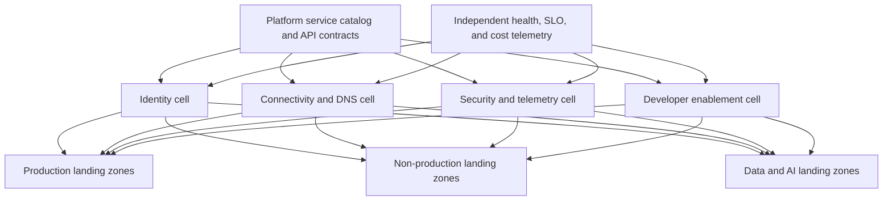
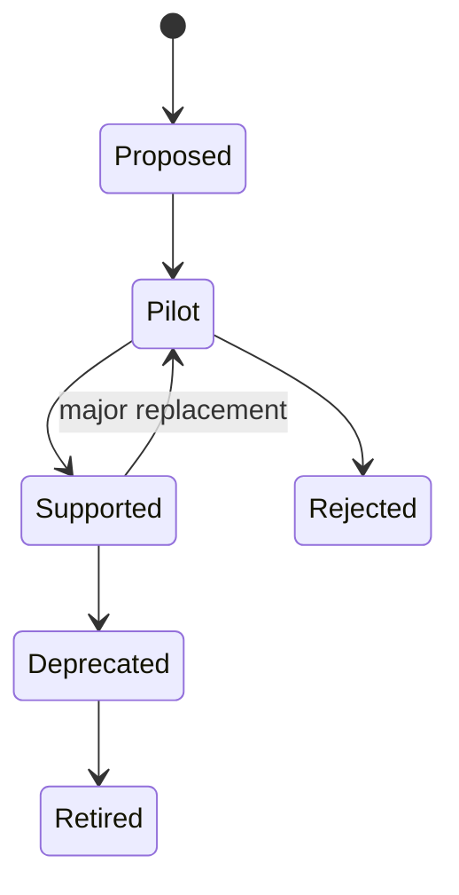

> **文档类型：** 云基础与治理架构参考模型
> **规范性术语：** **MUST**、**MUST NOT**、**SHOULD**、**SHOULD NOT** 和 **MAY** 是要求级别。
> **适用范围：** 共享平台服务选择、隔离、消费、所有权、可靠性、成本、变更管理和退役。
> **例外流程：** 偏离要求需要记录风险评估、补偿控制、指定风险负责人和到期日期。

|控制领域|价值|
|---|---|
|文件编号 | `CFG-13` |
|负责人|云卓越中心 |
|审核周期|至少每年一次，并且在重大平台、提供商、数据、安全或运营模式发生变化之后 |
|证据|服务目录和契约、SLO、依赖关系图、入驻和退出测试以及集中度报告 |

# 共享平台服务架构

> **决策简述：** 仅当其接口、隔离、所有权、可靠性、成本和退出路径明确时，才提升共享服务的能力。

## 目的

该标准定义了一项功能何时应成为共享平台服务，以及如何隔离、使用、操作和退役。仅当共享服务的所有权、接口、故障域、安全边界和成本明确时，共享服务才能减少重复。

## 候选服务域

- 身份联合和特权访问；
- 中转网络、DNS、入口、出口和私有连接；
- 审计日志、指标、安全遥测和事件集成；
- 密钥、机密、证书和信任服务；
- 制品和容器注册表；
- 部署运行器、策略评估和自动化服务；
- 时间同步、配置、目录和许可服务；
- 备份目录、恢复编排和安全工具。

特定于应用的数据库、消息代理或 API 不会仅仅因为多个团队使用它而自动成为平台服务。

## 资格测试

共享服务应该至少有一个稳定的可复用契约和一个指定的产品所有者。评估：

|问题 |何时集中|在以下情况下保持工作负载所属：|
|---|---|---|
|控制一致性|强制基线必须统一 |要求存在重大差异|
|专业知识 |稀缺的专业知识使许多团队受益 |产品专业知识属于一个团队|
|故障影响|区域单元可以包含故障|集中化造成的爆炸半径令人无法接受|
|经济学 |共享规模降低总成本 |成本分摊和闲置容量带来的成本超过节省额|
|改变节奏|消费者可以使用稳定的契约|消费者需要独立快速改变|
|数据边界|法律允许共享处理 |孤立或主权需要分离|

## 参考架构

当隔离和恢复目标需要时，优先选择区域或监管单元，而不是全球部署。

## 组织安置

|提供商|典型的共享服务边界 |工作负载使用模式 |
|---|---|---|
|Azure|专用平台订阅 |对等互连/Virtual WAN、私有端点、RBAC、服务 API |
|AWS |专用基础设施、网络、安全和工具账户 |中转附件、RAM、PrivateLink、跨账户角色 |
| GCP |在平台文件夹中托管和服务项目 |共享 VPC、私有服务连接、IAM、服务 API |
|OCI |网络、安全和共享服务隔间或租户| DRG、服务网关、私有端点、IAM 策略 |

管理所有权必须与消费者权限分开。工作负载团队能够使用服务契约，而不是对服务平面进行广泛的管理。

## 服务契约

每个共享服务都必须发布：

- 目标消费者和支持的用例；
- 请求接口和所需的元数据；
- 认证和授权模型；
- 数据分类和驻留限制；
- 配额、限制、合理使用策略和扩展行为；
- 可用性、延迟、支持、恢复和维护目标；
- 版本控制、兼容性、弃用和迁移策略；
- 成本分配方法和消费者可见的措施；
- 升级路径、所有者和安全联系人。
```yaml
service: private-dns-resolution
version: 2.1
scope: regional-cell
consumer_input:
  - landing_zone_id
  - network_id
  - approved_namespaces
slo:
  availability: 99.95%
  recovery_time: 60m
change_policy: backward-compatible-by-default
owner: network-platform
```
## 可靠性和爆炸半径

不要宣传高于其依赖项可以支持的服务目标。明确地对身份、DNS、网络、密钥管理、Artifact Registry 和自动化依赖关系进行建模。消除循环依赖；例如，恢复访问不能完全依赖于失败的身份或 DNS 服务。

当故障、安全事件、配额耗尽或不安全更改不应影响所有云或环境时，请使用单元。定义降级模式、缓存行为和消费者端超时。测试源控制配置的区域隔离和恢复。

## 安全模型

- 使用特定于消费者的身份和最低权限端点。
- 单独的服务管理、安全管理和消费。
- 保持管理端点的私有性或严格的访问控制。
- 集中日志记录控制平面更改和消费者请求。
- 根据需要对数据、配额和加密应用租户或消费者隔离。
- 扫描共享制品并签署已发布版本。
- 对服务及其加入自动化进行威胁建模。

## 生命周期和变更管理

重大变更需要新的契约版本、迁移路径、消费者清单、传达的截止日期和回滚。在依赖性发现确认消费者迁移或接受风险之前，服务无法退役。

## 执行顺序

1. 盘点重复的功能和现有的共享依赖项。
2. 应用资格测试并确定负责任的产品所有者。
3. 定义服务契约、威胁模型、SLO、成本模型和故障域。
4. 通过 IaC 部署隔离的提供商边界和区域单元。
5. 建立自助服务入驻、策略检查和消费者文档。
6. 对具有代表性的生产和非生产消费者进行试点。
7. 度量可靠性、采用率、满意度、成本和支持负载。
8. 正式化版本控制、恢复、弃用和退役实践。

## 验证

在正式发布之前，请验证：

- 消费者访问不能管理其他消费者或服务平面；
- 区域或小区故障保持在声明的爆炸半径内；
- 服务恢复满足恢复目标；
- 配额和嘈杂邻居控制在负载下工作；
- 审计、成本和所有权元数据完整；
- 契约测试检测不兼容的提供商或服务变更；
- 入驻和离职不会留下不受管理的信任或路由；
- 依赖性和消费者清单是最新的。

## 操作注意事项

将每个共享功能作为具有待办事项、路线图、SLO、待命所有权、安全审查、容量计划和单位成本度量标准的产品来运营。仅采用数量是不够的；还跟踪可靠性、上线时间、变更失败率、支持负担、消费者满意度、未使用的分配和集中风险。

## 消费者隔离模型

共享服务必须声明其隔离单元：

|隔离模型|示例|风险控制 |
|---|---|---|
|逻辑租户 |具有租户标识符的共享 API |授权与数据分区|
|专用命名空间或项目|共享控制平面，独立执行范围|配额、身份和策略 |
|专用区域单元|每个区域或配置文件单独的服务实例 |故障与主权隔离|
|专用消费者实例|每个工作负载一次部署 |隔离更强，成本更高 |
|独立租户或账户 |独立行政边界|最高的常规隔离 |

选择与威胁模型、数据、嘈杂邻居风险、恢复和成本的隔离。在没有定义数据、身份、配额、日志和加密如何分离的情况下，不要宣传“多租户”。

## 依赖管理

发布包含以下内容的依赖关系图：

- 上游身份、DNS、网络、密钥、注册表、数据和提供商服务；
- 消费者依赖性和重要性；
- 依赖失败时的启动和运行时行为；
- 超时、重试、缓存和降级规则；
- 恢复令；
- 循环依赖分析。

对于第 0 层和第 1 层服务，在一个主要依赖项不可用的情况下测试恢复。只能通过自身重建的服务是不可恢复的。

## 入驻和契约测试

消费者入驻应验证：
1. 身份和授权。
2. 网络和 DNS 路径。
3. 配额和成本分配。
4. 数据分类和区域资格。
5. 支持的客户端或协议版本。
6. 遥测和审计关联。
7. 失败和重试行为。
8. 离职和证书吊销。

提供消费者可以在生产前运行的自动化契约测试。契约测试应在事件发生之前识别不兼容的更改。

## 集中度和退出风险

对于每项共享服务，量化：

- 消费者的数量和重要性；
- 区域和提供商集中度；
- 替代或降级模式能力；
- 恢复和迁移持续时间；
- 专有数据或协议锁定；
- 契约和许可依赖性；
- 退休费用。

一项服务可能会减少重复，同时增加系统性风险。高集中度需要更强的细胞、恢复、变革控制和能力治理。

## 相关主题

- [平台所有权及运营模式](platform-ownership-and-operating-model.md)
- [订阅与账户发放](subscription-and-account-vending.md)
- [云网络基础及连接架构](cloud-network-foundation-and-connectivity-architecture.md)

## 参考文档

- [Azure 落地工作区](https://learn.microsoft.com/en-us/azure/cloud-adoption-framework/ready/landing-zone/)
- [AWS 云基础能力](https://docs.aws.amazon.com/whitepapers/latest/establishing-your-cloud-foundation-on-aws/capabilities.html)
- [Google Cloud Landing Zone 设计](https://docs.cloud.google.com/architecture/landing-zones)
- [OCI Landing Zone 概览](https://docs.oracle.com/en-us/iaas/Content/cloud-adoption-framework/oci-landing-zones-overview.htm)

## 相关仓库

- [andyxuan2010/azure-landingzone](https://github.com/andyxuan2010/azure-landingzone) — 提供 Azure 共享平台服务，包括网络、DNS、Key Vault、日志记录和自动化。
- [andyxuan2010/azure-template](https://github.com/andyxuan2010/azure-template) — 提供可复用的 Terraform 模块和交付模式，以实现一致的平台服务实现。
- [andyxuan2010/oci-template](https://github.com/andyxuan2010/oci-template) — 为 OCI 平台功能提供可复用的 Terraform 模块。
