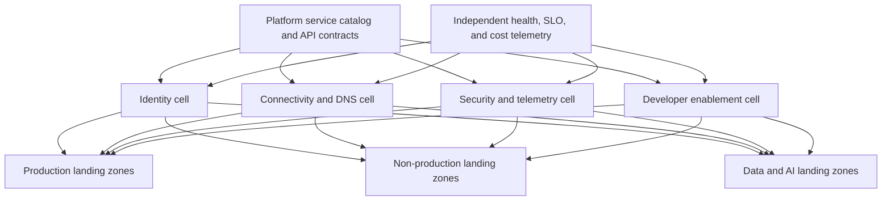
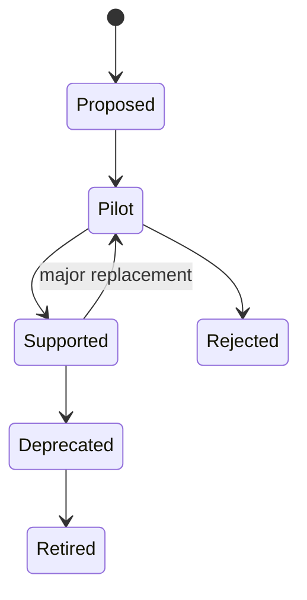

> **Document class:** Cloud Foundations & Governance architecture reference model
> **Normative terms:** **MUST**, **MUST NOT**, **SHOULD**, **SHOULD NOT**, and **MAY** are requirements levels.
> **Applicability:** Shared platform service selection, isolation, consumption, ownership, reliability, cost, change management, and retirement.
> **Exception process:** Deviations require a documented risk assessment, compensating controls, named risk owner, and expiry date.

| Control field | Value |
|---|---|
| Document ID | `CFG-13` |
| Owner | Cloud Center of Excellence |
| Review cycle | At least annually and after material platform, provider, data, security, or operating-model changes |
| Evidence | Service catalog and contracts, SLOs, dependency maps, onboarding and exit tests, and concentration reports |

# Shared Platform Services Architecture

> **Decision in brief:** Promote a capability to shared service only when its interface, isolation, ownership, reliability, cost, and exit path are explicit.

## Purpose

This standard defines when a capability should become a shared platform service and how it must be isolated, consumed, operated, and retired. Shared services reduce duplication only when their ownership, interfaces, failure domains, security boundaries, and costs are explicit.

## Candidate service domains

- identity federation and privileged access;
- transit networking, DNS, ingress, egress, and private connectivity;
- audit logging, metrics, security telemetry, and incident integration;
- key, secret, certificate, and trust services;
- artifact and container registries;
- deployment runners, policy evaluation, and automation services;
- time synchronization, configuration, directory, and license services;
- backup catalogs, recovery orchestration, and security tooling.

An application-specific database, message broker, or API is not automatically a platform service merely because several teams use it.

## Qualification test

A shared service should have at least one stable reusable contract and a named product owner. Evaluate:

| Question | Centralize when | Keep workload-owned when |
|---|---|---|
| Control consistency | A mandatory baseline must be uniform | Requirements materially differ |
| Expertise | Scarce expertise benefits many teams | Product expertise belongs with one team |
| Failure impact | Regional cells can contain failure | Centralization creates unacceptable blast radius |
| Economics | Shared scale reduces total cost | Chargeback and idle capacity outweigh savings |
| Change cadence | Consumers can use a stable contract | Consumers need independent rapid change |
| Data boundary | Shared handling is legally permitted | Isolation or sovereignty requires separation |

## Reference architecture



Prefer regional or regulatory cells over one global deployment when isolation and recovery objectives require them.

## Organizational placement

| Provider | Typical shared-service boundary | Workload consumption pattern |
|---|---|---|
| Azure | Dedicated platform subscriptions | Peering/Virtual WAN, private endpoints, RBAC, service APIs |
| AWS | Dedicated infrastructure, network, security, and tooling accounts | Transit attachments, RAM, PrivateLink, cross-account roles |
| GCP | Host and service projects in platform folders | Shared VPC, Private Service Connect, IAM, service APIs |
| OCI | Network, security, and shared-service compartments or tenancies | DRG, service gateways, private endpoints, IAM policies |

Administrative ownership must be separated from consumer permissions. Workload teams receive the ability to consume a service contract, not broad administration of the service plane.

## Service contract

Every shared service must publish:

- intended consumers and supported use cases;
- request interface and required metadata;
- authentication and authorization model;
- data classification and residency limits;
- quotas, limits, fair-use policy, and scaling behavior;
- availability, latency, support, recovery, and maintenance objectives;
- versioning, compatibility, deprecation, and migration policy;
- cost allocation method and consumer-visible measures;
- escalation path, owner, and security contact.

```yaml
service: private-dns-resolution
version: 2.1
scope: regional-cell
consumer_input:
  - landing_zone_id
  - network_id
  - approved_namespaces
slo:
  availability: 99.95%
  recovery_time: 60m
change_policy: backward-compatible-by-default
owner: network-platform
```

## Reliability and blast radius

Do not advertise a service objective higher than its dependencies can support. Model identity, DNS, network, key management, artifact registry, and automation dependencies explicitly. Eliminate circular dependencies; for example, recovery access must not depend exclusively on the failing identity or DNS service.

Use cells when a failure, compromise, quota exhaustion, or unsafe change should not affect all clouds or environments. Define degraded modes, cached behavior, and consumer-side timeouts. Test regional isolation and restoration from source-controlled configuration.

## Security model

- Use consumer-specific identities and least-privilege endpoints.
- Separate service administration, security administration, and consumption.
- Keep management endpoints private or strongly access controlled.
- Log control-plane changes and consumer requests centrally.
- Apply tenant or consumer isolation to data, quotas, and encryption where required.
- Scan shared artifacts and sign released versions.
- Threat-model the service and its onboarding automation.

## Lifecycle and change management



Breaking changes require a new contract version, migration path, consumer inventory, communicated deadline, and rollback. A service cannot be retired until dependency discovery confirms that consumers migrated or accepted the risk.

## Implementation sequence

1. Inventory repeated capabilities and existing shared dependencies.
2. Apply the qualification test and identify accountable product owners.
3. Define service contract, threat model, SLO, cost model, and failure domains.
4. Deploy isolated provider boundaries and regional cells through IaC.
5. Build self-service onboarding, policy checks, and consumer documentation.
6. Pilot with representative production and non-production consumers.
7. Measure reliability, adoption, satisfaction, cost, and support load.
8. Formalize versioning, recovery, deprecation, and retirement practices.

## Validation

Before general availability, verify:

- consumer access cannot administer other consumers or the service plane;
- regional or cell failure stays within the declared blast radius;
- service restoration meets recovery objectives;
- quotas and noisy-neighbor controls work under load;
- audit, cost, and ownership metadata are complete;
- contract tests detect incompatible provider or service changes;
- onboarding and offboarding leave no unmanaged trust or routes;
- dependency and consumer inventories are current.

## Operational considerations

Operate each shared capability as a product with a backlog, roadmap, SLOs, on-call ownership, security review, capacity plan, and unit-cost measures. Adoption count alone is insufficient; also track reliability, time to onboard, change failure rate, support burden, consumer satisfaction, unused allocation, and concentration risk.

## Consumer isolation models

A shared service must state its isolation unit:

| Isolation model | Example | Risk control |
|---|---|---|
| Logical tenant | Shared API with tenant identifier | Authorization and data partitioning |
| Dedicated namespace or project | Shared control plane, separate execution scope | Quotas, identity, and policy |
| Dedicated regional cell | Separate service instance per region or profile | Failure and sovereignty containment |
| Dedicated consumer instance | One deployment per workload | Stronger isolation with higher cost |
| Separate tenancy or account | Independent administrative boundary | Highest conventional isolation |

Select isolation from the threat model, data, noisy-neighbor risk, recovery, and cost. Do not advertise “multi-tenant” without defining how data, identity, quotas, logs, and encryption are separated.

## Dependency management

Publish a dependency map containing:

- upstream identity, DNS, network, key, registry, data, and provider services;
- consumer dependencies and criticality;
- startup and runtime behavior when dependencies fail;
- timeout, retry, cache, and degradation rules;
- recovery order;
- circular-dependency analysis.

For Tier 0 and Tier 1 services, test recovery with one major dependency unavailable. A service that can be rebuilt only through itself is not recoverable.

## Onboarding and contract testing

Consumer onboarding should verify:

1. Identity and authorization.
2. Network and DNS path.
3. Quota and cost allocation.
4. Data classification and regional eligibility.
5. Supported client or protocol version.
6. Telemetry and audit correlation.
7. Failure and retry behavior.
8. Offboarding and credential revocation.

Provide automated contract tests that consumers can run before production. Contract tests should identify incompatible changes earlier than an incident.

## Concentration and exit risk

For each shared service, quantify:

- number and criticality of consumers;
- regional and provider concentration;
- substitute or degraded-mode capability;
- recovery and migration duration;
- proprietary data or protocol lock-in;
- contract and licensing dependency;
- retirement cost.

A service may reduce duplication while increasing systemic risk. High concentration requires stronger cells, recovery, change control, and capacity governance.

## Related topics

- [Platform Ownership and Operating Model](platform-ownership-and-operating-model.md)
- [Subscription and Account Vending](subscription-and-account-vending.md)
- [Cloud Network Foundation and Connectivity Architecture](cloud-network-foundation-and-connectivity-architecture.md)

## References

- [Azure landing zones](https://learn.microsoft.com/en-us/azure/cloud-adoption-framework/ready/landing-zone/)
- [AWS cloud foundation capabilities](https://docs.aws.amazon.com/whitepapers/latest/establishing-your-cloud-foundation-on-aws/capabilities.html)
- [Google Cloud landing zone design](https://docs.cloud.google.com/architecture/landing-zones)
- [OCI landing zones overview](https://docs.oracle.com/en-us/iaas/Content/cloud-adoption-framework/oci-landing-zones-overview.htm)

## Related repos

- [andyxuan2010/azure-landingzone](https://github.com/andyxuan2010/azure-landingzone) — provisions Azure shared platform services including networking, DNS, Key Vault, logging, and automation.
- [andyxuan2010/azure-template](https://github.com/andyxuan2010/azure-template) — provides reusable Terraform modules and delivery patterns for consistent platform-service implementation.
- [andyxuan2010/oci-template](https://github.com/andyxuan2010/oci-template) — supplies reusable Terraform modules for OCI platform capabilities.
