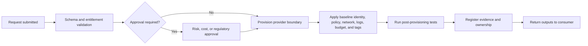
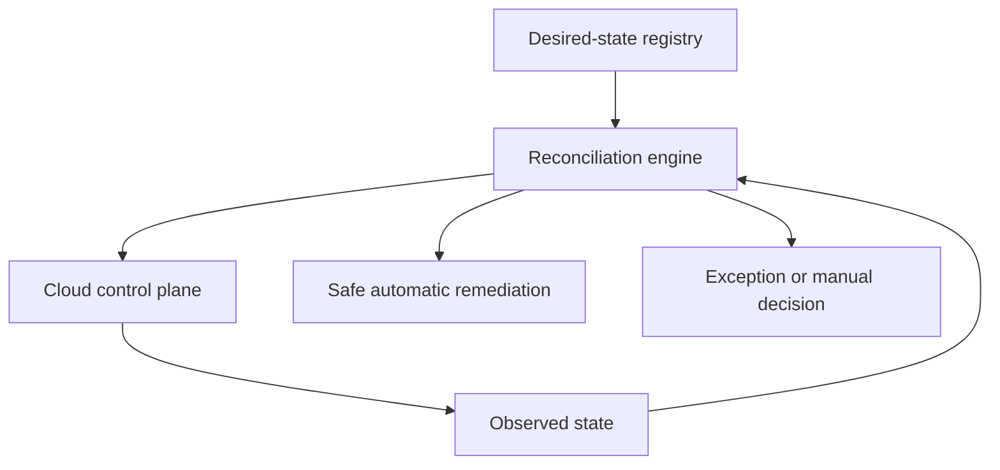
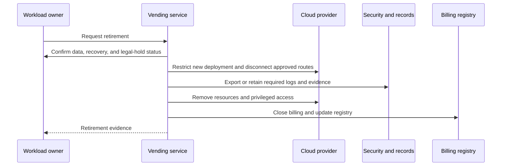

> **文档类型：** 云基础和治理实施指南
> **规范性术语：** **MUST**、**MUST NOT**、**SHOULD**、**SHOULD NOT** 和 **MAY** 是要求级别。
> **适用范围：** 云工作负载边界的自动创建、配置、更新、采用、协调废弃。
> **例外流程：** 偏离要求需要记录风险评估、补偿控制、指定风险负责人和到期日期。

|控制领域|价值|
|---|---|
|文件编号 | `CFG-06` |
|负责人|云卓越中心 |
|审核周期|至少每年一次，并且在重大平台、提供商、数据、安全或运营模式发生变化之后 |
|证据|请求和批准记录、发放日志、基线一致性、幂等性状态和验收测试 |

# 订阅与账户发放

> **决策简述：** 通过构建使每个新的云边界合规，幂等重试，并仅在有效控制测试通过后完成。

## 目的

自动发放是用于创建、配置、更新和淘汰云工作负载边界的受控自动化。它用可重复的产品界面取代了手动服务台配置，并创建了环境以合规状态启动的证据。

如果自动预配工作流仅创建账户、订阅、项目或隔间，则它是不完整的。它必须应用身份、策略、网络、日志、成本、所有权、清单和生命周期控制。


## 文档约定

本文一致使用以下术语：

- **平台团队**：构建和运营共享云能力的团队。
- **工作负载团队**：使用平台的应用、数据、产品或业务团队。
- **Landing Zone**：为工作负载准备的受管云环境。
- **护栏**：通过策略和自动化一致应用的预防性、检测性或纠正性控制。
- **自动发放**：订阅、账户、项目、隔间及其基线配置的自动创建和生命周期管理。

提供商示例是说明性的。控制目标具有权威性；特定于提供商的实现是可替换的。


## 标准请求契约

在实际情况下，请求模式应该是提供商中立的：
```yaml
request_id: CR-2026-00421
provider: azure
workload:
  name: claims-processing
  product_id: APP-0148
  owner_group: claims-platform
  business_owner: insurance-operations
classification:
  environment: production
  data_classification: confidential
  criticality: tier-1
financial:
  cost_center: CC-4402
  budget_monthly: 18000
placement:
  region_profile: canada-primary
  connectivity_profile: enterprise-private
  compliance_profile: regulated
lifecycle:
  review_date: 2027-08-01
  expected_end_date: null
```
拒绝所有权不明确、资金缺失、区域不受支持或分类冲突的请求。

## 自动预配工作流

批准应基于风险。标准非生产请求可能不需要手动批准。生产、受监管、高预算或外部连接环境可能需要有针对性的批准。

## 基线输出

平台应返回：

- 提供商和边界标识符；
- 层次结构布局；
- 负责人和运维组；
- 部署身份详细信息；
- 网络和 DNS 配置文件；
- 日志记录和安全目的地；
- 预算和财务联系；
- 策略和合规状况；
- 基线资源位置；
- 生命周期状态和审查日期；
- 支持渠道和升级路径。

## 特定于提供商的实现

|能力|Azure|AWS | GCP |OCI |
|---|---|---|---|---|
|边界创建 |订阅创建/关联 |组织账户创建 |项目创建和计费关联|隔间创建或租户流程 |
|安置|管理组|OU |文件夹|父隔间或租户|
|人类访问| Entra 组和 RBAC | IAM Identity Center permission sets |群组和 IAM | IAM domain groups and policies |
|工作负载身份|托管身份/联合 | IAM 角色 |服务账户/WIF |动态组和主体 |
|策略基线|Policy assignments| SCP、Config、security integrations |Organization Policy and security services|Policies、quotas、Security Zones、Cloud Guard |
|日志记录 |Activity Log and diagnostics| CloudTrail 和 Config | Cloud Audit Logs|Audit and Logging|
|网络| VNet、中心/Virtual WAN | VPC、Transit Gateway| VPC、共享 VPC/NCC | VCN 和 DRG |

## 幂等性与协调

自动发放系统必须能够协调现有环境。所需的状态属于配置注册表或源代码控制清单。重新运行工作流程应在安全的情况下修复偏差，并在自动更正可能会中断工作负载的情况下报告冲突。

## 身份和访问引导程序

在创建时，分配组，而不是个人。推荐的组类别：

- 工作负载所有者；
- 工作负载贡献者或操作者；
- 工作负载阅读器；
- 部署身份；
- 安全响应人员；
- 财经读者；
- 紧急或 break-glass 的管理员。

工作负载部署权限的范围应限于工作负载边界，并受策略或权限边界约束。平台自动化应使用联合工作负载身份，并在可行的情况下将计划/读取与应用/写入权限分开。

## 网络配置文件选择

请勿将网络设计选择嵌入自由文本票据中。提供明确的个人文档：

|简介 |描述 |
|---|---|
|隔离沙箱 |无企业路由；互联网受限；自动过期 |
|企业-私营|连接到企业中转、私有 DNS、受控出口 |
|互联网服务|经批准的入口、Web 保护、DDoS、证书和日志记录集成 |
|数据平台|私有服务访问、高吞吐路由、数据出口受控 |
|监管飞地 |专门检查、限制区域、额外证据和批准 |

每个配置文件都应具有自动连接和 DNS 测试。

## 策略和合规引导

自动发放系统应在部署后验证有效的控制。成功的 API 响应并不能证明环境合规。至少测试：

- 层次结构布局；
- 策略分配和有效结果；
- 审计日志传送；
- 安全服务注册；
- 公开暴露限制；
- 身份分配；
- 预算和所有权元数据；
- 连接和 DNS 行为。

## 成本和配额控制

根据配置文件应用预算、联系人、配额、允许的区域和批准的服务系列。对于沙箱，应用过期、自动关闭和低配额上限。对于生产，确保承诺和保留所有权是明确的。

## 生命周期管理

### 改变

允许对所有者、预算、环境、连接、合规性配置文件和恢复层进行受控更新。必须针对相关控制来验证更改。

### 隔离

移动或标记边界，以便限制新部署、减少外部访问并保留安全响应人员的访问权限。隔离期间请勿销毁证据。

### 退役

退役应验证备份、保留、合法保留、DNS 记录、证书、机密、网络路由、支持集成和经常性成本。

## 失败处理

工作流程应支持部分失败。记录每个完成的步骤并使用补偿措施。切勿因为后续步骤失败而留下具有广泛访问权限和缺少审核控制的新创建的边界。

失败状态应该是可见的且可操作的：

- 可重试的提供商 API 失败；
- 策略冲突；
- 不可用的计费关联；
- 身份组缺失；
- IP 分配冲突；
- 部署后控制失败；
- 需要手动例外。

## 服务目标和指标

- 标准请求完成时间；
- 完全自动化请求的百分比；
- 按工作流程步骤划分的失败率；
- 手动异常率；
- 非托管云边界的数量；
- 所有权和元数据完整性；
- 协调漂移年龄；
——退役完成时间；
- 消费者满意度和返工率。

## 反模式

- 仅创建云边界并留下基线配置手册。
- 接受没有模式的自由文本请求。
- 向指定个人分配访问权限。
- 将初始配置视为整个生命周期。
- 向自动发放流水线授予长期凭证。
- 在策略、日志记录和连接测试通过之前返回成功。
- 允许在自动发放服务之外进行未跟踪的手动创建。
- 删除环境而不保留证据并关闭计费。

## 验证

- [ ] 存在提供商中立的请求模式。
- [ ] 标准请求是自助服务且基于风险。
- [ ] 基线身份、策略、网络、日志、预算和元数据是自动的。
- [ ] Vending 是幂等的并且支持对账。
- [ ] 配置后测试验证有效的控制。
- [ ] 输出记录在权威注册表中。
- [ ] 隔离和退役是自动化的并经过测试。
- [ ] 部分故障不会留下不受控制的环境。
- [ ] 自动发放流程之外的创建被检测并修复。

## 工作流状态和幂等性

为每个请求分配一个持久的幂等键并保留步骤级状态。重试的请求必须恢复或协调，而不是创建重复的边界。

推荐状态：


故障子状态应确定是否需要安全重试、补偿操作、手动决策或隔离。当关键基线步骤仍悬而未决时，请勿报告成功。

工作流必须检测先前尝试创建的预先存在的资源。提供商 API 成功并不能证明请求是新的或完整的。

## 权利和批准矩阵

批准应取决于风险承担领域，而不仅仅是提供商名称。

|请求条件 |典型批准 |
|---|---|
|成本门槛下的标准沙箱|自动权利检查 |
|标准非生产|产品所有者或预先批准的目录权利 |
|生产|技术和成本所有权验证|
|受监管或机密数据 |安全、隐私或合规性批准 |
|公共入口或跨云连接 |网络与安全审批|
|特殊区域、配额或服务 |架构和风险审查|

审批者应仅审核他们负责的维度。委员会对每一项请求的广泛批准都会造成延误，而不会改善问责制。

## 配置后验收测试

验收测试应从具有代表性的消费者和管理路径进行。包括阴性测试。

示例：

- 工作负载组可以部署允许的资源；
- 工作负载组不能更改组织策略、审核路由或共享中转；
- 部署身份可以获取短期令牌，并且仅限于一个环境；
- 禁止公共存储或数据库暴露被阻止；
- 所需的审核事件集中到达；
- DNS、私有服务访问和出口工作按规定进行；
- 预算、配额、所有权和清单日志记录符合要求；
- 平台运维人员可调用退役或隔离控制。

保留测试版本和结果，以便在基线升级后可以重新认证环境。

## 采用现有边界

现有的订阅、账户、项目和隔间应通过发放工作流程进入自动发放系统：

1. 发现资源、所有者、策略、身份、路由、日志和成本。
2. 对可能中断服务的差距和变更进行分类。
3. 创建所需状态清单和异常日志记录。
4. 应用无干扰的基线控制。
5. 通过有计划的变革来弥补破坏性差距。
6. 运行验收测试。
7. 将边界注册为托管并阻止非托管创建路径。

不要仅仅因为现有边界出现在注册表中而将其标记为受管理。

## 相关主题

- [管理组、账户与组织结构](management-groups-accounts-and-organizational-structure.md)
- [策略、护栏和合规性](policy-guardrails-and-compliance.md)
- [资源命名、标签和元数据标准](resource-naming-tagging-and-metadata-standards.md)
- [平台所有权及运营模式](platform-ownership-and-operating-model.md)
