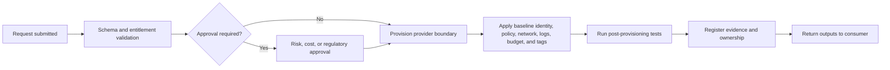
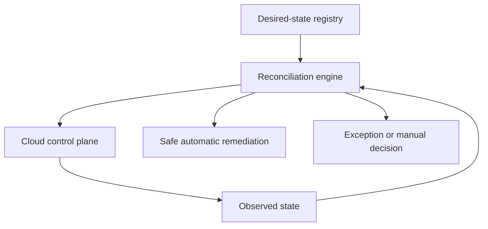
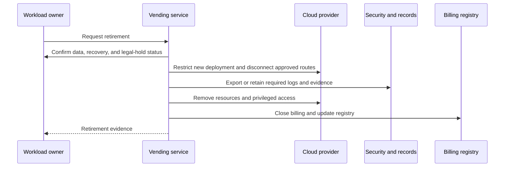
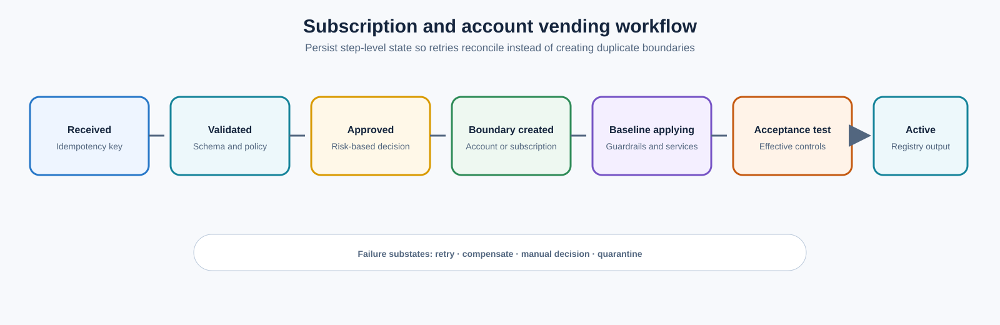

> **Document class:** Cloud Foundations & Governance implementation guide
> **Normative terms:** **MUST**, **MUST NOT**, **SHOULD**, **SHOULD NOT**, and **MAY** are requirements levels.
> **Applicability:** Automated creation, configuration, update, adoption, reconciliation, and retirement of cloud workload boundaries.
> **Exception process:** Deviations require a documented risk assessment, compensating controls, named risk owner, and expiry date.

| Control field | Value |
|---|---|
| Document ID | `CFG-06` |
| Owner | Cloud Center of Excellence |
| Review cycle | At least annually and after material platform, provider, data, security, or operating-model changes |
| Evidence | Request and approval records, vending logs, baseline conformance, idempotency state, and acceptance tests |

# Subscription and Account Vending

> **Decision in brief:** Make every new cloud boundary compliant by construction, idempotent to retry, and complete only after effective-control tests pass.

## Purpose

Vending is the controlled automation used to create, configure, update, and retire cloud workload boundaries. It replaces manual service-desk provisioning with a repeatable product interface and creates evidence that the environment started in a compliant state.

A vending workflow is incomplete if it creates only the account, subscription, project, or compartment. It must apply identity, policy, network, logging, cost, ownership, inventory, and lifecycle controls.


## Document conventions

This article uses the following terms consistently:

- **Platform team**: the team that builds and operates shared cloud capabilities.
- **Workload team**: an application, data, product, or business team consuming the platform.
- **Landing zone**: a governed cloud environment prepared for workloads.
- **Guardrail**: a preventive, detective, or corrective control applied consistently through policy and automation.
- **Vending**: the automated creation and lifecycle management of subscriptions, accounts, projects, compartments, and their baseline configuration.

Provider examples are illustrative. The control objective is authoritative; the provider-specific implementation is replaceable.


## Standard request contract

The request schema should be provider neutral where practical:

```yaml
request_id: CR-2026-00421
provider: azure
workload:
  name: claims-processing
  product_id: APP-0148
  owner_group: claims-platform
  business_owner: insurance-operations
classification:
  environment: production
  data_classification: confidential
  criticality: tier-1
financial:
  cost_center: CC-4402
  budget_monthly: 18000
placement:
  region_profile: canada-primary
  connectivity_profile: enterprise-private
  compliance_profile: regulated
lifecycle:
  review_date: 2027-08-01
  expected_end_date: null
```

Reject requests with ambiguous ownership, missing funding, unsupported regions, or conflicting classifications.

## Vending workflow



Approvals should be risk based. A standard non-production request may require no manual approval. A production, regulated, high-budget, or externally connected environment may require targeted approval.

## Baseline outputs

The platform should return:

- provider and boundary identifier;
- hierarchy placement;
- owner and operator groups;
- deployment identity details;
- network and DNS profile;
- logging and security destinations;
- budget and financial contacts;
- policy and compliance status;
- baseline resource locations;
- lifecycle state and review date;
- support channel and escalation path.

## Provider-specific implementation

| Capability | Azure | AWS | GCP | OCI |
|---|---|---|---|---|
| Boundary creation | Subscription creation/association | Organizations account creation | Project creation and billing association | Compartment creation or tenancy process |
| Placement | Management group | OU | Folder | Parent compartment or tenancy |
| Human access | Entra groups and RBAC | IAM Identity Center permission sets | Groups and IAM | IAM domain groups and policies |
| Workload identity | Managed identity/federation | IAM roles | Service accounts/WIF | Dynamic groups and principals |
| Policy baseline | Policy assignments | SCPs, Config, security integrations | Organization Policy and security services | Policies, quotas, Security Zones, Cloud Guard |
| Logging | Activity Log and diagnostics | CloudTrail and Config | Cloud Audit Logs | Audit and Logging |
| Network | VNet, hub/Virtual WAN | VPC, Transit Gateway | VPC, Shared VPC/NCC | VCN and DRG |

## Idempotency and reconciliation

Vending must be able to reconcile existing environments. The desired state belongs in a configuration registry or source-controlled manifest. Re-running the workflow should repair drift where safe and report conflicts where automatic correction could disrupt workloads.



## Identity and access bootstrap

At creation time, assign groups, not individuals. Recommended group categories:

- workload owners;
- workload contributors or operators;
- workload readers;
- deployment identities;
- security responders;
- financial readers;
- emergency or break-glass administrators.

Workload deployment permissions should be scoped to the workload boundary and constrained by policy or permission boundaries. Platform automation should use federated workload identity and separate plan/read from apply/write permissions where feasible.

## Network profile selection

Do not embed network design choices in free-text tickets. Offer explicit profiles:

| Profile | Description |
|---|---|
| isolated-sandbox | No enterprise routes; restricted internet; automatic expiry |
| enterprise-private | Connected to enterprise transit, private DNS, controlled egress |
| internet-service | Approved ingress, web protection, DDoS, certificate, and logging integration |
| data-platform | Private service access, high-throughput routes, controlled data egress |
| regulated-enclave | Dedicated inspection, restricted regions, additional evidence and approvals |

Each profile should have automated connectivity and DNS tests.

## Policy and compliance bootstrap

The vending system should validate effective controls after deployment. A successful API response does not prove the environment is compliant. Test at least:

- hierarchy placement;
- policy assignment and effective result;
- audit-log delivery;
- security-service registration;
- public exposure restrictions;
- identity assignments;
- budget and ownership metadata;
- connectivity and DNS behavior.

## Cost and quota controls

Apply budgets, contacts, quotas, allowed regions, and approved service families based on profile. For sandboxes, apply expiration, automatic shutdown, and low quota ceilings. For production, ensure commitment and reservation ownership is explicit.

## Lifecycle management

### Change

Allow controlled updates to owner, budget, environment, connectivity, compliance profile, and recovery tier. Changes must be validated against dependent controls.

### Quarantine

Move or mark the boundary so that new deployments are restricted, external access is reduced, and security responders retain access. Do not destroy evidence during quarantine.

### Decommission



Decommissioning should verify backups, retention, legal hold, DNS records, certificates, secrets, network routes, support integrations, and recurring costs.

## Failure handling

The workflow should support partial failure. Record every completed step and use compensating actions. Never leave a newly created boundary with broad access and missing audit controls because a later step failed.

Failure states should be visible and actionable:

- retryable provider API failure;
- policy conflict;
- unavailable billing association;
- identity group missing;
- IP allocation conflict;
- post-deployment control failure;
- manual exception required.

## Service objectives and metrics

- standard request completion time;
- percentage of fully automated requests;
- failure rate by workflow step;
- manual exception rate;
- number of unmanaged cloud boundaries;
- ownership and metadata completeness;
- reconciliation drift age;
- decommissioning completion time;
- consumer satisfaction and rework rate.

## Anti-patterns

- Creating only the cloud boundary and leaving baseline configuration manual.
- Accepting free-text requests with no schema.
- Assigning access to named individuals.
- Treating initial provisioning as the entire lifecycle.
- Granting long-lived credentials to vending pipelines.
- Returning success before policy, logging, and connectivity tests pass.
- Allowing untracked manual creation outside the vending service.
- Deleting environments without evidence retention and billing closure.

## Validation

- [ ] A provider-neutral request schema exists.
- [ ] Standard requests are self-service and risk-based.
- [ ] Baseline identity, policy, network, logging, budget, and metadata are automatic.
- [ ] Vending is idempotent and supports reconciliation.
- [ ] Post-provisioning tests validate effective controls.
- [ ] Outputs are recorded in an authoritative registry.
- [ ] Quarantine and decommissioning are automated and tested.
- [ ] Partial failures do not leave uncontrolled environments.
- [ ] Creation outside the vending process is detected and remediated.

## Workflow state and idempotency

Assign every request a durable idempotency key and persist step-level state. A retried request must resume or reconcile rather than create a duplicate boundary.

Recommended states:



Failure substates should identify whether a safe retry, compensating action, manual decision, or quarantine is required. Do not report success while critical baseline steps remain pending.

The workflow must detect pre-existing resources created by a prior attempt. Provider API success does not prove that the request is new or complete.

## Entitlement and approval matrix

Approval should depend on risk-bearing fields rather than on provider name alone.

| Request condition | Typical approval |
|---|---|
| Standard sandbox under cost threshold | Automated entitlement check |
| Standard non-production | Product-owner or pre-approved catalog entitlement |
| Production | Technical and cost ownership validation |
| Regulated or confidential data | Security, privacy, or compliance approval |
| Public ingress or cross-cloud connectivity | Network and security approval |
| Exceptional region, quota, or service | Architecture and risk review |

The approver should review only the dimension they own. A broad committee approval for every request creates delay without improving accountability.

## Post-provisioning acceptance tests

Acceptance tests should operate from representative consumer and administrative paths. Include negative tests.

Examples:

- workload group can deploy permitted resources;
- workload group cannot change organization policy, audit routing, or shared transit;
- deployment identity can obtain a short-lived token and is scoped to one environment;
- prohibited public storage or database exposure is blocked;
- required audit events arrive centrally;
- DNS, private service access, and egress work as specified;
- budget, quota, ownership, and inventory records match the request;
- decommission or quarantine controls are callable by the platform operator.

Retain test versions and results so an environment can be re-certified after baseline upgrades.

## Adopting existing boundaries

Existing subscriptions, accounts, projects, and compartments should enter the vending system through an adoption workflow:

1. Discover resources, owners, policies, identities, routes, logs, and costs.
2. Classify gaps and changes that could interrupt service.
3. Create the desired-state manifest and exception record.
4. Apply non-disruptive baseline controls.
5. Remediate disruptive gaps through planned changes.
6. Run acceptance tests.
7. Register the boundary as managed and block unmanaged creation paths.

Do not mark an existing boundary managed merely because it appears in the registry.

## Related topics

- [Management Groups, Accounts, and Organizational Structure](management-groups-accounts-and-organizational-structure.md)
- [Policy, Guardrails, and Compliance](policy-guardrails-and-compliance.md)
- [Resource Naming, Tagging, and Metadata Standards](resource-naming-tagging-and-metadata-standards.md)
- [Platform Ownership and Operating Model](platform-ownership-and-operating-model.md)
