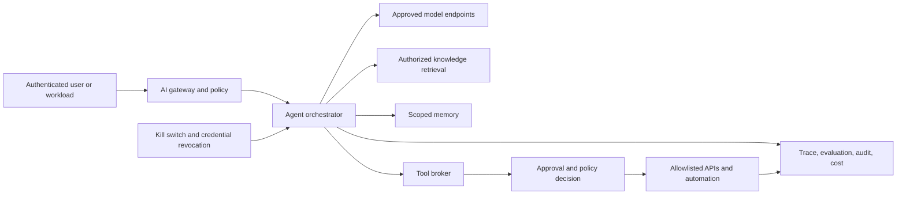

> **文档类型：**数据、AI 和集成架构参考模型
> **规范性术语：** **MUST**、**MUST NOT**、**SHOULD**、**SHOULD NOT** 和 **MAY** 是要求级别。
> **适用范围：** 代表用户或工作负载规划、维护状态、调用工具或采取操作的 AI 系统。
> **例外流程：** 偏离要求需要记录风险评估、补偿控制、指定风险负责人和到期日期。

|控制领域|价值|
|---|---|
|文件编号 | `DAI-16` |
|负责人|云卓越中心 |
|审核周期|至少每年一次，并且在重大平台、提供商、数据、安全或运营模式发生变化之后 |
|证据|威胁模型、工具注册、授权测试、评估结果和运营就绪证据 |

# Agentic AI 平台架构和工具治理

> **决策简述：** 将代理推理保持在确定性控制范围内。从经过身份验证的上下文和策略（而不是模型文本）授权工具。

## 目的

该标准管理规划、维护状态、调用工具或采取行动的 AI 系统。代理是在确定性安全范围内运行的不受信任的决策组件；模型输出绝不构成授权。

## 参考架构

## 信任边界

将提示、检索的内容、工具描述、模型响应、内存和外部 API 数据视为不可信。将模型标识与用户和工具标识分开。工具代理 MUST 从经过身份验证的用户/工作负载上下文、批准的策略和请求的操作中获取授权，而不是从模型生成的文本中获取授权。

## 操作类别

|班级 |示例|最小控制|
|---|---|---|
|只读|搜索认可的知识 |权限过滤、审计|
|双面 |创建草稿票 |范围身份、验证、速率限制 |
|后果性|发送消息、更改资源 |明确确认或策略批准 |
|高影响 |财务、身份、生产变更、删除 |人工审批、职责分离、交易限制 |
|禁止 |禁用控件，揭示机密 |硬否认外部模型上下文 |

## 强制控制

- 注册每个代理、所有者、目的、模型、工具、数据类、自治级别和风险等级。
- 将工具列入白名单并根据模式验证输入和输出。
- 使用短期的、每个工具的身份，具有最小的范围和事务限制。
- 不可逆转的、特权的、财务的、安全的或具有外部约束力的行为需要人工批准。
- 按用户、租户、用途、环境和保留策略隔离内存。
- 通过内容来源、指令/数据分离、工具策略和输出验证来防御提示注入。
- 记录决策、模型和提示版本、检索来源、工具请求、批准、结果和相关 ID，而不会泄露机密。
- 提供终止开关、队列暂停、凭证撤销和安全降级模式。

## 多云映射

|能力|Azure|AWS | GCP |OCI |
|---|---|---|---|---|
|代理/模型平台 |Microsoft Foundry/Azure OpenAI |Amazon Bedrock Agents| Vertex AI Agent Builder | OCI Generative AI 代理 |
| API 中介 | API Management/Functions| API Gateway/Lambda | Apigee/Cloud Run | API Gateway/Functions |
|身份 |内部/工作负载身份 | IAM 角色 | IAM/服务账户 | IAM/resource principals |
|机密 |Key Vault |Secrets Manager |Secrets Manager|Vault |
|可观测性| Azure Monitor/Application Insights | CloudWatch/X-Ray |Cloud Logging/Trace |Logging/APM |

## 评估与发布

测试任务成功、拒绝、工具选择、参数正确性、授权、注入阻力、数据泄漏、不安全操作、循环、延迟和成本。使用固定回归套件加上对抗性和人工评估。生产升级需要批准的模型/提示/工具版本、威胁模型、操作手册、回滚、限制和可监控的金丝雀行为。

## 验证

尝试跨用户内存访问、未经授权的工具调用、恶意检索指令、伪造批准、过度迭代、不可用的模型/工具以及重放操作。确认幂等性和补偿。按代理版本跟踪不安全操作块、批准率、工具故障、循环终止、评估回归、令牌/工具成本和事件。

## 操作注意事项
平台团队负责网关、工具代理、身份、策略、跟踪和评估框架。产品所有者负责预期的行为和结果。安全团队负责风险等级和事件控制。工具所有者保留对 API 的权限，并可以独立撤销代理。

## 工具注册契约

暴露给代理的每个工具 MUST 有一个版本化的注册记录。
```yaml
tool_id: service-desk.create-draft
owner: service-management
action_class: reversible
input_schema: v2
identity: agent-service-desk-draft
allowed_resources:
  - incident-drafts
approval: not-required
limits:
  calls_per_run: 3
  timeout_seconds: 10
compensation: delete-draft
```
日志 SHOULD 定义目的、允许的调用者、数据类、网络目的地、身份、范围、模式、事务限制、超时、重试行为、幂等性、批准、日志、补偿和终止开关所有者。

当可以提供窄域 API 时，可以为生产代理注册通用 shell、SQL、浏览器或云管理工具 SHOULD NOT。

## 批准、幂等性和补偿

审批界面 MUST 显示提议的行动、目标、实质性论据、预期效果、数据披露、成本或交易限制以及代理推理摘要。批准者的决定必须与确切的操作负载绑定；代理人批准后不得更改论点。

后续操作 SHOULD 使用从运行和操作派生的幂等性密钥。如果可逆操作是可能的，则定义并测试补偿操作。当涉及外部、通知、财务结算或不可逆删除时，补偿并不等于回滚。

## 内存治理

将记忆分类为会话、任务、用户偏好、业务日志或学习总结。每个类都需要来源、所有者、租户范围、目的、保留、更正、删除和冲突规则。

代理 MUST NOT 默默地将瞬态提示转换为持久内存。用户或系统策略 SHOULD 控制是否创建持久内存。敏感内存应使用加密存储、细粒度访问和内容最小化。

测试跨用户和跨租户隔离、过时内存效应、矛盾日志、存储在内存中的提示注入、删除传播以及从损坏的内存中恢复。

## 代理运行信封

每次运行 SHOULD 都会强制执行最大运行时间、规划迭代、模型调用、工具调用、令牌、外部成本和后续操作的数量。超过限制必须安全终止、保留证据并避免部分重复的副作用。

## 相关主题
- [AI 安全、身份和负责任的 AI](dai-ai-security-identity-and-responsible-ai.md)
- [AI 应用的生产运营](dai-production-operations-for-ai-applications.md)
- [Azure OpenAI 平台架构](dai-azure-openai-platform-architecture.md)

## 参考文档

- [Azure AI 工作负载架构模式](https://learn.microsoft.com/en-us/azure/well-architected/ai/architecture-pattern)
- [AWS Agentic AI 治理](https://docs.aws.amazon.com/prescriptive-guidance/latest/govern-architect-agentic-ai/)
- [Google Cloud Agentic AI 架构](https://cloud.google.com/architecture/choose-design-pattern-agentic-ai-system)
- [OCI Generative AI 代理](https://docs.oracle.com/en-us/iaas/Content/generative-ai-agents/home.htm)

## 相关仓库

- [andyxuan2010/enterprise-ai-chatbot](https://github.com/andyxuan2010/enterprise-ai-chatbot) — 提供安全的企业 AI 应用基础，可以通过受治理的代理功能进行扩展。
- [andyxuan2010/enterprise-ai-doc](https://github.com/andyxuan2010/enterprise-ai-doc) — 演示受控的 AI 辅助文档处理和下游工具编排。
