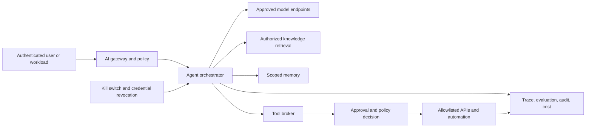

> **Document class:** Data, AI & Integration architecture reference model
> **Normative terms:** **MUST**, **MUST NOT**, **SHOULD**, **SHOULD NOT**, and **MAY** are requirements levels.
> **Applicability:** AI systems that plan, maintain state, call tools, or take actions on behalf of users or workloads.
> **Exception process:** Deviations require a documented risk assessment, compensating controls, named risk owner, and expiry date.

| Control field | Value |
|---|---|
| Document ID | `DAI-16` |
| Owner | Cloud Center of Excellence |
| Review cycle | At least annually and after material platform, provider, data, security, or operating-model changes |
| Evidence | Threat model, tool registry, authorization tests, evaluation results, and operational readiness evidence |

# Agentic AI Platform Architecture and Tool Governance

> **Decision in brief:** Keep agent reasoning inside a deterministic control envelope. Authorize tools from authenticated context and policy, not from model text.

## Purpose

This standard governs AI systems that plan, maintain state, call tools, or take actions. An agent is an untrusted decision component operating inside a deterministic security envelope; model output never constitutes authorization.

## Reference architecture



## Trust boundaries

Treat prompts, retrieved content, tool descriptions, model responses, memory, and external API data as untrusted. Separate the model identity from user and tool identities. The tool broker MUST derive authorization from authenticated user/workload context, approved policy, and requested action—not from text produced by the model.

## Action classes

| Class | Example | Minimum control |
|---|---|---|
| Read-only | Search approved knowledge | Entitlement filtering, audit |
| Reversible | Create draft ticket | Scoped identity, validation, rate limit |
| Consequential | Send message, alter resource | Explicit confirmation or policy approval |
| High impact | Financial, identity, production, deletion | Human approval, separation of duties, transaction limits |
| Prohibited | Disable controls, reveal secrets | Hard deny outside model context |

## Mandatory controls

- Register each agent, owner, purpose, models, tools, data classes, autonomy level, and risk tier.
- Allowlist tools and validate typed inputs and outputs against schemas.
- Use short-lived, per-tool identities with minimal scope and transaction limits.
- Require human approval for irreversible, privileged, financial, safety, or externally binding actions.
- Isolate memory by user, tenant, purpose, environment, and retention policy.
- Defend against prompt injection with content provenance, instruction/data separation, tool policy, and output validation.
- Record decisions, model and prompt version, retrieved sources, tool request, approval, result, and correlation ID without leaking secrets.
- Provide kill switch, queue pause, credential revocation, and safe degraded modes.

## Multi-cloud mapping

| Capability | Azure | AWS | GCP | OCI |
|---|---|---|---|---|
| Agent/model platform | Microsoft Foundry/Azure OpenAI | Amazon Bedrock Agents | Vertex AI Agent Builder | OCI Generative AI Agents |
| API mediation | API Management/Functions | API Gateway/Lambda | Apigee/Cloud Run | API Gateway/Functions |
| Identity | Entra/workload identity | IAM roles | IAM/service accounts | IAM/resource principals |
| Secrets | Key Vault | Secrets Manager | Secret Manager | Vault |
| Observability | Azure Monitor/Application Insights | CloudWatch/X-Ray | Cloud Logging/Trace | Logging/APM |

## Evaluation and release

Test task success, refusal, tool selection, argument correctness, authorization, injection resistance, data leakage, unsafe action, loops, latency, and cost. Use fixed regression suites plus adversarial and human evaluation. Production promotion requires approved model/prompt/tool versions, threat model, runbook, rollback, limits, and observable canary behavior.

## Validation

Attempt cross-user memory access, unauthorized tool calls, malicious retrieved instructions, forged approval, excessive iterations, unavailable model/tool, and replayed actions. Confirm idempotency and compensation. Track unsafe-action blocks, approval rates, tool failure, loop termination, evaluation regression, token/tool cost, and incidents by agent version.

## Operational considerations

Platform teams own gateway, tool broker, identities, policy, traces, and evaluation frameworks. Product owners own intended behavior and outcomes. Security owns risk tiers and incident controls. Tool owners retain authority over APIs and may revoke an agent independently.

## Tool Registration Contract

Every tool exposed to an agent MUST have a versioned registration record.

```yaml
tool_id: service-desk.create-draft
owner: service-management
action_class: reversible
input_schema: v2
identity: agent-service-desk-draft
allowed_resources:
  - incident-drafts
approval: not-required
limits:
  calls_per_run: 3
  timeout_seconds: 10
compensation: delete-draft
```

The record SHOULD define purpose, permitted callers, data classes, network destinations, identity, scopes, schemas, transaction limits, timeout, retry behavior, idempotency, approval, logging, compensation, and kill-switch owner.

Generic shell, SQL, browser, or cloud-administrator tools SHOULD NOT be registered for production agents when a narrow domain API can be provided.

## Approval, Idempotency, and Compensation

Approval interfaces MUST display the proposed action, target, material arguments, expected effect, data disclosure, cost or transaction limit, and agent reasoning summary. The approver decision must be bound to the exact action payload; the agent may not change arguments after approval.

Consequential actions SHOULD use an idempotency key derived from the run and action. Where a reversible action is possible, define and test a compensation operation. Compensation is not equivalent to rollback when external parties, notifications, financial settlement, or irreversible deletion are involved.

## Memory Governance

Classify memory as session, task, user preference, business record, or learned summary. Each class requires a source, owner, tenant scope, purpose, retention, correction, deletion, and conflict rule.

Agents MUST NOT silently convert transient prompts into durable memory. Users or system policy SHOULD control whether durable memory is created. Sensitive memory should use encrypted stores, fine-grained access, and content minimization.

Test cross-user and cross-tenant isolation, stale-memory effects, contradictory records, prompt injection stored in memory, deletion propagation, and recovery from corrupt memory.

## Agent Run Envelope

Each run SHOULD enforce maximum elapsed time, planning iterations, model calls, tool calls, tokens, external cost, and number of consequential actions. Exceeding a limit must terminate safely, preserve evidence, and avoid partially repeated side effects.

## Related topics
- [AI Security, Identity, and Responsible AI](dai-ai-security-identity-and-responsible-ai.md)
- [Production Operations for AI Applications](dai-production-operations-for-ai-applications.md)
- [Azure OpenAI Platform Architecture](dai-azure-openai-platform-architecture.md)

## References

- [Azure AI workload architecture pattern](https://learn.microsoft.com/en-us/azure/well-architected/ai/architecture-pattern)
- [AWS governance of agentic AI](https://docs.aws.amazon.com/prescriptive-guidance/latest/govern-architect-agentic-ai/)
- [Google Cloud agentic AI architecture](https://cloud.google.com/architecture/choose-design-pattern-agentic-ai-system)
- [OCI Generative AI Agents](https://docs.oracle.com/en-us/iaas/Content/generative-ai-agents/home.htm)

## Related repos

- [andyxuan2010/enterprise-ai-chatbot](https://github.com/andyxuan2010/enterprise-ai-chatbot) — provides a secured enterprise AI application foundation that can be extended with governed agent capabilities.
- [andyxuan2010/enterprise-ai-doc](https://github.com/andyxuan2010/enterprise-ai-doc) — demonstrates controlled AI-assisted document processing and downstream tool orchestration.
