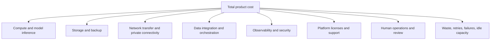
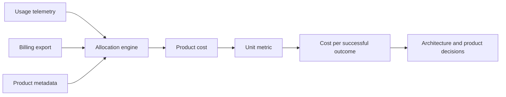
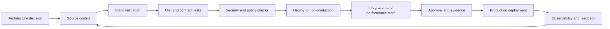

> **文档类型：**数据、AI 和集成架构参考模型
> **规范性术语：** **MUST**、**MUST NOT**、**SHOULD**、**SHOULD NOT** 和 **MAY** 是要求级别。
> **适用范围：** FinOps，用于数据、分析、机器学习、生成式 AI 和跨云共享平台服务。
> **例外流程：** 偏离要求需要记录风险评估、补偿控制、指定风险负责人和到期日期。

|控制领域|价值|
|---|---|
|文件编号 | `DAI-09` |
|负责人|云卓越中心 |
|审核周期|至少每年一次，并且在重大平台、提供商、数据、安全或运营模式发生变化之后 |
|证据|成本分配模型、单位经济学报告、优化决策、策略审查和运营就绪证据 |

# AI 和数据成本架构

> **决策简述：** 将成本分配给负责任的产品和单位，然后优化容量、令牌使用、存储、数据移动和运营浪费，而不影响所需的 SLO。

## 目的

本文档定义了数据平台、分析、机器学习和生成 AI 的企业成本架构。它建立了跨 Azure、AWS、GCP 和 OCI 的分配、单位经济性、预测、优化和治理要求。

成本优化并不是不加区别地降低成本。目标是最大限度地提高业务价值，同时满足可靠性、安全性、性能和合规性要求。

## 成本模型

总成本 MUST 不仅包括可见的计算服务。

成本所有者 SHOULD 度量资源成本和单位成本。有用单位的示例包括每次成功流水线运行的成本、处理的 TB 字节、查询、活动用户、数据产品、模型调用、千个令牌、检索到的答案、成功的任务、训练的模型或业务事务。

## 分配标准

每个成本承担资源 MUST 具有环境、所有者、产品、成本中心、应用、数据域和生命周期的可执行元数据。如果提供商标签不流向使用日志，则分配必须使用账户/订阅/项目/隔间结构、资源组、部署标识符、使用导出或平台级归因。

分担成本需要有记录在案的分配规则。可接受的方法包括直接度量、按比例分摊、预留容量分配、活动用户共享或商定的固定分配。未分配的“平台开销”应减少并使其可见，而不是忽视。

## 成本域

### 数据摄取和移动

成本驱动因素包括连接器运行时、编排活动、移动的字节、源提取、转换、网络传输、私有连接和重试。跨区域和跨云传输可以主导明显廉价的计算。

### 存储

成本驱动因素包括卷、冗余、事务计数、元数据操作、快照、备份、副本、存档检索、小文件开销和已删除数据保留。生命周期策略必须符合法律和重放要求。

### 处理和分析

成本驱动因素包括集群大小、运行时间、仓库槽或容量、扫描字节、并发、缓存、物化、文件布局和空闲资源。查询设计和数据布局是成本架构。

### AI 和机器学习

成本驱动因素包括训练计算、GPU、推理令牌、预配置容量、嵌入、向量索引、检索查询、上下文大小、输出长度、安全服务、评估、模型监控、人工审查和失败的请求。

## 单位经济学

示例：

- **管道单位成本：** 总摄取和转换成本/成功交付的分区。
- **仓库单位成本：** 计算加存储加上传输/受控查询或活跃消费者。
- **RAG 单位成本：** 模型加嵌入加搜索加应用加日志记录/成功的 grounding 答案。
- **代理单位成本：** 所有模型和工具调用加上基础设施/已完成的批准任务。

如果答案质量或任务完成情况恶化，每个请求的较低成本可能会产生误导。成本应与质量和 SLO 指标配对。

## 预测

预测 MUST 建模工作负载驱动因素，而不是仅推断历史支出。输入包括数据增长、保留、用户、查询、并发、令牌分配、上下文大小、模型组合、管道频率、区域副本和计划项目。

使用基本场景、预期场景和压力场景。压力场景应包括流量爆发、提供商配额更改、重新嵌入、回填、区域恢复、大型模型评估以及迁移过程中的临时双运行。

## 预算和护栏架构

预算本身只是通知，而不是控制。成熟的设计结合了：

- 账户或项目预算；
- 服务配额；
- 租户和应用限制；
- 批准的 SKU 和实例策略；
- 最大模型令牌和代理步骤；
- 自动终止和时间表；
- 数据保留生命周期策略；
- 阻止未标记资源的部署策略；
- 异常检测；
- 非关键工作负载的成本感知准入控制；
- 特定于所有者的告警和升级。

必须谨慎使用硬停止；禁用关键生产服务可能会造成比成本超支更大的损失。

## 数据平台优化

- 使用列格式和压缩。
- 基于实际查询模式的分区和集群。
- 压缩小文件。
- 当提高弹性时，将存储和计算分开。
- 暂停闲置仓库并终止交互集群。
- 使用增量处理而不是重复的全扫描。
- 对冷数据进行分层并在保留到期时删除数据。
- 避免不必要的跨区域或跨云复制。
- 隔离工作负载，这样一个消费者就无法强制进行全局过度配置。
- 仅为稳定、可测量的基线购买预留或承诺容量。

## 生成式 AI 优化

- 将简单的任务分配给较小的经批准的模型。
- 将上下文限制为相关证据。
- 限制输出令牌和代理步骤。
- 仅当授权和新鲜度允许时才缓存。
- 批量嵌入并避免不必要的重新嵌入。
- 使用检索过滤器来减少候选数量。
- 跟踪重试风暴和失败的世代。
- 根据持续利用率而不是峰值轶事来评估预配置吞吐量。
- 对非交互式工作负载使用异步处理。
- 度量每项成功任务的成本和质量水平。

## 多云成本映射

|能力|Azure|AWS | GCP |OCI |
|---|---|---|---|---|
|计费导出|Cost Management exports|Cost and Usage Report| Cloud Billing export to BigQuery |Cost and Usage Reports|
|预算| Azure budgets | AWS Budgets | Cloud Billing budgets | Budgets|
|推荐 | Azure Advisor | Cost Optimization Hub / Compute Optimizer | Recommender | Cloud Advisor |
|资源策略| Azure Policy |Organizations SCPs and Config |Organization Policy|配额、策略、Security Zones |
|数据成本遥测|服务指标、Log Analytics、平台系统表 | CloudWatch、服务指标、CUR |Cloud Monitoring 和计费导出|监控、日志、使用报告 |

提供商的建议是输入，而不是自动决策。他们可能不知道应用的关键性、契约义务或质量要求。

## Showback 和 Chargeback

Showback SHOULD 在 Chargeback 之前开始。产品团队需要可信、可解释的成本数据，以及将成本与使用量对账的能力。Chargeback 不应让团队为其无法控制的平台成本承担责任。

每月产品成本报表 SHOULD 显示：

- 总数和趋势；
- 预算差异；
- 直接成本与分摊成本；
- 单位成本和销量驱动因素；
- 可靠性和质量背景；
- 顶级异常；
- 优化行动和所有者；
- 预测和承诺。

## 成本意识架构决策

架构记录 SHOULD 包括预期稳态成本、峰值成本、恢复成本、迁移双运行成本、数据传输成本、运营员工和退出成本。每单位看起来更便宜的服务在出口、可观测性、许可或专业操作之后可能会更昂贵。

## FinOps 运营节奏

- 每日：主要服务和 AI 使用情况的异常审核。
- 每周：所有者分类、闲置资源清理、配额和预测变化。
- 每月：产品展示、预算差异、单位经济效益、承诺范围。
- 季度：架构优化、存储生命周期审核、模型和 SKU 合理化、预留策略。
- 每年：业务价值审查、提供商和契约策略、退出和可移植性评估。

## 跨领域的治理要求

平台 MUST 将数据产品、模型、提示、索引、管道和集成接口视为受治理资产。每项资产都需要一个负责任的所有者、分类、生命周期状态、批准的消费者、数据血缘、保留规则和运营目标。平台控制 MUST 通过策略即代码和基础设施即代码应用，而不是手动门户配置。

最低治理控制是：

1. 具有自动元数据收集功能的业务术语表和技术目录。
2. 摄取时的数据分类和转换后的重新分类。
3. 从源到转换、模型或索引、API 和消费者的端到端数据血缘。
4. 平台管理、数据管理、开发和生产运营之间的职责分离。
5. 用于管理操作和访问受监管数据的不可变审计日志。
6. 明确的保留、存档、合法保留和删除程序。
7、具有证据、审批、回滚能力的环境晋级。
8. 定期访问重新认证和控制有效性审查。

## 交付和生命周期标准

所有可部署资源 MUST 在版本控制中表示。合规的交付流程是：

生产变更 MUST 使用可重复的流水线、短期工作负载标识、同行评审和可审核的批准。紧急变更需要追溯相同的证据，且 MUST NOT 成为并行运行模型。

## 成本归因实施

Cloud billing records 本身很少包含足够的产品上下文。构建一个归因管道，将提供商使用情况、平台遥测、部署元数据、产品注册表、租户标识符以及定价或承诺数据结合起来。

分配输出 SHOULD 区分：

- 直接归因的使用；
- 由有记录在案的驱动程序分配的共享平台使用情况；
- 闲置或未分配的成本；
- 承诺和折扣；
- 税收、支持、许可和市场费用；
- 产品、区域和提供商之间的数据传输；
- 失败、重试、评估和恢复使用。

分配规则需要版本控制，因为更改驱动程序可能会在不改变使用量的情况下显著改变产品成本。

## 优化变更控制

优化建议会影响性能、可靠性和恢复。每个实质性行动 SHOULD 都日志记录基线、提议的变更、预期节省、SLO 风险、回滚、所有者和测量窗口。

需要受控测试的示例包括：

- 减少数据库、仓库或模型容量；
- 改变存储冗余或保留；
- 将数据移至存档；
- 切换模型或量化；
- 增加现货或抢占式使用；
- 减少遥测；
- 集成租户或集群；
- 改变区域布局。

在计费和单位指标确认之前，不要将预计的节省计算为已实现的节省。

## 根据请求设置 AI 成本护栏

应用 SHOULD 除每月预算之外还应用请求级控制。示例包括最大上下文、输出、迭代、工具扇出、检索候选、图像分辨率、音频持续时间和批量大小。

网关或编排层 SHOULD 拒绝或路由超出批准的风险和成本范围的请求。高成本的覆盖需要经过身份验证的目的和可审计的所有者。

## 可靠性和恢复成本

单独显示弹性成本：副本、热容量、保留模型和索引、不可变备份、预留配额、恢复练习和双运行迁移。这使业务负责人能够了解所选 RTO 和 RPO 的成本。

无法满足恢复目标的更便宜的架构并不是优化。

## 相关主题

- [治理数据平台架构](dai-governed-data-platform-architecture.md)
- [AI 应用的生产运营](dai-production-operations-for-ai-applications.md)
- [企业 MLOps 平台和模型生命周期架构](dai-enterprise-mlops-platform-and-model-lifecycle.md)
- [数据平台弹性、备份和灾难恢复标准](dai-data-platform-resilience-backup-and-disaster-recovery.md)

## 反模式
- 将标签视为可选文档而不是强制控制。
- 仅度量每月云支出，而不度量工作负载单位或结果。
- 忽略网络传输、备份、可观测性和安全成本。
- 在度量稳定基线之前购买承诺。
- 由于缺乏生命周期设计，重新嵌入或重新处理所有数据。
- 对关键生产系统使用硬预算关闭。
- 优化令牌成本，同时答案质量却下降。
- 无论使用量或收益如何，均等分配所有共享平台成本。

## 验证

- [ ] 每个资源和平台使用日志记录都映射到一个负责任的产品所有者。
- [ ] 共享成本分配已日志记录且可重复。
- [ ] 单位指标反映成功的业务或技术成果。
- [ ] 预测使用工作负载驱动因素和压力情景。
- [ ] 预算、配额、异常检测和策略护栏处于活动状态。
- [ ] 明确测量跨区域和跨云传输。
- [ ] AI 成本包括检索、嵌入、安全、重试、工具、评估和人工审查。
- [ ] 承诺和保留基于测量的稳定利用率。
- [ ] 优化操作有所有者、预期节省和风险评估。
- [ ] 成本变化与可靠性、性能和质量一起审查。

## 参考文档

- [Microsoft Cloud Adoption Framework: FinOps](https://learn.microsoft.com/cloud-computing/finops/)
- [Azure OpenAI 网关指南和成本注意事项](https://learn.microsoft.com/azure/architecture/ai-ml/guide/azure-openai-gateway-guide)
- [AWS Well-Architected 的成本优化支柱](https://docs.aws.amazon.com/wellarchitected/latest/cost-optimization-pillar/)
- [AWS 生成式 AI 镜头](https://docs.aws.amazon.com/wellarchitected/latest/generative-ai-lens/)
- [GCP 架构框架：成本优化](https://cloud.google.com/architecture/framework/cost-optimization)
- [OCI FinOps Hub](https://docs.oracle.com/en-us/iaas/Content/Billing/Concepts/FinOps.htm)
- [FinOps Framework](https://www.finops.org/framework/)
