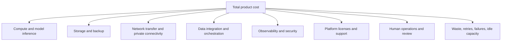
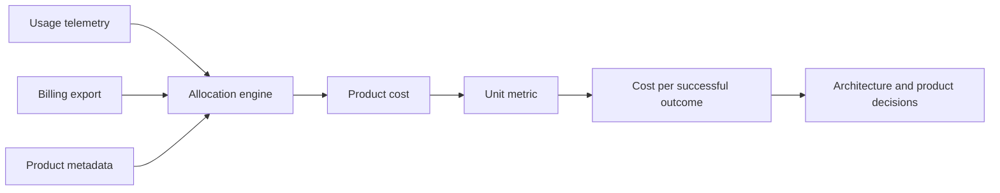
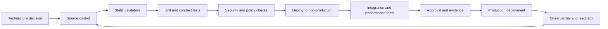

> **Document class:** Data, AI & Integration architecture reference model
> **Normative terms:** **MUST**, **MUST NOT**, **SHOULD**, **SHOULD NOT**, and **MAY** are requirements levels.
> **Applicability:** FinOps for data, analytics, machine learning, generative AI, and shared platform services across clouds.
> **Exception process:** Deviations require a documented risk assessment, compensating controls, named risk owner, and expiry date.

| Control field | Value |
|---|---|
| Document ID | `DAI-09` |
| Owner | Cloud Center of Excellence |
| Review cycle | At least annually and after material platform, provider, data, security, or operating-model changes |
| Evidence | Cost allocation model, unit-economics report, optimization decisions, policy review, and operational readiness evidence |

# AI and Data Cost Architecture

> **Decision in brief:** Allocate cost to accountable products and units, then optimize capacity, token usage, storage, data movement, and operational waste without compromising required SLOs.

## Purpose

This document defines the enterprise cost architecture for data platforms, analytics, ML, and generative AI. It establishes allocation, unit economics, forecasting, optimization, and governance requirements across Azure, AWS, GCP, and OCI.

Cost optimization is not indiscriminate cost reduction. The objective is to maximize business value while meeting reliability, security, performance, and compliance requirements.

## Cost Model

Total cost MUST include more than the visible compute service.

The cost owner SHOULD measure both resource cost and unit cost. Examples of useful units are cost per successful pipeline run, terabyte processed, query, active user, data product, model invocation, thousand tokens, retrieved answer, successful task, trained model, or business transaction.

## Allocation Standard

Every cost-bearing resource MUST have enforceable metadata for environment, owner, product, cost center, application, data domain, and lifecycle. Where provider tags do not flow to consumption records, allocation must use account/subscription/project/compartment structure, resource groups, deployment identifiers, usage exports, or platform-level attribution.

Shared costs require a documented allocation rule. Acceptable methods include direct metering, proportional consumption, reserved-capacity allocation, active-user share, or agreed fixed allocation. Unallocated “platform overhead” should be reduced and made visible, not ignored.

## Cost Domains

### Data ingestion and movement

Cost drivers include connector runtime, orchestration activity, bytes moved, source extraction, transformation, network transfer, private connectivity, and retries. Cross-region and cross-cloud transfer can dominate apparently cheap compute.

### Storage

Cost drivers include volume, redundancy, transaction count, metadata operations, snapshots, backups, replicas, archive retrieval, small-file overhead, and deleted-data retention. Lifecycle policies must align with legal and replay requirements.

### Processing and analytics

Cost drivers include cluster size, runtime, warehouse slots or capacity, scanned bytes, concurrency, caching, materialization, file layout, and idle resources. Query design and data layout are cost architecture.

### AI and ML

Cost drivers include training compute, GPUs, inference tokens, provisioned capacity, embeddings, vector indexes, retrieval queries, context size, output length, safety services, evaluations, model monitoring, human review, and failed requests.

## Unit Economics

Examples:

- **Pipeline unit cost:** total ingestion and transformation cost / successful delivered partitions.
- **Warehouse unit cost:** compute plus storage plus transfer / governed queries or active consumers.
- **RAG unit cost:** model plus embeddings plus search plus app plus logging / successful grounded answers.
- **Agent unit cost:** all model and tool calls plus infrastructure / completed approved tasks.

A lower cost per request can be misleading if answer quality or task completion deteriorates. Cost should be paired with quality and SLO metrics.

## Forecasting

Forecasts MUST model workload drivers rather than extrapolating only historical spend. Inputs include data growth, retention, users, queries, concurrency, token distribution, context size, model mix, pipeline frequency, regional copies, and planned projects.

Use base, expected, and stress scenarios. Stress scenarios should include traffic bursts, provider quota changes, re-embedding, backfill, regional recovery, large model evaluations, and temporary dual-running during migration.

## Budget and Guardrail Architecture

Budgets alone are notifications, not controls. A mature design combines:

- account or project budgets;
- service quotas;
- tenant and application limits;
- approved SKUs and instance policies;
- maximum model tokens and agent steps;
- auto-termination and schedules;
- data-retention lifecycle policies;
- deployment policy blocking untagged resources;
- anomaly detection;
- cost-aware admission control for noncritical workloads;
- owner-specific alerts and escalation.

Hard stops must be used carefully; disabling a critical production service can cause greater loss than the cost overrun.

## Data Platform Optimization

- Use columnar formats and compression.
- Partition and cluster based on actual query patterns.
- Compact small files.
- Separate storage and compute when it improves elasticity.
- Suspend idle warehouses and terminate interactive clusters.
- Use incremental processing instead of repeated full scans.
- Tier cold data and delete data when retention expires.
- Avoid unnecessary cross-region or cross-cloud copies.
- Isolate workloads so one consumer cannot force global overprovisioning.
- Purchase reserved or committed capacity only for stable, measured baselines.

## Generative AI Optimization

- Route simple tasks to smaller approved models.
- Limit context to relevant evidence.
- Cap output tokens and agent steps.
- Cache only when authorization and freshness allow.
- Batch embeddings and avoid unnecessary re-embedding.
- Use retrieval filters to reduce candidate volume.
- Track retry storms and failed generations.
- Evaluate provisioned throughput against sustained utilization, not peak anecdotes.
- Use asynchronous processing for noninteractive workloads.
- Measure cost per successful task and quality level.

## Multi-Cloud Cost Mapping

| Capability | Azure | AWS | GCP | OCI |
|---|---|---|---|---|
| Billing export | Cost Management exports | Cost and Usage Report | Cloud Billing export to BigQuery | Cost and Usage Reports |
| Budgets | Azure budgets | AWS Budgets | Cloud Billing budgets | Budgets |
| Recommendations | Azure Advisor | Cost Optimization Hub / Compute Optimizer | Recommender | Cloud Advisor |
| Resource policy | Azure Policy | Organizations SCPs and Config | Organization Policy | Quotas, policies, Security Zones |
| Data cost telemetry | service metrics, Log Analytics, platform system tables | CloudWatch, service metrics, CUR | Cloud Monitoring and billing export | Monitoring, Logging, usage reports |

Provider recommendations are inputs, not automatic decisions. They may not know application criticality, contractual obligations, or quality requirements.

## Showback and Chargeback

Showback SHOULD begin before chargeback. Product teams need trusted, explainable cost data and the ability to reconcile it to usage. Chargeback should not punish teams for platform costs they cannot control.

A monthly product cost statement SHOULD show:

- total and trend;
- budget variance;
- direct versus shared cost;
- unit cost and volume drivers;
- reliability and quality context;
- top anomalies;
- optimization actions and owners;
- forecast and commitments.

## Cost-Aware Architecture Decisions

Architecture records SHOULD include expected steady-state cost, peak cost, recovery cost, migration dual-run cost, data-transfer cost, operational labor, and exit cost. A service that appears cheaper per unit may be more expensive after egress, observability, licensing, or specialist operations.

## FinOps Operating Cadence

- Daily: anomaly review for major services and AI usage.
- Weekly: owner triage, idle resource cleanup, quota and forecast changes.
- Monthly: product showback, budget variance, unit economics, commitment coverage.
- Quarterly: architecture optimization, storage lifecycle review, model and SKU rationalization, reservation strategy.
- Annually: business-value review, provider and contract strategy, exit and portability assessment.

## Cross-cutting governance requirements

The platform MUST treat data products, models, prompts, indexes, pipelines, and integration interfaces as governed assets. Each asset requires an accountable owner, classification, lifecycle state, approved consumers, lineage, retention rules, and operational objectives. Platform controls MUST be applied through policy-as-code and infrastructure-as-code rather than manual portal configuration.

Minimum governance controls are:

1. A business glossary and technical catalog with automated metadata harvesting.
2. Data classification at ingestion and reclassification after transformation.
3. End-to-end lineage from source through transformation, model or index, API, and consumer.
4. Segregation of duties between platform administration, data stewardship, development, and production operations.
5. Immutable audit logging for administrative actions and access to regulated data.
6. Explicit retention, archival, legal-hold, and deletion procedures.
7. Environment promotion with evidence, approval, and rollback capability.
8. Periodic access recertification and control-effectiveness reviews.

## Delivery and lifecycle standard

All deployable resources MUST be represented in version control. A compliant delivery flow is:

Production changes MUST use repeatable pipelines, short-lived workload identities, peer review, and auditable approvals. Emergency changes require the same evidence retrospectively and MUST not become a parallel operating model.

## Cost Attribution Implementation

Cloud billing records rarely contain enough product context by themselves. Build an attribution pipeline that joins provider usage, platform telemetry, deployment metadata, product registry, tenant identifiers, and pricing or commitment data.

Allocation outputs SHOULD distinguish:

- directly attributable usage;
- shared platform usage allocated by a documented driver;
- idle or unallocated cost;
- commitments and discounts;
- taxes, support, licenses, and marketplace charges;
- data transfer between products, regions, and providers;
- failed, retried, evaluation, and recovery usage.

Allocation rules require versioning because changing a driver can materially alter product cost without changing consumption.

## Optimization Change Control

Optimization recommendations can affect performance, reliability, and recovery. Each material action SHOULD record the baseline, proposed change, expected savings, SLO risk, rollback, owner, and measurement window.

Examples requiring controlled testing include:

- reducing database, warehouse, or model capacity;
- changing storage redundancy or retention;
- moving data to archive;
- switching model or quantization;
- increasing spot or preemptible usage;
- reducing telemetry;
- consolidating tenants or clusters;
- changing regional placement.

Do not count projected savings as realized until the billing and unit metrics confirm them.

## AI Cost Guardrails by Request

Applications SHOULD apply request-level controls in addition to monthly budgets. Examples include maximum context, output, iterations, tool fan-out, retrieval candidates, image resolution, audio duration, and batch size.

A gateway or orchestration layer SHOULD reject or route requests that exceed the approved risk and cost envelope. High-cost overrides require an authenticated purpose and auditable owner.

## Cost of Reliability and Recovery

Show the cost of resilience separately: replicas, warm capacity, retained models and indexes, immutable backups, reserved quota, recovery exercises, and dual-running migrations. This allows business owners to understand the cost of the chosen RTO and RPO.

A cheaper architecture that cannot meet the recovery objective is not an optimization.

## Related topics

- [Governed Data Platform Architecture](dai-governed-data-platform-architecture.md)
- [Production Operations for AI Applications](dai-production-operations-for-ai-applications.md)
- [Enterprise MLOps Platform and Model Lifecycle Architecture](dai-enterprise-mlops-platform-and-model-lifecycle.md)
- [Data Platform Resilience, Backup, and Disaster Recovery Standard](dai-data-platform-resilience-backup-and-disaster-recovery.md)

## Anti-patterns
- Treating tags as optional documentation rather than an enforced control.
- Measuring only monthly cloud spend and not workload units or outcomes.
- Ignoring network transfer, backups, observability, and security costs.
- Buying commitments before measuring a stable baseline.
- Re-embedding or reprocessing all data because lifecycle design is absent.
- Using hard budget shutdowns for critical production systems.
- Optimizing token cost while answer quality collapses.
- Allocating all shared platform cost equally regardless of consumption or benefit.

## Validation

- [ ] Every resource and platform usage record maps to an accountable product owner.
- [ ] Shared-cost allocation is documented and reproducible.
- [ ] Unit metrics reflect successful business or technical outcomes.
- [ ] Forecasts use workload drivers and stress scenarios.
- [ ] Budgets, quotas, anomaly detection, and policy guardrails are active.
- [ ] Cross-region and cross-cloud transfer is measured explicitly.
- [ ] AI costs include retrieval, embeddings, safety, retries, tools, evaluation, and human review.
- [ ] Commitments and reservations are based on measured stable utilization.
- [ ] Optimization actions have owners, expected savings, and risk assessment.
- [ ] Cost changes are reviewed alongside reliability, performance, and quality.

## References

- [Microsoft Cloud Adoption Framework: FinOps](https://learn.microsoft.com/cloud-computing/finops/)
- [Azure OpenAI gateway guidance and cost considerations](https://learn.microsoft.com/azure/architecture/ai-ml/guide/azure-openai-gateway-guide)
- [AWS Well-Architected Cost Optimization Pillar](https://docs.aws.amazon.com/wellarchitected/latest/cost-optimization-pillar/)
- [AWS Generative AI Lens](https://docs.aws.amazon.com/wellarchitected/latest/generative-ai-lens/)
- [GCP Architecture Framework: Cost optimization](https://cloud.google.com/architecture/framework/cost-optimization)
- [OCI FinOps Hub](https://docs.oracle.com/en-us/iaas/Content/Billing/Concepts/FinOps.htm)
- [FinOps Framework](https://www.finops.org/framework/)
